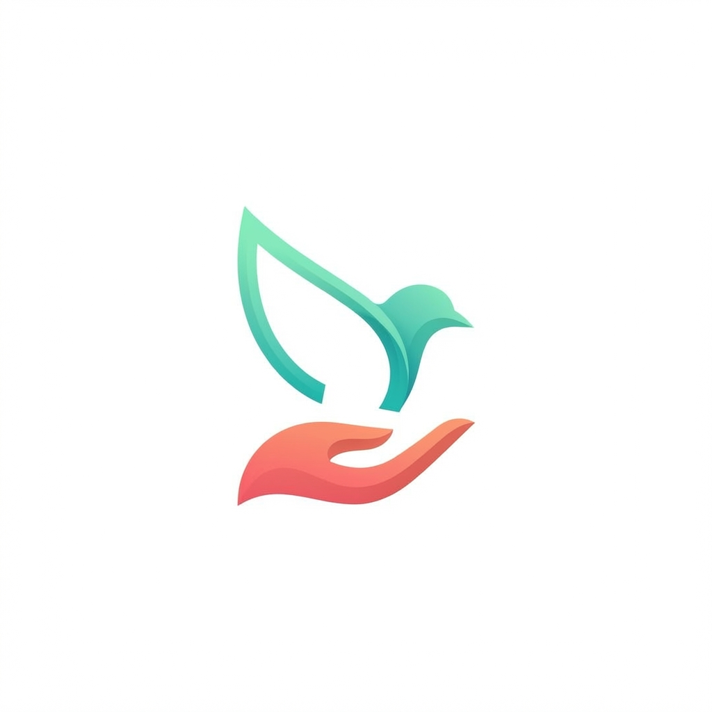

# Givernance NPO Platform Blueprint



> **Phase 0 — Foundation | In Planning**

Givernance — purpose-built CRM for European nonprofits. Modular monolith, GDPR-native, Salesforce alternative.

**Givernance** is a purpose-built CRM for European nonprofits (2-200 staff), replacing Salesforce NPSP with GDPR-native compliance, affordable pricing, and an AI-augmented dual-mode interface.

## Getting Started

```bash
# Clone the repository
git clone git@github.com:Onigam/givernance.git
cd givernance

# Install dependencies (Node.js >= 20 required)
npm install

# Open the HTML mockups locally
open docs/design/index.html
# or browse to docs/design/ in your browser
```

The design system reference is at `docs/design/design-system.html`. All 86 interactive mockups are in `docs/design/`.

## Design Mockups

86 interactive HTML mockups across 17 modules, viewable on GitHub Pages :

**[Voir les mockups](https://onigam.github.io/givernance/design/)**

- **75 ecrans GUI classique** : Auth, Dashboard, Constituants, Dons, Campagnes, Subventions, Programmes, Benevoles, Impact, Communications, Finance, RGPD, Admin, Rapports, Migration, Global
- **11 ecrans Mode Conversationnel** (vision 2026-2028) : hub IA, orchestration d'actions, vue hybride, mobile, dashboard evolue — [voir les mockups conversationnels](https://onigam.github.io/givernance/design/conversational-mode/index.html)

### Vision dual-mode

Givernance propose deux paradigmes d'interaction complementaires :

1. **GUI IA-augmente** — Interface classique enrichie par des suggestions IA inline (3 modes : Manuel, Assiste, Autopilote)
2. **Mode conversationnel** (vision) — Agent IA en langage naturel, orchestration d'actions, composants invocables

Voir [docs/vision/conversational-mode.md](docs/vision/conversational-mode.md) pour l'architecture detaillee.

## Documentation

### Architecture & Specs
- [docs/01-product-scope.md](docs/01-product-scope.md)
- [docs/02-reference-architecture.md](docs/02-reference-architecture.md)
- [docs/03-data-model.md](docs/03-data-model.md)
- [docs/04-business-capabilities.md](docs/04-business-capabilities.md)
- [docs/05-integration-migration.md](docs/05-integration-migration.md)
- [docs/06-security-compliance.md](docs/06-security-compliance.md)
- [docs/07-delivery-roadmap.md](docs/07-delivery-roadmap.md)
- [docs/08-pricing-packaging.md](docs/08-pricing-packaging.md)
- [docs/09-risk-register.md](docs/09-risk-register.md)
- [docs/10-open-questions.md](docs/10-open-questions.md)

### Design & UX
- [docs/11-design-identity.md](docs/11-design-identity.md) — Identite visuelle, tokens, composants, accessibilite
- [docs/12-user-journeys.md](docs/12-user-journeys.md) — Parcours utilisateurs (5 personas)
- [docs/13-ai-modes.md](docs/13-ai-modes.md) — Trois modes d'interaction IA (Manuel, Assiste, Autopilote)
- [docs/14-screen-inventory.md](docs/14-screen-inventory.md) — Inventaire complet des 86 ecrans
- [docs/vision/conversational-mode.md](docs/vision/conversational-mode.md) — Vision mode conversationnel 2026-2028

## Diagrams
- diagrams/context.mmd
- diagrams/container.mmd
- diagrams/core-erd.mmd
- diagrams/migration-flow.mmd

## Specialized Agents

8 Claude agents for domain-specific tasks (see `.claude/agents/`):

- `.claude/agents/domain-analyst.md` — Business domain analysis and bounded contexts
- `.claude/agents/data-architect.md` — Data model design and database architecture
- `.claude/agents/platform-architect.md` — System architecture and infrastructure decisions
- `.claude/agents/migration-architect.md` — Salesforce-to-Givernance migration strategy
- `.claude/agents/security-architect.md` — Security, compliance, and GDPR controls
- `.claude/agents/pricing-strategist.md` — Pricing model and packaging strategy
- `.claude/agents/ux-researcher.md` — User research, personas, and usability validation
- `.claude/agents/design-architect.md` — Visual identity, design system, and UI/UX principles
