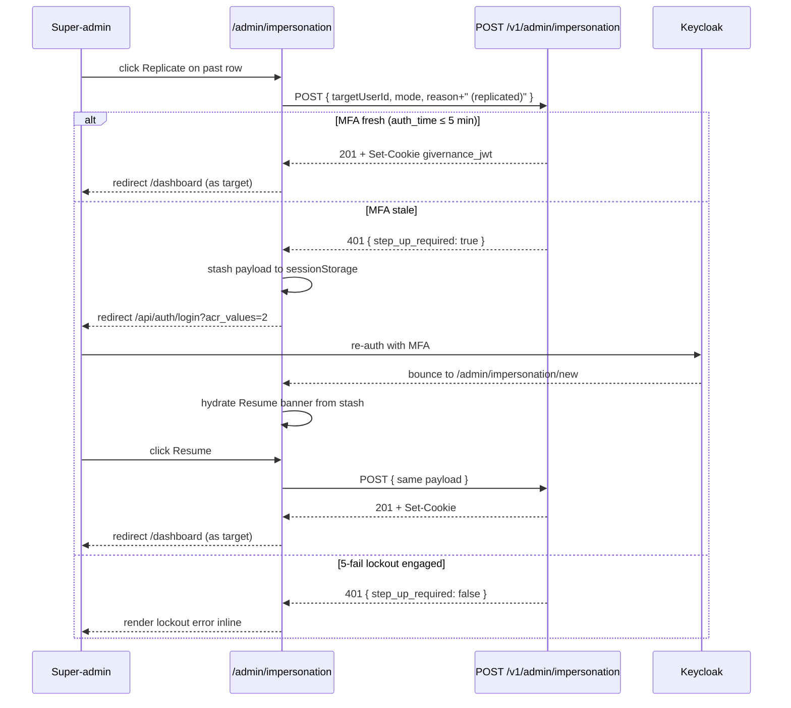

# 19 — Impersonation Strategy (Two Modes)

> **Status**: Implemented — issue #24
> **Owner**: Impersonation Engineer agent (`.claude/agents/impersonation-engineer.md`)
> **Related**: `02-reference-architecture.md`, `03-data-model.md`, `06-security-compliance.md`, `15-infra-adr.md`, `17-log-management.md`, `18-feature-flags.md`
> **Closes**: #6, #24
> **Extended by**: #428 (one-click Replicate from past sessions list — § 4.1)

## 0. Two coexisting modes — at a glance

Givernance supports **two distinct support-session flavours**. They share most of their plumbing (token shape, audit double-attribution, session record, banner) but diverge on session lifetime, RBAC behaviour, and write access. The mode is chosen explicitly when the operator starts the session.

| Aspect | `delegation` | `impersonation` (pure) |
|---|---|---|
| Use case | Operator does support / config work **on behalf of** a tenant. | Operator **reproduces a bug** as the user — see and act exactly as the user does. |
| `sub` in JWT | Target user's Keycloak `sub` | Target user's Keycloak `sub` |
| `act.sub` in JWT | Operator's Keycloak `sub` (RFC 8693) | Operator's Keycloak `sub` (RFC 8693) |
| `imp_mode` in JWT | `"delegation"` | `"impersonation"` |
| RBAC rights | `super_admin` retained → "extended rights" | Target user's role **only** — full parity, no augmentation, no restriction |
| Writes (POST/PUT/PATCH/DELETE) | Allowed (super_admin) | Allowed **iff target has the write role** — same answer the target would get logging in directly |
| Default TTL | 2 h (capped at 4 h) | 30 min (capped at 1 h) |
| Banner colour | Amber | Red |
| Audit `impersonation_mode` column | `"delegation"` | `"impersonation"` |

Both modes carry the RFC 8693 `act` claim — the RFC's "delegation" / "impersonation" terminology is about token shape, not our product modes. We always emit `act` so the audit chain is complete.

**Why both must coexist**: a one-mode design forces a tradeoff between "operator can do support work" and "operator can safely browse a user's account without changing anything". Delegation answers the first; pure impersonation answers the second. Conflating them is what the RFC 8693 spec writers explicitly warned against (§4.1).

**Dev-speed surface (issue #428)**: a one-click **Replicate** row-action on the Back Office past-sessions list re-enters the same target with the same mode + reason, reusing the existing 5-min MFA-fresh window (no new security mechanism — see § 4.1). Gated by `admin.impersonation_replicate` (default off, `scope='platform'`); with the flag off the list is identical to what shipped with issue #24.

## 1. Goals

The platform must let a `super_admin` operator:

1. **Configure or remediate** a tenant on behalf of staff (`delegation` mode) with full audit attribution.
2. **Reproduce a user-reported bug** by taking the user's view (`impersonation` mode) without any risk of incidental writes.
3. Leave a full **double-attributed audit trail** — every action persists both the impersonated user (data integrity) and the operator (accountability), plus the mode discriminator.
4. Be **time-limited** and **step-up authenticated** — sessions require recent re-auth (with MFA when configured) and a mandatory reason.
5. Preserve user trust — the impersonated user can be notified post-session; sessions are exportable as part of GDPR Art. 15 data.

## 2. Architecture overview

```
┌──────────────────────────────────────────────────────────────────────────────┐
│                         super_admin browser                                   │
│                                                                                │
│   1. Re-auth via Keycloak with `prompt=login` (and `acr_values=2` in prod)   │
│   2. POST /v1/admin/impersonation { targetUserId, mode, reason }             │
│      ← 201 Created + Set-Cookie: givernance_jwt=<imp_token>                  │
│                                                                                │
│   3. All subsequent calls carry the impersonation cookie                     │
│      ← banner rendered server-side from JWT claims                           │
│      ← (impersonation mode) writes 403 unless on explicit allowlist          │
│                                                                                │
│   4. DELETE /v1/admin/impersonation/:sessionId  (or auto-expire at TTL)      │
└──────────────────────────────┬───────────────────────────────────────────────┘
                               │
┌──────────────────────────────▼───────────────────────────────────────────────┐
│                          Fastify 5 API                                         │
│                                                                                │
│  Auth plugin (`packages/api/src/plugins/auth.ts`):                            │
│   - Routes by `iss` claim:                                                    │
│       "givernance-impersonation" → HS256 + IMPERSONATION_JWT_SECRET           │
│       <realm-issuer>              → Keycloak JWKS (RS256)                     │
│   - Validates Redis session record (instant revocation, drift detection)     │
│   - Populates `request.auth.impersonation = { mode, sessionId, reason, exp }`│
│                                                                                │
│  Impersonation plugin (`packages/api/src/plugins/impersonation.ts`):          │
│   - `mode === "impersonation"` + mutating method → 403 unless allowlisted    │
│   - `mode === "delegation"`                       → no extra check            │
│                                                                                │
│  Audit plugin (`packages/api/src/plugins/audit.ts`):                          │
│   - userId  = effective subject (target user)                                 │
│   - actorId = impersonator (from `act.sub`)                                   │
│   - impersonation_session_id + impersonation_mode (issue #24)                │
└──────────────────────────────┬───────────────────────────────────────────────┘
                               │
                ┌──────────────┴───────────────┐
                │                              │
        ┌───────▼────────┐            ┌────────▼────────────┐
        │  Redis         │            │  PostgreSQL          │
        │  session +     │            │  impersonation_      │
        │  rate limit +  │            │  sessions  +         │
        │  lockout       │            │  audit_logs          │
        └────────────────┘            └─────────────────────┘
```

## 3. Token design

### Keycloak Token Exchange (RFC 8693) — primary path

When `IMPERSONATION_USE_KEYCLOAK_EXCHANGE=true`, the API exchanges the operator's access token for a target-user-shaped token via the realm's `urn:ietf:params:oauth:grant-type:token-exchange` endpoint, using the `givernance-impersonation` confidential client (`infra/keycloak/realm-givernance.json`). The realm must have:

1. Token Exchange feature enabled (`features=token-exchange` Keycloak start flag).
2. `givernance-impersonation` client with `token.exchange.grant.enabled=true`.
3. The `realm-management/impersonation` role granted to the API service account.
4. The `infra/keycloak/mappers/impersonation-act-mapper.js` Script Mapper attached to the client — Keycloak 26 (and 26.6 as of writing) does not emit the RFC 8693 `act` claim natively (`keycloak/keycloak#12076`, open since 2022). The mapper reads `imp_mode` / `imp_session_id` / `imp_reason` from the request URL parameters and emits `act` + the `imp_*` claims into the access token.

### App-layer JWT — fallback path (default in dev / CI)

When the env var is unset or false, the API signs the impersonation JWT itself with HS256 against `IMPERSONATION_JWT_SECRET`. Both paths surface identical claims to the auth plugin; the discriminator is the `iss` value (`"givernance-impersonation"` for the app-layer path, `<realm-issuer>` for the Keycloak path).

Phase rollout: start with the app-layer path, flip the env var on once the realm Script Mapper is deployed and the smoke test confirms `act` is being emitted. Both paths are first-class — dev environments without the realm Script Mapper continue to work indefinitely.

### JWT claims

```json
{
  "sub": "<target_user_keycloak_id>",
  "org_id": "<target_tenant_uuid>",
  "role": "<target_user_role>",
  "email": "<target_user_email>",
  "act": { "sub": "<operator_keycloak_id>" },
  "imp_mode": "delegation" | "impersonation",
  "imp_session_id": "<uuid>",
  "imp_reason": "Support ticket #1234 — receipt PDF download is failing",
  "realm_access": { "roles": ["super_admin"] | ["<target_role>"] },
  "iss": "givernance-impersonation" | "<realm-issuer>",
  "iat": 1712000000,
  "exp": 1712007200,
  "jti": "<uuid>"
}
```

Mode-specific claim differences:

- `realm_access.roles` — `delegation` retains `["super_admin"]`; `impersonation` strips it down to the target user's roles only.
- `exp` — `delegation` defaults to 2 h; `impersonation` defaults to 30 min.

The cookie is `httpOnly; SameSite=Lax; Secure` (in production). Tokens are not renewable — a new INITIATE is required.

## 4. Session lifecycle

```
INITIATE ──(mode chosen, reason ≥ 20 chars, step-up OK)──► ACTIVE
ACTIVE   ──(operator ends own session)─────────────────► ENDED    (end_reason='manual')
ACTIVE   ──(super_admin revokes someone else's)────────► REVOKED  (end_reason='revoked')
ACTIVE   ──(TTL reached)───────────────────────────────► EXPIRED  (end_reason IS NULL,
                                                                    ended_at IS NULL,
                                                                    expires_at <= now())
```

Status is **derived**, never stored. The `impersonation_sessions` row is INSERT + at most one final UPDATE on `(ended_at, end_reason)`. A trigger (`prevent_impersonation_session_mutation` in migration 0033) rejects any other UPDATE and any DELETE — same append-only stance as `audit_logs`.

### 4.1. Replicating a past session (issue #428)

Once a session is `ENDED` / `REVOKED` / `EXPIRED`, the same investigation often needs to be picked up again — same target, same mode, same reason. The Back Office past-sessions list ships a **Replicate** row-action so this is one click instead of six (`/admin/impersonation` → `/new` → tenant picker → user picker → mode → retype the 20+ char reason).

**Mechanism**: Replicate is a pure client wrapper over the existing `POST /v1/admin/impersonation`. The list-DTO now surfaces `targetUserId` (the app `users.id` the start endpoint keys on, distinct from `targetKeycloakId`); the button POSTs `{ targetUserId, mode, reason: original_reason + " (replicated)" }`. The API treats the request identically to a start-form submission — same gates, same step-up validation, same lockout, same 24h cap.

**MFA reuse**: no new logic. If the operator's Keycloak `auth_time` is within the existing `STEP_UP_AUTH_TIME_WINDOW_SECONDS` (5 min), the server returns `201` and the new session starts immediately. If stale, the server returns `401 { step_up_required: true }`; the button stashes the replicate payload to the same `sessionStorage` key the start-form uses (`gv-impersonation-resubmit`) and bounces through `/api/auth/login?acr_values=2&return_to=/admin/impersonation/new` — the start-form's Resume banner picks up the post-MFA bounce-back exactly as for a manually-filled form (see § 7 "End-to-end web flow"). Net effect: one click *or* "click → MFA → Resume click", never re-typing.

**Reason marker**: the FE appends `" (replicated)"` to the original reason before POSTing, idempotently (no double-append on chained replicates) and skipped when the result would exceed the 2000-char cap. Audit-log readers see distinct rows under `impersonation.started` with the marker visible in the captured reason; SOC dashboards correlate replicate chains by `(impersonator_keycloak_id, target_keycloak_id)` ordered by `created_at`.

**Flag gate**: `admin.impersonation_replicate` (default off, `scope='platform'`, `tenant_override_allowed=false`, `public=true`). SSR-fetched on the list page; with the flag off the column ends with only the View button and the Replicate component is never mounted. Migration `0059_admin_impersonation_replicate_flag` seeds the row. Emergency rollback: `docs/runbooks/feature-flag-rollback.md`.

**Off-boarded target**: if the past target's `users.id` has been hard-deleted (`targetUserId` null in the DTO), the Replicate button is hidden for that row even with the flag on. The operator can still inspect the past session via View, but cannot re-enter it (the start endpoint requires a live `users.id` — see `resolveTarget()` in `impersonation-service.ts`).



### `impersonation_sessions` schema

```sql
CREATE TABLE impersonation_sessions (
  id                          UUID PRIMARY KEY,
  impersonator_keycloak_id    VARCHAR(255)            NOT NULL,
  target_keycloak_id          VARCHAR(255)            NOT NULL,
  target_org_id               UUID                    NOT NULL REFERENCES tenants(id),
  target_role                 VARCHAR(50)             NOT NULL,
  mode                        impersonation_mode      NOT NULL,    -- 'delegation' | 'impersonation'
  reason                      TEXT                    NOT NULL CHECK (length(reason) >= 20),
  expires_at                  TIMESTAMPTZ             NOT NULL,
  ended_at                    TIMESTAMPTZ,
  end_reason                  impersonation_end_reason,             -- 'manual' | 'revoked' | NULL
  ip_hash                     VARCHAR(64),
  user_agent                  TEXT,
  created_at                  TIMESTAMPTZ             NOT NULL DEFAULT NOW()
);
```

## 5. Audit trail — double-attribution AND mode discriminator

`audit_logs` already carries `actor_id` (the operator) alongside `user_id` (the effective subject) — that's the existing RFC 8693 `act` plumbing. Issue #24 added two more columns:

```sql
ALTER TABLE audit_logs
  ADD COLUMN impersonation_session_id UUID REFERENCES impersonation_sessions(id),
  ADD COLUMN impersonation_mode       VARCHAR(32);
```

Effect:

- Normal traffic: both new columns NULL. Backwards-compatible with every existing audit query.
- Inside a support session: both columns populated by the audit plugin. SIEM filters can isolate the full session trail with `WHERE impersonation_session_id = $1` without joining heuristically on `actor_id`, and group/separate by mode for incident review.

### Audit events catalog

| Event | `action` | Level | Notes |
|---|---|---|---|
| Session started | `impersonation.started` | warn | `actor_id` = operator; `user_id` = target |
| Action during session | `<METHOD>:/v1/...` | info | Same shape as normal audit, plus `impersonation_session_id` + `impersonation_mode` |
| Session ended (operator) | `impersonation.ended_by_admin` | info | |
| Session revoked (other super_admin) | `impersonation.revoked` | warn | Includes the revoker as `actor_id` |
| Step-up failure | `impersonation.denied` (logger only — no audit row, since no session was created) | error | Counted into the brute-force lockout |

**Replicate marker (issue #428)**: a session started via the past-list Replicate row-action carries a `reason` ending with `" (replicated)"` (FE-appended, idempotent, skipped if it would exceed the 2000-char cap). SOC dashboards can group replicate chains via `WHERE reason LIKE '% (replicated)' AND impersonator_keycloak_id = $1 ORDER BY created_at`. The original session's reason is unchanged — only the new row carries the marker.

> ⚠ **The marker is advisory, not tamper-evident.** It is convention, not control. A super-admin can type `" (replicated)"` into a *fresh* session's reason from the start-form to make it grep-match the same pattern — or omit the marker on a true replicate (via the overflow guard, or by clicking through the start-form). Forensic questions about *which* session was a real replicate of *which* prior session MUST correlate by `(impersonator_keycloak_id, target_keycloak_id, mode, created_at)` ordered chronologically — not by string-matching the reason. A future column `impersonation_sessions.replicated_from_session_id` would make this tamper-evident and is the natural follow-up if SOC needs a queryable chain (out of scope for #428; see PR #429 review threads).

## 6. Permission isolation — what each mode does at the boundary

| Layer | `delegation` | `impersonation` (pure) |
|---|---|---|
| RLS context | Target tenant's `org_id` (drives `withTenantContext`) | Target tenant's `org_id` |
| Application role (`request.auth.role`) | Target user's role | Target user's role |
| Realm roles array (`request.auth.roles`) | `["super_admin"]` retained | Target user's roles only |
| `requireSuperAdmin` route guard | Passes (operator retains super_admin) | **Fails** (super_admin stripped) |
| `requireOrgAdmin` route guard | Pass/fail by target user's role | Pass/fail by target user's role |
| `requireWrite` route guard | Passes (super_admin) | Pass/fail by target user's role — `viewer` 403s, `user`/`org_admin` pass |
| Mutating methods (POST/PUT/PATCH/DELETE) | Allowed | Allowed iff target's role passes the route guard — exact RBAC parity with the target |
| MFA-protected routes | Step-up at session start covers it | Same |

There is **no extra write-block on pure impersonation**. The whole purpose of the mode is bug reproduction with full parity to the target user; an extra default-deny on writes would let a "fix" pass tests without ever reproducing the failing write the user reported. Permission isolation is the standard RBAC stack — `requireWrite`, `requireOrgAdmin` etc. — fed the target's roles. The `requireSuperAdmin` guard naturally fails (super_admin stripped from the token), which is the only "extra" behaviour worth calling out. The DELETE-session endpoint accepts both super_admin AND inside-this-session callers via a bespoke check (`checkEndSessionAuth` in `impersonation-routes.ts`) so the operator can always end their own pure-impersonation session.

## 7. Step-up authentication

The operator's pre-impersonation Keycloak access token must satisfy:

- `auth_time` within the last 5 minutes (`STEP_UP_AUTH_TIME_WINDOW_SECONDS`).
- `acr >= 2` when `IMPERSONATION_REQUIRE_ACR_2=true` (env hard-fails to true in production).

We deliberately **do not** maintain an app-side TOTP secret store. Keycloak is the MFA authority — the realm's `otpPolicy` is configured (`HmacSHA256`, 6-digit, 30 s window), and the OTP form's `userSetupAllowed: true` flag lets new super-admins enrol an authenticator app on the fly the first time they hit step-up (no proactive `CONFIGURE_TOTP` required action — see TOTP enrolment + recovery below). Storing TOTP secrets in our DB would duplicate the source of truth.

### Realm flow that emits `acr=2` (issue #250)

The default Keycloak browser flow only issues `acr=1` — there's no built-in mechanism that translates "the user just typed an OTP" into a level-of-assurance claim. The realm JSON ships a custom flow + `acr.loa.map` attribute that closes that gap:

```
browser-with-step-up                                       (top-level, browserFlow)
├── auth-cookie                          ALTERNATIVE
├── identity-provider-redirector         ALTERNATIVE
└── browser-with-step-up forms           ALTERNATIVE   (sub-flow)
    ├── auth-username-password-form      REQUIRED
    └── browser-with-step-up loa-2       CONDITIONAL   (sub-flow)
        ├── conditional-level-of-authentication  REQUIRED   [config: loa=2, max_age=3600]
        └── auth-otp-form                          REQUIRED
```

The conditional sub-flow only fires when the OIDC client requests a higher LoA than the operator's current session can prove — so a regular admin login still goes through username/password only. When the impersonation form's POST fails, the web side redirects through `/api/auth/login?acr_values=2&prompt=login&return_to=...` and Keycloak fires the OTP prompt to satisfy LoA 2. Realm `attributes.acr.loa.map = {"2": 2}` translates the conditional authenticator's emitted level into the `acr` claim the API's `validateStepUp` keys off — note we deliberately map ONLY the level we step up to (no `"1": 1` baseline). Including `"1": 1` was the cause of the "OTP prompted on every login" regression on staging: KC interprets the lowest mapped level as the implicit default requested LoA when the client doesn't specify `acr_values`, which trips the conditional even on plain logins.

### End-to-end web flow (HTTP 401 → step-up redirect)

1. Operator opens `/admin/impersonation/new`, picks a target + mode + reason, submits.
2. `POST /v1/admin/impersonation` runs `validateStepUp({ auth_time, acr })`. With `IMPERSONATION_REQUIRE_ACR_2=true`, an `acr=1` token returns 401 with an extended RFC 9457 body:
   ```json
   {
     "type":  "https://httpproblems.com/http-status/401",
     "title": "Unauthorized",
     "status": 401,
     "detail": "Step-up authentication required …",
     "reason": "acr_insufficient",
     "step_up_required": true
   }
   ```
   `reason` discriminates `acr_insufficient` / `auth_time_stale` / `no_auth_time`. `step_up_required` is `false` when the same failure tipped the operator into the 5-fail lockout — sending them through Keycloak again would just loop.
3. The form keys off `step_up_required: true` and `window.location.assign`s `/api/auth/login?acr_values=2&prompt=login&return_to=/admin/impersonation/new`.
4. The login route's allow-list forwards `acr_values=2` + `prompt=login` to Keycloak verbatim (no other values pass) and persists `return_to` in a 5-minute httpOnly cookie next to the existing PKCE/state/nonce cookies.
5. Keycloak runs the browser-with-step-up flow. The Conditional-LoA sub-flow sees the request asking for LoA 2, prompts for OTP, and (on success) issues a token with `acr=2` + fresh `auth_time`.
6. The callback route validates state/nonce/PKCE as usual, sets the session cookie, then — finding the `oidc_return_to` cookie — redirects to the impersonation form instead of the default `/select-organization`. Operator re-submits and the call now returns 201.

### TOTP enrolment + recovery

Enrolment is **lazy** — nobody is force-enrolled at normal login. The flow is:

- A super-admin who has never enrolled TOTP submits the impersonation form. The API 401s `acr_insufficient`. The web side bounces them to Keycloak with `acr_values=2`.
- The Conditional-LoA sub-flow fires the `auth-otp-form` execution, which carries `userSetupAllowed: true`. Since the user has no `otp` credential yet, KC routes them through its built-in TOTP enrolment screen under the Givernance theme — scan QR, enter one verification code, done.
- Flow continues to issue the `acr=2` token; the callback redirects them back to the impersonation form; they re-submit and the call returns 201.
- Subsequent impersonation attempts within the `loa-max-age=300` window skip the OTP entirely (already at LoA 2). Past that window, they're prompted only for the OTP code (no re-enrol).

This is deliberate — an earlier draft forced `CONFIGURE_TOTP` onto the seed super-admin proactively, which surprised existing operators at their next login even when they weren't impersonating. The lazy-enrolment design keeps the rule "MFA only for impersonation/delegation" clean: normal logins, dashboard work, donations, settings, etc. are completely untouched for every user, including super-admins.

**Recovery (lost device):** any operator with realm-management `manage-users` access opens the user in the Keycloak admin console (e.g. `https://auth.staging.givernance.org/admin/master/console/`), Credentials tab → delete the OTP credential. Next time the user hits impersonation step-up, they're routed through fresh enrolment automatically (because `userSetupAllowed: true`). Recovery is intentionally a manual step gated on Keycloak admin access; we don't ship a self-serve "I lost my phone" path because the same credential gates the impersonation route into every tenant's data.

### Threat model — residual risk: lazy enrolment + stolen password

The lazy-enrolment design has a known weakness: a super-admin who has **never** enrolled and whose password is phished/leaked can have their first-time TOTP credential seeded by the attacker. KC's `OTPFormAuthenticator.action()` will show the QR screen to whoever holds the password — there is no out-of-band proof of physical possession before the QR is rendered.

**Status: accepted for pre-prod. Not acceptable for production.**

| | |
|---|---|
| **Why we accepted it** | A small operator team currently shares the seeded super-admin account during pre-prod testing. There's no out-of-band channel to coordinate a one-time MFA enrolment across all members before the first impersonation attempt. Lazy enrolment is the only practical UX while in this state. |
| **What it costs an attacker** | A leaked / phished super-admin password (entire credential surface) — same primitive that already gives the attacker normal-login access to whatever the super-admin can see without MFA (notably: read-only realm admin console). |
| **What it doesn't cost an attacker** | A second factor delivered out-of-band. Anyone who completes a normal super-admin login can enrol an authenticator on first MFA challenge. |
| **Mitigations in flight** | - Issue #258 — replace lazy enrolment with proactive `CONFIGURE_TOTP` on super-admin role grant before the first production deploy.<br>- Per-operator super-admin accounts via the platform-admin invite flow (PR #253) so the seed account stops being shared. |
| **Triggers to revisit before prod** | (a) `deploy-production.yml` lands; (b) real beneficiary data lives behind impersonation; (c) more than ~3 operators or rotating staff. |

### Brute-force lockout

- 5 failed step-up attempts in 15 minutes → operator locked out (HTTP 423) until the window rolls.
- Counter and lockout key live in Redis (`impersonation:denied:{operator_sub}`), TTL 15 min.
- Successful start clears the counter.

### Rate limit

- 10 session starts per operator per 24 h (`IMPERSONATION_MAX_STARTS_PER_24H`). Counter at `impersonation:ratelimit:start:{operator_sub}`.

### Lockout recovery — two distinct sources

When an operator is stuck on the impersonation start, **two independent counters** can be at fault — they need to be cleared separately. The 423 detail string includes a `lock_source` extension so the operator + on-call know which one engaged.

| Source | Trigger | Where it lives | TTL / clear | API symptom |
|---|---|---|---|---|
| **App** (`lock_source: "app_5fail_15min"`) | 5 failed `validateStepUp` results in 15 min | Redis `impersonation:denied:{operator_sub}` | 15 min auto-roll, OR `redis-cli DEL impersonation:denied:{sub}` | 423 from `POST /v1/admin/impersonation` |
| **Keycloak** (no API symptom — KC auth fails directly) | KC realm `bruteForceProtected` thresholds (configurable on the realm; default ~30 fails) | KC's `keycloak_user_login_failure` table | KC admin console → Manage → Brute Force Detection → Find user → Unlock, OR wait for `failureFactor` decay | 401 from `/api/auth/login`, KC sign-in page rejects the password before the OIDC dance starts |

If a normal login works but `POST /v1/admin/impersonation` keeps 423-ing → app lockout; clear the Redis key.
If a normal login already fails → KC lockout; unlock via KC admin console.

### Observability

Pino emits a structured line on every step-up failure. SOC dashboards filter on `audit:` to separate signal from noise.

| `audit:` discriminator | Level | Fires when | Action |
|---|---|---|---|
| `impersonation.step_up_denied` | warn | `acr_insufficient` / `auth_time_stale` / `no_auth_time` — operator just typo'd or arrived with stale tokens. Carries `deniedCount`, `lockedOut: false`. | None unless rate spikes (>10/min sustained = brute-force suspect). |
| `impersonation.step_up_lockout` | **error** | The 5th failed attempt within 15 min — operator is now unable to retry. Carries `lockedOut: true`. | **Page**. Either a real attack or a confused operator who needs unlocking. |
| `impersonation.lockout_hit` | warn | Locked-out operator attempted a fresh start (counter still active). Carries `lockSource: "app_5fail_15min"`. | None per event; correlate with the prior `step_up_lockout` to confirm same operator. |
| `impersonation.denied` | warn | Pre-existing — RBAC denial on the start route (non-super-admin). Distinct from step-up denials. | None unless rate spikes. |

Web-side errors during the OIDC step-up round-trip live in `/api/auth/login` + `/api/auth/callback`. They emit structured warn lines on rejected `return_to`, token-exchange failures, and acr cookie validation failures (see `packages/web/src/app/api/auth/*/route.ts`). On staging, these reach Cockpit/Loki via the Next.js stdout stream.

## 8. API surface

```
POST   /v1/admin/impersonation                  Start session. Body: { targetUserId, mode, reason }
                                                Guards: requireSuperAdmin + step-up + lockout + rate limit.
                                                Returns 201 with { sessionId, mode, expiresAt, token, ... } and sets cookie.
                                                Returns 423 when locked out, 429 when rate-limited.

GET    /v1/admin/impersonation                  List active sessions (?all=true for full history).
GET    /v1/admin/impersonation/:sessionId       Session detail.
DELETE /v1/admin/impersonation/:sessionId       End a session — manual or revoked depending on caller.
DELETE /v1/admin/impersonation/user/:userId     Bulk revoke ALL active sessions for a target user (emergency).
```

## 9. Frontend

- **`ImpersonationBanner`** (`packages/web/src/components/layout/impersonation-banner.tsx`) — server-rendered from JWT claims; client-hydrated for countdown + end button. Two visual variants:
  - `delegation` → amber palette, badge `DELEGATION`, label "acting on behalf of {name} with extended rights"
  - `impersonation` → red palette, badge `IMPERSONATION`, label "viewing as {name} (read-only)"
- **`/admin/impersonation`** — list of active sessions with End/Revoke per row (super_admin only).
- **`/admin/impersonation/new`** — form to start a session: target user UUID, mode picker, reason ≥ 20 chars.
- The banner is **not shown** in the impersonated user's own browser — it lives in the operator's session only.

## 10. BullMQ propagation

`outbox_events.metadata` carries an optional `impersonationSessionId` + `impersonationMode` + `impersonatorKeycloakId` triplet (`buildOutboxMetadata` in `packages/api/src/lib/trace-context.ts`). The relay forwards them into the BullMQ job payload; worker processors that write to `audit_logs` should call `readImpersonationMeta(job.data)` and pass the result through `impersonationAuditFields()` (in `packages/worker/src/lib/impersonation-meta.ts`) so async work mutating tenant state carries the same double-attribution.

Pure-impersonation requests can't reach this code path — they're blocked at the plugin boundary. Only delegation requests legitimately produce outbox writes.

## 11. GDPR considerations

| Concern | Decision |
|---|---|
| Legal basis | Legitimate interest (Art. 6(1)(f)) — support and platform integrity. Document in privacy policy. |
| `reason` field | Mandatory, ≥ 20 chars (`CHECK` constraint). Auditable paper trail. |
| Art. 15 export | `impersonation_sessions` rows included in BOTH the impersonated user's export and the operator's activity export. |
| `act.sub` (impersonator) visible in user export | Yes — transparency required. The user can see "a platform admin accessed your account on <date> for reason <text>". |
| User notification | Platform-configurable. Default: off. Notification (when enabled) is sent **after** session end so an active fraud investigation can't be tipped off. |
| Right to erasure | `impersonation_sessions` are **audit records exempt from erasure** (same principle as `audit_logs`). Documented in `docs/06-security-compliance.md`. |
| Retention | 7–10 years (aligned with `audit_logs` retention from doc-17). |
| IP storage | SHA-256 truncated hash, never raw INET. |
| DPIA | Required if impersonation can access special-category data (case notes, health data). Add to `docs/09-risk-register.md`. |

## 12. Cross-agent rules

### MVP Engineer

- `POST /v1/admin/impersonation` requires `requireSuperAdmin` + step-up + non-locked-out + within rate limit. All checks before the session row is inserted.
- Both modes' tokens must include `act: { sub: <operator_uuid> }` — detect impersonation via `decoded.act?.sub`, never via a custom claim name.
- Every Drizzle audit write helper must propagate `impersonator_id` (from `act.sub`) and `impersonation_session_id` + `impersonation_mode` (from `request.auth.impersonation`) when writing to `audit_logs`.
- BullMQ job data carries `impersonationSessionId` / `impersonationMode` / `impersonatorKeycloakId`; worker processors that do tenant-data audit writes must propagate.
- Reason field minimum length: 20 characters — TypeBox validator + DB `CHECK` constraint (defence in depth).

### QA Engineer

- Test: pure-impersonation token writes SUCCEED when the target has the write role (`org_admin`/`user`) — full RBAC parity with the target.
- Test: pure-impersonation token writes 403 when the target is a `viewer` — same response the target would get logging in directly. There is NO extra "read-only" message; it's the standard RBAC denial.
- Test: pure-impersonation token CAN end its own session via `DELETE /v1/admin/impersonation/:sessionId` even though super_admin is stripped (the route accepts inside-this-session via the bespoke `checkEndSessionAuth`).
- Test: delegation token can write inside the target tenant.
- Test: delegation token retains `super_admin` realm role; pure-impersonation token does NOT.
- Test: nested impersonation (target.role === 'super_admin') is rejected with 400.
- Test: starting a second session from inside an impersonation session returns 409.
- Test: `auth_time` older than 5 min returns 401 + counts toward the lockout.
- Test: 11th start in 24 h returns 429.
- Test: 5 consecutive failed step-ups return 423.
- Test: `DELETE /v1/admin/impersonation/:sessionId` invalidates Redis and subsequent requests return 401 with `impersonation_revoked` discriminator.
- Test: every audit row written during a session has `impersonation_session_id` AND `impersonation_mode` populated AND `actor_id != user_id`.

### Security Architect

- Impersonation tokens are HS256 (`IMPERSONATION_JWT_SECRET`) on the app-layer path or RS256 on the Keycloak path — never weaker.
- `impersonation_sessions` is append-only at the DB level (trigger).
- Redis keys use the session UUID (`impersonation:session:{uuid}`) — UUIDv4 collision risk negligible.
- Rate limit: 10 starts/op/24h. Lockout: 5 fails/op/15min.
- Production env hard-fails when `IMPERSONATION_JWT_SECRET` or `IMPERSONATION_REQUIRE_ACR_2=true` are missing.

### Data Architect

- Migration 0033 adds `impersonation_session_id` and `impersonation_mode` to `audit_logs` (both nullable, additive).
- `impersonation_sessions` is platform-level — no tenant-scoped RLS, queries flow through `systemDb` (BYPASSRLS).
- Include `impersonation_sessions` rows in GDPR Art. 15 export for both impersonated user and operator.
- Erasure exemption: `impersonation_sessions` rows survive Art. 17 — document in `docs/06-security-compliance.md`.

### Log Analyst

- `impersonation.started` and `impersonation.revoked` are logged at `warn` with `audit: true`.
- Every audit logger line during a session includes `impersonationMode` + `impersonationSessionId` (top-level structured fields).
- `body.stepUpCode` / `body.step_up_code` are **not stored** anywhere in this design — TOTP lives in Keycloak — but the redact path lists are kept just in case a future helper accepts one. No code change needed there.
- `impersonation.*` events are listed in `docs/17-log-management.md` audit catalog.

### Feature Flag Engineer

- Flag evaluation during a session uses the **target tenant's** overrides (Redis cache keyed by `tenantId` from `request.auth.orgId`, which is already the target's). No code change required.
- The impersonation feature itself is not flagged — it's always available to `super_admin`.

## 13. Open / settled questions

- ~~Keycloak Token Exchange vs app-layer JWT~~ — both shipped, picked at runtime via `IMPERSONATION_USE_KEYCLOAK_EXCHANGE`.
- ~~Nested impersonation~~ — blocked: `target.role === 'super_admin'` returns 400; starting a second session from inside one returns 409.
- ~~Read-only impersonation mode~~ — that's `mode === "impersonation"` (issue #24).
- **User notification** — default off. To be wired when product chooses default-on policy. Out of scope for #24 (no functional gap).
- **DPIA requirement** — open until DPO sign-off; risk register entry added.
- **Concurrent sessions per operator** — currently allowed up to the 10/24h cap. Not bounded to 1 because revoking on switch would surprise the operator mid-investigation; the rate limit handles abuse.

## 14. Migration history

- Migration `0033_impersonation_sessions.sql` — adds the table, mode/end_reason enums, append-only trigger, audit_logs columns, indexes.
- Realm config (`infra/keycloak/realm-givernance.json`) — adds the `givernance-impersonation` confidential client with Token Exchange grant + the Script Mapper reference; adds `otpPolicy` for MFA enrolment.
- Script Mapper (`infra/keycloak/mappers/impersonation-act-mapper.js`) — JS provider that emits `act` + `imp_*` claims on Token Exchange responses; retire when keycloak/keycloak#12076 lands native support.
