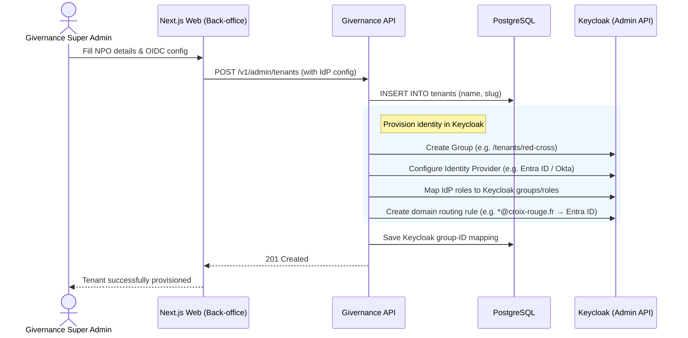
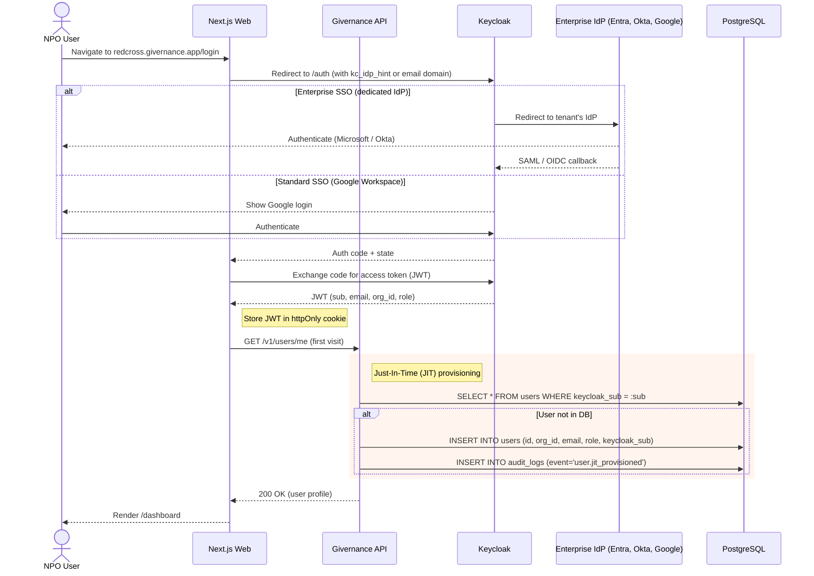

# 21 — Authentication & Single Sign-On (SSO)

> **Status**: Approved (Phase 1)
> **Related**: `02-reference-architecture.md` §3.2 & §6, `06-security-compliance.md`, `15-infra-adr.md` (ADR-009), `19-impersonation.md`
> **Context**: PR #73 (Sprint 4: Auth UI & App Shell); Spike [#80](https://github.com/purposestack/givernance/issues/80) — Multi-Tenant SSO Onboarding Architecture

## 1. Overview
Givernance uses **OpenID Connect (OIDC)** via **Keycloak** as the sole authentication mechanism. Local username/password forms and the former "self-service onboarding wizard" (organisation creation, team invite, data residency selection, GDPR parameters) have been intentionally discarded in favour of a 100% SSO-driven flow. This centralises identity management, simplifies GDPR compliance (no password storage), and enables enterprise-grade features (MFA, SAML federation) out of the box.

### 1.1 Onboarding model at a glance

| Concern | Previous model (deprecated) | Current model (Spike #80) |
|---|---|---|
| Tenant creation | Anonymous visitor fills a 5-step signup wizard | **Givernance Super Admin** creates the tenant from the back-office |
| Identity Provider configuration | Implicit (local password) | Super Admin configures the per-tenant OIDC/SAML connection (Entra ID, Okta, Google Workspace, …) in the shared Keycloak realm |
| User account creation | Manual invite → user sets password | **Just-In-Time (JIT) provisioning** runs on first SSO login from Keycloak JWT claims (`sub`, `email`, `org_id`, `role`). Email validation is deferred to Phase 2. |
| Data residency choice | Per-org selector in the wizard | **No longer a user choice** — governed centrally by ADR-009 (Scaleway Managed PostgreSQL EU, RLS-based isolation; supersedes ADR-006) |
| Salesforce / CSV import at signup | Step 3 of the wizard | Deferred to the **Migration epic**, post-login |
| Tenant URL routing | Generic app URL | Tenant is addressed by subdomain (`https://<tenant>.givernance.app`, or `.org` where appropriate); local development simulates this with `?namespace=<tenant>` |

## 2. Tenant Onboarding Architecture (Spike #80)

### 2.1 Option A — shared realm with groups/attributes (MVP choice)

Givernance operates **one shared Keycloak realm per deployment** (`givernance` for SaaS; see `02-reference-architecture.md` §3.2). Tenant membership is represented through:

- A Keycloak **group** per tenant (e.g. `/tenants/red-cross`) holding all the tenant's users.
- **Token mappers** that emit tenant claims on every access token: `org_id`, `org_slug`, and `role`.
- **Per-tenant Identity Provider federation** (Entra ID, Okta, Google Workspace, or Keycloak local for smoke tests), routed via `kc_idp_hint` or email-domain alias on the login page.

Because the realm is shared, thousands of small European NPOs can be onboarded without multiplying realms, clients, redirect URI configuration, or admin overhead. Tenant isolation is enforced at the application layer (`org_id` claim → PostgreSQL RLS, see `02-reference-architecture.md` §6).

### 2.2 Option B — dedicated realm per tenant (future evolution)

For self-hosted enterprise tenants with strict IdP isolation requirements (dedicated realm-level policies, branding, MFA config), Givernance offers a **dedicated-realm deployment mode** as an opt-in escape hatch. This is operationally heavy and reserved for large NPOs or public-sector customers; it is not offered on the shared SaaS plane.

### 2.3 Tenant provisioning — by Givernance Super Admin

A new NPO (e.g. Red Cross) is provisioned **before** any of its users can log in. A Givernance platform operator (`super_admin`) performs the following flow from the back-office:



**Scope of this step**:

- Creates the `tenants` row (no user rows yet).
- Wires the per-tenant OIDC/SAML Identity Provider in the shared `givernance` realm.
- Publishes domain-routing rules so `*@<tenant-domain>` logins are hinted to the correct IdP.
- **Does not** ask for data residency, GDPR retention, or CSV imports — those are centralised (ADR-009) or deferred to the Migration epic.

### 2.4 User creation — Just-In-Time (JIT) on first SSO login

Once the tenant is provisioned, NPO users never go through a Givernance signup wizard. Their PostgreSQL `users` row is created **Just-In-Time** on the first successful SSO login, using the trusted claims in the Keycloak-issued JWT:



**JIT provisioning rules**:

1. The API trusts **only the Keycloak-signed JWT claims** (`sub`, `email`, `org_id`, `role`) for the first INSERT. The `org_id` claim is the sole tenant-binding authority; the API MUST NOT derive `org_id` from the subdomain, email domain, or any client-provided hint.
2. The user row is keyed by `keycloak_sub` (stable Keycloak UUID) — not by email — so IdP-side email changes do not create duplicates.
3. The first provisioned user inherits the role claim from the IdP/Keycloak mapping. Tenants are expected to have at least one `org_admin` role mapping configured at provisioning time (§2.3), otherwise the first user will land with a reduced role and an explicit "Contact your Givernance administrator" banner.
4. JIT provisioning is **audit-logged** (`audit_logs.event = 'user.jit_provisioned'`) with the Keycloak `sub`, `iss`, and the trusted `org_id` at insertion time.
5. If the JWT `org_id` does not match any row in `tenants`, the API returns `403 tenant_not_provisioned` and does **not** auto-create a tenant — tenant creation is exclusively a super-admin back-office action (§2.3).

### 2.5 API contracts

| Endpoint | Caller | Purpose |
|---|---|---|
| `POST /v1/admin/tenants` | `super_admin` (requires step-up / admin secret) | Create tenant + Keycloak group + IdP federation |
| `GET /v1/admin/tenants/:id/provisioning-status` | `super_admin` | Return `{tenant, keycloakGroupId, idpAlias, status}` |
| `PATCH /v1/admin/tenants/:id/idp` | `super_admin` | Update the tenant's IdP config (rotate client secret, add domain alias) |
| `GET /v1/users/me` | Any authenticated user | Returns the profile; triggers JIT INSERT on first call |

All four endpoints live under `packages/api/src/modules/admin/` (super-admin) and `packages/api/src/modules/users/` (self); they are the integration surface for the follow-up implementation issues spawned from Spike #80.

### 2.6 Data residency

Data residency is **not a per-tenant choice** in the onboarding flow. All SaaS tenants share the Scaleway Managed PostgreSQL EU cluster, isolated by row-level security on `org_id` (see `02-reference-architecture.md` §6 and ADR-009, which supersedes ADR-006). Self-hosted deployments choose their own region at deploy time, independent of any user-facing onboarding UI.

---

## 3. Authentication Flow (Next.js & Fastify)

1. **Login Trigger**: The user visits `https://<tenant>.givernance.app/login` (or `https://<tenant>.givernance.org/login`) and clicks the "SSO Login" button. In local development, the same tenant context is simulated with `http://localhost:3000/login?namespace=<tenant>`.
2. **Redirect to Keycloak**: The Next.js API route `GET /api/auth/login` generates:
   - `state` (Anti-CSRF)
   - `nonce` (OIDC replay protection)
   - `code_challenge` / `code_verifier` (PKCE S256 to prevent code interception)
   These are stored in temporary `httpOnly` cookies (5-minute TTL). The user is redirected to the Keycloak Authorization endpoint.
3. **Keycloak Auth**: The user authenticates (via Google Workspace, Microsoft Entra, or Keycloak local DB).
4. **Callback**: Keycloak redirects to `GET /api/auth/callback` with an authorization `code`.
5. **Token Exchange**: Next.js exchanges the `code` + `code_verifier` for an Access Token (JWT) via backend server-to-server call.
6. **Session Establishment**:
   - The JWT is saved in the `givernance_jwt` cookie (`httpOnly`, `Secure`, `SameSite=Strict`).
   - A secondary `csrf-token` cookie (non-httpOnly) is set for the browser to read.
   - The web app resolves the tenant from the signed JWT claims and redirects the browser to `https://<org_slug>.givernance.app/dashboard` (or `.org` where appropriate). If the user started locally with `?namespace=<tenant>`, the local redirect remains on `localhost` and preserves the namespace for routing only.

## 4. Sign-Out Flow

The sidebar footer hosts a `LogOut` icon button that triggers the sign-out. It submits a form POST (not `fetch`) so the browser can natively follow the cross-origin redirect to Keycloak's end-session endpoint.

1. `POST /api/auth/logout` — clears both the `givernance_jwt` and `givernance_id_token` cookies, then 303-redirects to Keycloak's end-session URL with:
   - `client_id=givernance-web`
   - `post_logout_redirect_uri=${APP_URL}/login`
   - `id_token_hint=<the id_token>` — suppresses Keycloak's "Do you want to log out?" confirmation page
2. Keycloak ends the server session and redirects the browser to `/login`.

> **Why `id_token_hint` matters**: without it, Keycloak shows an HTML confirmation screen. The ID token is stored in `givernance_id_token` at callback time specifically to avoid that extra click.

> **Why `post.logout.redirect.uris` must be registered**: Keycloak 21+ requires the client to explicitly allow the `post_logout_redirect_uri`. The attribute is set in `infra/keycloak/realm-givernance.json`. Existing containers that already imported the realm need the attribute pushed via the admin API (`--import-realm` skips existing realms).

**Limitation — stateless session**: the JWT is self-contained and verified by signature, so revoking the Keycloak session does NOT invalidate an already-issued access token until its 8h TTL expires. Back-channel logout with a Redis `sid` blocklist is tracked in [#76](https://github.com/purposestack/givernance/issues/76).

## 5. Cookies Set by the Flow

| Cookie | Purpose | httpOnly | SameSite | Lifetime |
|--------|---------|:--------:|:--------:|----------|
| `givernance_jwt` | Access token used by web server components and sent to the API | Yes | Strict | 8h |
| `givernance_id_token` | ID token kept only to pass as `id_token_hint` on logout | Yes | Strict | 8h |
| `csrf-token` | Double-submit CSRF token (readable by JS via `<meta>`) | No | Strict | session |
| `oidc_state`, `oidc_code_verifier`, `oidc_nonce` | Short-lived OIDC flow state | Yes | Lax | 5 min |

## 6. Local Development Setup

### Required environment variables
Copy `.env.example` to `.env` — the OIDC-relevant vars are:

```
KEYCLOAK_URL=http://localhost:8080
KEYCLOAK_REALM=givernance
KEYCLOAK_CLIENT_ID=givernance-web
KEYCLOAK_CLIENT_SECRET=ci-test-secret-do-not-use-in-production
NEXT_PUBLIC_APP_URL=http://localhost:3000
NEXT_PUBLIC_API_URL=http://localhost:4000
API_URL=http://localhost:4000
```

### Default Tenant fallback
`KEYCLOAK_REALM` / `KEYCLOAK_CLIENT_ID` / `KEYCLOAK_CLIENT_SECRET` have sane defaults in [`packages/web/src/lib/auth/keycloak.ts`](../packages/web/src/lib/auth/keycloak.ts), so the app runs even if those are omitted.

### Docker + Keycloak realm seed
`docker compose up -d` starts Keycloak, which auto-imports `infra/keycloak/realm-givernance.json` on first startup. The seed provides:

- Realm `givernance` with brute-force protection enabled
- Client `givernance-web` with PKCE-compatible flow and the `post.logout.redirect.uris` attribute
- A single pre-provisioned user: **`admin@givernance.org` / `admin`** with the `super_admin` realm role

### Local login credentials
- **App URL**: http://localhost:3000 → redirects to `/dashboard`, then to `/login` when signed out
- **User**: `admin@givernance.org`
- **Password**: `admin`

*(Keycloak's master admin console is separate: `admin`/`admin` at http://localhost:8080.)*

### Troubleshooting

| Symptom | Cause | Fix |
|---------|-------|-----|
| `curl http://localhost:8080/realms/givernance` returns 404 | Keycloak running but realm not imported (realm JSON added after container started) | `docker compose up -d --force-recreate keycloak` |
| `?error=token_exchange_failed` on callback | Wrong `KEYCLOAK_CLIENT_SECRET` or realm misconfigured | Check the API console — `console.error("Token Exchange Failed: ...")` logs the Keycloak response |
| Clicking logout leaves you signed in on Keycloak | Old session from before the `post.logout.redirect.uris` attribute was added | Push the attribute via admin API or clear cookies for `localhost:8080` |
| Clicking login after logout auto-redirects without Keycloak prompt | Keycloak session cookie still alive | Expected once Keycloak session is ended via logout; if not, see row above |
