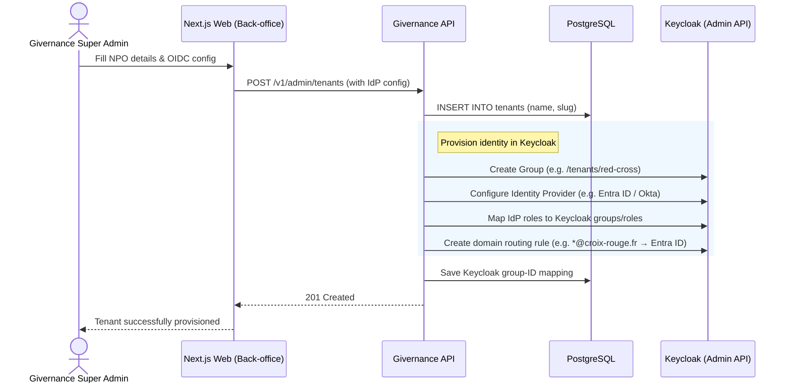
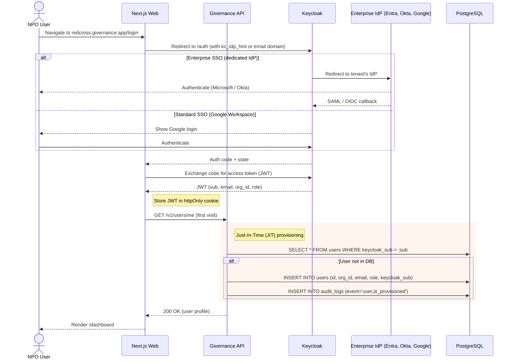

# 21 — Authentication & Single Sign-On (SSO)

> **Status**: Approved (Phase 1); extended by ADR-016 / `docs/22-tenant-onboarding.md` (Phase 2 hybrid onboarding)
> **Related**: `02-reference-architecture.md` §3.2 & §6, `06-security-compliance.md`, `15-infra-adr.md` (ADR-009, ADR-016), `19-impersonation.md`, `22-tenant-onboarding.md`
> **Context**: PR #73 (Sprint 4: Auth UI & App Shell); Spike [#80](https://github.com/purposestack/givernance/issues/80) — Multi-Tenant SSO Onboarding Architecture; design session 2026-04-23 — hybrid self-serve + enterprise tracks

## 1. Overview
Givernance uses **OpenID Connect (OIDC)** via **Keycloak** as the sole authentication mechanism. Local username/password forms and the former "self-service onboarding wizard" (organisation creation, team invite, data residency selection, GDPR parameters) have been intentionally discarded in favour of a 100% SSO-driven flow. This centralises identity management, simplifies GDPR compliance (no password storage), and enables enterprise-grade features (MFA, SAML federation) out of the box.

### 1.1 Onboarding model at a glance

The tenant-provisioning model has evolved twice. Spike #80 moved from a legacy self-service wizard to super-admin-only provisioning. ADR-016 (2026-04-23) added a self-serve track alongside the enterprise one to serve the long tail of small NPOs without corporate email domains. The table below reflects the **current (Phase 2) hybrid model**; see [`docs/22-tenant-onboarding.md`](./22-tenant-onboarding.md) for the full specification.

| Concern | Legacy wizard (pre-#80) | Enterprise track (ADR-016) | Self-serve track (ADR-016, new) |
|---|---|---|---|
| Tenant creation | Anonymous 5-step wizard | **Givernance super-admin** creates the tenant from the back-office | Anonymous visitor completes `/signup`; tenant row is `status='provisional'` until email verification |
| Identity Provider | Implicit (local password) | Super-admin wires per-tenant OIDC/SAML (Entra, Okta, Google Workspace) via Keycloak Admin API + Home IdP Discovery | Keycloak realm local authenticator (magic link / OTP) — no federated IdP |
| First-admin identity | Manual invite → user sets password | Domain-verified corporate email, JIT-provisioned from IdP claims | First verified user, granted **provisional `org_admin`** for a 7-day dispute window |
| Data residency | Per-org selector | Centralised by ADR-009 (Scaleway Managed PostgreSQL EU, RLS-based) | Same — not a user choice |
| Salesforce / CSV import | Wizard step 3 | Deferred to the Migration epic | Deferred to the Migration epic |
| Tenant URL routing | Generic app URL | `app.givernance.app/<slug>/…` (URL-path scoping per ADR-016) | Same |

Subdomain routing (`<tenant>.givernance.app`) is **deferred**; it is reserved for a future Enterprise tier over Cloudflare for SaaS.

## 2. Tenant Onboarding Architecture

### 2.1 Shared realm with Keycloak Organizations (ADR-016)

Keycloak 26 ships a first-class `Organization` primitive with built-in domain-based IdP routing (Home IdP Discovery), per-org IdP bindings, and invitation flows. ADR-016 adopts this primitive and issue [#114](https://github.com/purposestack/givernance/issues/114) landed the realm-seed migration. Concretely:

- Each Givernance tenant maps 1:1 to a Keycloak Organization identified by `tenants.keycloak_org_id`.
- Per-tenant IdP bindings are attached to the Organization rather than injected via a custom authenticator.
- Domain-based routing uses Keycloak's Home IdP Discovery, removing the need for custom `kc_idp_hint` wiring in the app.
- The seeded platform Organization (alias `platform`) owns the canonical `org_id` attribute; the super-admin user is bound as a member.
- The `organization` client scope carries three protocol mappers (reconciled by `scripts/keycloak-sync-realm.sh`):
  - `org_id` — flat top-level claim sourced from the user's `org_id` attribute (what the API's JWT verifier reads today).
  - `role` — flat top-level claim sourced from the user's `role` attribute.
  - `organization` — nested membership claim from the Keycloak 26 `oidc-organization-membership-mapper` (with `addOrganizationId=true` + `addOrganizationAttributes=true`), carrying the org UUID and every Organization attribute.
- `givernance-web` has `organization` on its default scopes so every web token carries all three claims without scope opt-in. The same scope is attached to `admin-cli` as optional so the dev smoke test's RO password grant can exercise the same code path.
- Depends on [issue #61](https://github.com/purposestack/givernance/issues/61) (Keycloak DB split, ADR-017). See [`docs/22-tenant-onboarding.md`](./22-tenant-onboarding.md) for the full Phase 2 spec (data model, API surface, rollout plan).

### 2.2 Option B — dedicated realm per tenant (future evolution)

For self-hosted enterprise tenants with strict IdP isolation requirements (dedicated realm-level policies, branding, MFA config), Givernance offers a **dedicated-realm deployment mode** as an opt-in escape hatch. This is operationally heavy and reserved for large NPOs or public-sector customers; it is not offered on the shared SaaS plane.

### 2.3 Tenant provisioning — by Givernance Super Admin

A new NPO (e.g. Red Cross) is provisioned **before** any of its users can log in. A Givernance platform operator (`super_admin`) performs the following flow from the back-office:


```mermaid
sequenceDiagram
    actor SA as Givernance Super Admin
    participant Web as Next.js Web (Back-office)
    participant API as Givernance API
    participant DB as PostgreSQL
    participant KC as Keycloak (Admin API)

    SA->>Web: Fill NPO details & OIDC config
    Web->>API: POST /v1/admin/tenants (with IdP config)
    API->>DB: INSERT INTO tenants (name, slug)

    rect rgb(240, 248, 255)
        Note right of API: Provision identity in Keycloak
        API->>KC: Create Group (e.g. /tenants/red-cross)
        API->>KC: Configure Identity Provider (e.g. Entra ID / Okta)
        API->>KC: Map IdP roles to Keycloak groups/roles
        API->>KC: Create domain routing rule (e.g. *@croix-rouge.fr → Entra ID)
    end

    API->>DB: Save Keycloak group-ID mapping
    API-->>Web: 201 Created
    Web-->>SA: Tenant successfully provisioned
```

**Scope of this step**:

- Creates the `tenants` row (no user rows yet).
- Wires the per-tenant OIDC/SAML Identity Provider in the shared `givernance` realm.
- Publishes domain-routing rules so `*@<tenant-domain>` logins are hinted to the correct IdP.
- **Does not** ask for data residency, GDPR retention, or CSV imports — those are centralised (ADR-009) or deferred to the Migration epic.

### 2.4 User creation — Just-In-Time (JIT) on first SSO login

Once the tenant is provisioned, NPO users never go through a Givernance signup wizard. Their PostgreSQL `users` row is created **Just-In-Time** on the first successful SSO login, using the trusted claims in the Keycloak-issued JWT:


```mermaid
sequenceDiagram
    actor User as NPO User
    participant Web as Next.js Web
    participant API as Givernance API
    participant KC as Keycloak
    participant IdP as Enterprise IdP (Entra, Okta, Google)
    participant DB as PostgreSQL

    User->>Web: Navigate to redcross.givernance.app/login
    Web->>KC: Redirect to /auth (with kc_idp_hint or email domain)

    alt Enterprise SSO (dedicated IdP)
        KC->>IdP: Redirect to tenant's IdP
        IdP-->>User: Authenticate (Microsoft / Okta)
        IdP-->>KC: SAML / OIDC callback
    else Standard SSO (Google Workspace)
        KC-->>User: Show Google login
        User->>KC: Authenticate
    end

    KC-->>Web: Auth code + state
    Web->>KC: Exchange code for access token (JWT)
    KC-->>Web: JWT (sub, email, org_id, role)

    Note right of Web: Store JWT in httpOnly cookie
    Web->>API: GET /v1/users/me (first visit)

    rect rgb(255, 245, 238)
        Note right of API: Just-In-Time (JIT) provisioning
        API->>DB: SELECT * FROM users WHERE keycloak_sub = :sub
        alt User not in DB
            API->>DB: INSERT INTO users (id, org_id, email, role, keycloak_sub)
            API->>DB: INSERT INTO audit_logs (event='user.jit_provisioned')
        end
    end

    API-->>Web: 200 OK (user profile)
    Web-->>User: Render /dashboard
```

**JIT provisioning rules**:

1. The API trusts **only the Keycloak-signed JWT claims** (`sub`, `email`, `org_id`, `role`) for the first INSERT. The `org_id` claim is the sole tenant-binding authority; the API MUST NOT derive `org_id` from the subdomain, email domain, or any client-provided hint.
2. The user row is keyed by `keycloak_sub` (stable Keycloak UUID) — not by email — so IdP-side email changes do not create duplicates.
3. The first provisioned user inherits the role claim from the IdP/Keycloak mapping. Tenants are expected to have at least one `org_admin` role mapping configured at provisioning time (§2.3), otherwise the first user will land with a reduced role and an explicit "Contact your Givernance administrator" banner.
4. JIT provisioning is **audit-logged** (`audit_logs.event = 'user.jit_provisioned'`) with the Keycloak `sub`, `iss`, and the trusted `org_id` at insertion time.
5. If the JWT `org_id` does not match any row in `tenants`, the API returns `403 tenant_not_provisioned` and does **not** auto-create a tenant — tenant creation is exclusively a super-admin back-office action (§2.3).

### 2.5 API contracts

| Endpoint | Caller | Purpose |
|---|---|---|
| `POST /v1/admin/tenants` | `super_admin` (requires step-up / admin secret) | Create tenant + Keycloak group + IdP federation |
| `GET /v1/admin/tenants/:id/provisioning-status` | `super_admin` | Return `{tenant, keycloakGroupId, idpAlias, status}` |
| `PATCH /v1/admin/tenants/:id/idp` | `super_admin` | Update the tenant's IdP config (rotate client secret, add domain alias) |
| `GET /v1/users/me` | Any authenticated user | Returns the profile; triggers JIT INSERT on first call |

All four endpoints live under `packages/api/src/modules/admin/` (super-admin) and `packages/api/src/modules/users/` (self); they are the integration surface for the follow-up implementation issues spawned from Spike #80.

### 2.6 Data residency

Data residency is **not a per-tenant choice** in the onboarding flow. All SaaS tenants share the Scaleway Managed PostgreSQL EU cluster, isolated by row-level security on `org_id` (see `02-reference-architecture.md` §6 and ADR-009, which supersedes ADR-006). Self-hosted deployments choose their own region at deploy time, independent of any user-facing onboarding UI.

---

## 3. Authentication Flow (Next.js & Fastify)

1. **Login Trigger**: The user visits `https://<tenant>.givernance.app/login` (or `https://<tenant>.givernance.org/login`) and clicks the "SSO Login" button. In local development, the same tenant context is simulated with `http://localhost:3000/login?namespace=<tenant>`.
2. **Redirect to Keycloak**: The Next.js API route `GET /api/auth/login` generates:
   - `state` (Anti-CSRF)
   - `nonce` (OIDC replay protection)
   - `code_challenge` / `code_verifier` (PKCE S256 to prevent code interception)
   These are stored in temporary `httpOnly` cookies (5-minute TTL). The user is redirected to the Keycloak Authorization endpoint.
3. **Keycloak Auth**: The user authenticates (via Google Workspace, Microsoft Entra, or Keycloak local DB).
4. **Callback**: Keycloak redirects to `GET /api/auth/callback` with an authorization `code`.
5. **Token Exchange**: Next.js exchanges the `code` + `code_verifier` for an Access Token (JWT) via backend server-to-server call.
6. **Session Establishment**:
   - Next.js verifies the Keycloak access token against the realm JWKS and ensures the `org_id` claim is present before trusting it.
   - The raw Keycloak Access Token is saved in the `givernance_jwt` cookie (`httpOnly`, `Secure`, `SameSite=Strict`).
   - The Keycloak Refresh Token is saved in the `givernance_refresh_token` cookie with the same attributes and is never exposed to browser JavaScript.
   - A secondary `csrf-token` cookie (non-httpOnly) is set for the browser to read.
   - The web app resolves the tenant from the signed JWT claims and redirects the browser to `https://<org_slug>.givernance.app/dashboard` (or `.org` where appropriate). If the user started locally with `?namespace=<tenant>`, the local redirect remains on `localhost` and preserves the namespace for routing only.
7. **Silent Renewal On Activity**:
   - The Next.js front-door `proxy.ts` inspects the JWT `exp` claim on each request.
   - When the token is within a short grace window of expiry, the proxy exchanges the refresh token for a fresh access token server-side and rotates the auth cookies before forwarding the request.
   - If the refresh fails and the access token is already expired, the cookies are cleared and the next protected navigation returns to `/login`.

## 4. Sign-Out Flow

The topbar avatar is a `DropdownMenu` (the **account menu** — see [GLO-005 mockup](design/shared/account-menu.html), issue #76). "Se déconnecter" calls `useAuth().logout()` which submits a form POST (not `fetch`) so the browser can natively follow the cross-origin redirect to Keycloak's end-session endpoint.

1. `POST /api/auth/logout` — clears the `givernance_jwt`, `givernance_id_token`, and `givernance_refresh_token` cookies, then 303-redirects to Keycloak's end-session URL with:
   - `client_id=givernance-web`
   - `post_logout_redirect_uri=${APP_URL}/login`
   - `id_token_hint=<the id_token>` — suppresses Keycloak's "Do you want to log out?" confirmation page
2. Keycloak ends the server session and redirects the browser to `/login`.

> **Why `id_token_hint` matters**: without it, Keycloak shows an HTML confirmation screen. The ID token is stored in `givernance_id_token` at callback time specifically to avoid that extra click.

> **Why `post.logout.redirect.uris` must be registered**: Keycloak 21+ requires the client to explicitly allow the `post_logout_redirect_uri`. The attribute is set in `infra/keycloak/realm-givernance.json`. Existing containers that already imported the realm need the attribute pushed via the admin API (`--import-realm` skips existing realms).

### 4.1 Back-channel logout (issue #76 / PR-2)

Stateless access tokens used to mean a Keycloak session ended on another device (admin "Sign out all sessions", sibling-device logout) could not invalidate an already-issued access token until natural expiry. OIDC Back-Channel Logout 1.0 closes that gap.

**End-to-end revocation flow** (ADR-029 covers the design rationale):

```mermaid
sequenceDiagram
    autonumber
    actor Admin as Keycloak admin
    participant KC as Keycloak
    participant API as Givernance API
    participant Redis
    actor User as Victim browser

    Admin->>KC: "Sign out all sessions" for user X
    KC->>KC: terminate SSO session for user X
    KC->>+API: POST /v1/session/backchannel-logout<br/>application/x-www-form-urlencoded<br/>logout_token=<signed JWT>
    API->>API: verify JWT signature + iss + aud<br/>+ iat skew + events claim<br/>+ no-nonce + jti + sid
    alt token verification OK
        API->>+Redis: SETEX auth:kc-sid-blocklist:<sid> 600 "1"
        Redis-->>-API: OK
        API-->>-KC: 200 {sid}
    else token rejected (bad sig / wrong aud / nonce present / …)
        API-->>KC: 400 RFC 9457 problem-detail
        Note over KC,API: Keycloak surfaces the failure<br/>via "Failed back-channel logout"<br/>admin event; no retry storm
    end

    Note over User: 5 minutes later, the silent-refresh<br/>scheduler hits /api/auth/refresh
    User->>+API: GET /v1/users/me<br/>(cookie: givernance_jwt with sid=X)
    API->>API: verify JWT signature
    API->>+Redis: GET auth:kc-sid-blocklist:<sid>
    Redis-->>-API: "1"
    API-->>-User: 401 {"detail":"Session revoked."}
    Note over User: AuthProvider clears local state;<br/>next nav → middleware → /login
```

**Keycloak side** (`infra/keycloak/realm-givernance.json` → `givernance-web` client):

| Attribute | Value | Purpose |
|---|---|---|
| `backchannel.logout.url` | `http://api:3000/v1/session/backchannel-logout` (dev) | Where Keycloak POSTs the signed `logout_token` |
| `backchannel.logout.session.required` | `true` | Keycloak emits the OIDC `sid` claim on every access/ID token, and includes it in the logout token |
| `backchannel.logout.revoke.offline.tokens` | `false` | We don't issue offline tokens; explicit for posterity |

Staging / production operators override `backchannel.logout.url` per-environment via the Keycloak admin API (`https://staging.givernance.org/v1/session/backchannel-logout`, `https://app.givernance.org/v1/session/backchannel-logout`). The dev URL uses the docker-compose service hostname (`api`) so Keycloak can reach the API container. **`scripts/keycloak-sync-realm.sh` will overwrite a manual override back to the dev value on its next reconcile run** — a per-environment runbook for the override is tracked as a follow-up to this PR.

**Why on the Fastify API instead of the Next.js web** (PR #360 review Architect M3): Keycloak's back-channel POST is server-to-server, not browser-mediated, so the OIDC-client property normally located on the web is not load-bearing for the route's home. The API already owns the Redis blocklist primitives (`session/service.ts`), the realm JWKS verifier (`keycloak-jwt.ts`), and the JWT-extraction code path (`plugins/auth.ts`). Putting the webhook there avoids a hop through the Next.js process for every revocation and removes the need to add a Redis client to the web runtime.

**App side** (`packages/api/src/modules/session/routes.ts`):

1. `POST /v1/session/backchannel-logout` receives `application/x-www-form-urlencoded` body with a `logout_token` field. Exempt from the JWT auth gate (`isAuthExempt` in `plugins/auth.ts`, exact-pathname match) — the logout token IS the authentication. Rate-limited at 1000/min as a DoS floor.
2. [`verifyBackchannelLogoutToken`](../packages/api/src/lib/keycloak-logout-token.ts) validates the token per OIDC Back-Channel Logout 1.0 § 2.4:
   - Signature against realm JWKS (RS256)
   - `iss` matches realm issuer
   - `aud` matches the `KEYCLOAK_CLIENT_ID` env var (defaults to `givernance-web` via the shared `KEYCLOAK_DEFAULT_CLIENT_ID` constant; no second-layer fallback in the verifier)
   - `iat` recent (≤ 5 min skew via `maxTokenAge`)
   - `jti` MUST be present (OIDC requirement — duplicate-receipt detection)
   - `events` contains `http://schemas.openid.net/event/backchannel-logout` mapped to a JSON object
   - `nonce` MUST NOT be present (defends against replaying a leaked ID token as a logout token)
   - `sid` MUST be present (realm sets `backchannel.logout.session.required=true`, so every legitimate logout token carries it)
3. The `sid` is written to a Redis blocklist `auth:kc-sid-blocklist:<sid>` with a 10-minute TTL (covers the 5-min access-token lifespan + skew). If the Redis write fails, the route returns 400 — Keycloak surfaces the failure via its "Failed back-channel logout" admin event instead of mounting a retry storm.
4. On the next authenticated request, the Fastify `auth` plugin extracts `sid` from the JWT claims and rejects the request with `401 Unauthorized — Session revoked.` if blocklisted.

**Why `sid` and not `jti`**: the existing `session_blocklist:<jti>` (used by `switch-org`) revokes a single access token. After a silent refresh (see §4.2 below), `jti` rotates but `sid` stays stable for the same Keycloak SSO session. Blocklisting `sid` therefore invalidates every refresh, not just the token in flight.

**Privacy / GDPR posture**:

- `sid` is a session identifier — not direct PII, but linkable to a natural person via Keycloak's session store. Classification: pseudonymous identifier (GDPR Art. 4(5)).
- Retention: bounded by the Redis key TTL (10 minutes). No persistence beyond that.
- Encryption at rest: inherits from the managed-Redis posture (Scaleway Managed Redis EU per ADR-009 in SaaS deployments; operator-configured in self-hosted).
- Log lines emit `sid` and a sha256-truncated hash of `sub` (raw `sub` is omitted from info-level logs per the codebase's `hashIp`/redaction convention). `jti` is logged for duplicate-receipt diagnostics.
- The endpoint is unauthenticated by design (Keycloak signs the payload). A forged `logout_token` cannot leak data — the 400 response never echoes any claim from the rejected token.

### 4.2 Short access-token TTL + silent refresh (issue #76 / PR-3)

To narrow the blocklist window (and the worst-case "compromised access token" lifetime), the realm sets `access.token.lifespan=300` (5 min) on `givernance-web`. The web app refreshes silently before the token expires so the user never gets bounced to `/login` mid-session.

| Component | Role |
|---|---|
| `POST /api/auth/refresh` (`packages/web/src/app/api/auth/refresh/route.ts`) | Reads the `givernance_refresh_token` cookie, calls Keycloak's token endpoint with `grant_type=refresh_token`, rotates `givernance_jwt` + `givernance_id_token` + `givernance_refresh_token` on success. On `invalid_grant` (session revoked, refresh token expired) clears all session cookies and returns 401. |
| `AuthProvider` (`packages/web/src/lib/auth/auth-context.tsx`) | Schedules a refresh ~240s after the user hydrates; on success, re-schedules using the server's `expires_in`. On failure, clears local auth state so the next protected navigation hits middleware → `/login`. |

CSRF: the refresh endpoint does not require the double-submit token. The refresh cookie is httpOnly, the only side effect is rotating the victim's own tokens, and the response goes to the same origin. Adding CSRF would block legitimate cross-tab refreshes without adding security.

**Multi-tab race**: each tab schedules its own refresh. Keycloak's refresh-token rotation means concurrent refreshes from two tabs may produce one winner + one `invalid_grant` failure; the losing tab catches the 401 and bounces to `/login`. This is acceptable for v1; a shared-worker / `BroadcastChannel` coordinator is tracked as a follow-up if it becomes a UX issue.

**Limitation — JWT signature still self-contained**: the access token is still verified by signature alone within its 5-min lifespan. The combined back-channel `sid` blocklist + short TTL closes the practical attack window to ≤ 5 minutes for any compromised or revoked session, with explicit fail-closed behaviour on Redis outage (see `isKeycloakSessionBlocklisted`).

## 5. Cookies Set by the Flow

| Cookie | Purpose | httpOnly | SameSite | Lifetime |
|--------|---------|:--------:|:--------:|----------|
| `givernance_jwt` | Access token used by web server components and sent to the API | Yes | Strict | Keycloak `expires_in` (rotated on activity) |
| `givernance_id_token` | ID token kept only to pass as `id_token_hint` on logout | Yes | Strict | Session lifetime |
| `givernance_refresh_token` | Refresh token used only server-side for silent renewal | Yes | Strict | Keycloak `refresh_expires_in` |
| `csrf-token` | Double-submit CSRF token (readable by JS via `<meta>`) | No | Strict | session |
| `oidc_state`, `oidc_code_verifier`, `oidc_nonce` | Short-lived OIDC flow state | Yes | Lax | 5 min |

## 6. Local Development Setup

### Required environment variables
Copy `.env.example` to `.env` — the OIDC-relevant vars are:

```
KEYCLOAK_URL=http://localhost:8080
KEYCLOAK_REALM=givernance
KEYCLOAK_CLIENT_ID=givernance-web
KEYCLOAK_CLIENT_SECRET=ci-test-secret-do-not-use-in-production
KEYCLOAK_ISSUER=http://localhost:8080/realms/givernance
KEYCLOAK_JWKS_URL=http://localhost:8080/realms/givernance/protocol/openid-connect/certs
# Admin API service account (issue #107) — used by the API server to provision
# Organizations, Identity Providers, and invitations. Leave the secret unset
# to disable the admin client entirely.
KEYCLOAK_ADMIN_CLIENT_ID=givernance-admin
KEYCLOAK_ADMIN_CLIENT_SECRET=ci-test-admin-secret-do-not-use-in-production
# KEYCLOAK_ADMIN_URL=http://localhost:8080  # defaults to KEYCLOAK_URL
NEXT_PUBLIC_APP_URL=http://localhost:3000
NEXT_PUBLIC_API_URL=http://localhost:4000
API_URL=http://localhost:4000
```

### Default Tenant fallback
`KEYCLOAK_REALM` / `KEYCLOAK_CLIENT_ID` / `KEYCLOAK_CLIENT_SECRET` have sane defaults in [`packages/web/src/lib/auth/keycloak.ts`](../packages/web/src/lib/auth/keycloak.ts), so the app runs even if those are omitted.

### Docker + Keycloak realm seed
`docker compose up -d` starts Keycloak, which auto-imports `infra/keycloak/realm-givernance.json` on first startup. The seed provides:

- Realm `givernance` with brute-force protection and `organizationsEnabled: true`
- Client `givernance-web` with PKCE-compatible flow, the `post.logout.redirect.uris` attribute, and the `organization` client scope on its default scopes
- A single pre-provisioned user: **`admin@givernance.org` / `admin`** with the `super_admin` realm role and `org_id=00000000-0000-0000-0000-0000000000a1`

### `org_id` claim pipeline

The API treats `org_id` as the sole tenant-binding authority, so the access token must always contain that claim. The pipeline:

- A seeded platform Organization (alias `platform`) with `attributes.org_id=[00000000-0000-0000-0000-0000000000a1]`; the super-admin user is bound as a member.
- A user profile definition with `unmanagedAttributePolicy=ENABLED` so the custom `org_id` attribute on the user is accepted (Keycloak's declarative user profile rejects undeclared attributes by default).
- An `org_id` attribute on the seeded user mirroring the Organization's attribute.
- The `organization` **client scope** carries both an `oidc-usermodel-attribute-mapper` (emitting flat `org_id`) and the built-in `oidc-organization-membership-mapper` (emitting the nested `organization` claim). `givernance-web` has the scope on its default scopes, so every token carries both claims.

Keycloak's `--import-realm` uses `IGNORE_EXISTING`, so a container started before the seed was last updated will not pick up these settings on restart. `scripts/dev-up.sh` runs `scripts/keycloak-sync-realm.sh` after Keycloak boots to reconcile the state idempotently. If you bypass `dev-up.sh`, run the sync script manually:

```bash
./scripts/keycloak-sync-realm.sh
```

### Local login credentials
- **App URL**: http://localhost:3000 → redirects to `/dashboard`, then to `/login` when signed out
- **User**: `admin@givernance.org`
- **Password**: `admin`

*(Keycloak's master admin console is separate: `admin`/`admin` at http://localhost:8080.)*

### Troubleshooting

| Symptom | Cause | Fix |
|---------|-------|-----|
| `curl http://localhost:8080/realms/givernance` returns 404 | Keycloak running but realm not imported (realm JSON added after container started) | `docker compose up -d --force-recreate keycloak` |
| `?error=token_exchange_failed` on callback | Wrong `KEYCLOAK_CLIENT_SECRET` or realm misconfigured | Check the API console — `console.error("Token Exchange Failed: ...")` logs the Keycloak response |
| `?error=missing_org_id` on callback | Keycloak realm pre-dates the `org_id` user-profile / mapper config (common on containers created before April 2026) | Run `./scripts/keycloak-sync-realm.sh` to patch the live realm, then log in again |
| Clicking logout leaves you signed in on Keycloak | Old session from before the `post.logout.redirect.uris` attribute was added | Push the attribute via admin API or clear cookies for `localhost:8080` |
| Clicking login after logout auto-redirects without Keycloak prompt | Keycloak session cookie still alive | Expected once Keycloak session is ended via logout; if not, see row above |
