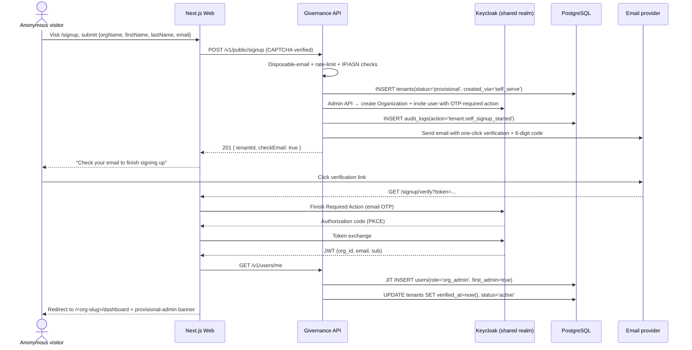

# 22 — Tenant Onboarding & Multi-Tenancy

> **Status**: Proposed (Phase 2)
> **Related**: [`docs/15-infra-adr.md`](./15-infra-adr.md) ADR-016, [`docs/21-authentication-sso.md`](./21-authentication-sso.md), [`docs/19-impersonation.md`](./19-impersonation.md), Spike [#80](https://github.com/purposestack/givernance/issues/80)
> **Context**: team design session 2026-04-23 reopened Spike #80 to add a self-serve track for SMB NPOs without a corporate email domain.

## 1. Why this document exists

Givernance targets ~2-to-200-staff European nonprofits. The customer base splits into three segments with very different onboarding needs:

- **SMB NPOs** (the long tail) — 2–20 staff, often using personal gmail, no corporate IT, price-sensitive, non-technical admin.
- **Mid-market NPOs** — 20–60 staff, Google Workspace or Microsoft 365, 1–2 admins, can handle a supported onboarding call.
- **Enterprise NPOs / federations** — 60+ staff, dedicated IT, existing SSO (Entra, Okta), domain-verification reflexes, procurement driven by a DPO.

Designing for only one of these segments is a known failure mode (documented in the 2026-04-23 transcript). This document specifies the hybrid flow that serves all three without duplicating infrastructure.

## 2. Concepts & vocabulary

| Term | Meaning in Givernance |
|---|---|
| **Tenant** | A row in `tenants` with its own `org_id`; the RLS boundary for all tenant-scoped data. |
| **Organization** | Business-facing synonym for tenant. Keycloak 26's first-class `Organization` entity maps 1:1 to a Givernance tenant. |
| **Track** | How a tenant came into existence: `self_serve` / `enterprise` / `invitation`. Stored as `tenants.created_via`. Drives UI affordances but not data access. |
| **Tenant domain** | A DNS domain claimed by a tenant (e.g., `croix-rouge.fr`). Verified via DNS TXT. Used for Home IdP Discovery. Optional. |
| **IdP binding** | A per-tenant OIDC/SAML identity provider (Entra, Okta, Google Workspace) registered in the shared Keycloak realm and bound to the tenant's Keycloak Organization. |
| **Provisional admin** | The first user of a self-serve tenant; holds `org_admin` role for a 7-day grace period during which other verified members can dispute. |
| **Home IdP Discovery** | Keycloak's email-domain → IdP routing at the login screen. Supersedes the custom `kc_idp_hint` plumbing from Spike #80. |
| **JIT provisioning** | On first successful SSO login, the Givernance `users` row is created from trusted JWT claims — never before. |
| **Org picker** | Post-login interstitial screen listing the tenants the authenticated user belongs to; chosen tenant is minted into a short-lived access token. |

## 3. Onboarding tracks at a glance

### 3.1 Self-serve (SMB) track



Notable behaviours:

- Tenant row is created **before** verification, with `status='provisional'`; it is reaped after 24h if verification never completes (BullMQ cleanup job).
- `users.role='org_admin'` is granted on first login; `users.first_admin=true` is kept for dispute logic.
- The provisional banner is removed after 7 days OR when a second admin is added via invitation, whichever first.
- No credit card involved.

### 3.2 Enterprise SSO track

```mermaid
sequenceDiagram
    actor SA as Givernance Super Admin
    participant Back as Back-office Web
    participant API as Givernance API
    participant DB as PostgreSQL
    participant KC as Keycloak (Admin API)
    participant Cust as NPO IT admin

    SA->>Back: Create tenant form (name, slug, primary domain, plan)
    Back->>API: POST /v1/admin/tenants
    API->>DB: INSERT tenants(status='provisional', created_via='enterprise')
    API->>KC: Create Organization (alias = slug)
    API->>DB: INSERT tenant_domains(state='pending_dns')
    API-->>Back: 201 { tenantId, dnsTxtRecord }
    Back-->>SA: "Ask <cust> to publish TXT record: <value>"

    SA->>Cust: Share DNS TXT value + IdP bootstrap guide
    Cust->>Cust: Publish DNS TXT; share IdP metadata URL/client
    SA->>Back: Enter IdP metadata + test
    Back->>API: POST /v1/admin/tenants/:id/provision-idp
    API->>KC: Create IdP instance + bind to Organization
    API->>KC: Link domain → Organization for Home IdP Discovery
    API->>DB: UPDATE tenant_domains SET state='verified'
    API->>DB: UPDATE tenants SET status='active'
    API-->>Back: 200 { loginUrl }
    SA-->>Cust: Deliver the tenant URL + invite first admin
```

The NPO's users then follow the JIT flow (same as §2.4 of `docs/21-authentication-sso.md`), but their `org_admin` role comes from the IdP claim mapping, not from self-serve privilege elevation.

### 3.3 Invitation-join track

Existing invitations flow (see [`packages/api/src/modules/invitations/routes.ts`](../packages/api/src/modules/invitations/routes.ts)) is extended:

1. `org_admin` invites an email from **Settings → Team**.
2. Invitation email carries a Keycloak-hosted accept link; invitee authenticates via the tenant's bound IdP (if any) or the realm's local authenticator (magic link / password).
3. On successful auth, JIT-provisions a `users` row in the target tenant with the role specified on the invitation.
4. If the invitee is already in a Keycloak Organization, they now belong to **two** (or more) — the Org picker handles that.

## 4. Data model additions

### 4.1 `tenants` changes

```sql
ALTER TABLE tenants
  ADD COLUMN status           VARCHAR(32) NOT NULL DEFAULT 'provisional'
      CHECK (status IN ('provisional','active','suspended','archived')),
  ADD COLUMN created_via      VARCHAR(32) NOT NULL DEFAULT 'enterprise'
      CHECK (created_via IN ('self_serve','enterprise','invitation')),
  ADD COLUMN verified_at      TIMESTAMPTZ,
  ADD COLUMN keycloak_org_id  TEXT,            -- Keycloak Organization id
  ADD COLUMN primary_domain   VARCHAR(255);
```

Existing `status` column (`VARCHAR(50) DEFAULT 'active'`) is migrated by setting `status='active'` for all pre-existing rows.

### 4.2 `tenant_domains`

```sql
CREATE TABLE tenant_domains (
  id              UUID PRIMARY KEY DEFAULT uuid_generate_v7(),
  org_id          UUID NOT NULL REFERENCES tenants(id) ON DELETE CASCADE,
  domain          VARCHAR(255) NOT NULL,
  state           VARCHAR(32) NOT NULL DEFAULT 'pending_dns'
                  CHECK (state IN ('pending_dns','verified','revoked')),
  dns_txt_value   VARCHAR(128) NOT NULL,
  verified_at     TIMESTAMPTZ,
  created_at      TIMESTAMPTZ NOT NULL DEFAULT now(),
  UNIQUE (domain)                                  -- domain claim is global
);
CREATE INDEX ON tenant_domains (org_id);
```

Personal email domains (gmail, outlook, proton, …) are rejected at the API level and **cannot** be stored — the block list lives in `@givernance/shared/constants/personal-email-domains.ts`.

### 4.3 `tenant_admin_disputes` (grace-period dispute log)

```sql
CREATE TABLE tenant_admin_disputes (
  id              UUID PRIMARY KEY DEFAULT uuid_generate_v7(),
  org_id          UUID NOT NULL REFERENCES tenants(id) ON DELETE CASCADE,
  disputer_id     UUID NOT NULL REFERENCES users(id),
  provisional_admin_id UUID NOT NULL REFERENCES users(id),
  reason          TEXT,
  resolved_at     TIMESTAMPTZ,
  resolution      VARCHAR(32)
                  CHECK (resolution IN ('kept','replaced','escalated_to_support')),
  created_at      TIMESTAMPTZ NOT NULL DEFAULT now()
);
```

Every other member of the tenant can open one dispute during the 7-day provisional window. Resolution is manual (support triage) for the first pilot deployments.

### 4.4 `users` changes

```sql
ALTER TABLE users
  ADD COLUMN first_admin  BOOLEAN NOT NULL DEFAULT false,
  ADD COLUMN provisional_until TIMESTAMPTZ;
```

## 5. API surface

All new endpoints respect the RLS 3-role pattern:

- **Public endpoints** run without tenant context (no `withTenantContext`), do their own `org_id` resolution after disposable-email / rate-limit checks, and emit audit events via a system actor.
- **Super-admin endpoints** use `requireSuperAdmin` guard (to be extended with the back-office auth introduced by PR #73) and may bypass RLS via the owner role.
- **Self endpoints** use the standard `requireAuth` + `withTenantContext(request.auth.orgId)`.

| Endpoint | Caller | Purpose |
|---|---|---|
| `POST /v1/public/signup` | Anonymous + CAPTCHA | Self-serve tenant creation with provisional admin |
| `POST /v1/public/signup/resend` | Anonymous | Re-send verification email; rate-limited per email+IP |
| `POST /v1/public/signup/verify` | Anonymous | Complete the Keycloak Required Action from the email link |
| `GET /v1/public/tenants/lookup?email=…` | Anonymous | Return `{ hasExistingTenant, hint }` for the login flow; used by Home IdP Discovery hint + "join your existing org" nudge |
| `POST /v1/admin/tenants` | `super_admin` | Enterprise-track tenant creation; returns DNS TXT to publish |
| `POST /v1/admin/tenants/:id/provision-idp` | `super_admin` | Create + bind the tenant's OIDC/SAML IdP via Keycloak Admin API |
| `POST /v1/tenants/:id/domains` | `org_admin` | Claim a domain on an existing tenant |
| `POST /v1/tenants/:id/domains/:domain/verify` | `org_admin` | Trigger DNS TXT lookup and transition to `verified` |
| `GET /v1/users/me/organizations` | `requireAuth` | List organizations the user belongs to (for the Org picker) |
| `POST /v1/session/switch-org` | `requireAuth` | Re-mint a short-lived JWT for the target org; revokes the previous access token |
| `POST /v1/tenants/:id/admin-dispute` | `requireAuth` (any tenant member) | Open a dispute against the provisional admin within the 7-day window |

Notes on the Keycloak Admin API integration:

- Admin API base URL + service-account credentials live in `KEYCLOAK_ADMIN_URL` + `KEYCLOAK_ADMIN_CLIENT_ID` / `KEYCLOAK_ADMIN_CLIENT_SECRET` — **different from** the realm client used for user auth.
- All Admin API calls go through a small `keycloakAdminClient` helper in `packages/api/src/lib/keycloak-admin.ts` with exponential-backoff retry and a circuit breaker (rate-limit aware).
- Integration tests stub this helper; a single e2e smoke test against a real Keycloak container runs in `.github/workflows/ci.yml` gated by `KEYCLOAK_E2E=1`.

## 6. Frontend flows

### 6.1 Public signup form

- Single page `/signup` with fields: organization name, first & last name, email, country (pre-selected from IP geolocation, editable), legal type (dropdown seeded from `docs/16-greg-field-insights.md`), GDPR micro-consent.
- Organization slug auto-generated from name; collision check runs client-side against `GET /v1/public/tenants/lookup`.
- hCaptcha widget; CAPTCHA token sent as `x-captcha-token` header.
- On submit: 201 → success screen "Check your email". Error states: disposable email → specific message; existing tenant on domain → deep-link to their login.

### 6.2 Email verification landing

- `/signup/verify?token=…` completes the Keycloak Required Action in a server component.
- On success: user is logged in, redirected to `/<org-slug>/dashboard` with a **provisional-admin banner** rendered by the app shell (reuse the impersonation banner pattern from PR #73).

### 6.3 Organization picker

- Interstitial `/select-organization` shown when `GET /v1/users/me/organizations` returns > 1 org.
- One card per tenant: logo, name, role badge, last-visited timestamp.
- Keyboard-navigable; default selection = last-used tenant from the `gv-last-org` cookie.
- Submitting calls `POST /v1/session/switch-org` and redirects to `/<slug>/dashboard`.

### 6.4 Back-office: tenant management

- Route group `(admin)` gated by `requireRole('super_admin')`.
- Screens: `/admin/tenants` (list + filters), `/admin/tenants/new` (enterprise-track creation form), `/admin/tenants/:id` (overview, domains tab, IdP tab, users tab, lifecycle tab).
- Uses the existing `/v1/admin/tenants/:orgId/snapshot` for audit exports.
- Suspend / archive actions are **soft** — no hard delete in MVP.

## 7. URL routing

- Authenticated app routes live under `/<org-slug>/…` (see §6 of ADR-016). App shell reads the slug from the route, resolves the tenant on every request, and re-mints the access token on `POST /v1/session/switch-org`.
- Reserved slugs (block list in `@givernance/shared/constants/reserved-slugs.ts`): `admin`, `api`, `auth`, `login`, `signup`, `select-organization`, `p`, `public`, `settings`, `status`, `onboarding`, `www`, `mail`, `signup`, `billing`, `health`, `docs`.
- Subdomain routing (`<slug>.givernance.app`) stays **deferred**. When it becomes necessary (enterprise tier), Cloudflare for SaaS is the planned delivery path.

## 8. Security & compliance

- **Abuse filters on `/v1/public/signup`**: disposable-email blocklist, per-IP rate limit (5/hour, 20/day), per-ASN rate limit for known hosting providers, hCaptcha enterprise challenge on threshold breach.
- **Audit trail**: every state transition on a tenant (`provisional → active`, `active → suspended`, `domain pending_dns → verified`, `org_admin dispute → resolution`) is logged with `actor`, `target`, `reason`, `ip_hash`.
- **GDPR**: signup form is minimal-PII; DPO email collected at verification step; data-residency decision is platform-wide (ADR-009) and never per tenant.
- **Back-channel logout** — the Keycloak back-channel logout endpoint from #76 MUST be wired before this flow reaches production, so a super-admin revoking a compromised tenant's session propagates within the access-token TTL.
- **Impersonation** — the "log in as" support action from #24 must know about multi-tenancy: a Givernance support agent impersonating a user in org A must never carry an `act` claim into org B. The Org picker enforces this.

## 9. Testing strategy

- **Unit**: disposable-email blocklist, slug collision, reserved-slug rejection, DNS TXT parser, personal-email detection.
- **Integration (API)**: every endpoint in §5 with cross-tenant isolation cases, rate-limit-exceeded cases, 422 on personal-domain claim, 409 on duplicate-domain claim, provisional-admin dispute happy + expired paths.
- **E2E smoke** (Keycloak + DB, gated): full self-serve signup → verify → dashboard round-trip, plus enterprise-track IdP provisioning against a mocked OIDC provider.
- **Load**: 100 concurrent signups from distinct IPs to confirm rate-limit store (Redis) holds up.

## 10. Migration & rollout

1. Ship the ADR + this doc (PR #1).
2. Land schema migrations + personal-email constants + reserved-slugs constants (PR #2).
3. Keycloak Admin API client + service account (PR #3).
4. Self-serve signup + verification endpoints + email templates (PR #4).
5. Public signup page + verify landing page (PR #5).
6. Enterprise track — domain CRUD + IdP provisioning endpoints (PR #6).
7. Back-office UI for tenants + domains + IdP (PR #7).
8. Organization picker + `switch-org` endpoint (PR #8).
9. Provisional-admin banner + dispute flow (PR #9).
10. Migrate local dev realm seed from groups/attributes to Keycloak Organizations, upgrade Keycloak container to 26.x (PR #10).

Phases 1–5 are blocking for the first external SMB pilot; phases 6–10 are blocking for the first enterprise pilot. Issue #61 (split Keycloak DB) is a prerequisite for the Keycloak 26 upgrade in PR #10.

## 11. Open questions

- **SIREN / RNA lookup** for French NPOs at signup — cross-check the organization against the public registry, offer "this looks like <name> — confirm" UX. Out of scope for the first pilot; tracked as a follow-up.
- **Magic link vs 6-digit OTP** as the default self-serve authenticator — both are supported by Keycloak; picking one default keeps the flow simple. Current proposal: email magic link as default, OTP as fallback for users blocked by email-filter / link-rewriting.
- **Multi-tenant billing** — when a platform user (consultant) belongs to 5 NPOs, which tenant is billed for the seat? MVP: each tenant bills independently; consultants have one "seat" per tenant they're in.
