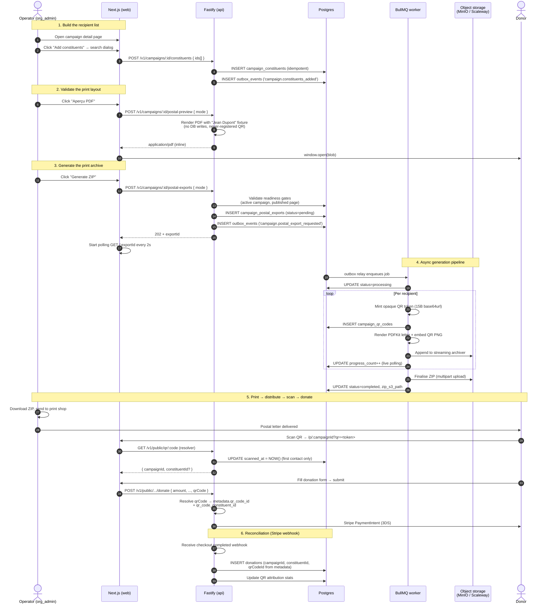
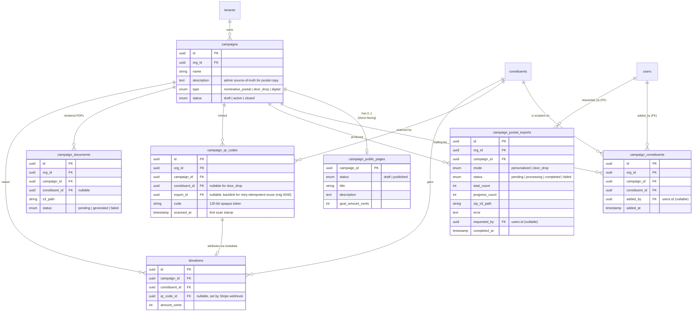
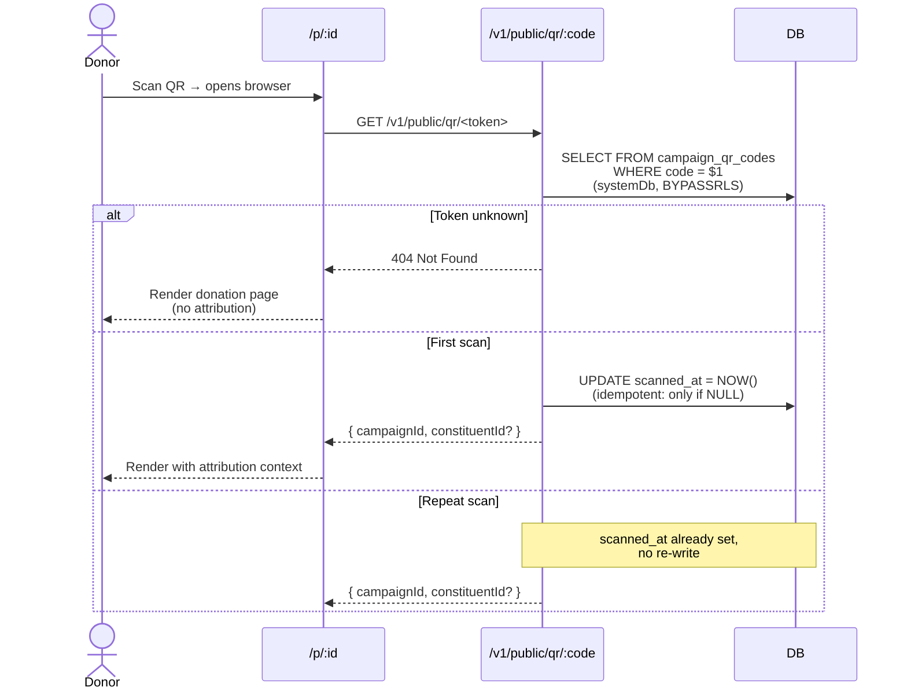

# 23 — Postal Campaigns & QR Reconciliation

> **Status**: Implemented — Epic #274
> **Owner**: Mailing Engineer
> **Related**: `02-reference-architecture.md`, `03-data-model.md`, `04-business-capabilities.md`, `06-security-compliance.md`, `15-infra-adr.md`, `17-log-management.md`
> **Closes**: #274

## 0. Why this exists — at a glance

European NPOs raise a sizeable share of their revenue through **printed direct-mail campaigns** ("appel postal", "publipostage"). The donor receives a personalised letter, scans the printed QR code on their smartphone, and is taken to a donation page where the gift is **automatically attributed back to the campaign + the recipient**.

Givernance ships this whole pipeline as a first-class feature so an operator can:

1. **Curate a recipient list** for a campaign (independent of donations — no more "donations à 0 €" workaround).
2. **Generate a printable archive** (`zip` of A4 PDFs, one per recipient) ready to hand to the print shop.
3. **Reconcile** donations made by QR-scan back to the campaign and the original recipient — every euro raised becomes a measurable scan-to-donate funnel.

The MVP supports two **mailing modes**:

| Mode | Distribution | Letter content | QR points to |
|---|---|---|---|
| **Personnalisé** (`personalized`) | One letter per recipient | "Cher·e {firstName} {lastName}" salutation | `/p/:campaignId?qr=<token>` — token bound to (campaign, constituent) |
| **Door-drop** (`door_drop`) | Mass-printed, hand-delivered by neighborhood | Generic body, no salutation | `/p/:campaignId?qr=<token>` — token bound to campaign only (no constituent) |

Both modes use the **same opaque-token mechanism** (~120 bits of entropy per token, server-resolved). The difference is whether the resolution carries a `constituentId` or only a `campaignId`.

## 1. End-to-end user flow



## 1.ter Window-envelope ready (postal address)

Personalised postal letters are designed to be folded once (Z-fold) and
slipped straight into a **standard French DL window envelope** (110×220mm,
norme NF Z-10-011) without any further hand-printing of the address on
the envelope. The renderer positions the recipient block at the
canonical 20×50mm offset, sized 90×35mm, so it lands cleanly inside the
envelope's transparent window after folding.

| Constituent field | DB column | Required for window block | Where it prints |
|---|---|---|---|
| First + last name | `first_name` + `last_name` | Yes (always present) | Line 1 of the address block |
| Street address | `address_line1` | **Yes** | Line 2 |
| Address complement | `address_line2` | No | Line 3 (skipped when null) |
| Postal code + city | `postal_code` + `city` | **Yes** (both) | Line 4 (`{postal_code} {city}`) |
| Country code | `country_code` | No (defaults to `FR`) | Line 5, only printed when ≠ `FR` |

If any of the three required fields (`address_line1`, `postal_code`,
`city`) is NULL, the renderer **skips the block entirely** and the
letterhead claims the top of the page as before. This keeps the
postal-export pipeline forward-compatible with existing constituents who
have no address yet — the operator gets a usable letter, just not one
ready for a window envelope.

For door-drop campaigns there's no recipient at all (the letter is
geographically distributed by hand), so the address block is never
rendered regardless of campaign-level state.

The seed (`scripts/seed.ts`) ships ~80% of the demo NPO's constituents
with a full French postal address (a curated pool of Paris/Lyon/
Marseille/etc. street + postcode/city pairs). The remaining 20%
intentionally land without an address so the operator can demo both
branches of the renderer in the same export run.

## 1.bis Letter content sources (org mission + campaign description)

Two free-form fields drive the actual prose printed on the letter, so the
operator's voice — not Givernance boilerplate — owns every word the donor
reads:

| Field | DB column | UI surface | Used in the letter as |
|---|---|---|---|
| **Organisation mission** | `tenants.mission` (TEXT, nullable, soft-cap 2000 chars) | `Settings → Organisation` (org_admin only) | Italic subtitle directly under the letterhead — answers "what does this org do" |
| **Campaign description** | `campaigns.description` (TEXT, nullable, soft-cap 2000 chars) | Campaign create/edit form | Justified paragraph between the salutation and the donate-call — answers "what is this specific campaign about" |

Both are NULL until the operator fills them. The renderer degrades
gracefully: an empty mission collapses the italic subtitle, and a missing
campaign description falls back to a generic "Your support could make a
real difference" line. The organisation **name** (`tenants.name`,
required) is the letterhead — Givernance never appears on the page.

The same fields are deliberately reusable: they're the canonical place to
enrich AI-assisted copy generation (planned), the donor-facing public
page footer, and any future channels (email signature, receipts).

## 2. Domain model



### Why a separate `campaign_constituents` table?

Before this change, the **only** way to associate a constituent with a campaign was to record a donation. NPO admins worked around this by creating placeholder "donations à 0 €" — polluting the donation table, the receipts pipeline, and every fundraising KPI.

The new table:

- **Lives independently** of the donation history (a recipient can be on the mailing list without ever giving)
- **Idempotent** via the unique `(org_id, campaign_id, constituent_id)` constraint + `ON CONFLICT DO NOTHING`
- **Carries the audit trail** (`added_by`, `added_at`) so the GDPR Art. 5(2) accountability principle holds: who put this person on which mailing
- **Refused on `door_drop` campaigns** by design — door-drop targets a geographic area, not a recipient list

## 3. Architecture (request → worker → archive)

```mermaid
flowchart LR
    subgraph Browser["Operator browser"]
        UI[CampaignMembersCard<br/>+ PostalExportPanel]
    end

    subgraph Web["Next.js (BFF / proxy)"]
        Page[/p/:id route]
    end

    subgraph API["Fastify API"]
        PR[postal-routes.ts]
        PES[postal-export-service.ts]
        QRS[qr-stats-service.ts]
        PUB[public/service.ts]
    end

    subgraph Outbox["Transactional outbox"]
        OBE[(outbox_events)]
        Relay[outbox-relay]
    end

    subgraph BullMQ["BullMQ queues"]
        CQ[campaigns queue]
    end

    subgraph Worker["Worker"]
        WP[postal-export.ts processor]
        PDF[postal-pdf.ts<br/>PDFKit + qrcode]
        ZIP[archiver]
    end

    subgraph Storage["Object storage<br/>(MinIO / Scaleway)"]
        S3[(campaigns bucket)]
    end

    subgraph DB["Postgres"]
        T[(tenants tables<br/>RLS by app_current_organization_id)]
    end

    UI -->|POST /postal-exports| PR
    PR --> PES
    PES -->|INSERT pending| T
    PES -->|INSERT outbox| OBE
    Relay -->|enqueue| CQ
    CQ -->|consume| WP
    WP --> PDF
    WP --> ZIP
    PDF -->|PDF stream| ZIP
    ZIP -->|multipart upload| S3
    WP -->|progress++ live| T

    UI -.poll 2s.-> PR
    PR -->|GET /postal-exports/:id| PES
    PES -.read state.-> T

    Donor -->|scan QR| Page
    Page -->|GET /public/qr/:code| PUB
    PUB -->|stamp scanned_at<br/>via systemDb BYPASSRLS| T
```

### Key design decisions

| # | Decision | Why |
|---|----------|-----|
| 1 | **Outbox pattern** for kicking off the worker | Same Postgres transaction guarantees the export row + the work order land atomically; the relay separates the in-process commit from the queue dispatch |
| 2 | **Streaming ZIP** through `archiver` → `PassThrough` → S3 multipart | A 10k-recipient campaign never materialises in memory or on disk — RAM stays bounded regardless of fan-out |
| 3 | **Live `progress_count` writes** per PDF | The 2-second polling on the frontend gives the operator a real progress bar instead of a "~5 minutes" estimate |
| 4 | **Sequential PDF generation** (vs. fan-out) | Simpler transaction boundary; suffices for MVP volumes (<1000 recipients). The legacy `campaign-documents` processor's semaphore pattern is the upgrade path if needed |
| 5 | **`systemDb` (BYPASSRLS) on `/v1/public/qr/:code`** | The endpoint is unauthenticated — no `app.current_organization_id` to set for RLS. The 120-bit opaque token IS the security boundary; rate-limiting (60/min) bounds brute force |
| 6 | **`/p/:id` as the canonical donor URL** (not `/c/:id`) | Matches the existing public donation page route. A permanent 308 redirect at `/c/[id]` keeps already-printed legacy letters working |
| 7 | **`PostalCampaignSection` wrapper** | Two sibling client components (`CampaignMembersCard`, `PostalExportPanel`) share live state (`memberCount`) without lifting it to the server-rendered parent |
| 8 | **Worker is idempotent under retry** (mig 0040) | A Kamal pod crash mid-export used to leave stranded QR rows + a bricked ZIP. We now backlink each minted code to its `export_id` and SELECT existing rows on retry — the same tokens that were printed end up in the ZIP regardless of how many BullMQ attempts the job took |
| 9 | **QR-attributed donations emit an asymmetric audit log** | Mirrors the `WEBHOOK:charge.refunded` pattern: when the Stripe webhook reconciles a postal-scanned gift, we write `audit_logs` with `user_id`/`actor_id = NULL` and the `qr_code_id` in `new_values` so a forensic reader can join print → scan → donate without trusting Stripe metadata in isolation |

## 4. Readiness gates (don't print useless letters)

A printed letter is irreversible — a typo can't be edited once it's in the post box. The export pipeline therefore enforces **two pre-conditions** before queueing any work, in **two layers** for defense-in-depth.

### API layer (`startPostalExport`)

The route returns a structured 400 with the **error code as `title`** so the client can branch on it:

| Code | Cause | Operator fix |
|---|---|---|
| `campaign_not_active` | `campaigns.status` is `draft` or `closed` | Open the status panel and switch to **Active** |
| `public_page_missing` | No `campaign_public_pages` row exists | Configure the page at `/campaigns/:id/public-page` |
| `public_page_draft` | Public page exists but is in `draft` state | Switch the page status to **Published** |
| `personalized_on_door_drop` | `mode=personalized` requested on a `door_drop` campaign | Use `mode=door_drop` or switch the campaign type |
| `no_recipients` | `mode=personalized` with zero linked constituents | Attach recipients first |

### UI layer (`PostalExportPanel`)

When either readiness gate fails, the panel renders a `<ReadinessBanners />` card with the matching copy and a CTA link straight to the missing config. The **Generate ZIP** button is disabled with a `title=` tooltip explaining the blocker.

The **Preview** button stays **enabled** even when readiness fails — it produces a fake-data sample with a never-registered QR token. This is the chicken-and-egg fix: the operator needs to validate the print layout before publishing the donor-facing page.


### 3.bis Worker idempotency contract (audit follow-up)

A postal export ZIP is not a green-field generation: a printed letter that hits the post box can't be unprinted, and a worker crash mid-export must not poison the next attempt with mismatched QR tokens. Concretely:

- **`campaign_qr_codes.export_id`** (migration 0040) backlinks every minted code to the `campaign_postal_exports` row that produced it. On retry the worker `SELECT`s these rows for `(org_id, export_id)` and reuses their tokens instead of generating new ones.
- **Partial unique index** `campaign_qr_codes_export_recipient_uniq` on `(export_id, COALESCE(constituent_id, sentinel))` makes the DB the safety net behind the application-level dedup: even a concurrent retry cannot insert a duplicate QR row for the same (export, recipient) pair.
- **Deterministic S3 key** (`{org}/campaigns/{cid}/exports/{eid}.zip`) lets a retry overwrite the previous (incomplete) upload — multipart uploads are idempotent on completion.
- **Short-circuit on `status='completed'`** at the top of the processor: if BullMQ re-queues an already-finished job (rare — Redis crash between worker commit and queue ack), we early-exit without re-uploading the ZIP or emitting a redundant log line.
- **`completed_at` is preserved** by gating the terminal flip on `status <> 'completed'`, so the audit trail records the *first* successful run, not the most-recent retry.

The contract is exercised by `packages/worker/src/tests/integration/postal-export.test.ts` — see the `idempotency under retry` describe block.

## 5. QR reconciliation flow

Every printed letter carries a unique opaque token (`base64url(15 random bytes)` = 20 characters, ~120 bits of entropy). The token reveals nothing about the recipient or the tenant — it's a server-side lookup key only.

### Token resolution



`scanned_at` is the **first-contact** timestamp — it's never overwritten by repeat scans, so the operator's KPI ("how many distinct codes were scanned") stays accurate.

### Donation attribution

When the donor submits the form, the public page forwards `qrCode` to the donate-intent endpoint, which:

1. Validates the token format (10–32 chars, base64url alphabet)
2. Resolves it server-side against `campaign_qr_codes`
3. Stamps `qr_code_id` and `qr_code_constituent_id` into the **Stripe PaymentIntent metadata**
4. Returns the client secret for Stripe.js to confirm the payment

The Stripe webhook (`processStripeWebhook`) reads the metadata when the payment lands and:

- Inserts the `donations` row with `campaign_id` AND `qr_code_id` populated
- If `qr_code_constituent_id` is present, links the donation to the original mail recipient (even if the donor entered a different email — the QR token is the trustworthy attribution)
- Writes a system-initiated `audit_logs` row with `action='WEBHOOK:donation.qr_attributed'`, `user_id=NULL`, `actor_id=NULL` and the resolved `qr_code_id` in `new_values`. Mirrors the `WEBHOOK:charge.refunded` pattern: when no operator clicked anything, the audit trail records *system → DB* with enough context (QR id, campaign id, payment intent id) for a forensic reader to reconstruct the print → scan → donate chain without trusting raw Stripe metadata

The QR-tracking widget on the campaign admin page (`qr-stats-service.ts`) aggregates:

| Metric | Definition |
|---|---|
| `totalCodes` | Count of `campaign_qr_codes` rows for the campaign |
| `scannedCodes` | Count where `scanned_at IS NOT NULL` |
| `qrAttributedDonations` | Count of `donations` where `qr_code_id` is set |
| `qrAttributedAmountCents` | Sum of cleared/refunded amounts via QR scan |

This gives the operator a real **scan-to-donate funnel**: codes printed → codes scanned → donations completed → revenue attributed.

## 6. Bulk email follow-up

Postal campaigns are paired with a **digital follow-up** mechanism so the operator can re-engage the same recipients via email after the printed mailing.

| Surface | Behaviour |
|---|---|
| Constituents list filter bar | New filters: `lastDonationFrom/To`, `totalAmountMinCents/Max`, `campaignId` (matches both `campaign_constituents` linkage AND donation history — union semantics) |
| Multi-select toolbar | Bulk-email dialog accepts a free-form subject + body, hits `POST /v1/constituents/bulk-email` |
| Worker job | Sequential send via `defaultEmailSender` (Mailpit local / Resend prod), per-recipient errors logged but never abort the batch |
| Reachability counter | `requested` (total ids) vs. `reachable` (constituents with a non-empty email) — surfaces the "selected 12, only 9 will get the email" warning before sending |

Distinct from the legacy segment-based `SendBulkEmailJob` (which targets a saved filter), this job carries the **literal id list** captured at request time so the audit trail stays unambiguous.

## 7. Permissions matrix

| Endpoint | Guard | Notes |
|---|---|---|
| `GET /v1/campaigns/:id/constituents` | `requireOrgAdmin` | Same gate as the rest of the postal feature |
| `POST /v1/campaigns/:id/constituents` | `requireOrgAdmin` | |
| `DELETE /v1/campaigns/:id/constituents/:cId` | `requireOrgAdmin` | |
| `POST /v1/campaigns/:id/postal-exports` | `requireOrgAdmin` | High-cost (worker time + S3 storage), audit-worthy |
| `GET /v1/campaigns/:id/postal-exports[/:id]` | `requireOrgAdmin` | |
| `GET /v1/campaigns/:id/postal-exports/:id/download` | `requireOrgAdmin` | ZIP streamed through API (no presigned URL) |
| `POST /v1/campaigns/:id/postal-preview` | `requireOrgAdmin` | Rate-limited 20/min (synchronous PDFKit render) |
| `GET /v1/campaigns/:id/qr-stats` | `requireAuth` | Read-only, available to all tenant members |
| `GET /v1/public/qr/:code` | **Unauthenticated** | Rate-limited 60/min. The opaque token is the security boundary |
| `POST /v1/public/campaigns/:id/donate` | **Unauthenticated** | Token in body forwarded to Stripe metadata |
| `POST /v1/constituents/bulk-email` | `requireWrite` | Write-tier — blocked for `viewer` |

## 8. Privacy & GDPR

- **Opaque tokens** — printed QR codes carry no PII. A scrap of paper found in the wild reveals nothing about the recipient or the tenant
- **`added_by` / `requested_by` audit trail** — every link and every export is traceable to the operator who initiated it (Art. 5(2) accountability)
- **Soft-delete propagation** — when a constituent is soft-deleted (`constituents.deleted_at IS NOT NULL`), they are filtered out of all postal-export listing endpoints. Their existing `campaign_constituents` rows are kept (audit), but they receive no further mailing
- **Ressource leak proofing** — the `/public/qr/:code` route returns the same 404 for unknown tokens AND for tokens belonging to soft-deleted constituents, so a scraper can't distinguish the two
- **Right to erasure (Art. 17)** — the GDPR-erasure worker (`processGdprErasure`) cascades to `campaign_qr_codes.constituent_id` (set to NULL via FK) and `campaign_constituents` (delete), preserving the campaign-level rollup metrics while removing the personal binding

## 9. Future work (not in MVP)

These were considered and **deliberately deferred** — they would have either tripled the implementation surface or required regional regulatory review:

- **QR-Facture Suisse** — Switzerland's native bank-encoding QR standard. Different layout, mandatory IBAN encoding, separate validation rules (issue #274 explicitly out of scope).
- **Image upload per campaign** — letterhead branding, embedded photos. The MVP letter is text + QR only; the print shop adds the org's letterhead during printing.
- **Country-of-impact tagging** — a per-campaign attribute deferred to a later epic.
- **Multi-language letter templates** — current letters are English-only; FR/DE will need a translation pipeline that respects the same QR-attribution flow.
- **Per-recipient editorial overrides** — every nominative letter today shares the same body ("Dear supporter…"). A future epic could let the operator override the body per segment (donor tier, last gift date, etc.).
- **Direct print-shop integration** — current MVP hands the operator a ZIP to upload manually to their printer's portal. A managed print partnership (with API hand-off) is on the long-term roadmap.

## 10. References

- ADR-017 (`docs/15-infra-adr.md`) — One logical DB per tool; informs the `systemDb` vs. `db` split used by the QR resolver
- ADR-022 — Platform admins disjoint from tenant users; postal exports are tenant-scoped only
- `docs/03-data-model.md` — Core ERD (campaigns, constituents, donations) the postal tables extend
- `docs/06-security-compliance.md` — RLS posture, audit columns convention
- `docs/12-user-journeys.md` — Personas behind the operator-facing screens (esp. "Stéphane — fundraising lead")
- Migration `0037_postal_campaigns_mvp.sql` — Schema delta for this epic
- Migration `0038_org_mission_campaign_description.sql` — Mission + campaign description columns
- Migration `0039_constituent_postal_address.sql` — Window-envelope address fields
- Migration `0040_postal_export_idempotency.sql` — Retry-idempotent QR codes (`export_id` backlink + partial unique index) and `tenants.mission` 1000-char DB cap
- Mockups: `docs/design/index.html` → "Postal mailing" section
