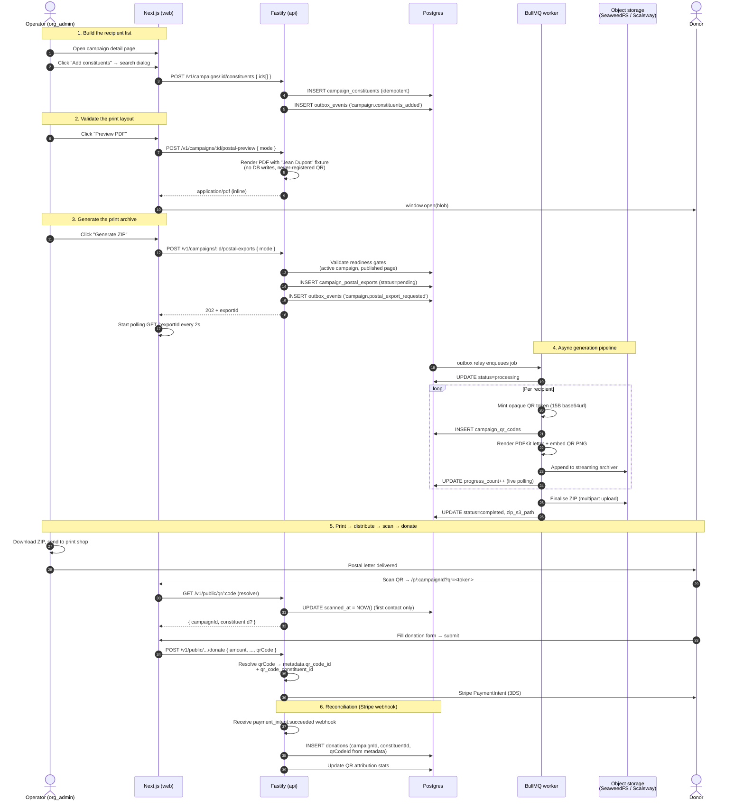
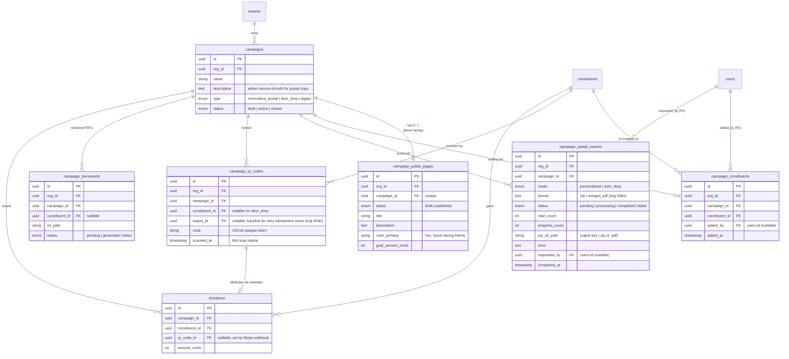
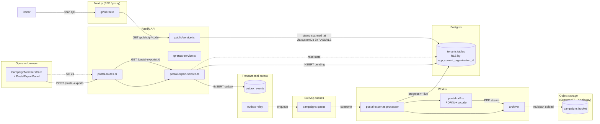
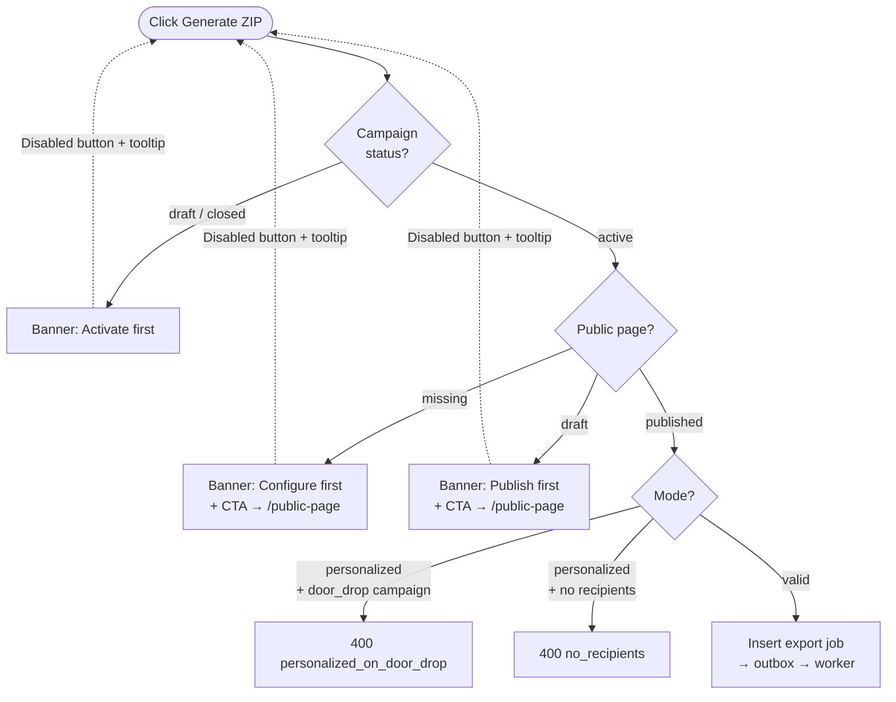
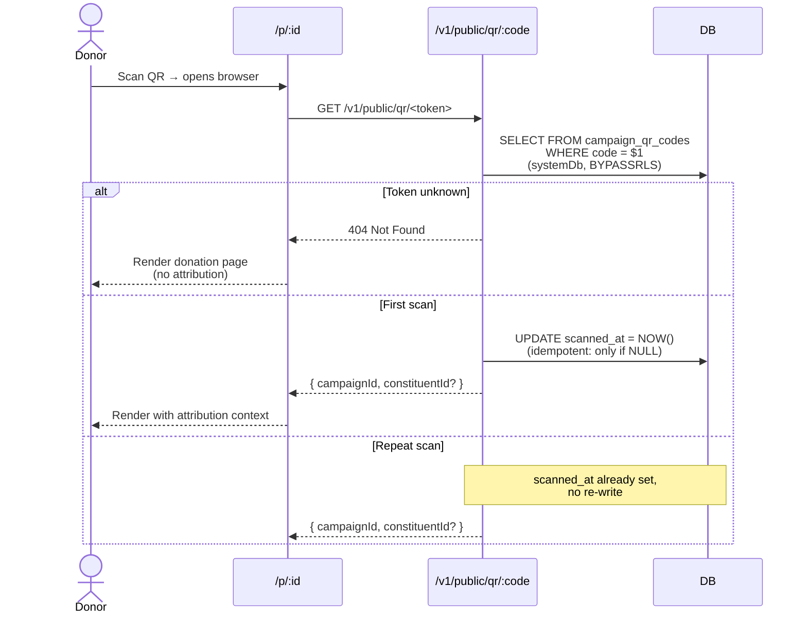
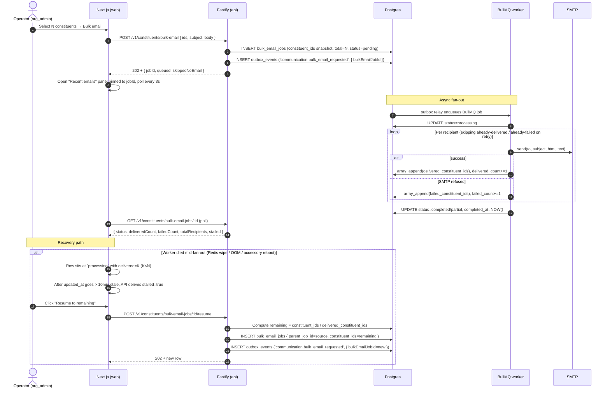

# 23 — Postal Campaigns & QR Reconciliation

> **Status**: Implemented — Epic #274
> **Owner**: Mailing Engineer
> **Related**: `02-reference-architecture.md`, `03-data-model.md`, `04-business-capabilities.md`, `06-security-compliance.md`, `15-infra-adr.md`, `17-log-management.md`
> **Companion diagram**: [`diagrams/postal-campaign-flow.mmd`](../diagrams/postal-campaign-flow.mmd) — full operator → donor → webhook sequence
> **Closes**: #274

## 0. Why this exists — at a glance

European NPOs raise a sizeable share of their revenue through **printed direct-mail campaigns** ("appel postal", "publipostage"). The donor receives a personalised letter, scans the printed QR code on their smartphone, and is taken to a donation page where the gift is **automatically attributed back to the campaign + the recipient**.

Givernance ships this whole pipeline as a first-class feature so an operator can:

1. **Curate a recipient list** for a campaign (independent of donations — no more "donations à 0 €" workaround).
2. **Generate a printable artefact** — either a `zip` of A4 PDFs (one per recipient, the default) or a **single merged multi-page PDF** (one page per constituent), ready to hand to the print shop. See § 3.ter for the format choice.
3. **Reconcile** donations made by QR-scan back to the campaign and the original recipient — every euro raised becomes a measurable scan-to-donate funnel.

The MVP supports two **mailing modes**:

| Mode | Distribution | Letter content | QR points to |
|---|---|---|---|
| **Personnalisé** (`personalized`) | One letter per recipient | "Cher·e {firstName} {lastName}" salutation | `/p/:campaignId?qr=<token>` — token bound to (campaign, constituent) |
| **Door-drop** (`door_drop`) | Mass-printed, hand-delivered by neighborhood | Generic body, no salutation | `/p/:campaignId?qr=<token>` — token bound to campaign only (no constituent) |

Both modes use the **same opaque-token mechanism** (~120 bits of entropy per token, server-resolved). The difference is whether the resolution carries a `constituentId` or only a `campaignId`.

## 1. End-to-end user flow



## 1.bis Page format and window envelope (A4 → C5)

Postal letters are printed on a **single A4 sheet (210×297mm), folded once
horizontally at the midline** (y=148.5mm), then slipped into a **standard
French C5 window envelope (162×229mm)** with no further hand-printing of
the address on the envelope itself. The folded letter (A5-landscape,
210×148.5mm) fits cleanly along the long axis of the C5.

The page layout is split into two zones along the fold:

```
┌───────────── A4 portrait (210×297mm) ─────────────┐
│             [ ORGANISATION NAME — bold ]          │  y=25mm
│             [ Mission summary — italic ]          │
│                                                   │
│                          ┌─────────────────────┐  │  y=60mm
│                          │ Recipient name      │  │  ← C5 window
│                          │ Street              │  │     zone
│                          │ Postal code · City  │  │
│                          └─────────────────────┘  │
│                                                   │
│ Campaign title                                    │  y=100mm
│ Campaign description (operator's words)           │
│                                                   │
│ - - - - - - - - - - fold line (148.5mm) - - - - - │
│                                                   │
│ Bonjour Jean Dupont,                              │
│ [thanks transition]                               │
│ [call to scan]                                    │
│                                                   │
│           ┌─────────────────────┐                 │
│           │     [ QR code ]     │                 │
│           └─────────────────────┘                 │
│           https://app/p/<id>?qr=<token>           │
│           Référence · ABC123…                     │
│                                                   │
└───────────────────────────────────────────────────┘
```

The fold is the physical crease that aligns the address with the C5 window envelope; the body **crosses the fold continuously** so when the donor unfolds the letter it reads as one A4 page from top to bottom. Forcing all appeal content below the fold (the original layout) left ~50mm of dead-zone whitespace between the address and the campaign title — the current layout starts the title at y=100mm, just below the address block.

**Cover side (visible through C5 window before unfolding):**

| Element | Position | Notes |
|---|---|---|
| Org name | Centered, y=25mm | Bold 22pt — primary visual identity |
| Mission | Centered, italic, under name | 10pt grey — collapses when `tenants.mission` is empty |
| Recipient address block | x=110mm, y=60mm, 80×35mm | Right-of-center — aligns with the C5 window cut |
| **Preview watermark** (operator preview only) | Top of page, y=10mm, fixed-position | Italic 8pt — drawn before flow content so a long body never pushes it onto a 2nd page |

**Body (flows top-down from y=100mm, crosses the fold):**

Campaign title → campaign description → salutation → thanks transition → call to scan → QR panel. The full appeal fits on a single A4 page for typical descriptions (up to ~50mm of body text); PDFKit auto-paginates only on extreme outliers, in which case the operator should shorten the campaign description.

### Recipient address block fields

| Constituent field | DB column | Required for window block | Where it prints |
|---|---|---|---|
| First + last name | `first_name` + `last_name` | Yes (always present) | Line 1 of the address block |
| Street address | `address_line1` | **Yes** | Line 2 |
| Address complement | `address_line2` | No | Line 3 (skipped when null) |
| Postal code + city | `postal_code` + `city` | **Yes** (both) | Line 4 (`{postal_code} {city}`) |
| Country code | `country_code` | No (defaults to `FR`) | Line 5, only printed when ≠ `FR` |

If any of the three required fields (`address_line1`, `postal_code`,
`city`) is NULL, the renderer **skips the block entirely** — the cover
panel still carries the org letterhead, but the operator must hand-write
the address on the envelope. This keeps the postal-export pipeline
forward-compatible with existing constituents who have no address yet.

For door-drop campaigns there's no recipient at all (the letter is
geographically distributed by hand), so the address block is never
rendered regardless of campaign-level state.

The seed (`scripts/seed.ts`) ships ~80% of the demo NPO's constituents
with a full French postal address (a curated pool of Paris/Lyon/
Marseille/etc. street + postcode/city pairs). The remaining 20%
intentionally land without an address so the operator can demo both
branches of the renderer in the same export run.

## 1.ter Letter content sources (org mission + campaign description)

Two free-form fields drive the actual prose printed on the letter, so the
operator's voice — not Givernance boilerplate — owns every word the donor
reads:

| Field | DB column | UI surface | Used in the letter as |
|---|---|---|---|
| **Organisation mission** | `tenants.mission` (TEXT, nullable, **DB cap 1000 chars** via `tenants_mission_length_chk`, mig 0040) | `Settings → Organisation` (org_admin only) | Italic subtitle directly under the letterhead, on the cover (top half) — answers "what does this org do" |
| **Campaign description** | `campaigns.description` (TEXT, nullable, **DB cap 2000 chars** via `campaigns_description_length_chk`, mig 0041) | Campaign create/edit form | Justified paragraph **directly under the campaign title** (bottom half) — operator's own words about this specific campaign, the prose load of the appeal |

Both are NULL until the operator fills them. The renderer degrades
gracefully: an empty mission collapses the italic subtitle, and a missing
campaign description falls back to a generic "Your support could make a
real difference" line. The organisation **name** (`tenants.name`,
required) is the letterhead — Givernance never appears on the page.

The same fields are deliberately reusable: they're the canonical place to
enrich AI-assisted copy generation (planned), the **donor-facing public
page hero** (org name as UPPERCASE eyebrow above the campaign title, with
the mission as an italic subline under the description — turns the page
from "generic donation form" into "I am giving to ${org}"), and any
future channels (email signature, receipts).

### Locale-driven static copy (`tenants.default_locale`)

Every word in the letter that **isn't** operator-authored — greeting
(`Bonjour Jean Dupont,` for personalised mail, `Bonjour,` for door-drop), thanks variants, "scan the QR code below",
reference label, preview watermark — is sourced from a per-locale lookup
table keyed by the tenant's `default_locale` (`fr` / `en`). FR is the
fallback when the column is NULL or carries an unsupported locale.

The lookup table lives **twice** by design — once in
`packages/api/src/modules/campaigns/postal-pdf.ts` (preview path) and
once in `packages/worker/src/services/campaign-pdf.ts` (bulk-export
path). Both copies MUST stay byte-equivalent in their rendered output:
the operator validates a campaign by clicking **Aperçu** and trusts that
the print shop will receive the same letter. The duplication is
documented at the top of each file with a "lockstep duplicate" banner.
The boundary policy — keep the duplicate now, extract into a new
`@givernance/pdf` package on the third PDF surface (receipts will be
the second; annual giving statements the third) — is captured in
[ADR-025](./adrs/adr-025-pdf-rendering-code-boundary.md). The
extraction target cannot be `@givernance/shared` because PDFKit is
Node-only and ADR-013 forbids Node-only deps in shared.

Since issue #289 the lockstep invariant is **enforced in CI**: the
golden-fixture parity test
(`packages/api/src/modules/campaigns/postal-pdf.parity.test.ts`)
renders frozen fixtures through both files and fails the build on any
hash difference after masking timestamps — a one-sided layout edit can
no longer merge.

Per-campaign locale override is **out of MVP scope** — see § 9.

## 2. Domain model



### Why a separate `campaign_constituents` table?

Before this change, the **only** way to associate a constituent with a campaign was to record a donation. NPO admins worked around this by creating placeholder "donations à 0 €" — polluting the donation table, the receipts pipeline, and every fundraising KPI.

The new table:

- **Lives independently** of the donation history (a recipient can be on the mailing list without ever giving)
- **Idempotent** via the unique `(org_id, campaign_id, constituent_id)` constraint + `ON CONFLICT DO NOTHING`
- **Carries the audit trail** (`added_by`, `added_at`) so the GDPR Art. 5(2) accountability principle holds: who put this person on which mailing
- **Refused on `door_drop` campaigns** by design — door-drop targets a geographic area, not a recipient list

## 3. Architecture (request → worker → archive)



### Key design decisions

| # | Decision | Why |
|---|----------|-----|
| 1 | **Outbox pattern** for kicking off the worker | Same Postgres transaction guarantees the export row + the work order land atomically; the relay separates the in-process commit from the queue dispatch |
| 2 | **Streaming ZIP** through `archiver` → `PassThrough` → S3 multipart | A 10k-recipient campaign never materialises in memory or on disk — RAM stays bounded regardless of fan-out |
| 3 | **Live `progress_count` writes** per PDF | The 2-second polling on the frontend gives the operator a real progress bar instead of a "~5 minutes" estimate |
| 4 | **Sequential PDF generation** (vs. fan-out) | Simpler transaction boundary; suffices for MVP volumes (<1000 recipients). The legacy `campaign-documents` processor's semaphore pattern is the upgrade path if needed |
| 5 | **`systemDb` (BYPASSRLS) on `/v1/public/qr/:code`** | The endpoint is unauthenticated — no `app.current_organization_id` to set for RLS. The 120-bit opaque token IS the security boundary; rate-limiting (60/min) bounds brute force |
| 6 | **`/p/:id` as the canonical donor URL** (not `/c/:id`) | Matches the existing public donation page route. A permanent 308 redirect at `/c/[id]` keeps already-printed legacy letters working |
| 7 | **`PostalCampaignSection` wrapper** | Two sibling client components (`CampaignMembersCard`, `PostalExportPanel`) share live state (`memberCount`) without lifting it to the server-rendered parent |
| 8 | **Worker is idempotent under retry** (mig 0040) | A Kamal pod crash mid-export used to leave stranded QR rows + a bricked ZIP. We now backlink each minted code to its `export_id` and SELECT existing rows on retry — the same tokens that were printed end up in the ZIP regardless of how many BullMQ attempts the job took |
| 9 | **QR-attributed donations emit an asymmetric audit log** | Mirrors the `WEBHOOK:charge.refunded` pattern: when the Stripe webhook reconciles a postal-scanned gift, we write `audit_logs` with `user_id`/`actor_id = NULL` and the `qr_code_id` in `new_values` so a forensic reader can join print → scan → donate without trusting Stripe metadata in isolation |
| 10 | **Bucket lifecycle: `AbortIncompleteMultipartUpload` after 1 day** | The `@aws-sdk/lib-storage` multipart upload may leak orphan parts when the source stream is destroyed mid-upload (worker crash, S3 transient error, BullMQ kill). Without a bucket-level lifecycle rule, those parts persist forever and bill against the tenant's storage. Configured in `docker-compose.yml` (`seaweedfs-init`, see [ADR-034](./adrs/adr-034-seaweedfs-over-minio-for-self-hosted-object-storage.md)) for dev — **MUST be replicated on the prod Scaleway `campaigns` bucket** during infra setup |
| 11 | **`renderPdfBuffer` accumulates each PDF in RAM before archive append** | A single PDF is ~50KB; the worker is sequential (decision #4) so the transient peak is bounded by one letter at a time. Acceptable for MVP volumes (<1000 recipients/campaign). **Refactor target before the first 10k-recipient real campaign** — `archive.append(pdfStream, …)` accepts a Readable directly, removing the intermediate `Buffer.concat`. Tracked as a follow-up |
| 12 | **`ON DELETE CASCADE` on `campaign_constituents.campaign_id`** | Deleting a campaign drops its membership rows. The audit trail is preserved at the API layer — the `DELETE /v1/campaigns/:id` route writes a single `audit_logs` row capturing the campaign deletion event; per-row constituent removal events would explode the audit table without forensic value (the join `audit_logs ⨝ campaign_constituents` is impossible after cascade anyway). The alternative (`ON DELETE RESTRICT` + applicative cleanup) breaks campaign deletion entirely when even one constituent is linked, which is hostile to operators |

## 4. Readiness gates (don't print useless letters)

A printed letter is irreversible — a typo can't be edited once it's in the post box. The export pipeline therefore enforces **two pre-conditions** before queueing any work, in **two layers** for defense-in-depth.

### API layer (`startPostalExport`)

The route returns a structured 400 with the **error code as `title`** so the client can branch on it:

| Code | Cause | Operator fix |
|---|---|---|
| `campaign_not_active` | `campaigns.status` is `draft` or `closed` | Open the status panel and switch to **Active** |
| `public_page_missing` | No `campaign_public_pages` row exists | Configure the page at `/campaigns/:id/public-page` |
| `public_page_draft` | Public page exists but is in `draft` state | Switch the page status to **Published** |
| `personalized_on_door_drop` | `mode=personalized` requested on a `door_drop` campaign | Use `mode=door_drop` or switch the campaign type |
| `no_recipients` | `mode=personalized` with zero linked constituents | Attach recipients first |

### UI layer (`PostalExportPanel`)

When either readiness gate fails, the panel renders a `<ReadinessBanners />` card with the matching copy and a CTA link straight to the missing config. The **Generate ZIP** button is disabled with a `title=` tooltip explaining the blocker.

The **Preview** button stays **enabled** even when readiness fails — it produces a fake-data sample with a never-registered QR token. This is the chicken-and-egg fix: the operator needs to validate the print layout before publishing the donor-facing page.



### 3.bis Worker idempotency contract (audit follow-up)

A postal export ZIP is not a green-field generation: a printed letter that hits the post box can't be unprinted, and a worker crash mid-export must not poison the next attempt with mismatched QR tokens. Concretely:

- **`campaign_qr_codes.export_id`** (migration 0040) backlinks every minted code to the `campaign_postal_exports` row that produced it. On retry the worker `SELECT`s these rows for `(org_id, export_id)` and reuses their tokens instead of generating new ones.
- **Partial unique index** `campaign_qr_codes_export_recipient_uniq` on `(export_id, COALESCE(constituent_id, sentinel))` makes the DB the safety net behind the application-level dedup: even a concurrent retry cannot insert a duplicate QR row for the same (export, recipient) pair.
- **Deterministic S3 key** (`{org}/campaigns/{cid}/exports/{eid}.zip`) lets a retry overwrite the previous (incomplete) upload — multipart uploads are idempotent on completion.
- **Short-circuit on `status='completed'`** at the top of the processor: if BullMQ re-queues an already-finished job (rare — Redis crash between worker commit and queue ack), we early-exit without re-uploading the ZIP or emitting a redundant log line.
- **`completed_at` is preserved** by gating the terminal flip on `status <> 'completed'`, so the audit trail records the *first* successful run, not the most-recent retry.

The contract is exercised by `packages/worker/src/tests/integration/postal-export.test.ts` — see the `idempotency under retry` describe block.

## 3.ter Output format — ZIP vs single merged PDF (project item #194221573)

The export produces one of two artefacts, chosen by the operator at Generate time via a `format` field on the request (default `zip`):

| `format` | Artefact | When to use |
|---|---|---|
| `zip` (default) | A streamed ZIP of one PDF per recipient — the original Epic #274 behaviour. | Very large mailings, or when the print shop wants individual files. |
| `merged_pdf` | A single multi-page PDF concatenating every recipient's PDF(s) — **one page per constituent** in `standard`/`door_drop` mode, two in `qr_bill_only`, three in `hybrid`. | One-click printing of the whole batch. |

**Mode-agnostic by construction.** The worker already renders every recipient artefact to a `Buffer` (`renderPdfBuffer` for the appeal letter, `renderSwissQrBillPdf` for the BVR PDF). The two formats differ only in the *sink*: `zip` streams each buffer into `archiver`; `merged_pdf` accumulates the buffers and concatenates them with **pdf-lib** (`mergePdfBuffers` in [`packages/worker/src/services/pdf-merge.ts`](../packages/worker/src/services/pdf-merge.ts)). The per-recipient loop (QR mint → render → progress tick) — the load-bearing idempotency path — stays single-sourced in `renderAllWorkItems`; `produceZipArtefact` and `produceMergedPdfArtefact` are the only branch points. So merged PDF works across **all four run modes** (`standard`, `door_drop`, `qr_bill_only`, `hybrid`) with no per-mode special-casing.

**Memory tradeoff + recipient cap.** The streamed ZIP (§3 decision #2) keeps RAM bounded for a 10k-recipient campaign because `archiver` + the `PassThrough` never hold more than one entry at a time. A merged PDF *cannot* be streamed page-by-page — pdf-lib builds the whole document in memory before `save()`. So `merged_pdf` is bounded by `MERGED_PDF_MAX_RECIPIENTS` (2000, in [`postal-export-service.ts`](../packages/api/src/modules/campaigns/postal-export-service.ts)): the API rejects a larger merged request with `merged_pdf_too_many_recipients` and points the operator back at the ZIP, which scales to any size.

**Storage + download.** Both artefacts land in the `campaigns` bucket under the same deterministic, retry-overwriting key prefix — `…/exports/{exportId}.zip` or `…/exports/{exportId}.pdf`. The `campaign_postal_exports.zip_s3_path` column holds whichever key was produced (kept un-renamed for applied-migration immutability); the download route branches on `format` for the `application/pdf` vs `application/zip` content-type + filename extension.

**Feature flag.** The whole option ships behind `campaign.postal_merged_pdf` (default-off, seeded by migration 0081). Because the postal-export route pre-dates the flag system, the gate lives *inside* the existing route rather than as a `requireFlag` 404 preHandler: with the flag off the `format=merged_pdf` request body is rejected (`merged_pdf_disabled`) and the web panel hides the format selector entirely — every export is a ZIP, exactly as before. The worker re-checks the flag (tenant-aware, mirroring the API evaluator) at pickup as defence-in-depth, failing a merged job whose flag was flipped off between enqueue and pickup. See [`docs/18-feature-flags.md`](18-feature-flags.md).

## 5. QR reconciliation flow

Every printed letter carries a unique opaque token (`base64url(15 random bytes)` = 20 characters, ~120 bits of entropy). The token reveals nothing about the recipient or the tenant — it's a server-side lookup key only.

### Token resolution



`scanned_at` is the **first-contact** timestamp — it's never overwritten by repeat scans, so the operator's KPI ("how many distinct codes were scanned") stays accurate.

### Donation attribution

When the donor submits the form, the public page forwards `qrCode` to the donate-intent endpoint, which:

1. Validates the token format (10–32 chars, base64url alphabet)
2. Resolves it server-side against `campaign_qr_codes`
3. Stamps `qr_code_id` and `qr_code_constituent_id` into the **Stripe PaymentIntent metadata**
4. Returns the client secret for Stripe.js to confirm the payment

The Stripe webhook (`processStripeWebhook`) reads the metadata when the payment lands and:

- Inserts the `donations` row with `campaign_id` AND `qr_code_id` populated
- If `qr_code_constituent_id` is present, links the donation to the original mail recipient (even if the donor entered a different email — the QR token is the trustworthy attribution)
- Writes a system-initiated `audit_logs` row with `action='WEBHOOK:donation.qr_attributed'`, `user_id=NULL`, `actor_id=NULL` and the resolved `qr_code_id` in `new_values`. Mirrors the `WEBHOOK:charge.refunded` pattern: when no operator clicked anything, the audit trail records *system → DB* with enough context (QR id, campaign id, payment intent id) for a forensic reader to reconstruct the print → scan → donate chain without trusting raw Stripe metadata

The QR-tracking widget on the campaign admin page (`qr-stats-service.ts`) aggregates:

| Metric | Definition |
|---|---|
| `totalCodes` | Count of `campaign_qr_codes` rows for the campaign |
| `scannedCodes` | Count where `scanned_at IS NOT NULL` |
| `qrAttributedDonations` | Count of `donations` where `qr_code_id` is set |
| `qrAttributedAmountCents` | Sum of cleared/refunded amounts via QR scan |

This gives the operator a real **scan-to-donate funnel**: codes printed → codes scanned → donations completed → revenue attributed.

## 6. Bulk email follow-up

Postal campaigns are paired with a **digital follow-up** mechanism so the operator can re-engage the same recipients via email after the printed mailing.

| Surface | Behaviour |
|---|---|
| Constituents list filter bar | New filters: `lastDonationFrom/To`, `totalAmountMinCents/Max`, `campaignId` (matches both `campaign_constituents` linkage AND donation history — union semantics) |
| Multi-select toolbar | Bulk-email dialog accepts a free-form subject + body, hits `POST /v1/constituents/bulk-email` |
| Worker job | Sequential send via `defaultEmailSender` (Mailpit local / Resend prod), per-recipient errors logged into `bulk_email_jobs.failed_constituent_ids` but never abort the batch |
| Reachability counter | `requested` (total ids) vs. `reachable` (constituents with a non-empty email) — surfaces the "selected 12, only 9 will get the email" warning before sending |
| "Recent emails" panel | Lists the 20 most-recent `bulk_email_jobs` rows newest first, polls every 3s while any job is non-terminal, shows live `delivered / total` ratio + per-job Resume button |

Distinct from the legacy segment-based `SendBulkEmailJob` (which targets a saved filter), this job carries the **literal id list** captured at request time so the audit trail stays unambiguous.

### 6.bis Partial-send indicator + resume (issue #326)

The original "fan-out happens in the worker, trust the outbox" design had a transparency gap: when the BullMQ job vanished mid-fan-out (Redis wipe, OOM kill, accessory reboot — see [ADR-026 §Redis 8 cutover](15-infra-adr.md#adr-026-postgres-17-cutover--scaleway-anchored-versioning)), the relay had already marked the outbox row `completed`, the bulk-email dispatch toast said "queued", and the operator had **no surface** showing that zero recipients were actually reached. Two problems:

1. **GDPR transparency** (Art. 5(1)(b)) — the tenant operator has a right to know how many recipients actually received the email, not just how many were requested.
2. **Operational** — there was no re-issuance path. The operator had to manually re-export the selection and re-trigger.

The `bulk_email_jobs` table makes the dispatch a queryable, resumable artefact:



**Counters are denormalised next to the id arrays.** The migration carries a `CHECK` constraint that rejects any drift between `delivered_count` and `array_length(delivered_constituent_ids, 1)` (same for `failed_count` and `total_recipients`), so a buggy worker-side UPDATE that touches only one column fails loudly instead of silently misreporting "8 of 10".

**Resume eligibility.** The API gates the resume action: `partial` and `failed` are always accepted; `processing` is accepted only when stalled (`updated_at` > 10 minutes ago). A still-actively-progressing job returns `400 job_still_running` so the operator can't accidentally race the original worker into double-sending. The new row's `constituent_ids` is computed as `source.constituent_ids \ source.delivered_constituent_ids` — previously SMTP-failed recipients **are** retried (operator intent: "make sure everyone who hasn't received it gets it").

**PII posture.** `bulk_email_jobs` stores constituent IDs only (uuids — tenant-local foreign keys, not directly identifying). PII (email, name) is re-resolved from `constituents` at send time under the worker's RLS context, same Art. 5(1)(e) posture as before. On GDPR erasure of a constituent the worker silently drops them at send time; the stale uuid in the snapshot array is a tenant-scoped reference, not personal data.

**Out of scope for this issue.** Exactly-once delivery (the general outbox → BullMQ contract) and persistent SMTP retry queues stay deferred — see issue #326 "Out of scope". The postal-export side keeps its existing "re-run from scratch" recovery path (the ZIP must be a complete bundle for printing, so a partial resume doesn't apply).

### 6.ter Feature-flag gate (PR #352, after @magino review)

The whole bulk-email surface is gated behind the global feature flag `communication.bulk_email` (registered in `packages/shared/src/constants/feature-flags.ts`, seeded `enabled = false` by migration `0047_feature_flags`). Until the platform's outbound mail domain has DKIM / SPF / DMARC configured, an operator-triggered "donor follow-up" reads to recipient MX servers as phishing — so the feature stays off in every deploy until a super-admin flips it from the Back Office page at `/admin/feature-flags`.

Enforcement is three-deep:

| Layer | Behaviour when flag is off |
|---|---|
| **API** | `requireFlag(...)` runs BEFORE auth/RBAC on every `/v1/constituents/bulk-email*` route → 404 (looks like a typo'd URL, no role-requirement leak) |
| **Worker** | `processSendBulkEmail` calls `isFlagEnabled` at job pickup. A flipped-off flag between API enqueue and worker dispatch drops the job silently — the tracking row stays `pending`, the operator's UI keeps showing the dispatch in the "Recent emails" panel, and re-enabling + Resume picks up where they left off |
| **Web** | The constituents page SSR-fetches `/v1/feature-flags` and hides the "Email selection" + "Recent emails" buttons when the flag is off |

See [`docs/18-feature-flags.md § 0`](18-feature-flags.md) for the registry shape, the typed `FeatureFlagKey` union, and how to add a new flag.

## 7. Permissions matrix

| Endpoint | Guard | Notes |
|---|---|---|
| `GET /v1/campaigns/:id/constituents` | `requireOrgAdmin` | Same gate as the rest of the postal feature |
| `POST /v1/campaigns/:id/constituents` | `requireOrgAdmin` | |
| `DELETE /v1/campaigns/:id/constituents/:cId` | `requireOrgAdmin` | |
| `POST /v1/campaigns/:id/postal-exports` | `requireOrgAdmin` | High-cost (worker time + S3 storage), audit-worthy. `format=merged_pdf` (project item #194221573) is additionally gated in-handler by `campaign.postal_merged_pdf` + the `MERGED_PDF_MAX_RECIPIENTS` cap |
| `GET /v1/campaigns/:id/postal-exports[/:id]` | `requireOrgAdmin` | |
| `GET /v1/campaigns/:id/postal-exports/:id/download` | `requireOrgAdmin` | Artefact streamed through API (no presigned URL); content-type branches on `format` (`application/zip` or `application/pdf`) |
| `POST /v1/campaigns/:id/postal-preview` | `requireOrgAdmin` | Rate-limited 20/min (synchronous PDFKit render) |
| `GET /v1/campaigns/:id/qr-stats` | `requireOrgAdmin` | Aggregate KPIs surfaced on the admin dashboard — kept on the same gate as the rest of the postal feature for a coherent permission model |
| `GET /v1/public/qr/:code` | **Unauthenticated** | Rate-limited 60/min. The opaque token is the security boundary |
| `POST /v1/public/campaigns/:id/donate` | **Unauthenticated** | Token in body forwarded to Stripe metadata |
| `POST /v1/constituents/bulk-email` | `requireOrgAdmin` | Org-admin only — same gate as the rest of the postal feature. Creates a `bulk_email_jobs` tracking row + outbox event |
| `GET /v1/constituents/bulk-email-jobs` | `requireOrgAdmin` | Lists recent 20 jobs (newest first) — drives the "Recent emails" panel |
| `GET /v1/constituents/bulk-email-jobs/:id` | `requireOrgAdmin` | Polling endpoint, rate-limited 60/min |
| `POST /v1/constituents/bulk-email-jobs/:id/resume` | `requireOrgAdmin` | Creates a fresh job targeting recipients the source never reached; gated on source status (`partial` / `failed` / stalled `processing`) |

## 8. Privacy & GDPR

- **Opaque tokens** — printed QR codes carry no PII. A scrap of paper found in the wild reveals nothing about the recipient or the tenant
- **`added_by` / `requested_by` audit trail** — every link and every export is traceable to the operator who initiated it (Art. 5(2) accountability)
- **Soft-delete propagation** — when a constituent is soft-deleted (`constituents.deleted_at IS NOT NULL`), they are filtered out of all postal-export listing endpoints. Their existing `campaign_constituents` rows are kept (audit), but they receive no further mailing
- **Resource leak proofing** — the `/public/qr/:code` route returns the same 404 for unknown tokens AND for tokens belonging to soft-deleted constituents, so a scraper can't distinguish the two
- **Right to erasure (Art. 17)** — the GDPR-erasure worker (`processGdprErasure`) cascades to `campaign_qr_codes.constituent_id` (set to NULL via FK) and `campaign_constituents` (delete), preserving the campaign-level rollup metrics while removing the personal binding

## 9. Future work (not in MVP)

These were considered and **deliberately deferred** — they would have either tripled the implementation surface or required regional regulatory review:

- ~~QR-Facture Suisse~~ — **moved to MVP**, see [`docs/25-swiss-qr-bill.md`](./25-swiss-qr-bill.md) (Epic #318). Re-classified on 2026-05-07: Swiss postal fundraising is impossible without QR-bill since the orange ESR / red ES bulletins were discontinued on 2022-09-30.
- **Image upload per campaign** — letterhead branding, embedded photos. The MVP letter is text + QR only; the print shop adds the org's letterhead during printing.
- **Country-of-impact tagging** — a per-campaign attribute deferred to a later epic.
- **More locales beyond FR/EN** — the renderer is locale-aware (driven by `tenants.default_locale`, see § 1.bis), and FR + EN ship in MVP. DE/IT/ES are deferred until a customer requests them; adding one is a copy-table extension, not a structural change.
- **Per-campaign locale override** — today the letter locale follows the tenant's default; a future epic could let the operator pick a locale per campaign (e.g., a Geneva-based French-speaking org doing one English-language ask for diaspora donors).
- **Per-recipient editorial overrides** — every nominative letter today shares the same body ("Dear supporter…"). A future epic could let the operator override the body per segment (donor tier, last gift date, etc.).
- **Direct print-shop integration** — current MVP hands the operator a ZIP (or a merged PDF) to upload manually to their printer's portal. A managed print partnership (with API hand-off) is on the long-term roadmap.
- **Merged-PDF preview** — the synchronous preview endpoint (`POST /postal-preview`) still renders a single sample letter inline, which *is* effectively the 1-page-per-constituent preview for the merged format. A dedicated multi-recipient merged-PDF preview was deliberately deferred (project item #194221573): the merge only changes how single-recipient pages are bundled, not their content, so the existing per-letter preview already validates what each page will look like.

## 10. References

- ADR-017 (`docs/15-infra-adr.md`) — One logical DB per tool; informs the `systemDb` vs. `db` split used by the QR resolver
- ADR-022 — Platform admins disjoint from tenant users; postal exports are tenant-scoped only
- `docs/03-data-model.md` — Core ERD (campaigns, constituents, donations) the postal tables extend
- `docs/06-security-compliance.md` — RLS posture, audit columns convention
- `docs/12-user-journeys.md` — Personas behind the operator-facing screens (esp. "Stéphane — fundraising lead")
- Migration `0037_postal_campaigns_mvp.sql` — Schema delta for this epic
- Migration `0038_org_mission_campaign_description.sql` — Mission + campaign description columns
- Migration `0039_constituent_postal_address.sql` — Window-envelope address fields
- Migration `0040_postal_export_idempotency.sql` — Retry-idempotent QR codes (`export_id` backlink + partial unique index) and `tenants.mission` 1000-char DB cap
- Migration `0041_campaign_description_length_cap.sql` — `campaigns.description` 2000-char DB cap (defense-in-depth against ETL/raw-SQL bypassing the form-level validator)
- Migration `0045_bulk_email_jobs.sql` — `bulk_email_jobs` table for partial-send tracking + resume path (issue #326)
- Migration `0046_bulk_email_jobs_review_followups.sql` — composite covering index + partial unique on active resumes (PR #352 review fixes)
- Migration `0047_feature_flags.sql` — global feature-flag registry + bulk-email gate seeded `enabled = false` (PR #352 @magino follow-up)
- Migration `0081_postal_export_merged_pdf.sql` — `campaign_postal_exports.format` (`zip | merged_pdf`) + the `campaign.postal_merged_pdf` flag seeded `enabled = false` (project item #194221573)
- Runbook [`docs/runbooks/bulk-email-stalled-job.md`](runbooks/bulk-email-stalled-job.md) — SRE triage flow for Stalled / Partial bulk-email recovery
- Mockups: `docs/design/index.html` → "Postal mailing" section
