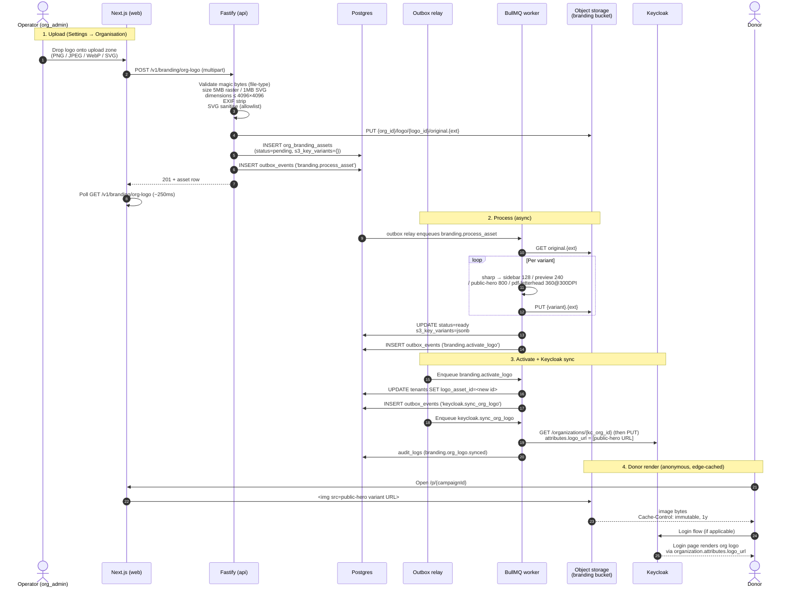
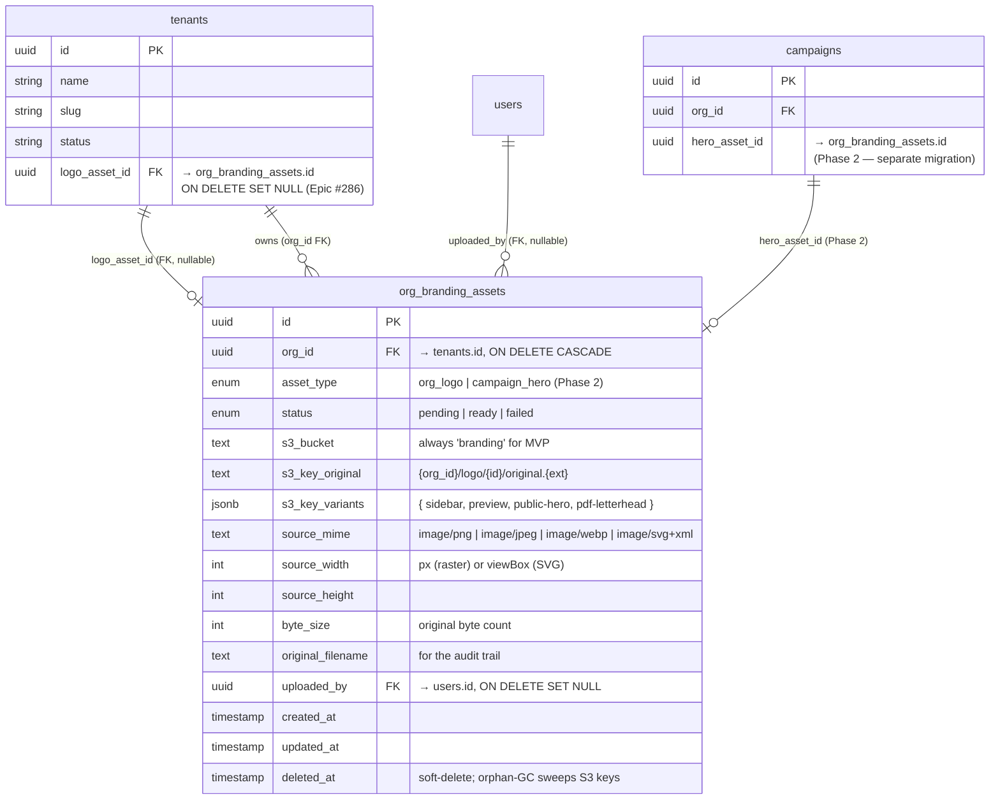

# 24 — Organisation Branding Assets (Logos)

> **Status**: Implemented — Epic #286
> **Owner**: Design Architect agent (`.claude/agents/design-architect.md`) + MVP Engineer
> **Related**: `03-data-model.md`, `04-business-capabilities.md`, `06-security-compliance.md`, `11-design-identity.md`, `22-tenant-onboarding.md`, `23-postal-campaigns.md`, ADR-013 (frontend type boundary), ADR-017 (one logical DB per tool — analogous principle), ADR-023 (bucket topology), ADR-024 (image processing pipeline), ADR-025 (PDF rendering boundary)
> **Companion diagram**: [`diagrams/branding-upload-flow.mmd`](../diagrams/branding-upload-flow.mmd) — upload → process → activate → donor render
> **Closes**: #286

## 0. Why this exists — at a glance

Until Epic #286, every operator-facing and donor-facing surface of Givernance carried the **Givernance** brand: the sidebar logo, the public donation page (`/p/[id]`) hero, the postal-letter PDF cover (Epic #274), the Keycloak login screen. Donors landing on a Givernance-hosted donation page saw a **generic donation form**, not "Charity X's donation page" — a direct contradiction of our positioning as the *invisible* infrastructure under the NPO's brand.

Brand recognition is also a measurable conversion lever. The [M+R Benchmarks 2025](https://mrbenchmarks.com/) frame branded donation forms as essential during high-volume periods (year-end, GivingTuesday, emergency response). [Frontiers in Communication 2025](https://www.frontiersin.org/journals/communication/articles/10.3389/fcomm.2025.1682863/full) finds that *brand image* — not awareness — predicts donation intent: a donor who recognises and trusts the org's visual identity converts at materially higher rates than one staring at a generic form.

This Epic ships **organisation-logo upload + reuse on every surface**, and the storage/processing stack that future branding work (per-campaign hero, favicon, OG share image, brand kit, dark-mode variants) will sit on top of. The MVP is deliberately narrow — one logo at the org level, four pre-generated variants, public-read bucket, async worker pipeline — but the foundations are the durable ones.

## 1. End-to-end user flow



The error branch (`status=failed`) leaves the `original` row in place so the operator can retry without re-uploading; the UI surfaces a "Reprocess" CTA. BullMQ's retry policy (5xx / network) applies inside Stage 2; only deterministic failures (corrupt source, sharp panic) reach `'failed'`.

## 2. Surfaces that consume the logo

| Surface | Where the logo appears | Variant required | Phase |
|---|---|---|---|
| Left navigation sidebar | Above the bottom tenant-switcher dropdown menu item | `sidebar` (128×128 retina-2× of 64) WebP | **MVP** |
| Tenant onboarding flow | Optional step (not blocking signup) | `preview` (240×240) WebP | **MVP** |
| Settings → Organisation | Visual-identity hero card at the top of the form | `preview` (240×240) WebP | **MVP** |
| Public donation page (`/p/[id]`) | Top-left of the hero gradient (NOT centered — anchors the page like website nav) | `public-hero` (800×800 contain) WebP | **MVP** |
| Postal-letter PDF (cover panel) | Top-left at `(PAGE_MARGIN, 60mm)`, 30×30mm rendered | `pdf-letterhead` (360×360 @ 300 DPI) PNG | **MVP** |
| Keycloak login theme | `infra/keycloak/themes/givernance/login/template.ftl` consumes `organization.attributes['logo_url']` | URL of `public-hero` variant | **MVP** |
| Tenant-switcher card (`/select-organization`) | Per-tenant card icon — sources from `tenants.logo_asset_id` | `sidebar` (128×128) WebP | **MVP** |
| Internal campaign detail page | Header banner | per-campaign `hero_asset_id` (separate from org logo) | **Phase 2** |
| Campaign create/edit form | Optional per-campaign hero upload | new `org_branding_assets` row, `asset_type='campaign_hero'` | **Phase 2** |
| Email signature (transactional + bulk) | 160×40 PNG with white background | new `email-signature` variant | **Phase 2** |
| Favicon | 16×16, 32×32, 192×192 PNG | new `favicon-*` variants | **Phase 3** |
| OG share image | 1200×630 JPEG with branding overlay | composed at request time | **Phase 3** |
| Dark-mode logo | mono / inverted variant | new `logo_dark` asset row | **Phase 3** |

The MVP scope is the trust-load-bearing set: every donor-visible surface renders the org's brand, not Givernance's. Phase 2 and 3 surfaces are explicit storytelling / polish features that don't move the donor-trust needle on day one.

## 3. Domain model



**Migration**: ships in `0042_org_branding_assets.sql`. Includes `ALTER TABLE tenants ADD COLUMN logo_asset_id …`. RLS is enabled and forced on `org_branding_assets`; tenant isolation policy `org_id = app_current_organization_id()`. `givernance_app` (NOBYPASSRLS) gets `SELECT, INSERT, UPDATE, DELETE`. The `campaigns.hero_asset_id` column is **deferred to a Phase 2 migration**, not shipped here.

### Why one polymorphic table

The row shape (`s3_*` keys, dimensions, status, audit) is identical between an org logo and a future per-campaign hero. Two parallel tables would mean duplicated migrations, duplicated RLS policies, and duplicated worker dispatch logic for marginal type-safety gain at the SQL layer. The `asset_type` enum carries the discriminator; the TypeScript reader narrows on it.

A future `favicon`, `og_image`, or `email_signature_logo` is one new enum value plus one new pointer column away — no schema upheaval.

### Why JSONB for variants, not columns

The variant set evolves across phases (see § 8). A `s3_key_sidebar TEXT, s3_key_preview TEXT, s3_key_public_hero TEXT, s3_key_pdf_letterhead TEXT` schema would require a migration every time the matrix changes. The TypeScript union `BrandingVariantKey` in `@givernance/shared` is the **source of truth** for the variant key set; Zod validates on read. We never query `WHERE variants->'sidebar' = …`; lookup is always by `id` first, then read the JSONB.

### Why `tenants.logo_asset_id` FK rather than `tenants.logo_url` text

- **Atomic replace.** Replacing the logo mints a new `org_branding_assets` row and updates `tenants.logo_asset_id` to point at it. The old row stays fetchable for the audit window before nightly orphan-GC sweeps it.
- **Variant-aware lookup.** The sidebar wants a different URL than the PDF wants. One FK + JSONB beats five `tenants.logo_*_url` columns.
- **Keycloak `logo_url` is derived.** The Keycloak Organization attribute is computed from the `public-hero` variant key on tenant write and synced via outbox event → worker → Keycloak Admin API PATCH. The application DB is the source of truth; Keycloak is a downstream consumer.

## 4. Architecture

### 4.1 Pipeline (sharp variants, content-addressed keys, JSONB variant map)

The full design is in [ADR-024](./adrs/adr-024-image-processing-pipeline.md). At a glance:

| Stage | Owner | Latency budget | What happens |
|---|---|---|---|
| 1. Upload | API handler (Fastify) | < 200ms p95 | Validate, EXIF-strip, sanitise SVG, write `original` to S3, INSERT row + outbox event |
| 2. Process | BullMQ worker | < 1s end-to-end | sharp pipeline → 4 variants, write to S3, flip status to `'ready'` |
| 3. Activate | Worker (chained outbox) | < 1s | UPDATE `tenants.logo_asset_id`, enqueue Keycloak sync |
| 4. KC sync | Worker (chained outbox) | < 5s typical | GET-then-PUT `/organizations/{id}` merging `attributes.logo_url` |

Variants are **content-addressed** by `{logo_id}` (a UUID minted at upload time, never reused). Replacing the logo mints a fresh `logo_id`, so every variant URL has a stable byte-equivalent meaning and `Cache-Control: public, max-age=31536000, immutable` is safe. Letters already in the post box keep working — the old row stays in S3 until orphan-GC, after a configurable grace window.

### 4.2 Bucket topology (ADR-023)

The `branding` bucket is **public-read at the bucket level**, with no per-object ACL. This is the strict ADR-023 separation: public assets in their own bucket, private assets (`receipts`, `campaigns` ZIPs) in theirs. Tenant offboarding is a single `aws s3api delete-objects --prefix {org_id}/`. See [ADR-023](./adrs/adr-023-object-storage-bucket-topology.md) for the full rationale and rejected alternatives.

The CLAUDE.md rule "🛑 One Bucket per Visibility Class (ADR-023)" governs every future asset-class addition.

### 4.3 Upload validation

- **Magic-byte check.** `file-type` is the source of truth — never trust the `Content-Type` header. The accepted set is `{image/png, image/jpeg, image/webp, image/svg+xml}`; anything else gets a 422 with `code: invalid_file_type`.
- **Size cap.** 5MB for raster formats, 1MB for SVG. SVG is text and any "logo" past 1MB is almost certainly a minified-once-but-still-bloated export from Illustrator with embedded raster fallbacks; reject and force the operator to clean it up.
- **Dimension cap.** 4096×4096 px (probed via `sharp({ failOnError: false }).metadata()` before any pixel-touching op). Larger inputs are almost certainly a phone screenshot or a poster mistakenly uploaded; the variant pipeline doesn't need them.
- **EXIF strip.** Raster originals have their EXIF metadata removed at upload time. A JPEG carrying GPS coordinates from the operator's phone shouldn't reach S3, let alone get cached at the edge.
- **SVG sanitiser.** Strict allowlist via `@mattdood/svg-sanitizer` (or DOMPurify SVG profile): permitted elements `svg, g, path, rect, circle, ellipse, line, polyline, polygon, defs, linearGradient, radialGradient, stop, title, desc`; rejected `<script>`, `<foreignObject>`, external `<use href>`, every `on*` event-handler attribute. **Raw SVG is never served to anonymous donors** in Phase 1 — donor-facing pages always consume the rasterised WebP variants. The PDF consumes the rasterised PNG (PDFKit cannot embed SVG natively).
- **SVG element-count cap** (issue #295). Before the DOMPurify/jsdom parse, the sanitiser counts opening tags with a cheap O(n) regex on the raw text and rejects (`reason: "too_complex"`) any document over **`MAX_SVG_ELEMENTS = 5000`** elements. This closes the gap where a pathological SVG of ~100k tiny `<rect>` elements — each ≈10 bytes, so it slips under the 1 MB byte cap — would inflate the jsdom parser DOM enough to spike memory/CPU before DOMPurify ever ran. 5,000 is a generous ceiling (a complex flat-design logo is ~200 paths; a vector portrait ~1,000), so it never trips a legitimate upload. The check lives in `@givernance/shared/lib/svg-sanitiser`, so both the API upload handler and the worker rasterisation pipeline enforce it identically.

### 4.4 Keycloak sync (outbox-relay → worker)

The Keycloak sync lives behind two outbox events:

1. `branding.activate_logo` — chained from Stage 2 of the pipeline. Sets `tenants.logo_asset_id`. Then enqueues:
2. `keycloak.sync_org_logo` — the worker calls `kcAdmin.updateOrganization(kcOrgId, { attributes: { logo_url: [publicHeroUrl] } })`, which is GET-then-PUT on `/organizations/{id}` to preserve the other attributes (`theme_primary_color`, organisation name, etc.).

Drift on the relay is < 1s in practice. A donor logging in during that window briefly sees the **old** logo on the Keycloak login screen — accepted as benign (no transactional content), documented as the chosen tradeoff. The alternative ("PATCH Keycloak in the upload handler") was rejected: a Keycloak outage would break logo uploads, and the KC Admin API rate-limit would tightly couple to the upload-path SLO.

The reusable shape (outbox → worker → KC Admin API GET-then-PUT) is documented in `docs/05-integration-migration.md` as the canonical pattern for any future tenant-attribute → Keycloak sync.

### 4.5 Worker LRU cache (PDF embedding)

Postal exports run in batches of thousands of recipients (Epic #274). Without a cache, each recipient PDF would re-fetch the same `pdf-letterhead` variant from S3. The worker maintains an in-process LRU keyed by `logo_asset_id`:

- **Max entries**: 50 (≈ 10MB total — each `pdf-letterhead` variant is ~200KB)
- **TTL**: 1 hour
- **Eviction**: LRU on overflow; explicit invalidate on the `branding.activate_logo` event for the relevant `org_id`

The cache is local to each worker pod; a multi-worker deployment may have stale-by-up-to-1h reads on pods that haven't seen the activate event yet, accepted because the postal-export ZIP is a snapshot of "what was approved at preview time" — minor drift between preview and bulk for a logo that was just replaced is acceptable, and the operator who does that already knows the export is mid-flight.

## 5. PDF embedding

The exact placement spec for the postal-letter cover panel:

| Property | Value | Source |
|---|---|---|
| `x` | `PAGE_MARGIN` (≈ 17.6mm) | mirrors the org-name letterhead `x` |
| `y` | `60mm` | mirrors `ADDRESS_BLOCK_Y` (right-of-center address block) |
| Rendered size | `30×30mm` | fits comfortably between `y=25mm` (org name) and `y=100mm` (campaign title), with 10mm of breathing room |
| Source raster | `360×360 px @ 300 DPI` | the `pdf-letterhead` variant key |
| PDFKit call | `doc.image(buffer, PAGE_MARGIN, 60 * MM_TO_PT, { fit: [30 * MM_TO_PT, 30 * MM_TO_PT] })` | `fit` (not `width`/`height`) so non-square logos shrink within the box without distortion |
| Missing-logo fallback | Skip the `doc.image` call entirely | layout unchanged — title stays at `y=100mm`, address stays at `x=110mm/y=60mm`, no reflow |

Both renderers update in lockstep:

- `packages/api/src/modules/campaigns/postal-pdf.ts` — preview path
- `packages/worker/src/services/campaign-pdf.ts` — bulk path

The lockstep convention is the existing parity rule from Epic #274 (see `docs/23-postal-campaigns.md` § 1.ter). The boundary policy — keep duplicating now, extract into `@givernance/pdf` on the third PDF surface — is captured in [ADR-025](./adrs/adr-025-pdf-rendering-code-boundary.md). PDFKit is Node-only, so the extraction target cannot be `@givernance/shared` (forbidden by ADR-013).

## 6. Permissions matrix

| Endpoint | Method | Guard | Notes |
|---|---|---|---|
| `POST /v1/branding/org-logo` | POST | `requireOrgAdmin` | multipart/form-data; 5MB raster / 1MB SVG cap; magic-byte validation; EXIF strip; SVG sanitiser. Audit-worthy. |
| `GET /v1/branding/org-logo` | GET | any authenticated tenant member | Returns the active logo asset row + variant URLs; returns null if `tenants.logo_asset_id IS NULL`. UI uses this to render the sidebar. |
| `DELETE /v1/branding/org-logo` | DELETE | `requireOrgAdmin` | Soft-deletes the asset, NULLs `tenants.logo_asset_id`, enqueues `keycloak.sync_org_logo` to clear the KC attribute, schedules orphan-GC of the S3 keys. |
| Public donation page (consumes `public-hero` variant) | GET | **Anonymous (donor)** | Served from S3 `branding` bucket directly via the public-read URL; no API call, no auth, edge-cached. |
| Keycloak login screen (consumes `public-hero` variant) | GET | **Anonymous** | KC reads `organization.attributes['logo_url']` from the realm and ``s it. The validation that the URL starts with `https://` is enforced in `template.ftl` (defense-in-depth). |

The bulk-postal-export pipeline reads the `pdf-letterhead` variant via the worker's S3 client (BYPASSRLS owner role); the operator-visible API surface for this is `POST /v1/campaigns/:id/postal-exports` (Epic #274) with the existing `requireOrgAdmin` gate.

## 7. Privacy & GDPR

- **PII**: none. A logo is the org's public branding asset by definition. There is no constituent data, no donor data, no staff PII embedded in a logo.
- **EXIF stripping** (privacy hygiene). The raster upload pipeline strips EXIF metadata before writing the `original` to S3. A JPEG with embedded GPS coordinates from the operator's phone (a real failure mode — operators photograph their printed logo and upload that) does not leak donor or staff location.
- **SVG sanitisation** (defense in depth). Even though SVG is text and the threat model is XSS-against-the-uploader rather than donor-PII-leakage, the strict allowlist removes `<script>`, `<foreignObject>`, external `<use href>`, and `on*` event handlers before storing the original. A `MAX_SVG_ELEMENTS = 5000` opening-tag cap (issue #295) is enforced before the parse to stop a resource-exhaustion upload (100k tiny elements under the byte cap) from spiking the parser.
- **Tenant offboarding cascade.** A `DELETE FROM tenants WHERE id=$1` cascades via FK to `org_branding_assets` (`ON DELETE CASCADE`). The S3 prefix `{org_id}/` is wiped by a single `aws s3api delete-objects --prefix {org_id}/` in the offboarding runbook; one bucket, one query.
- **Soft-deleted assets** are GC'd nightly. The orphan-GC sweep finds rows with `deleted_at IS NOT NULL AND deleted_at < now() - interval '7 days'` and removes their `s3_key_original` + every entry in `s3_key_variants` from S3 before hard-deleting the row. The 7-day window covers the audit case "an operator deletes the wrong logo and wants it back."
- **Right-to-erasure (Art. 17)** is unaffected — logos contain no personal data, so the erasure worker doesn't touch this table.
- **`uploaded_by` audit trail** — every uploaded asset records `users.id`, satisfying GDPR Art. 5(2) accountability for who introduced which branding asset on which date. `ON DELETE SET NULL` preserves the asset row when an offboarded user is anonymised.
- **Keycloak Organization attribute is non-sensitive.** The `logo_url` value is a public-bucket URL, not a secret. It is safe to emit into JWTs via the `oidc-organization-membership-mapper` (the CLAUDE.md "🛑 No secrets in Keycloak Organization attributes" rule explicitly permits public-facing labels).

## 8. Variant set evolution

The variant key set is a TypeScript union owned by `@givernance/shared`:

```typescript
export type BrandingVariantKey =
  | "sidebar"
  | "preview"
  | "public-hero"
  | "pdf-letterhead";
```

When a variant's spec changes (e.g. `sidebar` from 128×128 to 256×256 for a future high-DPI redesign), the strategy is **bump the key**:

1. Add `sidebar-v2` to the union.
2. The worker derives `sidebar-v2` on the next `branding.process_asset` job for any new uploads. A one-shot backfill job re-derives it for the in-place `'ready'` rows.
3. Frontend consumers switch from `sidebar` → `sidebar-v2` in a single commit.
4. After the rollout completes, the old `sidebar` key is dropped from the union and from `s3_key_variants`. Orphan-GC removes the now-unused S3 keys.

There is **no `variants_schema_version` column**, no migration, no versioning stamp. The strategy is captured in [ADR-024](./adrs/adr-024-image-processing-pipeline.md).

### 8.1 Mid-export re-upload semantics

Logo URLs are content-addressed (the `{logo_id}` segment), so an operator who uploads a new logo while a postal export is mid-run **does NOT retroactively update letters already serialised into the in-flight ZIP**. The worker resolves `tenants.logo_asset_id` once at job start and threads the resulting `pdf-letterhead` buffer through every recipient via the LRU cache. New letters generated AFTER the next export run pick up the new logo.

The donor-facing surfaces (sidebar, public donation page, Keycloak login) DO converge on the new logo as soon as the activation event lands — only the in-flight bulk PDF render is "frozen" by design. Operators expecting a hot-swap of an in-progress export should cancel the export, re-upload, and re-trigger; the alternative (mid-run re-resolution) would produce a ZIP with two visually different letterheads, which is worse than either option.

## 9. Future work (not in MVP)

Explicitly deferred so prospects, operators, and future-self don't assume any of this ships now:

- **Per-campaign hero (Phase 2)** — `campaigns.hero_asset_id` + per-campaign upload on the campaign create/edit form. Stacks with the org logo (does not replace it): the org logo stays in the sidebar at its usual size; the campaign hero takes the page-hero on `/p/[id]` and the internal campaign detail page. Schema impact: one new nullable FK column, zero query-time decision logic.
- **Email-signature variant (Phase 2)** — 160×40 PNG with white background, consumed by transactional + bulk email templates. Ties into Epic #279 (per-tenant email sending domain).
- **Favicon (Phase 3)** — 16×16, 32×32, 192×192 PNG variants for browser tabs and PWA icons.
- **OG share image (Phase 3)** — 1200×630 JPEG with branding overlay for donation-page link previews on social media.
- **Dark-mode logo variant (Phase 3)** — separate asset row with `asset_type='logo_dark'`, served when the consumer surface is in dark theme.
- **Brand kit / multi-asset library UI (Phase 3)** — Mailchimp Brand Kit-style Settings → Branding screen showing every asset (logo, favicon, OG image, dark-mode, email signature) in one place.
- **Crop tool / focal-point picker** — explicitly rejected for MVP. Slack, Notion, HelloAsso, Donorbox don't ship one either; defer until support tickets pile up. 90% of logos arrive square already.
- **Tier-gating (paywall on "Powered by Givernance" footer removal)** — the footer rendering hook ships in MVP behind a feature flag, but the actual gating logic ties into the pricing/tier work tracked separately in `docs/08-pricing-packaging.md`. Free tier shows the footer; paid tier removes it. The branding feature itself is **not** paywalled — table-stakes for European NPO CRM.
- **Federated structures (multi-org logo inheritance)** — Givernance does not currently provision per-tenant subdomains, so a federation-aware branding layer has no surface to attach to. Reopens when multi-tenant subdomain routing arrives.
- **Virus scanning (ClamAV sidecar)** — the threat model (only authenticated `org_admin` can upload; donors cannot) doesn't justify the operational overhead for MVP. Reconsider in Phase 3 if operator-controlled email attachments arrive.

## 10. References

- ADR-013 — Frontend type boundary (no Node-only deps in `@givernance/shared`)
- ADR-017 — One logical DB per tool (analogous principle, applied to buckets in ADR-023)
- ADR-023 — Object storage bucket topology (one bucket per visibility class)
- ADR-024 — Image processing pipeline (sharp + async worker + content-addressed variants)
- ADR-025 — PDF rendering code boundary (lockstep duplicate; extract on third surface)
- `docs/03-data-model.md` — `org_branding_assets` table + `tenants.logo_asset_id` FK
- `docs/04-business-capabilities.md` § 2.4 — public donation page consumes the `public-hero` variant
- `docs/05-integration-migration.md` § 5 — Keycloak Organization attribute sync pattern
- `docs/06-security-compliance.md` — encryption-at-rest table (incl. `branding` bucket); image-upload security controls
- `docs/11-design-identity.md` § 8 — sidebar logo slot; initial-letter colored fallback design token
- `docs/22-tenant-onboarding.md` § 6.4 — optional logo-upload step + tenant-switcher card consumes `tenants.logo_asset_id`
- `docs/23-postal-campaigns.md` — postal-letter renderer (lockstep duplicate consumed by Epic #286)
- Code refs: `packages/worker/src/lib/s3.ts` (S3 client, SSE-S3), `packages/api/src/modules/campaigns/postal-pdf.ts` + `packages/worker/src/services/campaign-pdf.ts` (lockstep PDF renderers), `packages/api/src/lib/keycloak-admin.ts` (`updateOrganization` GET-then-PUT), `infra/keycloak/themes/givernance/login/template.ftl` (consumes `organization.attributes['logo_url']`)
- Migration `0042_org_branding_assets.sql` — schema delta for this Epic (table + RLS + `tenants.logo_asset_id`)
- Mockups: [`docs/design/global/branding-empty-states.html`](design/global/branding-empty-states.html) (GLO-006) — AddLogoBanner + sidebar `InitialLetterAvatar` empty state, palette contractuelle, contraintes d'upload (issue #293)
