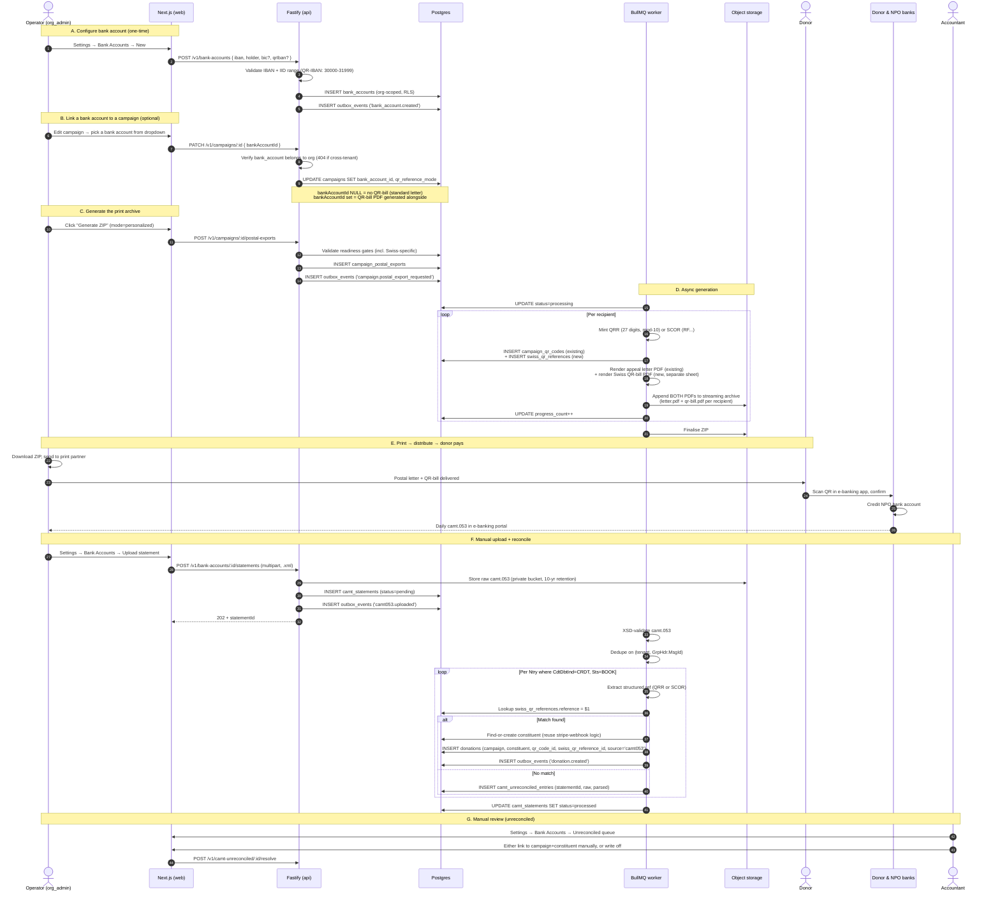
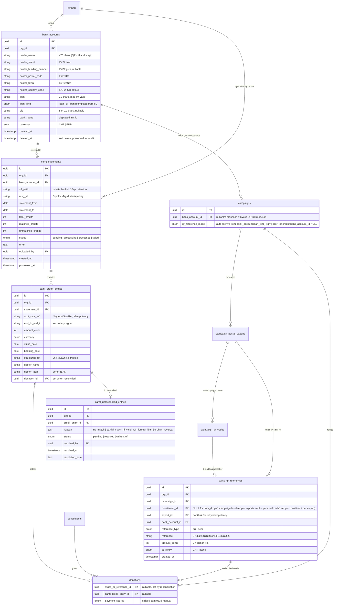
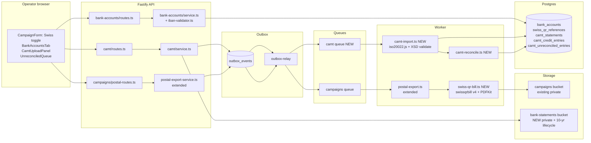
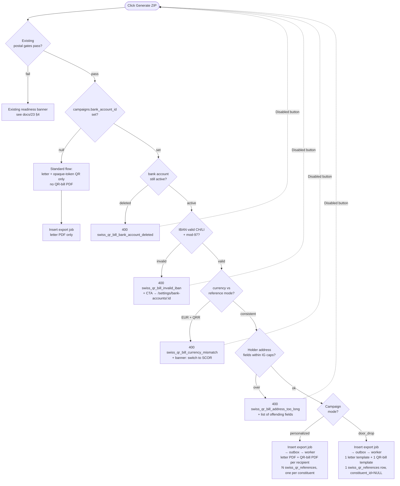
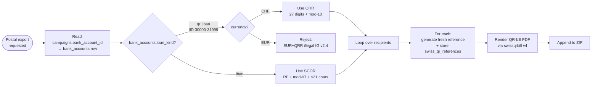
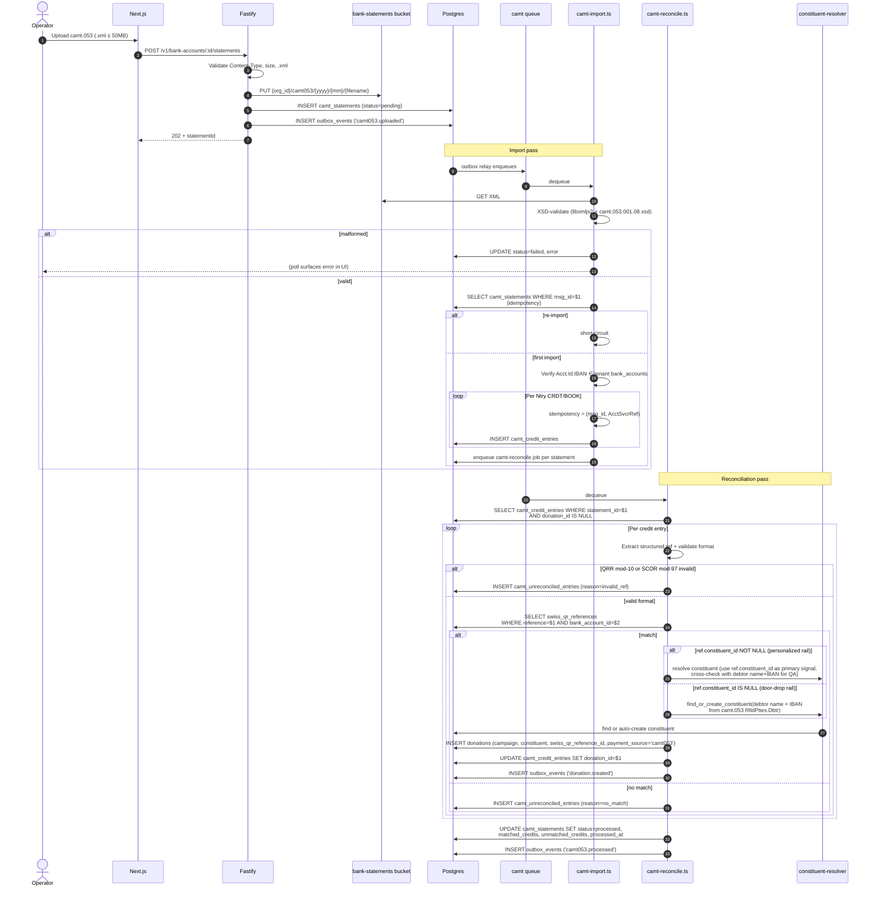
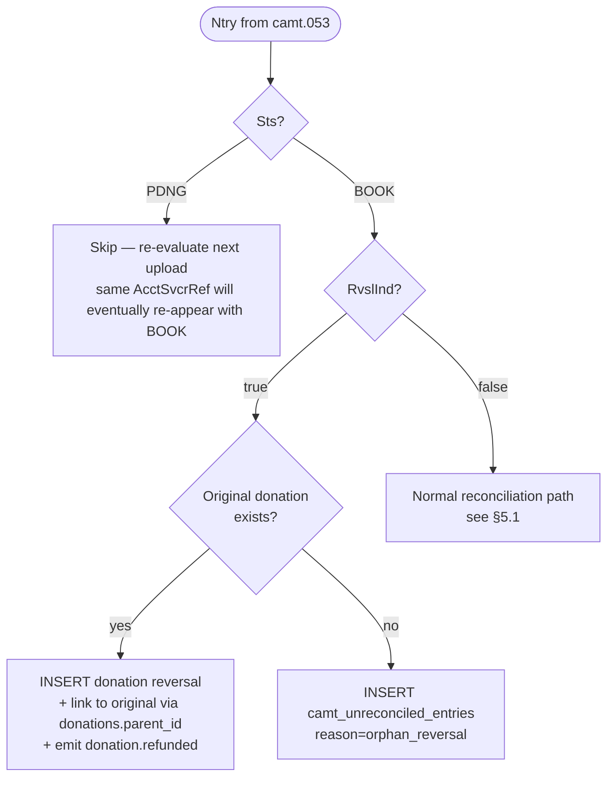
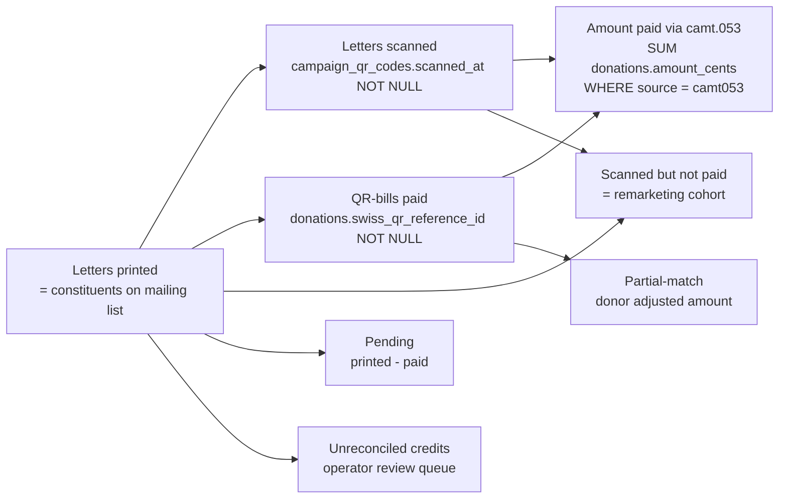
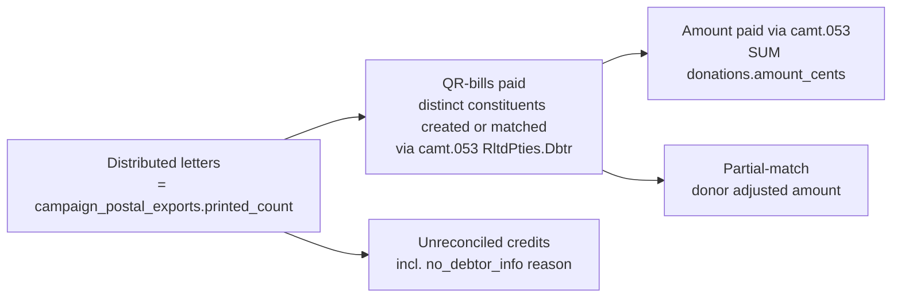

# 25 — Swiss QR-bill & camt.053 Reconciliation

> **Status**: Foundation merged (Epic #318)
> **Owner**: Payment Engineer agent
> **Related**: `23-postal-campaigns.md`, `20-payment-strategy.md`, `03-data-model.md`, `06-security-compliance.md`, `15-infra-adr.md`, [`adrs/adr-027-swiss-qr-bill.md`](./adrs/adr-027-swiss-qr-bill.md), [`adrs/adr-028-camt053-ingestion.md`](./adrs/adr-028-camt053-ingestion.md)
> **Companion diagrams**: [`diagrams/swiss-qr-bill-flow.mmd`](../diagrams/swiss-qr-bill-flow.mmd), [`diagrams/camt053-reconciliation-flow.mmd`](../diagrams/camt053-reconciliation-flow.mmd)
> **Closes (foundation)**: #318 (foundation PR)

## 0. Why this exists — at a glance

> 🚨 **MVP-mandatory** — re-classified from "Future work" in `docs/23-postal-campaigns.md` §9.

The previous scope decision (issue #274) explicitly **deferred** the Swiss QR-bill ("Switzerland's native bank-encoding QR standard. Different layout, mandatory IBAN encoding, separate validation rules"). **Field insight from Greg (2026-05-07) flips this**: a Swiss NPO without QR-bill cannot collect postal donations at all — there is no fallback rail in Switzerland since the orange ESR / red ES bulletins were discontinued on **2022-09-30**. Givernance must ship this in MVP-1 or it cannot serve `.ch` tenants.

This domain adds **three coupled deliverables** to the existing postal-campaign rail (`docs/23`):

1. **Swiss QR-bill PDF generation** — every nominative-postal letter to a Swiss campaign carries a Swiss QR-bill (QR-facture / Schweizer QR-Rechnung) on a perforation-free **separate A4 sheet**, with a per-letter QRR (QR-Reference) or SCOR (Creditor Reference) reference. The donor pays via their e-banking app (mobile scan) or at a Post counter.
2. **Bank Accounts settings** — a new tab in Org Settings (`/settings/bank-accounts`) where org_admins register the IBAN / QR-IBAN, holder name, and bank details that back QR-bill issuance. A campaign with QR-bill mode enabled is bound to exactly one bank account.
3. **camt.053 import + reconciliation** — the operator uploads the bank's daily ISO 20022 statement (`camt.053`); the worker parses every credit entry, matches the QRR/SCOR back to the campaign + recipient, creates the `donation` row (auto-creating the constituent if unknown, reusing the existing find-or-create logic from the Stripe webhook), and surfaces unmatched credits in a manual queue.

Every printed slip is a contract: the QRR on the slip → the donor's payment in the bank → the camt.053 entry → the reconciled `donation` in Givernance. The whole loop must be GDPR-tight (donor IBAN + name on every slip), idempotent under re-imports, and forward-compatible with **EBICS automated pull** (deferred to V2).

> **Greg field insight** (transcript 2026-05-07): _"on va aussi ajouté une issue pour gèrer les campagnes postal gen pdf pour supporter les virement bancaire (...) virement bancaire suisse avec la norme ISO 20022 et extrait de compte camt ISO 20022 pour pouvoir faire un import de compte ensuite et gèrer les reference et créer les donations dans la plateforme (+ ajout/réconciliation de constituants). Coté settings d'orga, y'aura la possibilité de gèrer des coordonnées de comptes bancaires et de les lier a des campagnes pour facilité la génération des pdf."_

## 1. End-to-end user flow



## 1.bis.0 Mode resolution matrix (PR #4)

Two booleans on the campaign drive the postal-export experience:

- `hasBank` — `campaign.bank_account_id IS NOT NULL` (a Swiss bank account is linked)
- `hasPage` — a page row exists in `campaign_public_pages` for this campaign (status: `draft` OR `published`).[^haspage] The publish-status gate (`public_page_missing` / `public_page_draft`) fires separately inside the standard / hybrid path at the API layer — using `status === 'published'` here would silently flip a draft-page-only campaign into `blocked` and surface a misleading "not-configured" banner when the operator just needs to publish.

[^haspage]: Resolved via the shared `hasPageFromStatus(status)` helper in [`@givernance/shared/postal-print-layout`](../packages/shared/src/postal-print-layout.ts). The hypothetical future `archived` status would map to `false` (an archived page is not a usable scan target).

| `hasBank` | `hasPage` | Mode | What ships per recipient | Readiness gates that fire |
|---|---|---|---|---|
| false | true | **Standard** | 1 PDF: appeal letter with scan-QR → public page | `campaign_not_active`, `public_page_missing`/`public_page_draft`, `no_recipients` (perso) |
| true | false | **QR-bill only** | 1 single-page PDF: compressed appeal + IG QR-bill strip at y=192 mm (auto-fallback to 2 pages on long content) | `campaign_not_active`, `swiss_qr_bill_*` (4 gates) |
| true | true | **Hybrid** | 2 sibling PDFs: appeal letter + rich QR-bill | All gates from Standard + all `swiss_qr_bill_*` gates |
| false | false | **Blocked** | nothing | New `postal_export_not_configured` gate |

The mode resolver lives in `@givernance/shared/postal-export-mode.ts` as a pure function. The API readiness-gate evaluator, the worker render dispatcher, and the web mode-summary panel all call the same code path — drift across the three would silently re-introduce the "preview lies about generation" bug PR #4 was opened to fix.

**Tie-break on the both-true case → `hybrid` wins.** Reason: the Swiss flow MUST be a strict superset of the French tracking surface (this §). Dropping the scan-tracking QR when the operator clearly published a public donation page would silently kill the 3-stage funnel they already configured.

**Run-mode persistence + drift assertion (migration 0050).** The API stamps the resolved `run_mode` on the `campaign_postal_exports` row at enqueue time. The worker re-resolves the mode at pickup; if the stamped and re-resolved modes diverge — operator unlinked the bank account or archived the public page between Generate and the BullMQ pickup — the worker fails the job with `postal_export_mode_drift` rather than shipping a ZIP whose contents don't match the export panel the operator clicked from. NULL `run_mode` = legacy row from before migration 0050; the assertion is skipped for those (history exports keep retrying cleanly until they age out).

## 1.bis QR codes per mailing — preserve scan tracking when it makes sense, add payment in either mode

**Critical design choice**: a Swiss QR-bill scan inside the donor's e-banking app **does NOT hit Givernance servers** — the QR encodes a payment instruction (SPC payload, IBAN, reference), not a URL. So a Swiss-only mailing would lose the **scan-to-donate funnel** the operator gets today on the French rail (`docs/23` §5: printed → scanned → donated → revenue).

The shape depends on `campaigns.mode`:

### Personalised mailing (1 letter per recipient)

**Mint and print both QR codes per recipient**, on the same physical mailing:

| Surface | Carrier | Encodes | Tracking signal | Table |
|---|---|---|---|---|
| **Appeal letter (page 1)** — bottom of the existing A4 layout | Givernance opaque-token QR + printed URL `/p/:cid?qr=<token>` | URL → Givernance resolver | `scanned_at` stamped on first scan (existing mechanism, unchanged) | `campaign_qr_codes` |
| **QR-bill (single-page sibling A4)** | Swiss IG-compliant QR-bill (compressed appeal content + bottom 105 mm Receipt + Payment Part strip) | SPC payload (IBAN, amount, **per-recipient QRR/SCOR**) | none (donor's bank app is offline-to-Givernance) | `swiss_qr_references` |

The two rows are 1:1-paired in the worker: the same `(campaign_id, constituent_id, export_id)` mints exactly one `campaign_qr_codes` row AND one `swiss_qr_references` row per personalised letter. They live in different tables for the reasons in §2 (different alphabet, different security model, different retention) but share their lifecycle and their export run.

**The operator's funnel becomes a 3-stage pipeline** with both engagement and payment signals:

```
letters printed   →   letters scanned   →   QR-bills paid
(constituents on        (Givernance QR              (camt.053
 mailing list)           scanned_at NOT NULL)        reconciled)
```

The "scanned but not yet paid" cohort is the highest-value remarketing segment — they showed engagement but didn't complete the bank-transfer step (which has more friction than a one-tap Stripe checkout). The campaign admin page surfaces this cohort directly (see §5.3 tracking widget).

### Door-drop mailing (one template, N anonymous copies)

Door-drop letters have no recipient identity at print time — they're distributed into mailboxes. So we mint **one campaign-level QR-bill per export** and print it identically on every copy:

| Surface | Carrier | Encodes | Tracking signal | Table |
|---|---|---|---|---|
| **Appeal letter (page 1)** | None (no per-recipient opaque token — there's no recipient to attribute) | — | — | — |
| **QR-bill (single-page A4)** | Swiss IG-compliant QR-bill (compressed appeal + bottom 105 mm payment strip) | SPC payload (IBAN, amount, **one campaign-level QRR/SCOR per export**) | none direct; per-donor attribution comes from camt.053 debtor data on payment | `swiss_qr_references` row with `constituent_id = NULL` |

The reconciler creates / matches the constituent **from the camt.053 debtor fields** (`RltdPties.Dbtr.Nm` + `DbtrAcct.Id.IBAN`) when the QR-reference resolves to a NULL-constituent row — see §5 reconciliation.

**Door-drop funnel (2 stages, scan stage omitted):**

```
letters printed     →     QR-bills paid
(export.print_count)        (camt.053 reconciled to the campaign-level QRR)
```

The conversion ratio is naturally lower than personalised (no engagement signal in the middle, no per-recipient remarketing), but the cost-per-letter is much lower too — door-drop is a volume play.

> **Why not just use the Swiss QR-bill page on its own for personalised mailings?** Because it would silently degrade the operator's existing 3-stage reporting on the personalised rail. The Swiss flow on personalised MUST be a strict superset of the French flow's tracking surface — never a regression. Door-drop is the natural exception because it had no scan-tracking signal to begin with.

## 1.ter Page format — Swiss QR-bill: canonical 1-page layout (auto-fallback to 2 pages)

The Swiss QR-bill PDF is **rendered as a single A4 portrait page** by default — compressed appeal content in the top 175 mm safe zone with the canonical IG QR-bill BVR strip at y=192 mm of the SAME A4. The IG Style Guide explicitly authorises this "invoice/letter at top, detachable BVR slip at bottom" layout. When the operator's appeal content overflows the 175 mm safe zone (measured at render time via `doc.y > 175 mm` after writing the compressed appeal + payment hint), the renderer **auto-falls back to a 2-page PDF** — appeal on page 1, BVR strip alone on page 2. The strip itself is **always at y=192 mm of an A4**, never moved or compressed; only the page hosting it changes. See [ADR-027 § amendment](./adrs/adr-027-swiss-qr-bill.md#2026-05-11-amendment--three-export-modes--rich-qr-bill-pdf) for the rationale (PR #354's 2-page-always layout gave donors a near-empty top half that disconnected the slip from its appeal) and [§1.bis.0](#1bis0-mode-resolution-matrix-pr-4) for which export modes use this layout (QR-bill-only + Hybrid both ship it).

```
┌───────────── A4 portrait (210×297mm) ─────────────┐
│  [ ORGANISATION NAME — bold ]                     │  y=20mm  ┐
│  Campaign: <campaign.name>                        │  y=30mm  │
│                                                   │          │
│  Dear <salutation>,                               │  y=45mm  │  COMPRESSED APPEAL ZONE
│                                                   │          │  (top 175 mm safe zone)
│  <compressed appeal body — operator-authored,     │          │
│   tightened typography vs. the standalone letter  │          │  When doc.y > 175 mm here
│   in Hybrid mode; same calls-to-action and        │          │  after writing the appeal +
│   donor thanks language>                          │          │  payment hint, the renderer
│                                                   │          │  auto-falls back to a
│  Recipient: Jean Dupont, Rue de Lausanne 12       │          │  2-page PDF (appeal on
│             1003 Lausanne                         │          │  page 1, BVR strip alone
│  (only if prefill_donor_identity is enabled)      │          │  on a fresh page 2).
│                                                   │          │
│  Pay this QR-bill from your e-banking app:        │          │
│  Scan the QR code on the receipt below.           │          │
│                                                   │  y=175mm ┘ <-- SAFE-ZONE CEILING
│                                                   │
│  - - - - - - - - - - - - - - - - - - - - - - - - │  y=192mm  <-- BVR STRIP TOP
│                                                   │              (canonical, fixed)
│  ┌─────────────────────┬─────────────────────────┐│
│  │  RECEIPT (62 mm)    │  PAYMENT PART (148 mm)  ││
│  │  ─────────────      │  ──────────────────     ││
│  │  Account / Payable  │  ┌─────────────┐        ││
│  │  to:                │  │             │        ││  y=200mm
│  │  CH9300762011…      │  │  [ QR ]     │        ││
│  │  NPO Holder Name    │  │   46×46mm   │        ││
│  │  Holder address     │  │   ECC M     │        ││
│  │                     │  │   + Swiss   │        ││
│  │  Reference          │  │   cross 7mm │        ││
│  │  21 00000 00003 …   │  └─────────────┘        ││
│  │  13947 14300 09017  │                         ││
│  │                     │  Currency  Amount       ││
│  │  Payable by         │  CHF       — (blank)    ││
│  │  (blank by default) │                         ││
│  │                     │  Account / Payable to:  ││
│  │  Currency  Amount   │  CH93 0076 2011 …       ││
│  │  CHF       —        │  NPO Holder Name        ││
│  │                     │  Holder address         ││
│  │  Acceptance point   │                         ││
│  │  ─────────────      │  Reference: 21 00000…   ││
│  │                     │  Payable by: (blank)    ││
│  └─────────────────────┴─────────────────────────┘│  y=297mm (page bottom)
└───────────────────────────────────────────────────┘
```

The Receipt + Payment Part dimensions are **fixed by IG QR-bill v2.4** — `swissqrbill` v4 handles them (210×105mm strip, 62mm Receipt + 148mm Payment Part). The 105 mm strip is the canonical IG-mandated structure; section labels (Account, Reference, Payable by, Acceptance point) are **mandatory in DE/FR/IT/EN**; the active label set is driven by the existing `tenants.default_locale` (FR/EN in MVP — DE deferred but cheap to add since `swissqrbill` ships all four locales out of the box, see §8).

The **y=175 mm safe-zone ceiling** and **y=192 mm strip top** are the two coordinates the renderer enforces at every export. They're load-bearing: a regression that lets the appeal content cross y=175 mm without triggering the 2-page fallback would push text into the IG-mandated 17 mm white margin above the strip, breaking IG conformance and donor scannability at the same time.

**Pre-flight printable checklist** (the worker validates before each render):

| Field | Source | Cap |
|---|---|---|
| Holder name | `bank_accounts.holder_name` | ≤ 70 chars |
| Holder street (IG `StrtNm`) | `bank_accounts.holder_street` | ≤ 70 chars |
| Holder building no. (IG `BldgNb`) | `bank_accounts.holder_building_number` (nullable) | ≤ 16 chars |
| Holder postal code (IG `PstCd`) | `bank_accounts.holder_postal_code` | ≤ 16 chars |
| Holder town (IG `TwnNm`) | `bank_accounts.holder_town` | ≤ 35 chars |
| Country | `bank_accounts.holder_country_code` (ISO-2) | exactly 2 |
| IBAN / QR-IBAN | `bank_accounts.iban` | 21 chars, mod-97 |
| Reference | minted per recipient | 27 (QRR) or RF.. (SCOR) |
| Currency | `bank_accounts.currency` | CHF or EUR (EUR ≠ QRR) |

If any cap is breached the export **fails before any PDF is rendered** — the readiness gate `swiss_qr_bill_address_too_long` lists the offending row(s) for the operator.

### 1.ter.bis Address-type readiness — S-only by construction

IG QR-bill v2.4 supports two address shapes: **K** (combined — 2 lines × 70 chars) and **S** (structured — `StrtNm` + `BldgNb` + `PstCd` + `TwnNm` + `Ctry`). The 2025 v2.3 update deprecated K and v2.5 makes S mandatory from **2026-09-30** ([Magic Heidi](https://magicheidi.ch/qr-bill-2025-changes-explained), [Projektron](https://www.projektron.de/en/blog/details/qr-invoices-switzerland-2025-4069/)).

Givernance ships **S-only from day one**. The column widths above (`holder_building_number ≤ 16` in particular, which is K-incompatible) make the K shape structurally impossible. No migration is required when the 2026-09-30 cutover happens. K is not modelled, validated, accepted, or rendered.

## 1.quater Reference type matrix (per bank account)

The choice of QR reference is **bound to the tenant's bank account**, not the campaign:

| `bank_account.iban_kind` | Reference type used | When |
|---|---|---|
| `qr_iban` (IID 30000-31999) | **QRR** — 27 numeric digits, mod-10 recursive check | Default for tenants whose bank issued a QR-IBAN (UBS, ZKB, PostFinance default) |
| `iban` (any other CH/LI IBAN) | **SCOR** — `RF` + 2 mod-97 check digits + ≤21 alphanum (ISO 11649) | For tenants whose bank only issues regular IBANs (some Raiffeisen, smaller cantonals) |

Per-letter — never per-campaign — **a fresh reference is minted** keyed `(constituentId, campaignId, exportId)`. Reuse across exports breaks idempotency on re-mailings and inflates duplicate-payment risk.

> **NON (no reference)** is **rejected at validation**: without a structured reference, camt.053 reconciliation collapses to fuzzy name matching, which we will not ship.

> **EUR + QRR is illegal** under IG QR-bill v2.4 (euroSIC discontinuation): currency-vs-reference consistency is enforced server-side. CHF is the default for Swiss NPOs.

> **The synchronous preview obeys this same matrix** (`POST /v1/campaigns/:id/postal-preview`). It resolves the reference type from the linked account's `iban_kind` + the campaign's `qr_reference_mode` exactly as the worker does, then mints a *never-registered* fixture of that type (QRR for a QR-IBAN, SCOR for a regular IBAN). Hardcoding a QRR fixture made the preview 500 for every regular-IBAN campaign — `swissqrbill` v4 rejects a QRR reference on a non-QR-IBAN with `QR-Reference requires the use of a QR-IBAN` (issue #495). The preview must stay in lockstep with the export here: the whole point of the preview is to show what Generate will print.

The full rationale for these matrix decisions, including rejected alternatives (NON, per-campaign references, EUR+QRR), is in [ADR-027](./adrs/adr-027-swiss-qr-bill.md).

## 2. Domain model

> **Schema file organisation**: `bank_accounts` is defined in `packages/shared/src/schema/bank-account.ts` — extracted from `swiss-qr-bill.ts` because it is now referenced by the funds module, the campaign editor, and the Settings › Bank Accounts UI, well beyond the QR-bill rail. The Swiss QR-bill rail tables (`swiss_qr_references`, `camt_statements`, `camt_credit_entries`, `camt_unreconciled_entries`) remain in `swiss-qr-bill.ts` and import `bankAccounts` from `./bank-account`. All symbols are re-exported through `schema/index.ts`; no consumer outside `packages/shared/` is affected.



### Why no `swiss_qr_bill_enabled` boolean?

The presence of `campaigns.bank_account_id` IS the on/off switch. Modelling it as a separate boolean would introduce an invalid state (`enabled=true && bank_account_id=NULL`) that has no operator meaning and forces defensive checks everywhere. A nullable FK is the canonical "optional pointer" in this codebase (mirrors `campaigns.parent_id`, `donations.constituent_id`, etc.) and lets the operator simply pick a bank account from the dropdown — or leave it blank — without a separate toggle. Settings can hold many bank accounts (`bank_accounts ||--o{ campaigns`); the campaign picks at most one.

### Why a `swiss_qr_references` table separate from `campaign_qr_codes`?

`campaign_qr_codes.code` is a 120-bit opaque token — its security model is "the token IS the URL". A Swiss QRR/SCOR is **not opaque**: it's a 27-digit number that the bank prints, the donor reads, and the camt.053 echoes back. Different alphabet, different validation, different uniqueness scope (per-bank-account vs. per-org), different retention story (financial record, 10-yr CH retention). Co-mingling them in one table would force every postal-export letter to mint two refs in the same row and confuse the reconciliation join. Sibling table, 1:1 link by `(export_id, constituent_id)`.

## 3. Architecture (3-tier extension of postal rail)



### Key design decisions

| # | Decision | Why |
|---|----------|-----|
| 1 | **Separate-sheet QR-bill** (one PDF letter + one PDF QR-bill, both in the ZIP) | IG QR-bill Style Guide explicitly allows this layout. Avoids perforation-partnership negotiation; print partner staples or the donor unfolds two sheets. Letter typography stays unchanged. Full rationale in [ADR-027](./adrs/adr-027-swiss-qr-bill.md). |
| 2 | **Library: `swissqrbill` v4 (schoero, MIT)** | Composes natively on PDFKit (`SwissQRBill.attachTo(doc)`); built-in payload + IBAN/QRR/SCOR validation; TypeScript-first; monthly cadence; covers IG v2.3 + v2.4 ready. Supplement with `boessu/SwissQRBill` algorithms for `validateBeforeMint()` unit tests. |
| 3 | **Library: `iso20022.js` for camt.053** + **XSD validation pass** via `libxmljs2` against the SIX `camt.053.001.08.xsd` | Most-maintained Node option; SEPA-shaped but generic enough. **Open question**: confirm with a real PostFinance + UBS sample that QRR (`Prtry="QRR"`) extraction works; fall back to `fast-xml-parser` + hand-written mapper if the library only surfaces `Cd="SCOR"`. Decision in [ADR-028](./adrs/adr-028-camt053-ingestion.md). |
| 4 | **Reference granularity depends on campaign mode** | `personalized` → **one QRR/SCOR per recipient per export** (`constituent_id` set) — disambiguates two letters sent to the same constituent on different mailings, enables per-recipient remarketing. `door_drop` → **one campaign-level QRR/SCOR per export** (`constituent_id = NULL`) — donor identity captured post-payment via camt.053 debtor data. Both branches idempotent on retry via the partial unique `(export_id, COALESCE(constituent_id, sentinel))`. |
| 5 | **camt.053 + camt.054 V1, EBICS V2** | Manual statement upload via UI ships in V1. EBICS automated pull is a separate epic. Most operators check their e-banking weekly anyway. |
| 6 | **Reconcile by reference only — never by amount** | The QR-bill spec lets the donor override the printed amount (counter payment, e-banking edit). Matching on amount would silently miss every partial-amount donation. Persist the gap as `partial_match` flag for the operator. |
| 7 | **Idempotency key: `(org_id, GrpHdr.MsgId, Ntry.AcctSvcrRef)`** | Statement re-uploads are dedup'd at file level (MsgId), entry-level dedup'd by AcctSvcrRef. Note: some banks reuse AcctSvcrRef across related entries (ISO 20022 maintenance note) — verify per-bank in QA, add `EndToEndId` as secondary. |
| 8 | **Reuse `find-or-create constituent` logic** from `packages/worker/src/processors/stripe-webhook.ts:179-242` | The Stripe path already auto-creates constituents on donation receipt. Refactor it into a shared service (`donations/constituent-resolver.ts`) called from both the Stripe webhook and the camt.053 reconciler. |
| 9 | **New private bucket `bank-statements`** under ADR-023 | Camt.053 contains donor IBAN + name (PII). Cannot land in `branding` (public). Creating a sibling private bucket (rather than reusing `receipts`) keeps lifecycle policy distinct: 10-yr CH retention vs. 7-yr standard for receipts. Documented in [ADR-023 amendment](./adrs/adr-023-object-storage-bucket-topology.md). |
| 10 | **Worker idempotency contract** mirrors postal-export | `swiss_qr_references.export_id` backlink + partial unique on `(export_id, constituent_id)` so a Kamal pod crash mid-export doesn't mint mismatched refs on retry. |
| 11 | **`swissqrbill` runs in worker only — never in API** | Same constraint as `pdfkit` (Node-only, ADR-013 forbids in `@givernance/shared`). Preview path in API regenerates a sample QR-bill with a never-registered fixture reference. Lockstep duplicate banner per [ADR-025](./adrs/adr-025-pdf-rendering-code-boundary.md). |
| 12 | **Bank account is org-scoped, not campaign-scoped** | A tenant typically has one or two operating accounts. Linking at the campaign level keeps the QR-bill issuance deterministic per export. Multi-account-per-campaign (split fundraising) is V2. |

## 4. Readiness gates (Swiss-specific extensions)

**Swiss-specific gates fire only when `campaigns.bank_account_id IS NOT NULL`.** A campaign with no linked bank account behaves like a regular non-Swiss campaign — the existing gates (`campaign_not_active`, `public_page_missing`, `public_page_draft`, `personalized_on_door_drop`, `no_recipients`) are the only checks. When a bank account is linked, the following additional gates run **in either mode** (`personalized` or `door_drop`):

| Code | Cause | Operator fix |
|---|---|---|
| `swiss_qr_bill_invalid_iban` | Linked bank account IBAN fails mod-97 or country ∉ {CH, LI} | Fix the bank account in `Settings → Bank Accounts` |
| `swiss_qr_bill_currency_mismatch` | `qr_reference_mode = qrr` but `bank_account.currency = EUR` (illegal under IG v2.4) | Switch reference mode to SCOR, change the bank account currency, or unlink the bank account |
| `swiss_qr_bill_address_too_long` | Tenant address > IG cap on any QR-bill field | Fix the bank account record before bulk export |
| `swiss_qr_bill_bank_account_deleted` | Linked bank account was soft-deleted after the link was made | Pick a different bank account, or restore the deleted one |

> **Door-drop is supported.** A `door_drop` campaign linked to a `bank_account` mints **one campaign-level QR-bill per export** (a single QRR/SCOR printed identically on every distributed letter). Donor identity comes from the camt.053 `RltdPties.Dbtr` / `DbtrAcct.Id.IBAN` on payment — the reconciler `find-or-create`s the constituent from debtor data. See §5 reconciliation.

The **Preview** button stays enabled with a never-registered fixture reference so the operator validates the layout before printing.



### 4.bis Reference-type decision (per export, per recipient)

The reference type is decided **once per export** (from the bank account) but **a fresh value is minted per recipient**:



The mod-10 (QRR) and mod-97 (SCOR) check digits are computed by `swissqrbill`'s built-in helpers; cross-validated in unit tests against the `boessu/SwissQRBill` reference algorithms.

## 5. Reconciliation

### 5.1 Sequence — happy path + unmatched branch



### 5.2 Reversal & pending entry handling



### 5.3 Tracking widget — full 3-stage funnel (printed → scanned → paid)

The existing French postal flow exposes a 4-stage funnel on the campaign admin page (see `docs/23` §5 and `packages/api/src/modules/campaigns/qr-stats-service.ts`): printed → scanned → donated → revenue. **The Swiss flow MUST preserve every stage of this funnel** because we keep minting the Givernance opaque-token QR on the appeal letter (§1.bis); the QR-bill on the separate sheet adds the payment dimension on top.

**Personalised tracking funnel:**



**Door-drop tracking funnel** (no per-letter scan stage — the letters are anonymous; conversion is measured at payment time only):



#### Metrics surfaced on the campaign admin page

A single combined card per campaign when `bank_account_id IS NOT NULL` — **the existing `qr-tracking-card.tsx` is extended in place**, not duplicated, so `getCampaignQrStats()` returns one merged shape. Some fields are mode-aware (`null` on door-drop because the underlying signal doesn't exist):

| Metric | Definition | Source | Personalised | Door-drop |
|---|---|---|---|---|
| `totalLetters` | Personalised: count of `campaign_qr_codes`. Door-drop: SUM `campaign_postal_exports.printed_count` | mode-dependent | ✓ | ✓ |
| `scannedLetters` | Count where `scanned_at IS NOT NULL` | `campaign_qr_codes` | ✓ | **null** (no scan tracking on door-drop) |
| `qrAttributedDonations` | Stripe-rail donations from QR scan | `donations.qr_code_id` | ✓ | **null** |
| `qrAttributedAmountCents` | Stripe-rail amount from QR scan | `donations` aggregate | ✓ | **null** |
| `totalQrBills` | Personalised: count of `swiss_qr_references` (≡ `totalLetters`). Door-drop: count of `swiss_qr_references` (= number of exports, one ref per export) | `swiss_qr_references` | ✓ | ✓ |
| `paidQrBills` | Personalised: count of `donations` where `swiss_qr_reference_id` is set. Door-drop: count of **distinct constituents** resolved from camt.053 for the campaign-level ref | join | ✓ | ✓ |
| `paidQrBillAmountCents` | Sum of camt.053-attributed donations | `donations` aggregate | ✓ | ✓ |
| `pendingQrBills` | `totalQrBills − paidQrBills` (personalised). Door-drop: omitted (no pending dimension — donor count is open-ended) | derived | ✓ | **null** |
| `scannedNotPaidCount` | Engagement-without-payment remarketing cohort | join | ✓ | **null** |
| `partialMatchCount` | `donations` linked via swiss_qr where `amount_cents ≠ swiss_qr_references.amount_cents` (only counted when printed amount was non-zero) | join | ✓ | ✓ |
| `unreconciledCount` | `camt_unreconciled_entries` for bank accounts linked to this campaign, status=pending | aggregate | ✓ | ✓ |
| `lastStatementImportedAt` | MAX `camt_statements.processed_at` for the campaign's bank account | aggregate | ✓ | ✓ |

**Visual layout** when both rails are active (mixed campaign: some donors scan + pay Stripe, others use the Swiss QR-bill + bank transfer):

```
┌─────────────────────────────────────────────────────┐
│ Postal campaign tracking                            │
│                                                     │
│   100  Letters printed                              │
│   ↓                                                 │
│   38   Letters scanned (38%)                        │
│   ├─→  17 paid via Stripe (CHF 1,250)               │
│   ├─→  42 paid via QR-bill (CHF 3,200)              │
│   └─→  21 scanned but not paid ← remarket           │
│                                                     │
│   3    Pending camt review (unreconciled)           │
│   Last bank statement import: 2026-05-06            │
└─────────────────────────────────────────────────────┘
```

For pure-Swiss campaigns (no Stripe rail, e.g. the NPO has no Stripe Connect), the Stripe lines collapse but the funnel structure stays identical — `printed → scanned → paid via QR-bill` with the "scanned but not paid" remarketing cohort intact.

#### Reconciliation health card on the bank-account page

A second surface lives at `/settings/bank-accounts/:id` (cross-campaign view): it shows the last 5 imported statements, their match rates, and a quick link to the unreconciled queue. This mirrors the spirit of the existing QR-tracking widget but at the bank-account scope, since one statement can clear donations across many campaigns at once.

### 5.4 Pseudocode (full algorithm)

```
Per uploaded statement:
  1. XSD-validate against camt.053.001.08.xsd → reject malformed
  2. Read GrpHdr.MsgId
     → if (org_id, msg_id) already in camt_statements: short-circuit (re-import)
  3. For each Stmt:
     - Read Acct.Id.IBAN → MUST match a tenant bank_account.iban
       (else: reject the whole file — GDPR safety, foreign IBAN)
     - For each Ntry where CdtDbtInd = CRDT and Sts = BOOK:
        a. idempotency_key = (msg_id, AcctSvcrRef)
           if seen in camt_credit_entries → skip
        b. Walk NtryDtls.TxDtls (1..n — banks may batch):
           - Extract RmtInf.Strd.CdtrRefInf.Ref + Tp.CdOrPrtry
           - Validate format (QRR mod-10 OR SCOR mod-97) → if invalid, mark unreconciled
        c. Lookup swiss_qr_references.reference = $1
           AND swiss_qr_references.bank_account_id = $2
           → resolve (campaignId, constituentId)
        d. Capture: amount, currency, value_date, booking_date, donor name+IBAN
        e. INSERT camt_credit_entries (always, matched or not)
        f. If matched:
           - Constituent resolution:
               if ref.constituent_id IS NOT NULL (personalized rail):
                 → use it; cross-check debtor name+IBAN as a QA signal
                   (mismatch → log warning, do not block)
               else (door-drop rail, ref.constituent_id IS NULL):
                 → find_or_create_constituent(orgId, debtor name + IBAN
                   from camt.053 RltdPties.Dbtr / DbtrAcct.Id.IBAN)
                 → if debtor info is missing/anonymised (rare, mostly TWINT):
                   mark unreconciled (reason=no_debtor_info) for operator review
           - INSERT donations { campaign_id, constituent_id, swiss_qr_reference_id, payment_source='camt053', payment_ref=AcctSvcrRef }
           - emit outbox 'donation.created' (existing flow downstream: receipt PDF, etc.)
        g. If unmatched (no QR ref / invalid ref / amount diff > tolerance):
           - INSERT camt_unreconciled_entries (status=pending)
  4. UPDATE camt_statements SET status=processed, matched_credits, unmatched_credits
  5. Emit outbox 'camt053.processed'
```

**Reversal entries** (`Ntry.RvslInd = true`) reverse the prior donation rather than double-book. **Pending entries** (`Sts != BOOK`) are skipped and re-evaluated on next statement upload.

### 5.5 Constituent enrichment from camt.053 — what we extract and how

**Why this matters.** A constituent created via the door-drop reconciler (or matched-but-augmented via the personalised reconciler) determines whether the operator can re-engage by post: without `addressLine1` + `postalCode` + `city`, future appeal letters cannot be sent to this donor. The Swiss QR-bill rail typically carries no email address (the donor never typed one — they paid via BVR, not via the public donation page), so postal address is the *only* re-engagement channel for ~70% of new constituents created this way.

**The data is there for most banks, but not all.** ISO 20022 camt.053 specifies a rich `RltdPties.Dbtr` block — the question is whether the donor's bank populates it. Empirically:

> **SWIFT Nov-2026 milestone — camt.053 is explicitly exempt.** The SWIFT [ISO 20022 Nov-2026 milestone](https://www.swift.com/news-events/news/iso-20022-milestone-november-2026-unstructured-addresses-be-removed) removes unstructured (free-form) addresses from **cross-border payment messages** (`pacs.008`, `pacs.009`, `pain.001`) — but **statement messages (`camt.053`, `camt.054`) are out of scope**. PostFinance, UBS, Raiffeisen, and the other Swiss banks may therefore continue emitting `RltdPties.Dbtr.PstlAdr.AdrLine` (free-form lines) in camt.053 indefinitely. The `AdrLine` fallback parser documented in the matrix below is **permanent infrastructure**, not a transitional shim — we cannot retire it after Nov 2026, and we should not architect around an expected reduction in free-form data volume on the statement side.

| Bank | `Dbtr.Nm` | `Dbtr.PstlAdr` structured (`StrtNm`, `BldgNb`, `PstCd`, `TwnNm`, `Ctry`) | `Dbtr.PstlAdr.AdrLine` free-form fallback | Notes |
|---|---|---|---|---|
| **PostFinance** | ✅ | ✅ usually complete | rarely needed | reference implementation; most generous output |
| **UBS Switzerland** | ✅ | ✅ often complete | sometimes used for street+number on one line | |
| **Raiffeisen** | ✅ | ⚠️ variable by regional bank | sometimes used | larger caisses ≈ PostFinance; smaller ones omit address |
| **ZKB / cantonales** | ✅ | ⚠️ variable | variable | |
| **Néo-banques (Yuh, Neon, Wise CH, Revolut CHF)** | ✅ | ❌ name-only is common | ❌ | minimalist by design |
| **TWINT-rail credits** | ⚠️ often anonymised as `"TWINT"` | ❌ | ❌ | already covered by the `no_debtor_info` unreconciled reason (§5.1) |

Net practical effect: **~70-85% of QR-bill credits carry an exploitable postal address**, **~15-30% arrive name-only**. The reconciler must handle both gracefully.

#### Extraction matrix per ISO 20022 field

```
RltdPties.Dbtr.Nm                  → constituents.firstName + lastName
                                     (split on the last space; preserve compound surnames
                                     when the bank emits "Pia-Maria Rutschmann-Schnyder")

RltdPties.Dbtr.PstlAdr.StrtNm      → constituents.addressLine1 (street only)
RltdPties.Dbtr.PstlAdr.BldgNb      → appended to addressLine1 as " {BldgNb}"
RltdPties.Dbtr.PstlAdr.PstCd       → constituents.postalCode
RltdPties.Dbtr.PstlAdr.TwnNm       → constituents.city
RltdPties.Dbtr.PstlAdr.Ctry        → constituents.countryCode (ISO 3166-1 alpha-2)

# Free-form fallback when structured fields are absent
RltdPties.Dbtr.PstlAdr.AdrLine[*]  → heuristic parser:
                                     - last line matching /^\d{4,5}\s+\w/ → "{PostCode} {City}"
                                     - prior line → addressLine1
                                     - lines beyond → addressLine2

RltdPties.DbtrAcct.Id.IBAN         → constituents.paymentSourceIban (NEW field, PR #5 schema)
                                     — secondary match key for re-imports + cross-tenant collisions
```

#### Idempotent enrichment on re-import

A donor who gives twice may show up once with a name-only camt.053 and a second time with a full address (different bank correspondent, different month). The reconciler must:

1. **First import** → create constituent with whatever fields are available; set `dataSource='camt053'`
2. **Second import (same IBAN)** → match the existing constituent by IBAN; **fill missing fields** but **never overwrite** existing ones (the operator may have manually corrected/completed the row in the meantime)
3. **Re-import of the same statement** (statement-level idempotency key matched at §5.4 step 2) → skip; no enrichment passes

**The three layers of idempotency stacked here, top-to-bottom.** A second upload of the same physical XML, a second upload of a different statement that happens to repeat one entry, and a second upload that legitimately carries the same donor reaching enrichment — each is short-circuited at a different boundary by a different constraint:

- **Statement-level** (file-of-records) — `camt_statements_org_msg_id_uniq` on `(org_id, msg_id)`. Re-importing the SAME statement (same `GrpHdr.MsgId`) is rejected wholesale at §5.4 step 2 (the MsgId short-circuit); no entries are scanned, no enrichment runs.
- **Entry-level** (record-within-file) — `camt_credit_entries_org_statement_entry_uniq` on `(org_id, statement_id, acct_svcr_ref, COALESCE(end_to_end_id, ''))`. Within a single accepted statement, individual `Ntry` rows are de-duplicated against this index at §5.4 step 3.a; a bank that repeats the same `AcctSvcrRef` across two `Ntry` elements (rare ISO 20022 maintenance edge case) writes only one `camt_credit_entries` row, so enrichment runs at most once per entry.
- **Enrichment-level** (donor-across-statements) — existing constituents are matched by IBAN (`constituents.paymentSourceIban`) so a DIFFERENT statement (different `MsgId`, accepted at step 2) carrying the same donor reaches the enrichment branch (steps 1-2 of the list above), fills missing fields, and **never creates a duplicate constituent**. This is the layer the operator actually relies on for the "donor gave twice, second statement filled in the address" use case.

The three constraints are independent — a regression in one does not silently fall through to the next, it surfaces as either a `unique_violation` (statement-level / entry-level) or a duplicate constituent row (enrichment-level) the operator can spot in the unreconciled queue.

#### New constituent indicators

Two new fields on `constituents` (PR #5 schema):
- `dataSource: 'camt053' | 'manual' | 'public_form' | 'csv_import'` — provenance flag
- `identityCompleteness: 'full' | 'partial' | 'minimal'` — derived at write-time:
  - `full` = name + (email OR postal address) at minimum
  - `partial` = name + IBAN, missing both email and address
  - `minimal` = name only (no IBAN, no contact) — the TWINT-anonymised case

The UI surfaces `partial` / `minimal` as a soft signal on the constituent detail page ("This donor was created from a bank transfer — no contact info on file. [Request address by email]") so the operator can act on the gap rather than discovering it the next time they try to mail.

### 5.6 Future: AI normalisation layer for cross-bank heterogeneity

The matrix above is deterministic and works well for the structured-camt.053 happy path. But **bank-to-bank variation in real-world camt.053 files is the main long-term reliability risk** for this reconciler:

- Same address rendered as `"Rue de la Paix 12"` (PostFinance) vs `"12, Rue de la Paix"` (UBS) vs split across `AdrLine[1]`+`AdrLine[2]` (Raiffeisen)
- Names with title prefixes (`"M. Jean Dupont"`, `"Dr. med. Anna Müller"`) the deterministic split mishandles
- Hyphenated / compound / aristocratic / Asian-name-order surnames that the "last space" heuristic gets wrong (`"van der Berg"`, `"de la Croix"`, `"Wong Wei Ming"`)
- Free-form `AdrLine` with inconsistent ordering across banks
- Future donor-rail expansions (TWINT enrichment, Revolut multi-currency, foreign-bank cross-border via SEPA) will widen the matrix

**Planned mitigation (post-MVP)**: an LLM normalisation step between raw camt.053 extraction and constituent write. The model receives `{ rawDbtrName, rawDbtrPstlAdr, rawAdrLines, rawIban, ibanCountry }` and returns `{ firstName, lastName, street, buildingNumber, postalCode, city, countryCode, confidence }` in the canonical shape Givernance stores. Bank-specific heuristics become training data rather than per-bank code branches, and a single confidence score lets the reconciler queue low-confidence rows for human review.

Constraints inherited from the project posture:
- **EU-resident inference only** — runs via Scaleway Generative APIs (Mistral / Llama 3.1) per the Tech Stack table in CLAUDE.md
- **GDPR Art. 9 boundary** — donor address is personal data; the model must not be used for inference outside the tenant's EU region
- **Operator-visible confidence flag** — never silently rewrite a deterministic-extracted address with an LLM-normalised one; surface the diff in the unreconciled queue when confidence < threshold
- **Deterministic fallback always available** — the deterministic parser stays in code as the primary path; LLM is an enrichment layer on the deterministic output, not a replacement
- **No cross-tenant data sharing** — each tenant's reconciler runs against its own data only; the model receives no training updates from one tenant's data that leak into another's inference

This lives in a dedicated future ADR (`adr-029-ai-camt053-normalisation.md`, TBD) and a separate epic — *not* PR #5. PR #5 ships the deterministic extraction matrix from §5.5 above. The AI layer is the natural next step once we see actual bank-by-bank variance in production.

## 6. Permissions matrix

| Endpoint | Guard | Notes |
|---|---|---|
| `GET /v1/bank-accounts` | `requireOrgAdmin` | Settings tab visibility |
| `POST /v1/bank-accounts` | `requireOrgAdmin` | IBAN validated server-side |
| `PATCH /v1/bank-accounts/:id` | `requireOrgAdmin` | Soft-delete on remove (audit) |
| `DELETE /v1/bank-accounts/:id` | `requireOrgAdmin` | Soft delete; ON DELETE SET NULL on `campaigns.bank_account_id` cascades to graceful degrade (no hard refusal). Linked campaigns get a banner: "Bank account removed; QR-bill mode disabled" |
| `POST /v1/bank-accounts/:id/statements` | `requireOrgAdmin` | Multipart upload, `.xml` only, ≤ 50 MB |
| `GET /v1/camt-statements[/:id]` | `requireOrgAdmin` | List + detail |
| `GET /v1/camt-statements/:id/download` | `requireOrgAdmin` | Streamed signed URL, 10-yr retention |
| `GET /v1/camt-unreconciled` | `requireWrite` | Accountant role can resolve |
| `POST /v1/camt-unreconciled/:id/resolve` | `requireWrite` | Manual link or write-off |
| `GET /v1/bank-accounts/:id/reconciliation-health` | `requireOrgAdmin` | Stats card on the bank-account detail surface — total credits / matched / unmatched / last statement date. Reads from `camt_statements` aggregates |
| `PATCH /v1/campaigns/:id` (Swiss QR fields) | `requireOrgAdmin` | Adds `bankAccountId` (nullable) + `qrReferenceMode`. Linking sets the campaign in Swiss QR-bill mode; unlinking degrades it back to standard |
| `GET /v1/campaigns/:id/qr-stats` | `requireOrgAdmin` | Existing endpoint — returns the merged Stripe-rail + Swiss-rail metrics from §5.3. No new endpoint introduced |

The existing `POST /v1/campaigns/:id/postal-preview` and `POST /v1/campaigns/:id/postal-exports` reuse their existing `requireOrgAdmin` guard with extended readiness gates.

## 7. Privacy & GDPR

- **Donor PII on the slip**: a discarded QR-bill in a recycling bin leaks donor name + full address if `Ultimate Debtor` is pre-filled. **Default = blank Ultimate Debtor** (donor types own name in their app); per-campaign override `prefill_donor_identity = true` requires explicit operator confirmation. Mirrors the existing French opaque-token QR posture.
- **Operator-bank-account PII**: `holder_name` + `holder_street` + `holder_building_number` + `holder_postal_code` + `holder_town` are printed on every slip and constitute personal data for sole-trader-style NPOs and small charities where the holder is a named natural person. RLS-scoped per tenant; never logged (Pino redacts `iban` / `*.iban` paths — see `pino-redact.ts`).
- **Camt.053 storage**: raw XML lands in the **new private `bank-statements` bucket** ([ADR-023 amendment](./adrs/adr-023-object-storage-bucket-topology.md)), keyed `{org_id}/camt053/{yyyy}/{mm}/{msg_id}.xml`. Signed URLs only; no CDN; SSE-S3 at rest; versioning + MFA-delete enabled; explicit public-access deny.
- **Rejected-file handling**: foreign-IBAN files and XSD-validation failures are stored under `{org_id}/camt053/rejected/{yyyy}/{mm}/{uuid}.xml` with the same 10-yr lifecycle so the operator can audit *why* an upload was rejected; the rejection reason is recorded in the structured log (`event=camt_upload_rejected`, no PII).
- **Retention**: Swiss CO Art. 958f mandates **10 years** for bank statements (electronic OK). Apply a 10-yr lifecycle on the `bank-statements` bucket. **Camt-derived donation rows are exempt from GDPR Art. 17 erasure** (legal-hold protected, same as Stripe-derived rows under existing policy in `docs/06`).
- **Erasure cascade — GDPR Art. 17 vs Swiss CO Art. 958f collision**: this conflict resolves in favour of CO Art. 958f for camt.053-rail data. Concrete mechanics:
  - On constituent erasure (`constituents.deleted_at IS NOT NULL`), `swiss_qr_references.constituent_id` is set NULL via the FK's `ON DELETE SET NULL` — preserves campaign-level rollup KPIs while clearing the donor pointer.
  - `camt_credit_entries.debtor_name` and `.debtor_iban` are **retained as-is** for the legally required 10 years. They are PII but legal-hold protected; the data subject is informed at the privacy-notice level (see `docs/06`).
  - Donor-facing surfaces (annual statement, donor portal) filter out erased rows by joining via `constituents.deleted_at IS NULL`; the underlying camt data stays accessible only to the operator's accountant role and only on direct query against `camt_credit_entries`.
  - No `gdpr_erased` boolean flag is added — `constituents.deleted_at` is the single source of truth and the audit-log captures the erasure event explicitly (see Audit trail subsection below).
- **Foreign-IBAN safety**: a camt.053 referencing an IBAN not registered in the tenant's `bank_accounts` is **rejected outright** (file-level), preventing the operator from accidentally importing a third-party's statement.

### 7.bis Audit trail

Every sensitive mutation lands in `audit_logs` (same shape as `docs/19-impersonation.md` §6). Operators reviewing a Swiss QR-bill incident can answer "who, what, when, before/after" without leaving the audit surface.

| Action | `resource_type` | `action` | `old_values` / `new_values` capture |
|---|---|---|---|
| Create bank account | `bank_account` | `create` | `{ iban, holderName, currency, ibanKind, bankName }` |
| Update bank account | `bank_account` | `update` | Field-level diff (excluding `iban` — re-creation only) |
| Soft-delete bank account | `bank_account` | `soft_delete` | `{ deletedAt }` |
| Upload camt.053 | `camt_statement` | `upload` | `{ msgId, bankAccountId, s3Path, fileSize }` |
| Resolve unreconciled | `camt_unreconciled_entry` | `resolve` | `{ resolutionNote, linkedDonationId }` |
| Write off unreconciled | `camt_unreconciled_entry` | `write_off` | `{ resolutionNote }` |
| Link campaign ↔ bank account | `campaign` | `update` | `{ bankAccountId: { from, to }, qrReferenceMode }` |

The `actor_id` is the impersonation-aware `effective_actor_id` per `docs/19` §5 — operator-via-support audits double-attribute correctly.

## 8. Future work (explicitly out of scope for this epic)

| Item | Why deferred |
|---|---|
| **EBICS automated camt pull** | Per-bank contract negotiation, ≥1 month per bank. V1 = manual upload — operators check e-banking weekly anyway. |
| **camt.054 real-time credit notifications** | Requires per-tenant bank opt-in. Bonus surface; same parser path so straightforward to enable later. |
| **TWINT, PostFinance Pay** | Phase 3+ via Saferpay (`docs/20` §3.4). Distinct UX (point-of-sale-style) — not part of postal mailing. |
| **Multi-bank-account per campaign** | Some NPOs split fundraising across two accounts (operations / endowment). V1 = one account per campaign. |
| **Embedded campaign image / letterhead on QR-bill page** | The QR-bill page is text + slip; the appeal letter remains the brand carrier. Image upload epic is separate. |
| **DE/IT locales** | `swissqrbill` ships all four locales; FR/EN ship in MVP, DE/IT cheap to add when a Romandie/Ticino tenant requests. |
| **Annual-giving statement integration** | Camt-derived donations flow into the same annual statement pipeline as Stripe; no special handling needed but covered by the receipts epic. |
| **MT940 legacy import** | Swiss banks deprecated MT940; not worth supporting. |
| **Donor self-service: switch from CHF QR-bill to SEPA bank transfer** | Cross-border donors paying EUR → SCOR works; deeper SEPA DD integration is the existing payment-strategy roadmap (`docs/20` §11). |
| **AI normalisation of camt.053 donor data (cross-bank heterogeneity)** | See §5.6. Deterministic parser ships first; an LLM enrichment layer is the natural follow-up once production data exposes the long tail of per-bank quirks (`AdrLine` variants, compound surnames, free-form ordering). Scaleway Generative APIs (EU residency) per ADR-010-equivalent posture. Future `adr-029-ai-camt053-normalisation.md`. |
| **Donor profile-completion workflow** | Constituents created from camt.053 with `identityCompleteness='partial'` (no email, no address) need a re-engagement flow — e.g. a small notice on the next QR-bill letter, or a follow-up email if the operator collects the email by other means. Out of MVP scope; the data flag from §5.5 sets it up. |

## 9. References

### Architecture / docs

- `docs/23-postal-campaigns.md` — existing postal-campaign rail this domain extends
- `docs/20-payment-strategy.md` — payment provider strategy (Stripe ≠ bank transfer)
- `docs/03-data-model.md` — core ERD (extended with the 5 new tables)
- `docs/04-business-capabilities.md` — Swiss QR-bill capability under the postal-campaign module
- `docs/06-security-compliance.md` — IBAN/donor-PII handling rules + camt.053 retention exception to Art. 17
- `docs/07-delivery-roadmap.md` — Phase 1 includes Swiss QR-bill MVP
- [ADR-013](./adrs/adr-013-frontend-type-boundary-no-drizzle-imports-in-web-package.md) — keeps `swissqrbill` (Node-only) out of `@givernance/shared`
- [ADR-017](./adrs/adr-017-one-logical-database-per-tool-isolate-keycloak-from-the-application-db.md) — reuse the `givernance` logical DB; no new DB
- [ADR-023](./adrs/adr-023-object-storage-bucket-topology.md) — new private `bank-statements` bucket added by amendment
- [ADR-025](./adrs/adr-025-pdf-rendering-code-boundary.md) — lockstep duplicate policy applies to QR-bill rendering
- [ADR-027](./adrs/adr-027-swiss-qr-bill.md) — Swiss QR-bill: provider + library selection, layout, reference-type matrix
- [ADR-028](./adrs/adr-028-camt053-ingestion.md) — camt.053 ingestion: parser, validation, idempotency, retention

### Standards

- [Swiss Implementation Guidelines QR-bill v2.4 — SIX, Feb 2026](https://www.six-group.com/dam/download/banking-services/standardization/qr-bill/ig-qr-bill-v2.4-en.pdf)
- [Swiss Implementation Guidelines QR-bill v2.3 — SIX](https://www.six-group.com/dam/download/banking-services/standardization/qr-bill/ig-qr-bill-v2.3-en.pdf) (in force until Nov 2027)
- [Style Guide QR-bill — SIX](https://www.six-group.com/dam/download/banking-services/standardization/qr-bill/style-guide-qr-bill-en.pdf)
- [Swiss Implementation Guidelines for Cash Management (camt) — SPS 2026 v2.3](https://www.six-group.com/dam/download/banking-services/standardization/sps/ig-cash-management-sps-2026-en.pdf)
- ISO 11649 — RF Creditor Reference (SCOR)
- Swiss Code of Obligations Art. 958f — 10-year retention of accounting records

### Libraries

- [`swissqrbill`](https://github.com/schoero/SwissQRBill) v4 (MIT) — recommended PDF generator
- [`boessu/SwissQRBill`](https://github.com/boessu/SwissQRBill) — validator algorithms (QRR mod-10, SCOR mod-97, IBAN)
- [`iso20022.js`](https://github.com/Svapnil/iso20022.js) — recommended camt.053 parser (Node, TS)
- [`libxmljs2`](https://www.npmjs.com/package/libxmljs2) — XSD validation pass

### Tracking

- Epic: #318 — Swiss QR-bill (re-classifies `docs/23` §9 deferred item)
- Related epics: #274 (postal campaigns MVP), #286 (branding), #62 (Mollie — on hold)
