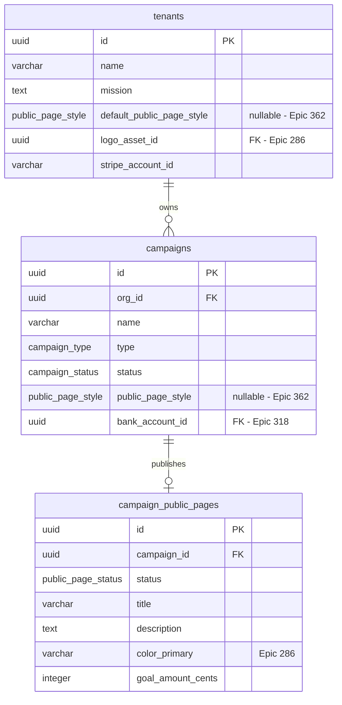

# Public donation page styles — domain doc

> **Status:** canonical (after Epic [#362](https://github.com/purposestack/givernance/issues/362) PRs #386–#389). Replaces the PR-2 stub of the same path.
>
> Related: [Epic #286 — Organisation branding](https://github.com/purposestack/givernance/issues/286) (colour + logo tokens this Epic composes with) · [Epic #39 / PR #197](https://github.com/purposestack/givernance/pull/197) (the public donation page being extended) · [ADR-030](adrs/adr-030-public-page-style-archetypes.md) (architecture — hybrid shell + slots) · [`docs/ideas/public-page-styles-teardown.md`](ideas/public-page-styles-teardown.md) (competitive teardown + archetype briefs) · [`docs/18-feature-flags.md`](18-feature-flags.md) (flag posture)
>
> Companion diagram: [`diagrams/public-page-styles-flow.mmd`](../diagrams/public-page-styles-flow.mmd).

## 0. Why this exists — at a glance

Givernance's public donation page (`/p/[campaignId]`) used to be a single layout. Operators could swap the primary colour + logo via [Epic #286](https://github.com/purposestack/givernance/issues/286), but the structure, typography, and copy rhythm were identical for every NPO. Two donors landing on two different Givernance campaigns could tell they were on the same platform.

This Epic adds **10 deliberately-different visual archetypes** the operator picks from — Foundation, Activist, Editorial Story, Minimal Checkout, Emergency Appeal, Neo-Brutalist, Calm Wellness, Civic Modern, Retro Print, Cosmic Gradient. Each archetype owns *structure / typography / motion*; [Epic #286](https://github.com/purposestack/givernance/issues/286) still owns *colour / logo*. The operator picks **one archetype per campaign**, optionally inheriting from an **org-level default**.

**Scope:** curated catalogue, designer-controlled. **Out of scope:** WYSIWYG editor, per-section style mixing, donor-uploaded media, A/B test framework, AI-suggested archetypes.

## 1. Archetype catalogue

The 10 shipped archetypes, in picker-display order (driven by `PUBLIC_PAGE_STYLE_KEYS` in [`@givernance/shared/constants`](../packages/shared/src/constants/public-page-styles.ts)). Each row links to its HTML mockup + slot brief.

| # | Key | Operator label | Voice | Hero treatment | Mockup |
|---|---|---|---|---|---|
| 1 | `foundation` | **Foundation** *(default)* | Institutional, restrained | Logo + headline + mission · soft gradient | [`public-foundation.html`](design/donations/public-foundation.html) |
| 2 | `activist` | **Activist** | Expressive · recurring-mobilisation | Oversized headline · saturated brand wash · counter strip | [`public-activist.html`](design/donations/public-activist.html) |
| 3 | `editorial-story` | **Editorial Story** | Editorial · photo essay | Full-bleed photo · drop cap · post-scroll form reveal | [`public-editorial-story.html`](design/donations/public-editorial-story.html) |
| 4 | `minimal-checkout` | **Minimal Checkout** | Minimal · trusted-donor | Tiny logo · headline as label · form-only | [`public-minimal-checkout.html`](design/donations/public-minimal-checkout.html) |
| 5 | `emergency-appeal` | **Emergency Appeal** | Expressive · one-time-counter-led | Counter IS hero · time-since-launch banner | [`public-emergency-appeal.html`](design/donations/public-emergency-appeal.html) |
| 6 | `neo-brutalist` | **Neo-Brutalist** | Expressive · type-driven | Hard borders · rotation · mono numerals · serif accent | [`public-neo-brutalist.html`](design/donations/public-neo-brutalist.html) |
| 7 | `calm-wellness` | **Calm Wellness** | Expressive · breath-paced | Animated pastel mesh · lowercase headline · pill chips | [`public-calm-wellness.html`](design/donations/public-calm-wellness.html) |
| 8 | `civic-modern` | **Civic Modern** | Civic · transparency-first | Headline + transparency-stat block · "où va l'argent" expander | [`public-civic-modern.html`](design/donations/public-civic-modern.html) |
| 9 | `retro-print` | **Retro Print** | Editorial · heritage | Riso-duotone · paper grain · dashed borders | [`public-retro-print.html`](design/donations/public-retro-print.html) |
| 10 | `cosmic-gradient` | **Cosmic Gradient** | Expressive · future-facing | Animated gradient mesh · glassmorphism · gradient text-fill | [`public-cosmic-gradient.html`](design/donations/public-cosmic-gradient.html) |

## 2. User flow

```mermaid
sequenceDiagram
  actor Operator as Operator (org_admin)
  actor Donor
  participant Web as Next.js (Settings + /p/[id])
  participant API as Fastify API
  participant Flags as flagService (Redis → PG)
  participant DB as Postgres

  Note over Operator, DB: Operator picks an archetype (PR-3 settings UI)
  Operator->>Web: GET /settings
  Web->>API: GET /v1/feature-flags  (public projection)
  API-->>Web: { donation.public_page_styles: true }
  Web->>API: GET /v1/org/style-default
  API->>Flags: requireFlag(DONATION_PUBLIC_PAGE_STYLES)
  Flags-->>API: enabled (for this tenant)
  API->>DB: SELECT default_public_page_style FROM tenants WHERE id=…
  DB-->>API: 'cosmic-gradient'
  API-->>Web: { defaultPublicPageStyle: 'cosmic-gradient' }
  Web-->>Operator: render picker tile-grid (Cosmic Gradient active)

  Operator->>Web: clicks 'Activist' tile (optimistic flip)
  Web->>API: PATCH /v1/org/style-default { defaultPublicPageStyle: 'activist' }
  API->>DB: UPDATE tenants SET default_public_page_style='activist' WHERE id=…
  API->>API: invalidateTenantPublicPageCache(orgId)
  API-->>Web: 200 { defaultPublicPageStyle: 'activist' }
  Web-->>Operator: toast 'Donation page style set to Activist.'

  Note over Donor, DB: Donor lands on the page
  Donor->>Web: GET /p/{campaignId}
  Web->>API: GET /v1/public/campaigns/{id}/page
  API->>API: cache-check (raw columns; flag-resolution at boundary)
  API->>DB: SELECT campaign + tenant + org logo (joined)
  DB-->>API: campaign.public_page_style=NULL, tenant.default=…='activist'
  API->>Flags: isEnabled(DONATION_PUBLIC_PAGE_STYLES, {orgId})
  Flags-->>API: true
  API->>API: resolve: campaign override ?? tenant default ?? 'foundation'
  API-->>Web: { …, publicPageStyle: 'activist' }
  Web->>Web: dynamic import ARCHETYPES['activist']()
  Web-->>Donor: render Activist shell + slots
```

## 3. Domain model

Two columns + one Postgres enum (migration [`0054_public_page_style_columns.sql`](../packages/api/migrations/0054_public_page_style_columns.sql)). Both nullable so the picker can render an "inherits from…" affordance instead of stamping a default on legacy rows.



The `public_page_style` enum is kept in lockstep with `PUBLIC_PAGE_STYLE_KEYS` via a CI parity test (`packages/api/src/tests/integration/public-page-styles.test.ts`). Adding an archetype is a one-place change in the shared constants file mirrored by a new migration.

## 4. Three-layer resolution

```
campaigns.public_page_style                  /* per-campaign override */
  ?? tenants.default_public_page_style       /* org-level default */
  ?? "foundation"                            /* hardcoded platform default */
```

- A campaign with `public_page_style = NULL` and a tenant with `default_public_page_style = NULL` resolves to `"foundation"`. This matches today's hardcoded layout, so every existing campaign keeps its current look until the operator explicitly picks something else.
- Resolution happens **outside the public-page Redis cache** (`getPublicPage` in `packages/api/src/modules/public/service.ts`). A flag flip is picked up on the very next donor request — no 30 s shadow window after an emergency rollback.
- A defence-in-depth filter (`isPublicPageStyleKey`) drops any stale DB value not in the current registry, so a deprecated archetype removed from the frontend bundle can't 404 the donor's page; the resolution falls all the way back to `"foundation"`.

## 5. Architecture

Hybrid shell + slot components ([ADR-030](adrs/adr-030-public-page-style-archetypes.md)). The shell owns the data fetch, the Stripe Elements + 3DS handling, the a11y scaffolding, and the locale-aware footer. Each archetype contributes four React slots — `Hero`, `Progress`, `AmountPicker`, `Footer` — plus a `tokens` CSS module + a `motion` spec + a shell-controlled `layout` enum value.

Slot inventory (from ADR-030 § Slot Inventory):

| Archetype | `layout` | Hero owns | Progress | Picker mode | Ambient motion |
|---|---|---|---|---|---|
| `foundation` | side-by-side | logo + headline + mission | inline | inline chip grid + write-in | none |
| `activist` | side-by-side | giant headline + tag | inline | 2×2 oversized chips, recurring-first | static gradient |
| `editorial-story` | scroll-reveal | full-bleed photo + drop-cap | post-scroll reveal | inline | none |
| `minimal-checkout` | stacked | tiny logo, no headline | inline above CTA | the page IS the picker | none |
| `emergency-appeal` | stacked | counter IS hero | `null` (merged into Hero) | inline below counter, one-time-first | none |
| `neo-brutalist` | side-by-side | type-driven, no photo | inline | square chips, hard borders | none |
| `calm-wellness` | side-by-side | lowercase headline + soft wash | inline | pill chips, generous whitespace | low-amplitude SVG morph (≤ 0.1 Hz, `reduced-ok`) |
| `civic-modern` | side-by-side | headline + transparency-stat | inline | inline chips + "where does it go?" expander | none |
| `retro-print` | side-by-side | duotone logo + stamped headline | inline | stamped-postcard chips | none |
| `cosmic-gradient` | scroll-reveal | headline floats over animated mesh | post-scroll reveal | glassmorphism chips | animated gradient mesh (≤ 0.5 Hz, `reduced-ok`) |

The `motion` spec is shell-enforced: `prefers-reduced-motion`, `prefers-reduced-data`, and `navigator.connection.saveData` all halt ambient motion and short-circuit the easter-egg hook. WCAG 2.2.2 level A: no archetype currently uses `requires-pause-control`; that value exists in the type to force future proposals through review.

## 6. API contract

| Method | URL | Purpose | Flag posture |
|---|---|---|---|
| `GET` | `/v1/public/campaigns/:id/page` | Donor-facing payload — includes resolved `publicPageStyle` (`null` when flag is off) | Field-level; route unauthenticated, always open |
| `GET` | `/v1/campaigns/:id/public-page` | Admin view; response includes raw `publicPageStyle` (`null` = inherits from tenant) | Always returned; field-level posture |
| `PUT` | `/v1/campaigns/:id/public-page` | Admin upsert; tri-state `publicPageStyle` (`undefined` = leave untouched, `null` = clear, `<key>` = set) | Field-level 400 when flag off + field in body. Legacy fields unaffected |
| `GET` | `/v1/org/style-default` | Org-level default (read) | `requireFlag(...)` as FIRST preHandler → 404 when off |
| `PATCH` | `/v1/org/style-default` | Org-level default (write); bulk-invalidates per-tenant public-page cache | Same gate; second preHandler is `requireOrgAdmin` |

URL convention: `/v1/org/…` for caller-scoped self-service (matches `/v1/org/feature-flags` from [Epic #365](https://github.com/purposestack/givernance/issues/365)). The `/v1/tenants/:orgId/…` shape is reserved for platform-admin or tenant-id-scoped routes.

## 7. Permissions matrix

| Role | Read campaign style | Write campaign style | Read tenant default | Write tenant default |
|---|---|---|---|---|
| `super_admin` | ✅ (via tenant impersonation or admin route) | ✅ | ✅ | ✅ |
| `org_admin` | ✅ | ✅ | ✅ | ✅ |
| `user` | ✅ (read-only on the admin GET) | ❌ (403) | ❌ (403) | ❌ (403) |
| Unauthenticated donor | ✅ via the resolved value on `/v1/public/…` | n/a | n/a | n/a |

All `403` paths use the codebase's anti-disclosure 404 *only when the flag itself is off* — i.e. when the route should appear not to exist. When the flag is on but the caller lacks the role, the response is `403`, not `404`. See `docs/18-feature-flags.md` § 0 for the rationale.

## 8. Feature-flag posture

| Flag key | Default | Scope | Tenant override | Public projection |
|---|---|---|---|---|
| `donation.public_page_styles` | `off` | `tenant` | `false` (super-admin only for the initial rollout) | `true` (settings UI + campaign editor SSR-fetch to decide whether to render the picker) |

Emergency rollback: [`docs/runbooks/feature-flag-rollback.md`](runbooks/feature-flag-rollback.md). Donor-facing flag-resolution lives outside the cached payload; `UPDATE feature_flags SET enabled = false …` is picked up by donors on the next request.

## 9. Privacy / GDPR posture

- The `publicPageStyle` value is a non-PII enum.
- The *presence or absence* of the field on the donor-facing endpoint leaks one bit per tenant (flag on / off) to anyone scraping the public page. This is intentional — the flag is `public=true` so the picker UI in `/settings` can decide whether to render itself. The flag NAME (`donation.public_page_styles`) is descriptive but doesn't tease an unannounced surprise.
- The `org_id` join used to resolve the per-tenant flag state runs through the existing public-page query path — no new join, no new data path.
- The easter-egg hook (`useEasterEgg`) MUST NOT log, persist, or POST any listener input (keystrokes, click coordinates). Donor input on a public page is a GDPR-adjacent risk; the hook is the choke point and enforces this by contract.
- Easter-egg side-effects are visual-only — no `aria-live` announcement, no focus shift, no DOM injection into the form region. Egg containers are `aria-hidden="true"` and appended outside `<main>`.

## 10. How to add a new archetype

1. **Pitch + visual** — write a brief in `docs/ideas/public-page-styles-teardown.md` § 2 (voice, typography pairing, hero treatment, picker mode). Add an HTML mockup at `docs/design/donations/public-<key>.html` matching the conventions of the existing 10. Honour the WCAG contract: real radio inputs for amount chips, `:focus-visible` rings, `prefers-reduced-motion` guards, `lang="fr"` on FR strings, NBSP for thousands separators, `tabular-nums` on numeric surfaces, `aria-valuetext` on progressbars.
2. **Slot inventory update** — add a row to ADR-030 § Slot Inventory mapping the archetype to `Hero` / `Progress` / `AmountPicker` / `Footer` + the `layout` enum value + the `motion.ambient` declaration. If the archetype needs a 5th slot, **stop** — amend the slot contract in a separate PR before the archetype lands (ADR-030 § Revisit if).
3. **Shared registry** — add the key to `PUBLIC_PAGE_STYLE_KEYS` (picker-display order matters; don't sort alphabetically) and `PUBLIC_PAGE_STYLE_REGISTRY` in [`packages/shared/src/constants/public-page-styles.ts`](../packages/shared/src/constants/public-page-styles.ts).
4. **Postgres enum** — ship a new migration `00NN_<key>_public_page_style.sql` that does `ALTER TYPE public_page_style ADD VALUE '<key>'`. **Never modify migration 0054.** The CI parity test will fail if the enum drifts from the constants.
5. **React module** — create `packages/web/src/archetypes/<key>/index.tsx` exporting a default `ArchetypeModule`. Implement the four slots in sibling files; bundle ≤ 12 KB gzipped (ADR-030 § Bundle-size budget). No `framer-motion` / `gsap` / `lottie-*` — Biome `noRestrictedImports` enforces. CSS `@keyframes` + raw SVG only.
6. **Registry wiring** — flip the archetype's entry in [`packages/web/src/archetypes/registry.ts`](../packages/web/src/archetypes/registry.ts) from the Foundation fallback to its own dynamic import.
7. **Easter egg (optional)** — wire `motion.easterEgg` to a `EasterEggSpec` using one of the supported trigger kinds (`konami`, `click-region`, `click-count`, `triple-click`, `hover-and-hold`). The egg's `Render` component MUST be `aria-hidden`. Do not introduce new trigger kinds without amending `EasterEggSpec` in [`types.ts`](../packages/web/src/archetypes/types.ts) — adding a trigger is a slot-contract change.
8. **Tests** — Playwright screenshot test (desktop + mobile, en + fr), reduced-motion screenshot, axe-core integration, Lighthouse mobile ≥ 90 Performance / ≥ 95 Accessibility, bundle-size assertion ≤ 12 KB gz.
9. **Picker visibility** — when the archetype lands, remove its "Coming soon" affordance from the picker UI in [`public-page-style-picker.tsx`](../packages/web/src/components/settings/public-page-style-picker.tsx) (or remove the per-archetype feature flag, whichever guard the PR-4b posture-fix chose).

## 11. Out of scope (forever)

- **WYSIWYG / drag-and-drop builder** — the picker is a curated catalogue, not a Wix-style editor.
- **Per-section style mixing** — each campaign picks one archetype.
- **Donor-uploaded media** — photos are operator-side, via [Epic #286](https://github.com/purposestack/givernance/issues/286).
- **A/B testing across archetypes for the same campaign** — the operator picks one.
- **AI-suggested archetypes** — out of scope until we have shipped data on archetype→outcome correlation.

## 12. Open questions / future work

- **Voice taxonomy** — 5 archetypes carry `voice: "expressive"` in the registry; the picker's voice-quadrant grouping is therefore lopsided. Iterate against operator picker usage in Phase 2.
- **FR localisation of archetype labels** — "Foundation", "Activist", etc. are English-only proper nouns in the shared registry today. Add a translation layer if FR operators report friction.
- **Faith / heritage archetype** — not in the initial 10; the teardown flagged this as a real European NPO segment ([teardown § 2.1](ideas/public-page-styles-teardown.md)). Candidate for a Phase 2 addition once the existing 10 are in operator hands.
- **Per-campaign picker in the campaign editor** — PR-3 only ships the org-level picker; the per-campaign override exists on the API surface and the schema but doesn't have a UI yet. PR-3b lands it as the campaign editor grows.
