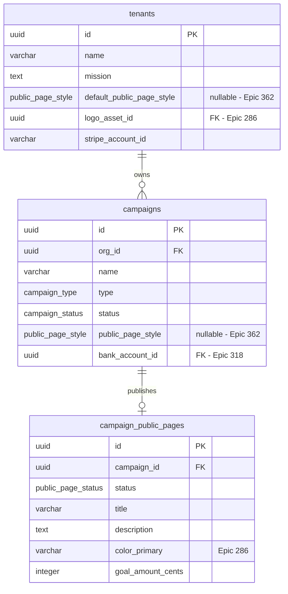

# Public donation page styles — domain stub

> **Stub doc, ships with [Epic #362](https://github.com/purposestack/givernance/issues/362) PR-2.** The full canonical doc — visual mockup gallery, full archetype-to-slot mapping, permissions matrix populated against the picker UI, Mermaid user-flow diagram, GDPR posture — lands with PR-5 of the Epic. This stub covers the schema + API surface that exist *today* (after PR-2) so the spec is reviewable now rather than waiting for the picker UI.
>
> Related: [Epic #286 — Organisation branding](https://github.com/purposestack/givernance/issues/286) (colour + logo tokens this Epic composes with) · [Epic #39 / PR #197](https://github.com/purposestack/givernance/pull/197) (the public donation page being extended) · [ADR-030](adrs/adr-030-public-page-style-archetypes.md) (architecture) · [docs/ideas/public-page-styles-teardown.md](ideas/public-page-styles-teardown.md) (competitive teardown + the 10-archetype shortlist) · [docs/18-feature-flags.md](18-feature-flags.md) (flag posture)

## 0. Why this exists — at a glance

Givernance's public donation page (`/p/[campaignId]`) used to be a single layout. Operators could swap the primary colour + logo via Epic #286, but the structure, typography, and copy rhythm were identical for every NPO. Two donors landing on two different Givernance campaigns could tell they were on the same platform.

This Epic adds **10 deliberately-different visual archetypes** the operator picks from — Foundation, Activist, Editorial Story, Minimal Checkout, Emergency Appeal, Neo-Brutalist, Calm Wellness, Civic Modern, Retro Print, Cosmic Gradient. Each archetype owns *structure / typography / motion*; Epic #286 still owns *colour / logo*. The operator picks **one archetype per campaign**, optionally inheriting from an **org-level default**. Donors stop perceiving Givernance pages as a uniform template.

**Scope:** curated catalogue, designer-controlled. **Out of scope:** WYSIWYG editor, per-section style mixing, donor-uploaded media, A/B test framework. These are tracked in the Epic's `## 4. Out of scope` section.

## 1. Schema (after PR-2)

Two columns + one Postgres enum, added by migration [`0054_public_page_style_columns.sql`](../packages/api/migrations/0054_public_page_style_columns.sql). Both columns are nullable so the picker can render an "inherits from…" affordance instead of implicitly stamping a value on legacy rows.



The `public_page_style` enum (kept in lockstep with `PUBLIC_PAGE_STYLE_KEYS` in [`@givernance/shared/constants`](../packages/shared/src/constants/public-page-styles.ts) via a CI parity test):

```
foundation | activist | editorial-story | minimal-checkout | emergency-appeal
| neo-brutalist | calm-wellness | civic-modern | retro-print | cosmic-gradient
```

## 2. Resolution rule

The donor-facing API returns the archetype after a **three-layer fallback**:

```
campaigns.public_page_style
  ?? tenants.default_public_page_style
  ?? "foundation"  /* platform-wide default; matches today's layout */
```

A campaign with `public_page_style = NULL` and a tenant with `default_public_page_style = NULL` resolves to `"foundation"` — the institutional layout that shipped before this Epic, so existing campaigns keep their current look unless the operator explicitly picks something else.

The resolved value is computed **outside the public-page Redis cache** (`packages/api/src/modules/public/service.ts → getPublicPage`), so a super-admin flipping the feature flag is picked up on the very next request rather than being shadowed by a 30 s cache window.

A defence-in-depth filter (`isPublicPageStyleKey`) drops any stale DB value not in the current registry — so a deprecated archetype removed from the frontend bundle can't return `null`-the-page on the donor; the resolution falls all the way back to `"foundation"` instead.

## 3. API contract (after PR-2)

| Method | URL | Purpose | Flag posture |
|---|---|---|---|
| `GET` | `/v1/public/campaigns/:id/page` | Donor-facing page payload — includes resolved `publicPageStyle` (`null` when flag is off) | Field-level; route is unauthenticated and always open |
| `GET` | `/v1/campaigns/:id/public-page` | Admin view; response includes raw `publicPageStyle` (`null` = inherits from tenant) | Always returned to authenticated admins; field is `null` when not set |
| `PUT` | `/v1/campaigns/:id/public-page` | Admin upsert; accepts tri-state `publicPageStyle` (`undefined` = leave untouched, `null` = clear, `<key>` = set) | Field-level 400 when flag off + field in body. Legacy fields unaffected |
| `GET` | `/v1/org/style-default` | Org-level default (read) | `requireFlag(...)` as FIRST preHandler → 404 when off |
| `PATCH` | `/v1/org/style-default` | Org-level default (write); bulk-invalidates per-tenant public-page cache | Same gate; second preHandler is `requireOrgAdmin` |

URL convention: `/v1/org/…` for caller-scoped self-service (matches `/v1/org/feature-flags` from [Epic #365](https://github.com/purposestack/givernance/issues/365)). The `/v1/tenants/:orgId/…` shape is reserved for platform-admin or tenant-id-scoped routes.

## 4. RBAC (after PR-2)

| Role | Read campaign style | Write campaign style | Read tenant default | Write tenant default |
|---|---|---|---|---|
| `super_admin` | ✅ (via tenant impersonation or admin route) | ✅ | ✅ | ✅ |
| `org_admin` | ✅ | ✅ | ✅ | ✅ |
| `user` | ✅ (read-only on the admin GET) | ❌ (403) | ❌ (403) | ❌ (403) |
| Unauthenticated donor | ✅ via resolved value on `/v1/public/...` | n/a | n/a | n/a |

All `403` paths use the codebase's anti-disclosure 404 *only when the flag itself is off* — i.e. when the route should appear not to exist. When the flag is on but the caller lacks role, the response is `403`, not `404`. See [docs/18-feature-flags.md § 0](18-feature-flags.md) for the rationale.

## 5. Feature-flag posture

| Flag key | Default | Scope | Tenant override | Public projection |
|---|---|---|---|---|
| `donation.public_page_styles` | `off` | `tenant` | `false` (super-admin only for the initial rollout) | `true` (settings UI + campaign editor SSR-fetch to decide whether to render the picker) |

Emergency rollback: [`docs/runbooks/feature-flag-rollback.md`](runbooks/feature-flag-rollback.md). Since PR-2 the donor-facing flag-resolution moved out of the cached payload — a `UPDATE feature_flags SET enabled = false …` is picked up by donors on the next request, not after the 30 s cache window.

## 6. Privacy / GDPR posture

- The `publicPageStyle` value is a non-PII enum.
- The *presence or absence* of the field on the donor-facing endpoint leaks one bit per tenant (flag on / off) to anyone scraping the public page. This is intentional — the flag is `public=true` so the picker UI in the settings page can decide whether to render itself. The flag NAME (`donation.public_page_styles`) is descriptive but doesn't tease an unannounced surprise.
- The `org_id` join used to resolve the per-tenant flag state runs through the existing public-page query path — no new join, no new data path.
- No donor input (keystrokes, click coordinates) is logged by the easter-egg hook (per [ADR-030 § Motion policy](adrs/adr-030-public-page-style-archetypes.md#motion-policy--ambient-and-easter-egg)).

## 7. Out of scope for the canonical doc (lands in PR-5)

PR-2 ships the schema + API surface. The remaining sections of the canonical doc — the picker UX flow diagram, the per-archetype slot mapping (with screenshots), the visual-regression test matrix, the "how to add a new archetype" guide, the cross-link from [`docs/14-screen-inventory.md`](14-screen-inventory.md), the operator-runbook "how to pick" — all land with PR-5 of the Epic, alongside the implementation they document.

If you're reviewing PR-2 and want the long form of the operator-side picker UX, read the [teardown doc](ideas/public-page-styles-teardown.md). If you want the architecture, read [ADR-030](adrs/adr-030-public-page-style-archetypes.md). This file is the schema + API contract only.
