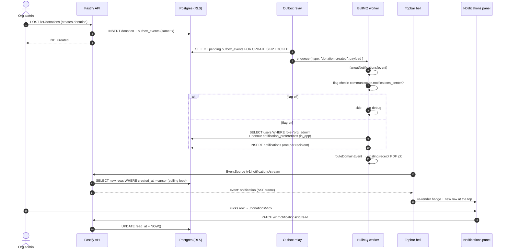
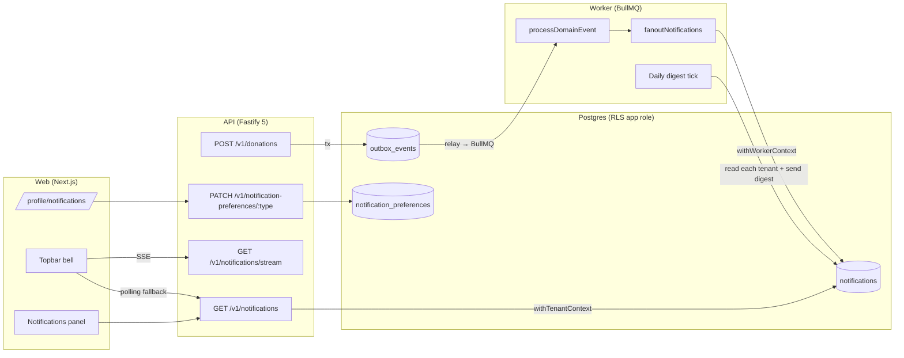
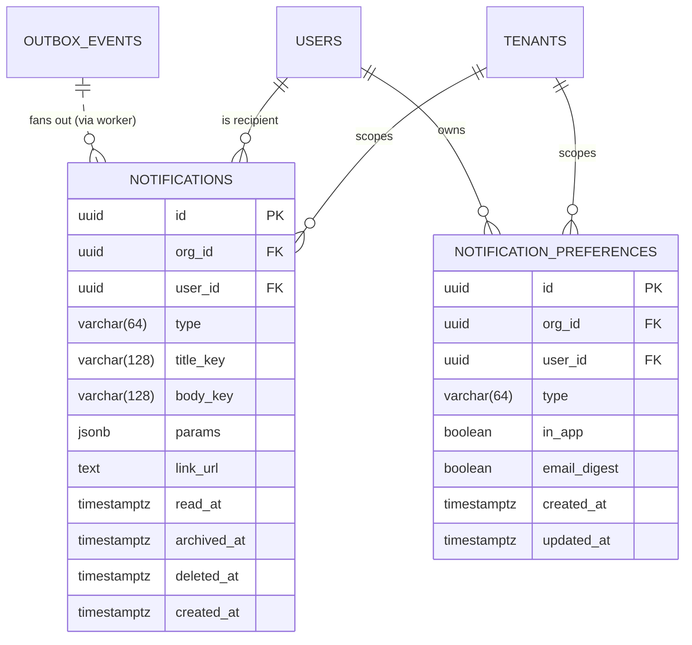

# 27 — In-app Notification Centre (GLO-004)

> Related: [`docs/14-screen-inventory.md`](14-screen-inventory.md) GLO-004, [`docs/17-log-management.md`](17-log-management.md), [`docs/18-feature-flags.md`](18-feature-flags.md), [`docs/adrs/adr-031-notifications-delivery-and-fanout.md`](adrs/adr-031-notifications-delivery-and-fanout.md), [`diagrams/notifications-flow.mmd`](../diagrams/notifications-flow.mmd), [Epic #363](https://github.com/purposestack/givernance/issues/363).
>
> Migration that ships the schema: [`packages/api/migrations/0055_notifications_center.sql`](../packages/api/migrations/0055_notifications_center.sql).
> Feature flag: `communication.notifications_center` (default off, scope `tenant`).

## 0. Why this exists — at a glance

Givernance's async surface area is growing — postal exports (Epic #274), branding pipelines (Epic #286), Swiss QR-bill bank reconciliation (Epic #318), bulk emails (Epic #326). Each of these produces work the operator initiated and now wants to know about: "did the export finish?", "did the donation come through?", "did the invitee actually accept?". The audit log already records these events but is tenant-wide and admin-only. **There is no per-user, per-event signal anywhere in the product today.**

This Epic ships the missing surface: a topbar bell with an unread badge, a side panel listing recent events filtered by category, per-user preferences for which alerts to receive and on which channel (in-app / email digest), and real-time delivery via SSE with a polling fallback.

The architecture leans on infrastructure already proven in production: the transactional outbox + BullMQ worker (Epic #274, #286, #326), the feature-flag scaffolding (Epic #326, #365), and the RLS / soft-delete patterns (ADR-021). Adding this surface is a fan-out at the worker, a single Fastify module, a topbar component, and a settings sub-page — no new infrastructure, no new tools.

A future `docs/27` revision will fold AI aggregation ("3 similar grant-deadline alerts grouped"), push notifications, and SMS into the same model; those are explicitly out of scope for this Epic and live in [§ 7](#7-out-of-scope).

## 1. End-to-end user flow

The shipped MVP covers six notification types — one per "thing an operator initiated that runs async":

| Type | Producer event | Recipients | Visual | Default in-app | Default email digest |
|---|---|---|---|---|---|
| `donation.received` | `donation.created` | every `org_admin` of the tenant | donation (green) | on | off |
| `invitation.created` | `invitation.created` | every `org_admin` of the tenant | team (indigo) | on | off |
| `invitation.resent` | `invitation.resent` | every `org_admin` of the tenant | team (indigo) | off | off |
| `branding.logo_synced` | `branding.activate_logo` | every `org_admin` of the tenant | system (sky) | on | off |
| `postal_export.queued` | `campaign.postal_export_requested` | requester (fallback: org_admins) | system (sky) | on | off |
| `bulk_email.queued` | `communication.bulk_email_requested` | requester (fallback: org_admins) | team (indigo) | on | off |

### Off-state behaviour (flag off)

- Topbar has no bell icon at all (off-state QA per `feedback_feature_flag_first`).
- `/v1/notifications*` + `/v1/notification-preferences*` routes return 404 (anti-disclosure — same posture as `/v1/constituents/bulk-email`).
- `/profile/notifications` returns 404 (the page itself re-checks the flag SSR).
- Outbox-fanout worker silently no-ops on every event.
- Email-digest BullMQ tick reads the flag, sees off, returns.

## 2. Architecture overview

### Code boundaries

| Concern | Package | File(s) |
|---|---|---|
| Schema (Drizzle) | `packages/shared/src/schema/notifications.ts` | `notifications`, `notification_preferences` |
| Type registry | `packages/shared/src/constants/notifications.ts` | `NOTIFICATION_TYPE_VALUES`, `NOTIFICATION_TYPE_REGISTRY` |
| Feature flag | `packages/shared/src/constants/feature-flags.ts` | `COMMUNICATION_NOTIFICATIONS_CENTER` |
| Migration | `packages/api/migrations/0055_notifications_center.sql` | seed + table + RLS |
| Fanout producer | `packages/worker/src/processors/notifications-fanout.ts` | `fanoutNotifications`, `planFanout` |
| Worker wiring | `packages/worker/src/worker.ts` | `processDomainEvent` calls fanout first |
| Email digest job | `packages/worker/src/processors/notifications-email-digest.ts` | `processNotificationsEmailDigest` |
| API routes | `packages/api/src/modules/notifications/routes.ts` | REST + SSE |
| API service | `packages/api/src/modules/notifications/service.ts` | list + cursor + RLS reads |
| Web service | `packages/web/src/services/NotificationsService.ts` | API client wrapper |
| Web live hook | `packages/web/src/components/notifications/use-notifications-live.ts` | SSE + polling fallback |
| Topbar bell | `packages/web/src/components/notifications/notifications-bell.tsx` | trigger + badge |
| Panel | `packages/web/src/components/notifications/notifications-panel.tsx` | filter chips + rows |
| Preferences page | `packages/web/src/app/(app)/profile/notifications/page.tsx` | SSR + form |
| Preferences form | `packages/web/src/components/notifications/notification-preferences-form.tsx` | optimistic checkboxes |

## 3. Data model

### Field rationale

- **`type` is `varchar(64)`** with a CHECK constraint on shape (`^[a-z][a-z0-9_]*(\.[a-z][a-z0-9_]*)+$`), NOT a Postgres enum. Adding a new type is a code change + producer wiring, never a migration.
- **`(title_key, body_key, params)` instead of frozen `text`** — i18n resolution at READ time. A French recipient sees French regardless of the worker's session locale.
- **`link_url` is a relative path** (CHECK `link_url LIKE '/%'`). Frontend prepends `APP_URL`. Absolute URLs would break for tenants on custom subdomains (Epic #279 follow-up).
- **`deleted_at` (soft-delete)** per `feedback_soft_delete_universal` — a panel "delete" sets the column; the row stays for audit + GDPR DSR replay.
- **Partial index `(user_id) WHERE read_at IS NULL AND deleted_at IS NULL`** keeps the bell badge query O(log N) on a noisy tenant.

### Recipient resolution

The worker's `planFanout(event)` resolves recipients per the table in [§ 1](#1-end-to-end-user-flow). For "specific user" rules (postal export, bulk email), the payload carries `requestedBy` — if absent (older events, super-admin actions), the rule falls back to "all org_admins". A user with `notification_preferences.in_app = false` for the type is silently dropped at write time so the worker doesn't pile rows onto an opted-out user.

## 4. Permissions matrix

| Endpoint | Method | Flag | Guard | Notes |
|---|---|---|---|---|
| `/v1/notifications` | GET | `communication.notifications_center` | `requireAuth` | Lists caller's own rows. RLS isolates tenant; service filters `user_id = currentUserId`. |
| `/v1/notifications/unread-count` | GET | `communication.notifications_center` | `requireAuth` | Caller-scoped count. |
| `/v1/notifications/:id/read` | PATCH | `communication.notifications_center` | `requireAuth` | Caller-scoped — 404 if not owned. Idempotent. |
| `/v1/notifications/read-all` | POST | `communication.notifications_center` | `requireAuth` | Idempotent — returns count of rows touched. |
| `/v1/notifications/:id` | DELETE | `communication.notifications_center` | `requireAuth` | Soft-delete (sets `deleted_at`). |
| `/v1/notifications/stream` | GET | `communication.notifications_center` | `requireAuth` | SSE. Heartbeat every 25 s. Resumes from `Last-Event-ID`. |
| `/v1/notification-preferences` | GET | `communication.notifications_center` | `requireAuth` | Returns the closed set (every registered type), defaults merged in. |
| `/v1/notification-preferences/:type` | PATCH | `communication.notifications_center` | `requireAuth` | Upsert (idempotent). Body `{ inApp, emailDigest }`. |
| `/profile/notifications` | GET | `communication.notifications_center` | requireAuth (SSR) | 404 if flag off. |

Flag gate runs FIRST per the canonical `[requireFlag, requireRole]` pattern from `docs/18-feature-flags.md` § 6.1 — a scanner can't enumerate gated routes by their auth requirement.

## 5. GDPR posture

The notification surface is per-user data; GDPR Articles 5, 15, 17 apply.

- **PII in the row body**: NEVER. `params` carries opaque identifiers (donation id, campaign id, invitation id) and non-sensitive counters (`amountCents`, `currency`). Donor names / emails are dereferenced client-side via `link_url`. A constituent deleted via GDPR DSR (Epic #21 / ADR-021) does NOT leave their name frozen in the panel — the link target itself filters on `deleted_at IS NULL`.
- **Soft-delete**: a panel "Dismiss" sets `deleted_at`; the row stays for the audit chain. A future GDPR DSR purge step (out of scope for this Epic — tracked under ADR-021 cleanup) hard-deletes notifications whose `user_id` matches the erased account.
- **User-rights export** (Art. 15): the existing `/v1/users/me` GDPR-snapshot export adds `notifications` + `notification_preferences` to its payload in a follow-up — tracked alongside ADR-021's universal export schema.
- **User-rights erasure** (Art. 17): on user purge the FK `users.id → notifications.user_id` is `ON DELETE SET NULL`, so historical rows are orphaned (kept for tenant audit) but no longer attribute to an identified person. `notification_preferences.user_id → users.id` is `ON DELETE CASCADE` since the preferences are personal-only and don't carry audit value once the user is gone.
- **Cross-tenant isolation**: RLS keys `notifications.org_id` to `app.current_organization_id` (FORCE ROW LEVEL SECURITY). The worker writes under `withWorkerContext(tenantId)`; the API reads under `withTenantContext(orgId)`. A cross-tenant SELECT returns zero rows even with a hand-crafted SQL injection — the partial unique on the GUC is the durable boundary.
- **Audit log**: every PATCH / POST / DELETE on `/v1/notifications*` is auto-recorded by the existing `plugins/audit.ts` plugin (impersonation context propagates per `project_impersonation_two_modes` — both the impersonator and the impersonated user land in the audit row).

## 6. Implementation phases

The Epic ships in one PR:

1. **Step 0 — feature flag**: register `communication.notifications_center` in the shared registry; seed via migration. Every new route + worker job pickup + web surface gates on it.
2. **Phase 1 — schema + outbox subscriber + REST API**: migration 0055 creates the two tables + RLS + indices. Worker's `fanoutNotifications` runs alongside `routeDomainEvent` for every outbox event. API exposes list / unread-count / mark-read / mark-all-read / soft-delete.
3. **Phase 2 — topbar bell + panel**: `NotificationsBell` mounts when the SSR-resolved flag is on; `NotificationsPanel` matches the GLO-004 mockup (filter chips, accent bars, mark-all-read, click-through). Polling fallback at 30 s.
4. **Phase 3 — preferences page**: `/profile/notifications` (every authenticated role; not `/settings/*` which is org-admin only). Optimistic upsert.
5. **Phase 4 — SSE delivery**: `/v1/notifications/stream` (`text/event-stream`). EventSource client swaps polling for SSE; falls back automatically on error. `Last-Event-ID` resume.
6. **Phase 5 — email digest (opt-in)**: BullMQ recurring job at 09:00 UTC daily. Reads each tenant's opted-in users + their unread rows since the cursor, sends one digest per recipient via `defaultEmailSender`. Templates are minimal text/HTML — per-user locale + per-tenant DKIM are explicit follow-ups (see § 7).
7. **Phase 6 — docs**: this doc + ADR-031 + flow diagram + CLAUDE.md file-tree update.

## 7. Out of scope

The Epic explicitly does NOT ship:

- **Push notifications (mobile / browser Web Push)** — opt-in re-engagement is non-trivial; deferred.
- **SMS notifications** — `ff.sms_notifications` placeholder exists in `docs/04-business-capabilities.md`; not in this Epic.
- **AI aggregation** ("3 similar grant-deadline alerts grouped") — listed as future enhancement in GLO-004 spec.
- **Cross-org notifications for super-admins** — Back Office is the cross-org surface; the panel is tenant-scoped.
- **Per-tenant DKIM / sending domain for the email digest** — depends on Epic #279.
- **Per-user locale resolution for the email digest body** — current digest renders English. Follow-up wires the same i18n keys the panel uses.
- **HTML templating with the tenant logo in the email digest** — same dependency on Epic #279 / tenant branding propagation to email.
- **`LISTEN/NOTIFY` for the SSE generator's internal loop** — current polling at 5 s is acceptable for the shipped MVP; ADR-031 § Revisit if calls out the migration trigger.
- **Re-routing notifications when a user is offboarded** — handled by tenant-offboarding flow, not this Epic.
- **Archive management UI** — the column exists; surfacing it is a small follow-up.

## 8. Acceptance — per Epic #363

- [x] `communication.notifications_center` flag registered + seeded; every new route protected with `requireFlag(...)` as the first preHandler; every dependent UI surface and worker job pickup gated; off-state QA done.
- [x] Spike ADR merged ([`docs/adrs/adr-031`](adrs/adr-031-notifications-delivery-and-fanout.md)).
- [x] `notifications` table + RLS shipped, with passing isolation tests.
- [x] At least 5 event producers wired (donation, invitation × 2, branding activation, postal export, bulk email).
- [x] Topbar bell + panel match the mockup.
- [x] Preferences page live.
- [x] SSE delivery shipped + polling fallback in place.
- [x] `docs/27-notifications.md` + ERD + permissions matrix + GDPR section (this file).
- [x] CLAUDE.md updated.
