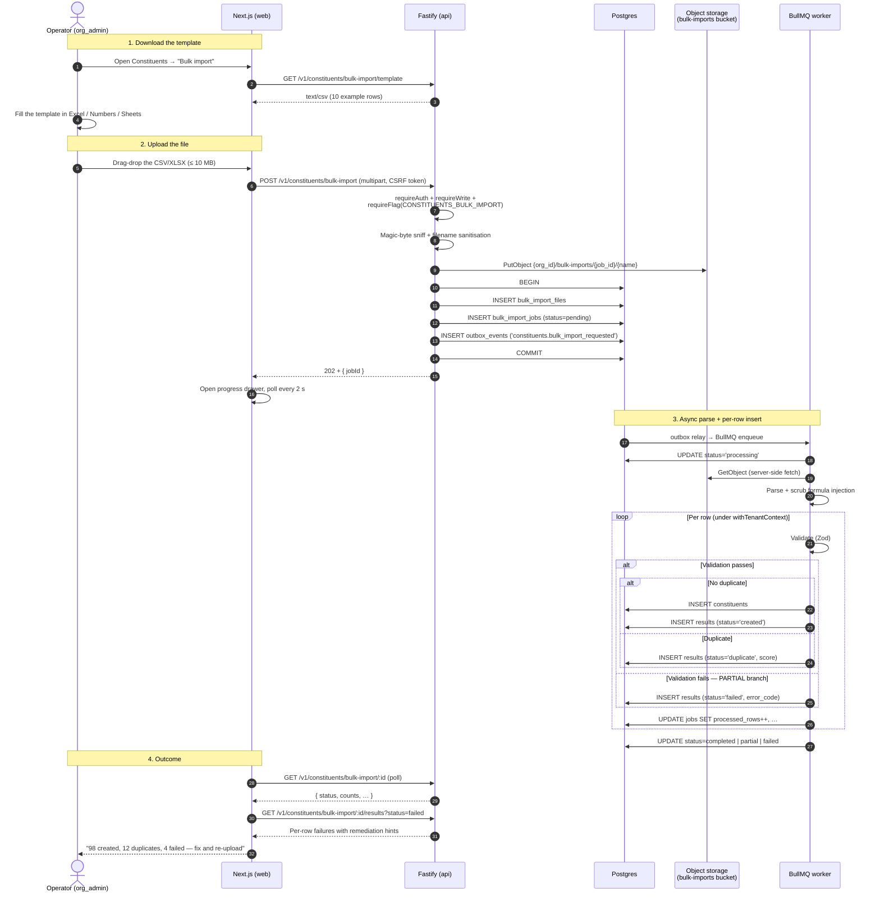
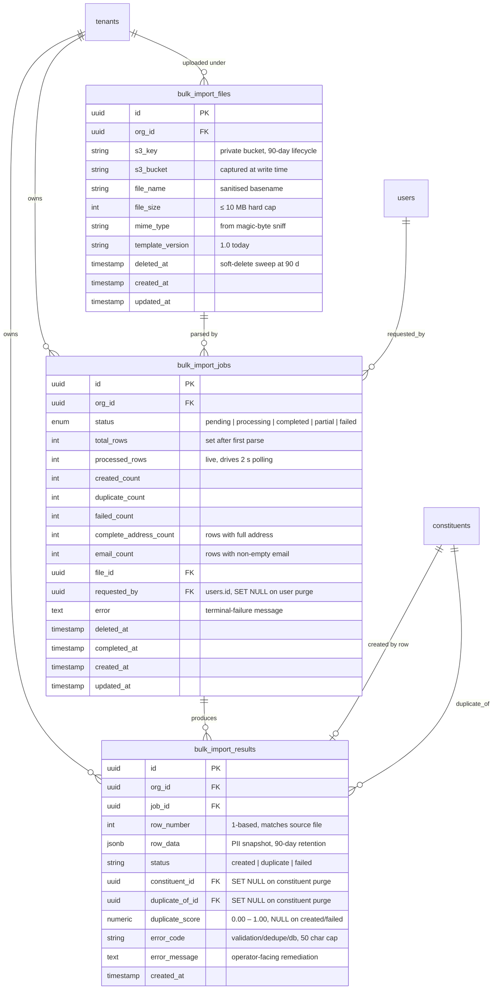

# 28 — Bulk Import Constituents

> **Status**: Implemented — Epic #373, PR #385
> **Owner**: MVP Engineer
> **Related**: [`docs/04-business-capabilities.md`](04-business-capabilities.md) §2.1 Constituent 360 · [`docs/15-infra-adr.md` ADR-011](15-infra-adr.md) (frontend/backend boundary, CSRF on multipart) · [`docs/15-infra-adr.md` ADR-023 amendment](adrs/adr-023-object-storage-bucket-topology.md) (new `bulk-imports` private bucket) · [`docs/06-security-compliance.md`](06-security-compliance.md) (RLS posture, audit conventions) · [`docs/18-feature-flags.md`](18-feature-flags.md) (`constituents.bulk_import` gate)
> **Companion diagram**: [`diagrams/bulk-import-flow.mmd`](../diagrams/bulk-import-flow.mmd) — full operator → API → worker → results sequence
> **Closes**: #373

## 0. Why this exists — at a glance

Every NPO that lands on Givernance arrives with a **list of donors** somewhere — a Salesforce export, a HelloAsso CSV, a 2000-row Excel from the previous treasurer's laptop, a stack of paper forms an intern just retyped. Without bulk import, the only way to onboard those contacts is the "New constituent" form, one record at a time. A small NPO with 800 donors faces ~13 hours of manual typing before they can even start using the product — long enough that prospects walk away during the trial.

Bulk Import Constituents ships the **CSV / Excel onboarding ramp** as a first-class feature so an operator can:

1. **Download a documented template** (CSV with 10 example rows) showing exactly which fields Givernance expects and which are optional.
2. **Upload a filled file** (CSV or `.xlsx`, ≤ 10 MB) and watch a live progress view as the platform parses, deduplicates, and inserts every row under the tenant's RLS context.
3. **Read the outcome per row** — created, deduped (with a similarity score), or rejected (with an `error_code` + remediation hint) — and re-upload a corrected file as many times as they need.

Three properties are load-bearing:

- **GDPR-bounded audit trail.** Every upload leaves a `bulk_import_files` + `bulk_import_jobs` + `bulk_import_results` triplet that names who uploaded what, when, and what the outcome was — satisfying Art. 5(2) accountability when a donor later asks "where did you get my data?". The audit rows survive the 90-day file retention (the file is purged, the metadata stays).
- **Duplicate-protection as CRM hygiene.** Re-uploading the same file (or a near-duplicate row) does not silently double a donor's footprint. The dedupe step is part of the contract, not an afterthought — see § 3.
- **Tenant-isolated end-to-end.** The S3 prefix is `{org_id}/…`, the BullMQ job runs under `withTenantContext`, every new table is `FORCE ROW LEVEL SECURITY`. A bug that leaks one tenant's CSV onto another tenant's screen has to fail four independent checks at once.

The MVP scope is deliberately narrow — **create-only**, no field mapping UI, no resumable import, no AI normalisation — see § 7 for the explicit non-goals.

## 1. User flow

> Canonical companion: [`diagrams/bulk-import-flow.mmd`](../diagrams/bulk-import-flow.mmd). The diagram below is the doc-embedded copy; if they drift, the `.mmd` file is the source of truth.

**Happy-path terminal state**: `status='completed'` — every parsed row landed as either `created` or `duplicate`; zero `failed`.

**Partial-failure branch** (numbered step 3 above, "Validation fails"): when at least one row passes validation **and** at least one row fails, the worker flips the job to `status='partial'` instead of `completed`. The operator's progress drawer renders the same UI either way (counts table + per-row results), but the headline state and the post-import toast both make the partial outcome explicit ("4 rows could not be created — see details"). The operator's next step is the same: open the failed-results panel, copy the `error_code` + `error_message`, edit the source file, re-upload. Re-upload is **not** a "resume" — it's a fresh job; the dedupe step makes that safe (rows that did land the first time are flagged `duplicate` on the second run).

`status='failed'` is reserved for **terminal-on-the-whole-file** errors: the file is unreadable, the MIME-sniff doesn't match a supported type, S3 is unreachable. A failed job carries an `error` text column (top-level on `bulk_import_jobs`) instead of per-row failures.

## 2. Domain model

### Why three tables, not one

A flatter "one row per job, every result inline in a JSONB array" shape would have been cheaper to write but breaks three things this design needs:

- **Re-download of the uploaded file.** The `bulk_import_files` row owns the S3 pointer independently of the parsing outcome, so the operator can re-download the file even on a `failed` job (or after a retry).
- **Per-row filtering and pagination** on the results panel. The UI shows "show me only the 4 failed rows out of 800" — a SQL `WHERE status='failed'` against `bulk_import_results` is the obvious shape; pulling and filtering an 800-element JSONB on every poll is not.
- **GDPR cascade clarity.** `ON DELETE SET NULL` for `constituent_id` / `duplicate_of_id` keeps the audit row intact when the constituent is hard-deleted; the link drops, the row stays as evidence. A JSONB blob can't carry a real FK constraint.

## 3. Architecture

| Concern | Owner | Sync/async |
|---|---|---|
| File upload + sanitisation + magic-byte sniff | `packages/api/src/modules/constituents/bulk-import/routes.ts` → `service.ts` | **Sync** under the HTTP request |
| Transactional outbox emission | API service (`db.transaction(...)`) | **Sync** — the file row + job row + `outbox_events` row commit atomically |
| Per-row parse + validate + dedupe + insert | `packages/worker/src/processors/process-bulk-import.ts` (consumes the `constituents.bulk_import_requested` outbox event via the `bulk_import` BullMQ queue) | **Async** — runs under `withTenantContext(orgId, …)` |
| Live progress polling | API `GET /v1/constituents/bulk-import/:id` | Sync, 2 s cadence from the SPA |
| Results detail | API `GET /v1/constituents/bulk-import/:id/results` | Sync |
| File re-download (operator-driven) | API `GET /v1/constituents/bulk-import/:id/download` — streams from S3 through the API, **no signed URL handed to the browser** | Sync |
| 90-day retention sweep | Scheduled worker job (purges `row_data` JSONB, soft-deletes `bulk_import_files`) — pairs with the S3 bucket lifecycle policy | Async, daily |

### Transaction / outbox / RLS boundaries

- The **HTTP transaction** in `service.ts` wraps three INSERTs (file row, job row, outbox event). If S3 PutObject succeeds but the DB transaction rolls back, the S3 object is left orphaned — the daily retention sweep is responsible for the GC pass (it deletes any `bulk-imports` key with no matching `bulk_import_files` row).
- The **outbox → BullMQ relay** is the existing `outbox-relay` process (same plumbing as postal exports and bulk email — see [`docs/23-postal-campaigns.md` § 3 decision 1](23-postal-campaigns.md)). The relay marks the row `completed` only after the BullMQ `add` returns a job ID, so a relay crash mid-fan-out replays the enqueue rather than dropping it.
- The **worker** sets the tenant context on its DB pool via `withTenantContext(job.data.orgId, async () => { … })` — every SQL statement inside the closure runs as `givernance_app` with `app.current_organization_id` set, so the RLS policy on `constituents` (and on every new bulk-import table) self-enforces tenant isolation. A bug that forgets to pass `orgId` into the closure fails immediately because the policy returns zero rows.

### Bucket topology (ADR-023)

The uploaded file lives in a **new private bucket** named `bulk-imports`, sibling to `receipts` / `campaigns` / `bank-statements`. The choice is mandated by [ADR-023](adrs/adr-023-object-storage-bucket-topology.md) ("One Bucket per Visibility Class"):

- Files are **private** — never served via signed URL, never edge-cached, never reachable by an anonymous request.
- The lifecycle policy (90 days) is **distinct** from `receipts` (7 years) and `bank-statements` (10 years), which forks a new bucket per the ADR's "visibility × lifecycle" refinement.
- Bucket-level public-access block is on: `BlockPublicAcls`, `IgnorePublicAcls`, `BlockPublicPolicy`, `RestrictPublicBuckets` all `true`.
- SSE-S3 (Scaleway-managed keys) at rest.

The bucket name lives in the env var `S3_BULK_IMPORT_BUCKET` (defaulted to `bulk-imports` in dev). The bucket name is also persisted on each `bulk_import_files.s3_bucket` row at write time, so a future env-var rename doesn't break re-download for older rows.

### CSRF on multipart upload (ADR-011)

The upload endpoint (`POST /v1/constituents/bulk-import`) is a `multipart/form-data` POST initiated from the browser, so it follows the [ADR-011](15-infra-adr.md#adr-011) double-submit CSRF pattern: the browser includes both the `givernance_csrf` cookie and the matching `X-CSRF-Token` header (issued by `/api/auth/me`). The API's CSRF plugin runs before the multipart parser, so a request without a token is rejected before any file bytes are read.

## 4. Permissions matrix

| Endpoint | Method | Guard chain (in order) | Notes |
|---|---|---|---|
| `/v1/constituents/bulk-import/template` | GET | `requireAuth` + `requireFlag(CONSTITUENTS_BULK_IMPORT)` | Returns `text/csv` with 10 example rows. Same gate as everything else so disabled tenants don't even see the template. |
| `/v1/constituents/bulk-import` | POST | `requireAuth` + `requireWrite` + `requireFlag(CONSTITUENTS_BULK_IMPORT)` | Multipart upload; 10 MB cap via `request.file({ limits: { fileSize: 10*1024*1024 } })`. Rate-limited (per-org, 5 active jobs at once). |
| `/v1/constituents/bulk-import` | GET | `requireAuth` + `requireFlag(CONSTITUENTS_BULK_IMPORT)` | Lists the tenant's recent jobs (newest first, `LIMIT 20`). Drives the "Recent imports" panel. |
| `/v1/constituents/bulk-import/:id` | GET | `requireAuth` + `requireFlag(CONSTITUENTS_BULK_IMPORT)` | Job detail + live counters; the 2 s polling endpoint. Rate-limited 60/min. |
| `/v1/constituents/bulk-import/:id/results` | GET | `requireAuth` + `requireFlag(CONSTITUENTS_BULK_IMPORT)` | Per-row results with `?status=` filter and paging. |
| `/v1/constituents/bulk-import/:id/download` | GET | `requireAuth` + `requireFlag(CONSTITUENTS_BULK_IMPORT)` | Re-download the **original** uploaded file. Streamed through the API; no signed URL handed to the browser. 404 once the 90-day retention sweep deletes the S3 object. |

`requireWrite` is the standard write-role gate (`org_admin` or `user`, never `viewer`). `requireFlag(...)` runs **before** `requireAuth` so a request hitting the route while the flag is off gets a 404 (looks like a typo'd URL), not a "Forbidden" that would leak the existence of the feature. This matches the convention established by [`docs/18-feature-flags.md`](18-feature-flags.md) §16.

The worker has its own defence-in-depth gate: `processBulkImport` calls `isFlagEnabled` at job pickup, so a flag flipped off between API enqueue and worker dispatch drops the job silently — the tracking row stays at `pending`, the operator's UI shows the dispatch in the "Recent imports" panel, and re-enabling + a manual re-upload picks up where they left off (no resume; the original file is still in S3 within the 90-day window).

## 5. Privacy / GDPR posture

| Asset | Storage | Retention | Erasure cascade |
|---|---|---|---|
| Uploaded CSV / Excel file | S3 `bulk-imports` (private, SSE-S3, public-access block) under key `{org_id}/bulk-imports/{job_id}/{sanitised_filename}`. **Served via API only — signed URLs disabled.** | **90 days** via bucket lifecycle rule | The bucket lifecycle is the GDPR boundary. Erasure of a single constituent does **not** purge the file (multi-row file; can't surgically redact one row from a printed CSV). |
| `bulk_import_files` row | Postgres, `FORCE ROW LEVEL SECURITY` | 90-day soft-delete sweep mirrors the S3 lifecycle (the row keeps the audit pointer until the file is gone) | Org deletion: `ON DELETE CASCADE` from `tenants.id`. |
| `bulk_import_jobs` row | Postgres, `FORCE ROW LEVEL SECURITY` | Retained alongside the file (90 days). The job is the audit unit — who uploaded, when, with what outcome | `requested_by` → `users.id` with `ON DELETE SET NULL`: when the originating user is purged (operator deletion), the audit row survives with a NULL link. The user identity is still retrievable from `audit_logs` for accountability. |
| `bulk_import_results.row_data` (JSONB) | Postgres | **90 days** — purged by the daily retention sweep alongside the soft-delete of the parent `bulk_import_files` row | When the source file is purged the JSONB snapshot is cleared in the same pass — `row_data` is the per-row replica of the file's PII and shares its retention. |
| `bulk_import_results.constituent_id` / `duplicate_of_id` | Postgres FK | Retained (the row is audit evidence) | When a `constituent` is hard-deleted (full erasure, not soft-delete), the FK is `SET NULL`. The result row stays — it documents that the row was once imported — but the link to the now-erased PII is dropped. |

### Legal basis

Bulk import is a contractual feature (Art. 6(1)(b)) — the operator is using the platform per the SaaS contract. The constituent records the operator uploads inherit whatever legal basis the operator had to hold the data in the first place (typically Art. 6(1)(b) member contract, Art. 6(1)(a) donor consent, or Art. 6(1)(f) legitimate interest for past donor follow-up). Givernance does not introduce a new legal basis on import; the operator's data-protection register carries that decision.

### Art. 15 / Art. 17 implications

- **Art. 15 (access)**: A constituent's data export includes all `bulk_import_results.row_data` snapshots where `constituent_id` or `duplicate_of_id` points at them, until those snapshots age out at 90 days. The operator can transparently answer "we got your data from this Excel file on this date".
- **Art. 17 (erasure)**: A constituent erasure cascades `SET NULL` on the result-row FKs and clears the JSONB snapshot's PII fields in the next retention sweep (the row is kept as audit-of-the-import, not as a copy of the donor record). The originating file in S3 is not surgically edited — the 90-day bucket lifecycle is the upper bound.

## 6. Security mitigations

| Threat | Control | Where it lives |
|---|---|---|
| **File-size DoS** (a 5 GB CSV taking the API down) | Per-route 10 MB hard cap via `request.file({ limits: { fileSize: 10 * 1024 * 1024 } })`. The stream errors out at byte 10 485 761; nothing reaches S3. | `packages/api/src/modules/constituents/bulk-import/routes.ts` |
| **MIME spoofing** (`.xlsx` that's actually an ELF binary) | `file-type` magic-byte sniff on the first 4 KB **after** the upload completes. Allowed magic types: `text/csv`, `application/vnd.openxmlformats-officedocument.spreadsheetml.sheet`. Anything else: 415 + audit log line. | API service layer, before S3 PutObject |
| **SheetJS prototype pollution** (CVE-2023-30533) | **Do not depend on `xlsx` / SheetJS.** Excel parsing uses `exceljs` (no known prototype-pollution CVE, actively maintained). | `packages/api/package.json` |
| **CSV / Excel formula injection** (`=cmd|'/c calc'!A1`, `+HYPERLINK(…)`, `@SUM(…)`, leading tab/CR) | At parse time, any cell whose first character is `=`, `+`, `-`, `@`, `\t`, `\r` is prefixed with a single quote (`'`) before it lands in `row_data` or in any downstream `constituents` column. The original is **not stored** anywhere — formula injection in audit storage is itself the threat. | `packages/api/src/modules/constituents/bulk-import/parser.ts` |
| **Path traversal in filename** (`../../../etc/passwd.csv`) | `path.basename(originalName)` + regex sanitisation (`/[^a-zA-Z0-9._-]/g` → `_`) before the filename is concatenated into the S3 key. The original is stored verbatim in `file_name` for display, but never used for I/O. | Service layer, before key construction |
| **Cross-tenant access** (operator A reads operator B's job) | (a) Every new table is `ENABLE ROW LEVEL SECURITY` + `FORCE ROW LEVEL SECURITY` with a `tenant_isolation` policy on `org_id`. (b) Every worker DB call runs inside `withTenantContext`. (c) S3 keys are prefixed `{org_id}/…` and the download endpoint re-asserts `org_id` from `request.auth` before constructing the GetObject key. Four independent walls. | DB migration 0053 + worker + API |
| **DB error leak** (raw Postgres exception bleeding `pg_hba.conf` or table names into the operator's browser) | Service maps every DB error to a stable `errorCode` (e.g. `db_constraint_violation`, `db_unreachable`) + a generic `error_message`. The full error goes to pino at `error` level with `audit: true`. | API + worker |
| **Multipart CSRF** | ADR-011 double-submit token on every `multipart/form-data` POST. The CSRF check runs before the multipart parser. | `packages/api/src/plugins/csrf.ts` |
| **Worker job replay** (BullMQ retries after a partial-fan-out crash) | The worker is idempotent on `(job_id, row_number)` — the per-row INSERT into `bulk_import_results` is wrapped in a "skip if already exists" check, and `processed_rows` is recomputed from `bulk_import_results` rather than blind-incremented. A retry resumes from the next un-recorded row. | Worker `processBulkImport` |

## 7. Future work explicitly out of scope

The MVP intentionally **does not** ship these — they are real gaps but each one expands the threat model or the support surface enough that it deserves its own epic:

- **AI / LLM normalisation of fields** — e.g. inferring `country_code` from `"France"` vs `"FR"` vs `"FRANCE"`, splitting `"Jean Dupont"` into first + last, parsing `"75 rue de la Paix, 75001 Paris"` into a structured address. Today the operator gets a hard validation error and fixes the cell. Deferred to a later epic that pairs with the existing AI mode architecture (`docs/13-ai-modes.md`).
- **Incremental / resumable imports** — today a partial-failure job is re-tried by re-uploading a fresh file (the dedupe step makes that safe). A real "resume the same job at row 412" pathway is out of scope until a customer hits an import large enough that the 5-minute worker round-trip is operationally painful.
- **Bulk update** (not just bulk create) — updating existing constituents via CSV (e.g. an annual address-refresh sweep) is the single most-requested follow-up. Out of scope because it needs a separate UI for **field mapping** (which CSV column maps to which DB column, which fields are "update if non-null", which are "always overwrite") and a separate audit shape (every UPDATE writes an `audit_logs` row per row, which the create path doesn't need).
- **Webhook on completion** — operators have asked for a `bulk_import.completed` webhook so an external CRM can mirror the results. Deferred until the platform ships a general outbound-webhook surface (currently we have Stripe webhooks inbound and nothing outbound).
- **Multi-sheet XLSX** — the parser today reads only the first sheet. A future "constituents on sheet 1, households on sheet 2" shape is plausible but unbounded in scope (every sheet would need its own template + validator + audit row). Stays single-sheet for the MVP.

## 8. Operational runbook references

When a job is stuck in `processing` for more than 15 minutes, follow the SRE triage flow in [`docs/runbooks/bulk-import-stalled-job.md`](runbooks/bulk-import-stalled-job.md) (planned — to be authored on the first real on-call incident; the runbook will mirror the shape of [`docs/runbooks/bulk-email-stalled-job.md`](runbooks/bulk-email-stalled-job.md): identify the stuck job by SQL, check BullMQ queue depth via RedisInsight, check worker logs in Loki for the `bulk_import` discriminator, decide between "let it finish" / "manual re-enqueue" / "operator re-upload"). For an emergency platform-wide stop, flip the `constituents.bulk_import` flag off via the Back Office page or — if that surface is unavailable — follow [`docs/runbooks/feature-flag-rollback.md`](runbooks/feature-flag-rollback.md) for the psql + redis-cli path.

## 9. Open questions

- **Super-admin file download across tenants.** Today `GET /v1/constituents/bulk-import/:id/download` enforces tenant isolation through `requireAuth` + RLS — even a `super_admin` token is bound to its current org. That means a platform operator investigating a customer's stuck import has no way to retrieve the file from their own session; they have to start an impersonation session into the target tenant. **Decision: keep it that way for now** — re-evaluate on the first real ops incident where the friction matters. The opposite (super-admin reads any tenant's CSV with one HTTP call) is the kind of capability that has to be earned, not pre-baked.
- **Dedupe scoring threshold.** The current implementation flags a duplicate at score ≥ 0.85 (case-insensitive email exact match counts as 1.00; name+postcode fuzzy match counts as 0.85–0.95). The threshold has not been tuned against real customer data yet — open until the first real-world import gives us a F1-score to optimise against. If operators report false-positive duplicates frequently, the threshold rises; if they report missed duplicates, it drops. Tracked as a follow-up.

## 10. Migration history

- Migration `0056_bulk_import_tables.sql` — `bulk_import_job_status` enum + `bulk_import_files` + `bulk_import_jobs` + `bulk_import_results` tables, RLS policies, indexes, `givernance_app` grants.
- Migration `0057_bulk_import_feature_flag.sql` — seeds the `constituents.bulk_import` feature flag with the Phase-2 columns (`scope='tenant'`, `tenant_override_allowed=TRUE`, `public=TRUE`; disabled by default; idempotent `ON CONFLICT (key) DO NOTHING`).
- ADR-023 amendment — adds the `bulk-imports` private bucket (90-day lifecycle) to the bucket topology table.
