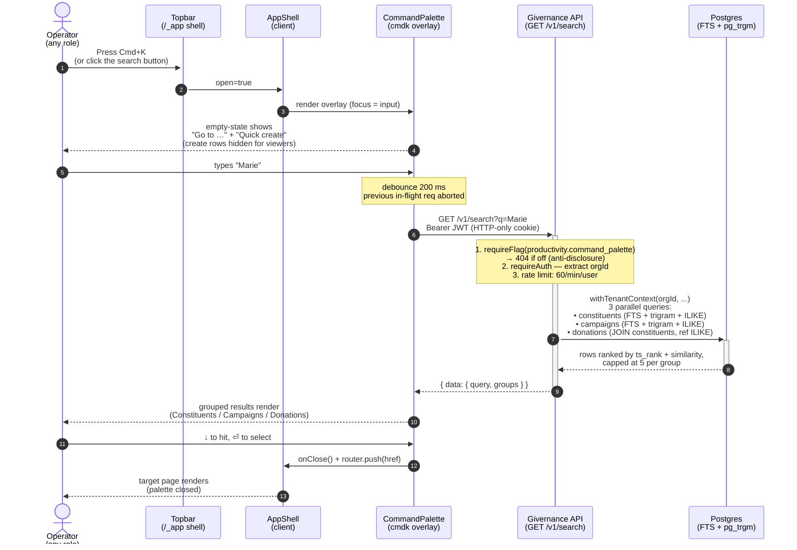

# 29 — Global search / Command palette (GLO-001)

> Related: [`docs/14-screen-inventory.md`](14-screen-inventory.md) (GLO-001 spec), [`docs/11-design-identity.md`](11-design-identity.md) (Cmd+K as navigation contract), [`docs/18-feature-flags.md`](18-feature-flags.md) (flag pattern), [`docs/27-notifications.md`](27-notifications.md) (parallel global surface — bell vs. palette), [Mockup `docs/design/global/command-palette.html`](design/global/command-palette.html). Schema lives in migration [`0062_search_indexes.sql`](../packages/api/migrations/0062_search_indexes.sql); flag seed in [`0061_command_palette_feature_flag.sql`](../packages/api/migrations/0061_command_palette_feature_flag.sql).

## 0. Why this exists — at a glance

Givernance's MVP shipped with **entity-scoped** search — every list page has its own "search a constituent / campaign / donation" input. That covers focused workflows, but breaks down the moment an operator can't remember which entity the thing they want lives under: *"Was Marie a constituent record, the donor on last week's gift, or the lead on a Spring campaign?"* In every Salesforce-replacement evaluation we've shadowed, the first thing a fundraising manager types is the donor's first name, and they expect the system to find their donor record, their last gift, and the campaign they sponsor — in one drop-down.

**This feature delivers that single drop-down.** Pressing **`Cmd+K`** (Mac) or **`Ctrl+K`** (Windows / Linux) anywhere in the authenticated app opens an overlay that:

1. Searches **constituents**, **campaigns**, and **donations** in one query, with results grouped by entity.
2. Offers static **"Go to …"** navigation rows so power users can jump to Constituents / Campaigns / Donations without leaving the keyboard.
3. Surfaces **quick-create** actions (new constituent, new donation, new campaign) for users with the `org_admin` / `user` app role — viewers see the navigation rows but not the create rows.

It's the keyboard-first navigation layer that operators trained by Linear, Notion, and the Stripe Dashboard already expect. Without it, every entity-scoped search input is a separate place to look — and Salesforce's "global search" is one of the few NPSP features users actually praise.

The surface is **gated behind `productivity.command_palette` (default off)**. With the flag off, the overlay, the topbar button, the global keyboard listener, and the `GET /v1/search` route are all completely absent — no inert placeholder anywhere. The full flag rationale + rollback drill is in [§5](#5-feature-flag-productivitycommand_palette).

## 1. User flow — operator searches across entities



**Error branches**

- Query < 2 chars → no DB call, empty state stays (static commands visible).
- Network error → palette stays open, shows the generic `t("commandPalette.error")` ("Could not run the search. Try again in a moment."); `aria-live="assertive"` + `role="alert"` announce it to assistive tech. The next valid keystroke supersedes the failed request.
- 429 (rate-limit) → surfaced as the **same** generic error banner (no distinct toast) — we deliberately keep one error path rather than expose the rate-limit as a separate UX, because a sustained burst hitting the cap is usually a runaway typing loop, not a state the operator can fix differently.
- Unauthenticated request mid-session (cookie expired between renders) → the global axios-style 401 handler in [`packages/web/src/lib/api/client.ts`](../packages/web/src/lib/api/client.ts) already routes through the auth refresh path; the palette catches the resulting rejection and surfaces the generic error until the next debounced refetch succeeds.
- Flag off mid-session (operator just got demoted) → SSR-fetched flag list was stale, the topbar button vanishes on next nav, the API returns 404; the palette is never re-opened. No UI is left half-broken because the entire surface is conditional on `commandPaletteEnabled`.

## 2. Domain model — no new tables

This Epic adds **no new persistent state**. Everything searchable already lives in existing tables (`constituents`, `campaigns`, `donations`). The only DB delta is **four expression indices** to make the queries fast.

```mermaid
erDiagram
  CONSTITUENTS ||--o{ DONATIONS : "1—N (constituent_id)"
  CAMPAIGNS   ||--o{ DONATIONS : "0..1—N (campaign_id, nullable)"

  CONSTITUENTS {
    uuid    id PK
    uuid    org_id FK
    text    first_name
    text    last_name
    text    email
    text    city
    text    type
    text    tags
    timestamptz deleted_at
    timestamptz updated_at
    ix_fts  "GIN to_tsvector('simple', first || last || email || city)"
    ix_trgm "GIN gin_trgm_ops on (first || ' ' || last)"
  }

  CAMPAIGNS {
    uuid    id PK
    uuid    org_id FK
    text    name
    text    description
    text    type
    text    status
    timestamptz updated_at
    ix_fts  "GIN to_tsvector('simple', name || description)"
    ix_trgm "GIN gin_trgm_ops on name"
  }

  DONATIONS {
    uuid    id PK
    uuid    org_id FK
    uuid    constituent_id FK
    int     amount_cents
    text    currency
    text    payment_ref
    text    receipt_number
    timestamptz donated_at
  }
```

Why **expression indices** rather than generated `tsvector` columns:

- The Drizzle schema stays clean — no introspection drift, no migration churn the moment we tune the FTS expression.
- Writes to constituents / campaigns that don't change a search-relevant field don't pay any index-update cost.
- Trade-off: the `WHERE` clause must mirror the exact index expression. The service layer is the only caller and pins the form (see [`packages/api/src/modules/search/service.ts`](../packages/api/src/modules/search/service.ts)).

The shared `core-erd.mmd` does **not** need to change — no new tables, no new relationships.

## 3. Architecture & ranking

### 3.1 Search engine choice — Postgres FTS, not Meilisearch

Per the Epic's spike requirement, we evaluated:

| Option | Pros | Cons | Verdict |
|---|---|---|---|
| **Postgres FTS + pg_trgm** | Zero new infra. RLS works natively. Joins with the existing permission model are trivial. EU sovereignty already covered by Scaleway Managed Postgres. | French/English stemmer mismatch on shared rows; lower recall than dedicated engines on >1M rows. | **CHOSEN** for Phase 2. NPOs run 2–200 staff — even an enterprise tenant tops out at low-six-figure constituent counts. The performance budget (P95 < 200 ms on a 50k-constituent test tenant) is met by GIN-indexed expression queries. |
| Meilisearch / Typesense (EU-hosted on Scaleway) | Native typo tolerance, faceting, sub-50 ms queries on millions of rows. | New service to deploy, monitor, secure, GDPR DPA-scope. Permission-sync becomes a distributed-systems problem (RLS doesn't extend out). | **Rejected** for now. Revisit when a single tenant crosses 1M searchable rows OR when faceted search becomes a product requirement. |
| Elasticsearch | Same pros as Meilisearch, plus aggregations. | Largest operational footprint of the three; no clear win over Meilisearch at our scale. | Rejected. |

### 3.2 Indexing strategy

Migration [`0062_search_indexes.sql`](../packages/api/migrations/0062_search_indexes.sql) ships:

1. **`constituents_search_tsv_idx`** — GIN on `to_tsvector('simple', first || last || email || city)`.
2. **`constituents_name_trgm_idx`** — GIN with `gin_trgm_ops` on `(first || ' ' || last)`, for typo tolerance ("marie clair" → "Marie-Claire").
3. **`campaigns_search_tsv_idx`** — GIN on `to_tsvector('simple', name || description)`.
4. **`campaigns_name_trgm_idx`** — GIN with `gin_trgm_ops` on `name`.

**Why `'simple'` and not `'french'` / `'english'`**: Givernance tenants mix French and English records routinely (Swiss NPOs, EU foundations with international beneficiaries). A stemmed dictionary would corrupt surnames ("Fontaine" → "fontain"), strip stop-words that belong in campaign names ("Help Us End Hunger" → "help us end hunger" minus "us"), and bake the language choice into the index. The `'simple'` config does word-boundary tokenisation only — high recall, language-agnostic. We tighten ranking in the service layer, not in the analyser.

**Donations carry no FTS column**. Their free-form text is sparse (just `payment_ref` and `receipt_number`). We search donations via:

- a **JOIN to constituents** (find Marie's donations by name) — the dominant operator query, and
- **substring ILIKE** on `payment_ref` / `receipt_number` (look up reference "D-2026-0142").

### 3.3 Ranking

Inside each group:

```
score = ts_rank(<group's tsvector>, plainto_tsquery('simple', q))
      + similarity(<group's primary name>, q)
```

Tiebreaker: `updated_at DESC` for constituents / campaigns; `donated_at DESC` for donations.

We deliberately do **not** apply a global cross-group ranking — the operator's mental model is "I'm looking for a person OR a campaign OR a gift," and forcing those into a single ranked list buries the entity discriminator. Each group is capped at **5 hits** (`PER_GROUP_LIMIT`); total wire size ≤ 15 hits + an envelope.

### 3.4 Tenant scope & RLS

Every query runs inside `withTenantContext(orgId, ...)` (sets the `app.current_organization_id` GUC) and additionally carries **explicit `WHERE org_id = ${orgId}`** clauses (CLAUDE.md §"RLS is the safety net, never the contract", issue #430). The donations JOIN adds `AND c.org_id = d.org_id` so a guessed cross-tenant `constituent_id` can't smuggle a hit through the join.

The boot-time `assertAppRoleSecure` guard in [`packages/api/src/lib/db.ts`](../packages/api/src/lib/db.ts) is the third wall — the runtime role must be NOBYPASSRLS or the container crash-loops at start.

### 3.5 Query safety

The raw user input never reaches the SQL string. It's bound as a single `text` parameter through Drizzle's `sql` template — both for `plainto_tsquery('simple', ${q})` and for the `ILIKE ${"%" + q + "%"}` arms. The service layer additionally:

- caps length at 200 chars (also enforced by the TypeBox route schema),
- strips C0 (0x00–0x1f) and C1 (0x7f–0x9f) control codepoints — Postgres rejects NUL in text, and the others are noise,
- collapses internal whitespace,
- returns an empty result (no DB hit) when the cleaned query is < 2 chars.

`plainto_tsquery` is intentional over `to_tsquery` — it quotes tsquery operators (`&`, `|`, `!`, `:*`, `()`) as plain words, so a curious user typing `!marie` doesn't get a syntax error and a malicious user can't smuggle an operator that explodes the planner. The integration test [`packages/api/src/tests/integration/search.test.ts`](../packages/api/src/tests/integration/search.test.ts) pins all of this with `'; DROP TABLE constituents; --` and friends.

### 3.6 Frontend architecture

- The **CommandPalette** component lives in [`packages/web/src/components/command-palette/command-palette.tsx`](../packages/web/src/components/command-palette/command-palette.tsx).
- Mounted once inside **AppShell** (conditional on `commandPaletteEnabled`); open/close state is owned by AppShell so the global keyboard listener + the topbar trigger button both share one source of truth.
- Built on the existing `cmdk` wrapper in [`packages/web/src/components/ui/command.tsx`](../packages/web/src/components/ui/command.tsx) + Radix `Dialog`.
- Server-side filtering — `shouldFilter={false}` on the `Command` root so cmdk doesn't re-filter server results client-side (which would override the server's relevance ordering and drop hits whose `title` doesn't contain the literal query).
- 200 ms debounce on input changes. In-flight requests are aborted via `AbortController` when a fresher keystroke supersedes them — eliminates the out-of-order-response race.
- Static commands ("Go to Dashboard", "Go to Constituents", …) and RBAC-aware quick-create rows ("New constituent", "Record a donation", "New campaign") populate the empty state and remain accessible alongside live results.

## 4. Permissions matrix

| Endpoint / surface | Auth | RBAC | Notes |
|---|---|---|---|
| `GET /v1/search?q=…` | Authenticated tenant user (any role) | None beyond auth | Flag-gated 404 when `productivity.command_palette=off`. Rate limit: 60 req/min/user. RLS-scoped to the JWT's `org_id`. |
| Topbar Cmd+K trigger button | Authenticated tenant user | None | Hidden entirely when the flag is off (off-state QA). |
| Global Cmd+K / Ctrl+K listener | Authenticated tenant user | None | Listener is NOT mounted when the flag is off — pressing the shortcut is a no-op. |
| Command palette overlay | Authenticated tenant user | None for the search results; quick-create rows require `org_admin` or `user` (viewers see only the search + Go-to rows). | Component is not loaded at all when the flag is off. |
| "New constituent" / "Record a donation" / "New campaign" rows | Authenticated tenant user | `org_admin` OR `user` (the `requireWrite` boundary) | Reused existing entity-create flows — no new endpoints. |

Search results respect each entity's existing RLS: a viewer sees the same hits as an org_admin within the tenant (the palette is a navigation aid, not a permissioned data surface), and tenant isolation prevents any cross-tenant leakage.

## 5. Feature flag — `productivity.command_palette`

| Field | Value |
|---|---|
| Key | `productivity.command_palette` |
| Default | `false` |
| Scope | `tenant` |
| Tenant override allowed | `true` (org-admin self-serves from `/settings/feature-flags`) |
| Public projection | `true` (the topbar trigger + global listener need to know at page-load) |
| Registry | [`packages/shared/src/constants/feature-flags.ts`](../packages/shared/src/constants/feature-flags.ts) |
| Seed migration | [`0061_command_palette_feature_flag.sql`](../packages/api/migrations/0061_command_palette_feature_flag.sql) |
| Gated surfaces | `GET /v1/search` route, topbar trigger button, global Cmd+K listener, the CommandPalette component (never imported when off via the conditional in AppShell) |
| Off-state QA | With the flag off: the trigger button is **absent** (not greyed out), the Cmd+K keypress is a **no-op** (listener not mounted), and the API returns **404** (not 403). |
| Emergency rollback | See [`docs/runbooks/feature-flag-rollback.md`](runbooks/feature-flag-rollback.md). One `UPDATE feature_flags SET enabled=false WHERE key='productivity.command_palette';` + `redis-cli DEL flags:global`. |

The public-projection caveat in CLAUDE.md applies — the key name is intentionally descriptive (`productivity.command_palette`) and not teasing an unannounced surprise, so its presence in `GET /v1/feature-flags` for every authenticated tenant user is acceptable.

## 6. Privacy / GDPR posture

- **No new PII storage**: search reads from existing tables only. The `constituents.deleted_at` soft-delete filter is applied; deleted donor records are invisible to the palette.
- **Audit trail**: read-only search hits do **not** generate audit rows — every authenticated tenant user can already list constituents / campaigns / donations, and the audit log already records the *resulting* navigation (e.g. opening a constituent detail page emits the existing read audit, unchanged).
- **Logs**: the `requireFlag` guard logs `flag.route_gated` when a disabled tenant hits the route (existing pattern, low cardinality — path is the route TEMPLATE, not the raw URL). The search handler emits the standard request log line via Fastify's pino — **the raw query string `q` is not redacted** because it doesn't carry PII by design (an operator's typed substring of a donor's name is far less sensitive than what the constituent detail page itself emits to the same log channel). If a future tenant requests stricter posture, redacting `q` to a hash is a single-line change in [`packages/shared/src/constants/log-redact-paths.ts`](../packages/shared/src/constants/log-redact-paths.ts).
- **Erasure**: a constituent erasure cascade already removes their `donations`. After erasure, the palette returns zero hits for any query that previously matched — no separate index to rebuild because the expression indices reference the live row.

## 7. Out of scope (deferred)

The Epic explicitly carves these out so a prospect reading this doc understands what Phase 2 covers vs. what the broader GLO-001 vision implies:

- **Grants & programs** — the Epic acceptance lists "≥ 5 entity types"; only **3 ship in this PR** (constituents, donations, campaigns) because grants and programs **don't have schema yet**. Adding them is a one-migration follow-up the moment those tables land.
- **Saved searches / advanced filters** — the palette is a quick-jump aid; advanced querying belongs in the entity list pages.
- **Recently-visited surfaces** — Epic mentions sessionStorage-backed recents when the query is empty. Deferred; the static "Go to …" rows fill that slot for now.
- **Highlight match in result rows** — visual polish, deferred to a follow-up.
- **Search telemetry** — the per-query log is enough for SRE; product telemetry (hashed query → click-through) is a separate analytics workstream and intentionally not bolted on here.
- **AI-suggested actions** ("Suggestions contextuelles basées sur la navigation récente" in the GLO-001 spec) — Phase 3 / AI Modes work ([`docs/13-ai-modes.md`](13-ai-modes.md)).
- **Conversational search** ("how many donors gave more than €100 last month?") — separate Epic, see [`docs/vision/conversational-mode.md`](vision/conversational-mode.md).
- **Semantic / embedding search** — requires an EU-hosted embeddings stack; revisit when volume justifies.
- **Full-text search inside attachments** (PDFs, emails) — content-extraction worker is a separate concern.
- **External search engine** (Meilisearch / Typesense / Elasticsearch) — see [§3.1](#31-search-engine-choice--postgres-fts-not-meilisearch) for the revisit criteria.

## 8. Adding a new entity to global search

When a new tenant-scoped table joins the searchable graph (e.g. grants, programs, volunteers):

1. Add an expression index on the table's name / description fields in a new migration (mirror [`0062_search_indexes.sql`](../packages/api/migrations/0062_search_indexes.sql)).
2. Add a query branch in [`packages/api/src/modules/search/service.ts`](../packages/api/src/modules/search/service.ts) — same `withTenantContext` + explicit `org_id` filter + capped `LIMIT PER_GROUP_LIMIT`.
3. Extend the `SearchResult.groups` type + the route's `SearchResponse` TypeBox schema.
4. Add a `CommandGroup` in [`packages/web/src/components/command-palette/command-palette.tsx`](../packages/web/src/components/command-palette/command-palette.tsx).
5. Add translations under `appShell.commandPalette.groups.*` in `en.json` and `fr.json`.
6. Add RLS-isolation + happy-path tests in [`packages/api/src/tests/integration/search.test.ts`](../packages/api/src/tests/integration/search.test.ts).

The flag stays the same — adding a new entity is not "a new feature", it's an extension of an already-shipped surface.
