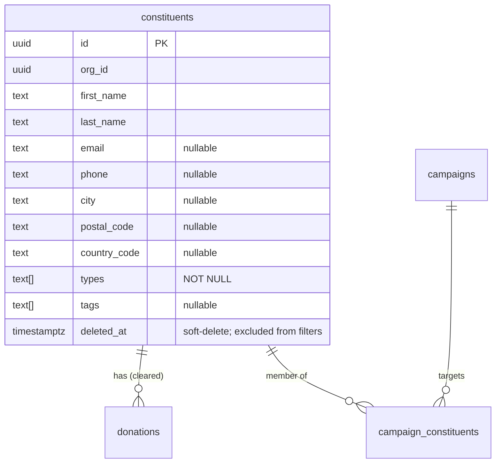

# 30 — Advanced Constituent Filters for Campaigns

> **Status**: Implemented — Epic #418 (PR #421), reconciled by the advanced-filters audit (this PR)
> **Owner**: MVP Engineer
> **Related**: [`docs/23-postal-campaigns.md`](23-postal-campaigns.md) §2.3 Campaign Members · [`docs/28-bulk-import.md`](28-bulk-import.md) Bulk operations · [`docs/29-global-search.md`](29-global-search.md) GLO-001 search · [`docs/34-constituents.md`](34-constituents.md) multi-valued `types`
> **Companion ADR**: [`docs/adrs/adr-033-advanced-filter-architecture.md`](adrs/adr-033-advanced-filter-architecture.md)

## 0. Why this exists — at a glance

NPOs build campaign audiences from criteria like "donors who gave over €500 lifetime", "constituents with no email on file", "people tagged *newsletter*", or smart segments like LYBUNT (gave last year, not this year). Without this, an operator selects recipients one by one — unworkable past a few dozen.

Advanced filters let a campaign manager, from the campaign **Add constituents → Build a filter** flow:

1. Start from a **quick template** (a pre-built segment: LYBUNT, major donors, recurring, lapsed, new donors, local-Geneva).
2. Refine with **custom rules** — pick a field, an operator that fits that field, and a value; combine rules with **AND / OR**.
3. See a **live count** of matching constituents before applying.
4. **Add the matched set** to the campaign in one action.

**What this PR fixed (the audit).** The builder previously advertised ~22 fields of which only ~6 actually worked; the rest returned HTTP 400 because the frontend field names / operators had drifted from the backend registry. There was no usable "is empty / not set" operator (the only two nullable-ish operators were broken end-to-end), donation-metric filters silently matched constituents who had never donated, amount thresholds were compared in cents against a EUR-labelled input, and soft-deleted constituents leaked back into results. The catalog is now trimmed to exactly what the backend can execute, plus a real nullable operator. See §7 for what remains out of scope.

## 1. User flow

```mermaid
sequenceDiagram
    autonumber
    actor Op as Campaign manager
    participant UI as FilterBuilder
    participant Prev as /filter/preview
    participant Add as /campaigns/:id/members/filter
    participant DB as Postgres (RLS)

    Op->>UI: Open "Build a filter"
    Op->>UI: Pick a quick template (optional) + custom rules
    Note over UI: Rules validated client-side; presence<br/>operators (isNull/isNotNull) need no value
    UI->>Prev: POST { query } (debounced)
    Prev->>DB: COUNT over constituents (orgId, deleted_at IS NULL, whereClause)
    DB-->>Prev: 234
    Prev-->>UI: { count: 234 }
    UI-->>Op: "234 constituents match"
    alt query invalid (unknown field / bad operator)
        Prev-->>UI: 400 { errors:[…] }
        UI-->>Op: "Some conditions are invalid — please review them"
    end
    Op->>UI: Confirm "Add 234 constituents"
    UI->>Add: POST { query }
    Add->>DB: SELECT ids (same predicate) → INSERT campaign_constituents (skip existing)
    Add-->>UI: { added: 234, skipped: 0 }
    UI-->>Op: toast + redirect to campaign
```

## 2. Filter catalog (what actually ships)

Every field below maps to a real column or aggregate in `FIELD_REGISTRY`
(`packages/api/src/modules/constituents/filters/types.ts`) and is offered by the
frontend catalog `filterFields`
(`packages/web/src/components/constituents/filters/filter-presets.ts`). A build
contract keeps the two in lockstep — a field the backend can't execute is never
shown.

### 2.1 Identity & contact
| Field | Type | Operators |
|---|---|---|
| First name | text | eq, neq, contains, startsWith, endsWith |
| Last name | text | eq, neq, contains, startsWith, endsWith |
| Email | text | eq, neq, contains, startsWith, endsWith, **isNull, isNotNull** |
| Phone | text | eq, neq, contains, startsWith, endsWith, **isNull, isNotNull** |
| Date added | date | eq, neq, gt, gte, lt, lte, between |

### 2.2 Demographics
| Field | Type | Operators |
|---|---|---|
| Constituent type | multiselect | arrayOverlaps ("is any of"), arrayContains ("is all of") |
| Tags | multiselect (tenant-defined, autocompleted) | arrayOverlaps, arrayContains, **isNull, isNotNull** |
| City | text | eq, neq, contains, startsWith, in, **isNull, isNotNull** |
| Postal code | text | eq, neq, startsWith, contains, **isNull, isNotNull** |
| Country | select | eq, neq, in, **isNull, isNotNull** |

### 2.3 Donation history (aggregates over cleared donations)
| Field | Type | Operators | Notes |
|---|---|---|---|
| Total donated (lifetime) | number (EUR) | eq, neq, gt, gte, lt, lte, between | value ×100 → cents at the DSL boundary |
| Number of donations | number | eq, neq, gt, gte, lt, lte, between | |
| Last donation date | date | eq, neq, gt, gte, lt, lte, between | |
| First gift date | date | eq, neq, gt, gte, lt, lte, between | |

### 2.4 Quick templates (presets)
`lybunt`, `major-donors`, `recurring-monthly`, `lapsed-donors` (backend pattern
flags), `new-donors` (recent first gift), `local-geneva` (case/accent-insensitive
city + postal band). Pattern flags: `LYBUNT | SYBUNT | RECURRING | LAPSED | MAJOR_DONOR`.

### 2.5 The nullable ("is empty" / "has a value") operator
`isNull` / `isNotNull` are surfaced as **"is empty" / "has a value"** (FR *non
renseigné* / *renseigné*), take **no value input**, and are offered **only on
columns that can actually be empty** (email, phone, city, postal code, country,
tags). Never on `NOT NULL` columns (first/last name, type) where they would be
dead operators, and not on donation-date aggregates (where `isNotNull` would
match everyone). "Has ever / never donated" is expressed with **Number of
donations ≥ 1 / = 0** instead.

## 3. Architecture

### 3.1 Query DSL
```ts
interface FilterQuery {
  operator: "AND" | "OR";
  conditions: Array<{ field: string; operator: FilterOperator; value?: FilterValue; subConditions?: FilterQuery }>;
  patterns?: Array<"LYBUNT" | "SYBUNT" | "RECURRING" | "LAPSED" | "MAJOR_DONOR">;
}

type FilterOperator =
  | "eq" | "neq" | "gt" | "gte" | "lt" | "lte" | "between"
  | "in" | "contains" | "startsWith" | "endsWith"
  | "arrayContains" | "arrayOverlaps"   // text[] columns (types, tags)
  | "isNull" | "isNotNull";             // presence checks on nullable columns
```
The FE `FilterOperator` union (`filter-types.ts`), the BE union (`types.ts`) and
the TypeBox wire schema (`filter.routes.ts`) are **identical** — any operator the
FE emits that the wire schema rejects is a 400, so drift is not allowed. The
former FE-only `exists` / `notExists` / `notIn` / `notContains` operators (which
always 400'd) were removed.

### 3.2 Read model

No new tables. Donation metrics come from an inline `donation_stats` subquery
(`COUNT`, `SUM(amount_base_cents)`, `MIN`/`MAX(donated_at)`) grouped over
**cleared** donations and LEFT-JOINed to `constituents`.

### 3.3 Package ownership & correctness invariants
- **Backend** (`packages/api/src/modules/constituents/filters/`): `types.ts`
  (registry), `query-builder.ts` (DSL → Drizzle SQL, value normalisation),
  `filter.service.ts` (assembly + tenant queries), `filter.routes.ts` (TypeBox +
  guards), `pattern-detector.ts` (result-badge enrichment).
- **Frontend** (`packages/web/src/components/constituents/filters/`):
  `FilterBuilder`, `FilterCondition`, `FilterChip`, `FilterPreview`,
  `FilterPresets`, and the pure-data `filter-presets.ts` / `filter-types.ts`.
- **Correctness invariants enforced in this PR**:
  - **Tenant + soft-delete**: every filter query filters `eq(orgId)` **and**
    `isNull(deleted_at)` explicitly (issue #430), in addition to RLS.
  - **Aggregate existence**: a donation-metric predicate means "has stats AND
    predicate holds" — constituents with zero cleared donations no longer leak
    through an `IS NULL OR (…)` escape hatch.
  - **Logical operator**: `OR` is honoured across the regular/aggregate boundary
    and across multiple aggregate conditions (was silently forced to `AND`).
  - **Units**: amount fields carry `valueUnit: "cents"`; the builder multiplies
    the EUR input by 100 before comparing against `*_cents` columns.
  - **Date `between`**: the upper bound is extended to end-of-day so an
    inclusive-looking `…-12-31` range doesn't drop that day's records.

## 4. Permissions matrix
| Endpoint | Guard chain | Rate limit |
|---|---|---|
| `POST /v1/constituents/filter` | `requireFlag(advanced_filters)` → `requireAuth` | 10/min |
| `POST /v1/constituents/filter/preview` | `requireFlag` → `requireAuth` | 20/min |
| `GET /v1/constituents/filter/suggestions` | `requireFlag` → `requireAuth` | — |
| `GET /v1/constituents/filter/fields` | `requireFlag` → `requireAuth` | — |
| `POST /v1/campaigns/:id/members/filter` | `requireFlag` → `requireAuth` → `requireWrite` | 5/min |

With the `advanced_filters` flag **off**, every route returns 404 and the
campaign "Build a filter" surface is hidden.

## 5. Privacy / GDPR posture
- **Soft-delete**: `deleted_at IS NOT NULL` constituents are excluded from every
  count, result page, and campaign-add — erased/removed people can't be pulled
  back into a mailing.
- **Tenant isolation**: explicit `eq(orgId)` on every query plus forced RLS.
- **No PII in logs**: the SQL-injection guard logs field/operator/value only on a
  *suspected* injection attempt; normal queries are not value-logged.
- **Suggestions**: the autocomplete endpoint returns only distinct values the
  tenant already stores (tags, cities, …), scoped by `orgId`.

## 6. Testing
- **Backend** (`packages/api/src/tests/integration/filters.test.ts`, "Advanced-filters
  audit fixes"): zero-donation exclusion, EUR→cents scaling, renamed
  `address.countryCode` resolves, `isNull`/`isNotNull` on email, OR across the
  regular/aggregate boundary, soft-delete exclusion, removed-operator 400. Runs
  under both the owner and `givernance_app` (RLS) roles per issue #455.
- **Frontend**: `FilterCondition` renders no value input for `isNull`/`isNotNull`;
  the existing builder/preview/chip suites cover the reconciled catalog.

## 7. Out of scope (roadmap)
Deliberately **not** in this PR — the audit chose a correct, working subset over
a broad-but-broken surface:

- **More donation aggregates** — *Average gift* and *Largest gift* need the
  inline `donation_stats` subquery to project `AVG`/`MAX(amount)`; *Number of
  campaigns* / *In campaign* need a `campaign_stats` join. Their registry entries
  were removed until the aggregation is actually wired (they previously 500'd).
- **Fields with no backing column** — canton, preferred language, email
  deliverability status, communication preferences, last-contact date, and the
  "Calculated metrics" group (lifetime value / gifts-per-year / recency score)
  need real schema before they can be filters. Removed from the catalog.
- **Tag / type negation** — "NOT tagged *board*" needs an `arrayNotContains`
  operator (BE + wire + FE label).
- **Combining smart segments** — selecting a second preset replaces the first,
  and two pattern flags are OR-joined; "major donors who also lapsed" (pattern
  AND pattern) needs additive preset merge + AND-join of `patterns`.
- **Nested AND/OR groups in the UI** — the DSL supports `subConditions`, but the
  builder only renders a flat list; this is why `local-geneva` can't scope its
  postal band to Switzerland (the "12xx" band also matches DE/FR codes).
- **Saved / shared filters**, **natural-language / AI query**, and **exporting a
  filtered list** — future phases.
- **Richer 400 surfacing** — the preview maps all validation 400s to one generic
  message; now that catalog drift is fixed these are rare edge cases.

## 8. Related documents
- [ADR-033](./adrs/adr-033-advanced-filter-architecture.md) — technical decisions
- [Campaign management](./23-postal-campaigns.md) — parent feature
- [Constituents & multi-valued type](./34-constituents.md) — `types` array
- [Bulk import](./28-bulk-import.md) — related bulk operations
