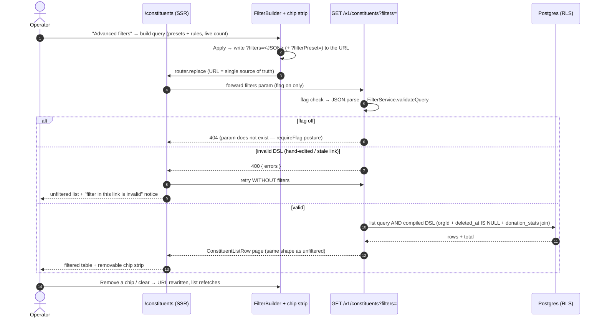
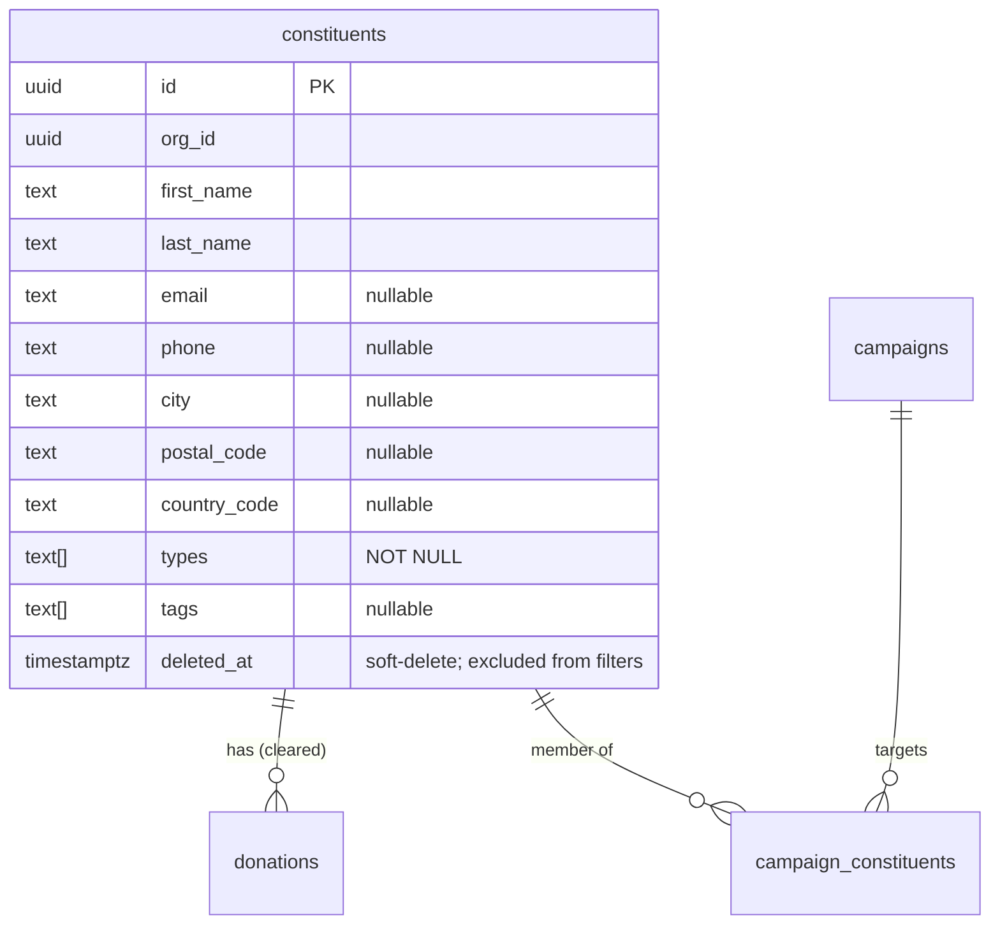
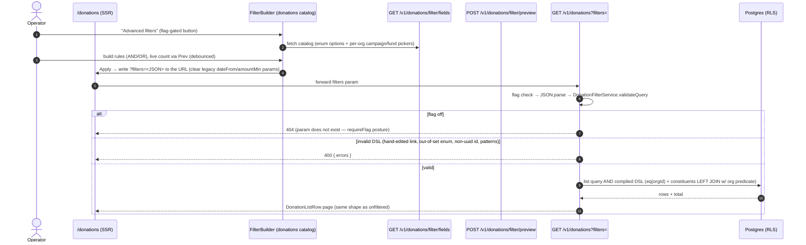

# 30 — Advanced Filters (Constituents & Donations)

> **Status**: Implemented — Epic #418 (PR #421), reconciled by the advanced-filters audit; extended to the constituents LIST page; **Part II (§9)**: the donations list engine (flag `donations.advanced_filters`)
> **Owner**: MVP Engineer
> **Related**: [`docs/23-postal-campaigns.md`](23-postal-campaigns.md) §2.3 Campaign Members · [`docs/28-bulk-import.md`](28-bulk-import.md) Bulk operations · [`docs/29-global-search.md`](29-global-search.md) GLO-001 search · [`docs/34-constituents.md`](34-constituents.md) multi-valued `types` · [`docs/35-customization.md`](35-customization.md) custom-field filter lanes + the donation-domain veto
> **Companion ADR**: [`docs/adrs/adr-033-advanced-filter-architecture.md`](adrs/adr-033-advanced-filter-architecture.md)

## 0. Why this exists — at a glance

NPOs build campaign audiences from criteria like "donors who gave over €500 lifetime", "constituents with no email on file", "people tagged *newsletter*", or smart segments like LYBUNT (gave last year, not this year). Without this, an operator selects recipients one by one — unworkable past a few dozen.

Advanced filters let a campaign manager, from the campaign **Add constituents → Build a filter** flow:

1. Start from a **quick template** (a pre-built segment: LYBUNT, major donors, recurring, lapsed, new donors, local-Geneva).
2. Refine with **custom rules** — pick a field, an operator that fits that field, and a value; combine rules with **AND / OR**.
3. See a **live count** of matching constituents before applying.
4. **Add the matched set** to the campaign in one action.

**What this PR fixed (the audit).** The builder previously advertised ~22 fields of which only ~6 actually worked; the rest returned HTTP 400 because the frontend field names / operators had drifted from the backend registry. There was no usable "is empty / not set" operator (the only two nullable-ish operators were broken end-to-end), donation-metric filters silently matched constituents who had never donated, amount thresholds were compared in cents against a EUR-labelled input, and soft-deleted constituents leaked back into results. The catalog is now trimmed to exactly what the backend can execute, plus a real nullable operator. See §7 for what remains out of scope.

**Second entry point — the constituents list page.** The same FilterBuilder is now reachable from **Constituents → Advanced filters**, so operators can browse and segment the full constituent base with the DSL without needing a campaign as a pretext:

- The applied query lives in the **shareable URL** (`/constituents?filters=<JSON>` + optional `?filterPreset=<id>`) — bookmark it, paste it to a colleague, refresh without losing the segment.
- The list shows an **active-filter chip strip** (pattern chips + one chip per condition, each removable) and composes with the quick search / type filters (AND semantics).
- Server-side, the DSL is compiled into the regular `GET /v1/constituents` query — the response keeps the exact list-row shape, sorting and pagination.
- With the `advanced_filters` flag **off**, the button falls back to the legacy basic dialog (last-donation range + minimum total giving) and a `?filters=` URL 404s — the surface is completely absent.
- With the flag **on**, the FilterBuilder **replaces** the basic dialog (its catalog is a superset); bookmarked basic-dialog URLs keep working, and opening the builder on one pre-seeds the equivalent DSL conditions. On the donations page the legacy `?dateFrom=/?dateTo=` params also render through the same chip strip, so a bookmarked pre-DSL URL is clearable in one click (removing a chip upgrades the remainder to a DSL `?filters=` URL).

## 1. User flow

```mermaid
sequenceDiagram
    autonumber
    actor Op as Campaign manager
    participant UI as FilterBuilder
    participant Prev as /filter/preview
    participant Add as /campaigns/:id/members/filter
    participant DB as Postgres (RLS)

    Op->>UI: Open "Build a filter"
    Op->>UI: Pick a quick template (optional) + custom rules
    Note over UI: Rules validated client-side; presence<br/>operators (isNull/isNotNull) need no value
    UI->>Prev: POST { query } (debounced)
    Prev->>DB: COUNT over constituents (orgId, deleted_at IS NULL, whereClause)
    DB-->>Prev: 234
    Prev-->>UI: { count: 234 }
    UI-->>Op: "234 constituents match"
    alt query invalid (unknown field / bad operator)
        Prev-->>UI: 400 { errors:[…] }
        UI-->>Op: "Some conditions are invalid — please review them"
    end
    Op->>UI: Confirm "Add 234 constituents"
    UI->>Add: POST { query }
    Add->>DB: SELECT ids (same predicate) → INSERT campaign_constituents (skip existing)
    Add-->>UI: { added: 234, skipped: 0 }
    UI-->>Op: toast + redirect to campaign
```

### 1.1 List-page flow (browse / segment — this PR)



## 2. Filter catalog (what actually ships)

Every field below maps to a real column or aggregate in `FIELD_REGISTRY`
(`packages/api/src/modules/constituents/filters/types.ts`) and is offered by the
frontend catalog `filterFields`
(`packages/web/src/components/constituents/filters/filter-presets.ts`). A build
contract keeps the two in lockstep — a field the backend can't execute is never
shown.

### 2.1 Identity & contact
| Field | Type | Operators |
|---|---|---|
| First name | text | eq, neq, contains, startsWith, endsWith |
| Last name | text | eq, neq, contains, startsWith, endsWith |
| Email | text | eq, neq, contains, startsWith, endsWith, **isNull, isNotNull** |
| Phone | text | eq, neq, contains, startsWith, endsWith, **isNull, isNotNull** |
| Date added | date | eq, neq, gt, gte, lt, lte, between |

### 2.2 Demographics
| Field | Type | Operators |
|---|---|---|
| Constituent type | multiselect | arrayOverlaps ("is any of"), arrayContains ("is all of") |
| Tags | multiselect (tenant-defined, autocompleted) | arrayOverlaps, arrayContains, **isNull, isNotNull** |
| City | text | eq, neq, contains, startsWith, in, **isNull, isNotNull** |
| Postal code | text | eq, neq, startsWith, contains, **isNull, isNotNull** |
| Country | select | eq, neq, in, **isNull, isNotNull** |

### 2.3 Donation history (aggregates over cleared donations)
| Field | Type | Operators | Notes |
|---|---|---|---|
| Total donated (lifetime) | number (EUR) | eq, neq, gt, gte, lt, lte, between | value ×100 → cents at the DSL boundary |
| Number of donations | number | eq, neq, gt, gte, lt, lte, between | |
| Last donation date | date | eq, neq, gt, gte, lt, lte, between | |
| First gift date | date | eq, neq, gt, gte, lt, lte, between | |

### 2.4 Quick templates (presets)
`lybunt`, `major-donors`, `recurring-monthly`, `lapsed-donors` (backend pattern
flags), `new-donors` (recent first gift), `local-geneva` (case/accent-insensitive
city + postal band). Pattern flags: `LYBUNT | SYBUNT | RECURRING | LAPSED | MAJOR_DONOR`.

### 2.5 The nullable ("is empty" / "has a value") operator
`isNull` / `isNotNull` are surfaced as **"is empty" / "has a value"** (FR *non
renseigné* / *renseigné*), take **no value input**, and are offered **only on
columns that can actually be empty** (email, phone, city, postal code, country,
tags). Never on `NOT NULL` columns (first/last name, type) where they would be
dead operators, and not on donation-date aggregates (where `isNotNull` would
match everyone). "Has ever / never donated" is expressed with **Number of
donations ≥ 1 / = 0** instead.

### 2.6 Custom fields (Epic #539)

Per-org **custom-field definitions** (`filterable=true`, non-archived,
constituent domain) join the catalog as `custom.<key>` entries via a two-layer
registry: `getFieldRegistry(orgId)` merges the static core `FIELD_REGISTRY` with
the org's cached definition catalog. The `/v1/constituents/filter/fields`
payload carries them with `category: 'custom'`, `labelKind: 'literal'` (the
label is operator data, not an i18n key), `uiType`, picklist `options`,
`valueUnit: 'cents'` for currency, and `nullable: true` (every custom field
offers "is empty" / "has a value"). Picklist/boolean equality compiles to
GIN-served `custom @> …` containment; keys are server-resolved from the
registry — the DSL never carries column names. Persisted segments referencing an
archived definition fail with a named 400 `custom_field_archived`, never
silently dropped. Full contract: [35-customization.md](35-customization.md) /
[ADR-036](adrs/adr-036-custom-fields-jsonb-registry.md). Donation-domain fields
now have the same integration in the DONATIONS engine (§9.2.1);
campaign-domain fields stay out of both filter engines.

## 3. Architecture

### 3.1 Query DSL
```ts
interface FilterQuery {
  operator: "AND" | "OR";
  conditions: Array<{ field: string; operator: FilterOperator; value?: FilterValue; subConditions?: FilterQuery }>;
  patterns?: Array<"LYBUNT" | "SYBUNT" | "RECURRING" | "LAPSED" | "MAJOR_DONOR">;
}

type FilterOperator =
  | "eq" | "neq" | "gt" | "gte" | "lt" | "lte" | "between"
  | "in" | "contains" | "startsWith" | "endsWith"
  | "arrayContains" | "arrayOverlaps"   // text[] columns (types, tags)
  | "isNull" | "isNotNull";             // presence checks on nullable columns
```
The FE `FilterOperator` union (`filter-types.ts`), the BE union (`types.ts`) and
the TypeBox wire schema (`filter.routes.ts`) are **identical** — any operator the
FE emits that the wire schema rejects is a 400, so drift is not allowed. The
former FE-only `exists` / `notExists` / `notIn` / `notContains` operators (which
always 400'd) were removed.

### 3.2 Read model

No new tables. Donation metrics come from an inline `donation_stats` subquery
(`COUNT`, `SUM(amount_base_cents)`, `MIN`/`MAX(donated_at)`) grouped over
**cleared** donations and LEFT-JOINed to `constituents`.

### 3.3 Package ownership & correctness invariants
- **Backend** (`packages/api/src/modules/constituents/filters/`): `types.ts`
  (registry), `query-builder.ts` (DSL → Drizzle SQL, value normalisation),
  `filter.service.ts` (assembly + tenant queries), `filter.routes.ts` (TypeBox +
  guards), `pattern-detector.ts` (result-badge enrichment).
- **Frontend** (`packages/web/src/components/constituents/filters/`):
  `FilterBuilder`, `FilterCondition`, `FilterChip`, `FilterPreview`,
  `FilterPresets`, the pure-data `filter-presets.ts` / `filter-types.ts`, and
  `filter-chip-helpers.ts` (chip-strip mapping shared by the campaign card and
  the constituents list page).
- **List-page integration** (this PR):
  - `GET /v1/constituents` accepts an optional `filters` query param — a
    JSON-serialised `FilterQuery` (8 KiB cap). The route gates it on the
    `advanced_filters` flag (404 when off, same posture as `requireFlag` —
    never a silently-unfiltered 200), rejects unparseable/non-object JSON and
    registry violations with 400 + error list, then hands the parsed query to
    `listConstituents`.
  - `listConstituents` compiles the DSL via the now-public
    `FilterService.buildCompleteWhereClause` and ANDs it with every other list
    predicate (search, type chips, campaign scoping, soft-delete, explicit
    `eq(orgId)`), adding the `donation_stats` join (exported
    `donationStatsJoin(orgId)` helper) **only when a DSL filter is present** so
    the default list plan is untouched. `donation_agg` (list aggregates) and
    `donation_stats` (filter aggregates) project disjoint column names and
    coexist.
  - The web page (`(app)/constituents/page.tsx`) SSR-forwards `?filters=` only
    when the flag is on, falls back to the unfiltered list with an inline
    notice when the API rejects a hand-edited value, and keeps the table shell
    mounted for zero-result filtered views so the operator can always clear
    the filter.
- **Correctness invariants enforced in this PR**:
  - **Tenant + soft-delete**: every filter query filters `eq(orgId)` **and**
    `isNull(deleted_at)` explicitly (issue #430), in addition to RLS.
  - **Aggregate existence**: a donation-metric predicate means "has stats AND
    predicate holds" — constituents with zero cleared donations no longer leak
    through an `IS NULL OR (…)` escape hatch.
  - **Logical operator**: `OR` is honoured across the regular/aggregate boundary
    and across multiple aggregate conditions (was silently forced to `AND`).
  - **Units**: amount fields carry `valueUnit: "cents"`; the builder multiplies
    the EUR input by 100 before comparing against `*_cents` columns.
  - **Date `between`**: the upper bound is extended to end-of-day so an
    inclusive-looking `…-12-31` range doesn't drop that day's records. Day
    boundaries are **UTC calendar days**: the bound is bumped to
    `…T23:59:59.999Z` (explicit `Z` — issue #582), matching the UTC-midnight
    parse of the bare lower bound. Both engines (constituents + donations)
    share this normalisation; org-local-timezone day boundaries are out of
    scope for now (would need a per-org timezone setting).

## 4. Permissions matrix
| Endpoint | Guard chain | Rate limit |
|---|---|---|
| `POST /v1/constituents/filter` | `requireFlag(advanced_filters)` → `requireAuth` | 10/min |
| `POST /v1/constituents/filter/preview` | `requireFlag` → `requireAuth` | 20/min |
| `GET /v1/constituents/filter/suggestions` | `requireFlag` → `requireAuth` | — |
| `GET /v1/constituents/filter/fields` | `requireFlag` → `requireAuth` | — |
| `POST /v1/campaigns/:id/members/filter` | `requireFlag` → `requireAuth` → `requireWrite` | 5/min |
| `GET /v1/constituents?filters=` | `requireAuth` → inline `advanced_filters` gate on the param (404 when off; without the param the route is the plain list, unchanged) | list default |

With the `advanced_filters` flag **off**, every route returns 404, the
campaign "Build a filter" surface is hidden, and the constituents list page
shows only the legacy basic dialog (no builder button, no chip strip, no
`?filters=` passthrough).

## 5. Privacy / GDPR posture
- **Soft-delete**: `deleted_at IS NOT NULL` constituents are excluded from every
  count, result page, and campaign-add — erased/removed people can't be pulled
  back into a mailing.
- **Tenant isolation**: explicit `eq(orgId)` on every query plus forced RLS.
- **No PII in logs**: the SQL-injection guard logs field/operator/value only on a
  *suspected* injection attempt; normal queries are not value-logged.
- **Suggestions**: the autocomplete endpoint returns only distinct values the
  tenant already stores (tags, cities, …), scoped by `orgId`.

## 6. Testing
- **Backend** (`packages/api/src/tests/integration/filters.test.ts`, "Advanced-filters
  audit fixes"): zero-donation exclusion, EUR→cents scaling, renamed
  `address.countryCode` resolves, `isNull`/`isNotNull` on email, OR across the
  regular/aggregate boundary, soft-delete exclusion, removed-operator 400. Runs
  under both the owner and `givernance_app` (RLS) roles per issue #455.
- **List endpoint** (same file, "GET /v1/constituents?filters="): regular
  condition filtering, aggregate EUR→cents through the `donation_stats` join,
  pattern-only (LYBUNT) queries, composition with quick search, soft-delete
  exclusion, cross-tenant isolation under the app role, 400 on unparseable /
  non-object / unknown-field DSL, flag-off 404 for the param with the plain
  list untouched, and list-row response-shape stability.
- **Frontend**: `FilterCondition` renders no value input for `isNull`/`isNotNull`;
  the existing builder/preview/chip suites cover the reconciled catalog.

## 7. Out of scope (roadmap)
Deliberately **not** in this PR — the audit chose a correct, working subset over
a broad-but-broken surface:

- **More donation aggregates** — *Average gift* and *Largest gift* need the
  inline `donation_stats` subquery to project `AVG`/`MAX(amount)`; *Number of
  campaigns* / *In campaign* need a `campaign_stats` join. Their registry entries
  were removed until the aggregation is actually wired (they previously 500'd).
- **Fields with no backing column** — canton, preferred language, email
  deliverability status, communication preferences, last-contact date, and the
  "Calculated metrics" group (lifetime value / gifts-per-year / recency score)
  need real schema before they can be filters. Removed from the catalog.
- **Tag / type negation** — "NOT tagged *board*" needs an `arrayNotContains`
  operator (BE + wire + FE label).
- **Combining smart segments** — selecting a second preset replaces the first,
  and two pattern flags are OR-joined; "major donors who also lapsed" (pattern
  AND pattern) needs additive preset merge + AND-join of `patterns`.
- **Nested AND/OR groups in the UI** — the DSL supports `subConditions`, but the
  builder only renders a flat list; this is why `local-geneva` can't scope its
  postal band to Switzerland (the "12xx" band also matches DE/FR codes).
- **Saved / shared filters**, **natural-language / AI query**, and **exporting a
  filtered list** — future phases. (URL-shareability of the applied list-page
  filter shipped in this PR; *named, persisted* segments have not.)
- **Bulk actions on a filtered list** — the bulk-email selection still operates
  on hand-checked rows; "email everyone matching this filter" is a natural
  follow-up but needs its own recipient-count guardrails.
- **Richer 400 surfacing** — the preview maps all validation 400s to one generic
  message; now that catalog drift is fixed these are rare edge cases.

## 8. Related documents
- [ADR-033](./adrs/adr-033-advanced-filter-architecture.md) — technical decisions
- [Campaign management](./23-postal-campaigns.md) — parent feature
- [Constituents & multi-valued type](./34-constituents.md) — `types` array
- [Bulk import](./28-bulk-import.md) — related bulk operations

---

## 9. Part II — Donations advanced filters

> **Status**: Implemented end-to-end (this PR) — flag `donations.advanced_filters` (dotted convention; the constituents key above is legacy-flat `advanced_filters`), default-off, tenant scope, staff-enabled. Ships the API engine + `?filters=` URL contract **and** the donations-page FilterBuilder UI: a parameterised reuse of the constituents builder (`namespace` / `fields` / endpoint props on the shared components, catalog in `packages/web/src/components/donations/filters/`) over this catalog. With the flag off, the param, the sub-routes, and every UI surface read as nonexistent.

### 9.0 Why this exists — at a glance

The donations list answered "show me gifts in a date range / above an amount" but nothing like *"unreceipted manual gifts over €200 this fiscal year"* or *"camt053 transfers allocated to the Building fund"*. Part II clones the ADR-033 architecture for the donations list:

1. Operators build **AND / OR rule sets** over a donation-native field catalog — amounts, dates, payment status/rail/method, campaign & fund attribution, receipt state, pledge linkage, donor name.
2. The applied query lives in the **shareable URL** (`/donations?filters=<JSON DSL>`), compiled server-side into the regular `GET /v1/donations` list query — same rows, sorting, pagination.
3. A **live count** preview and a per-org **field catalog** endpoint back the builder UI.

**Deliberately different from Part I** — donations are the ROW GRAIN:

- **No aggregate lane, no patterns.** LYBUNT/SYBUNT/RECURRING/LAPSED/MAJOR_DONOR are constituent-grain concepts (they summarize a donor's giving); every donation field is row-local or a per-row `EXISTS`. Queries carrying `patterns` are rejected with 400.
- **No donor-custom-field conditions.** Filtering donations by the *donor's* custom fields is explicitly vetoed (Epic #539 §6). Donation-OWN custom fields (`donations.custom`, domain `donation`) ARE filterable — see §9.2.1.
- **No preset templates in v1.** No constituent-style smart segments transpose; the cheap donation-native ones ("unreceipted" = `receiptStatus isNull`, "large gifts" = `amount gte`) are single conditions the operator can build in two clicks.

### 9.1 User flow



### 9.2 Field catalog (donation-native)

Registry: `packages/api/src/modules/donations/filters/field-registry.ts`. DSL names are the only thing the wire carries — column resolution is server-side.

| DSL name | Backing | Type | Operators | Notes |
|---|---|---|---|---|
| `donation.amount` | `amount_cents` | number | eq neq gt gte lt lte between | `valueUnit:"cents"` — FE sends EUR, builder ×100. Transactional-currency column (matches the legacy `amountMin/Max` cents params and the visible list column). |
| `donation.currency` | `currency` | string | eq neq in | suggestions endpoint serves DISTINCT values |
| `donation.donatedAt` | `donated_at` | date | eq neq gt gte lt lte between | end-of-day upper bounds (shared normalization) |
| `donation.createdAt` | `created_at` | date | same | |
| `donation.fiscalYear` | `fiscal_year` | number | comparisons + in + isNull/isNotNull | |
| `donation.status` | `status` (PG enum) | select | eq neq in | options pending/cleared/refunded/failed, `optionsKind:"enum"` |
| `donation.paymentSource` | `payment_source` (PG enum) | select | eq neq in | stripe/camt053/manual |
| `donation.paymentMethod` | `payment_method` | string | eq neq contains startsWith endsWith isNull isNotNull | free text; DISTINCT suggestions |
| `donation.paymentRef` | `payment_ref` | string | eq contains startsWith endsWith isNull isNotNull | |
| `donation.refundedAt` | `refunded_at` | date | comparisons + isNull/isNotNull | isNotNull ≡ "was refunded" |
| `donation.campaign` | `campaign_id` | select (uuid) | eq neq in isNull isNotNull | id-based picker; catalog ships per-org `{id,label}` options (`optionsKind:"entity"`); isNull ≡ "no campaign" |
| `donation.fund` | EXISTS `donation_allocations` | select (uuid) | eq in isNull isNotNull | `in` ≡ "allocated to any of"; isNull ≡ "unallocated"; EXISTS (never a row-multiplying join) |
| `donor.name` | joined `constituents` first+last | string | eq contains startsWith | virtual `first_name \|\| ' ' \|\| last_name` expression over the list's existing LEFT JOIN; eq is case-insensitive exact |
| `donor.email` | joined `constituents.email` | string | eq neq contains startsWith endsWith isNull isNotNull | |
| `donation.isPledgeInstallment` | EXISTS `pledge_installments` | boolean | eq | true ≡ settles a pledge installment |
| `donation.receiptStatus` | EXISTS `receipts` | select | eq isNull isNotNull | eq ≡ "has a receipt with this status" (legacy `receiptStatus` param semantics); **isNull ≡ unreceipted** |
| `donation.receiptNumber` | `receipt_number` | string | eq contains startsWith isNull isNotNull | |
| `custom.<key>` | `donations.custom` JSONB | per definition type | per type (constituents vocabulary) | per-org DONATION-domain custom fields (Epic #539) — see §9.2.1; flag `donations.custom_fields` |

**Never filterable**: `stripeFeeCents` / `platformFee*` (super-admin projection lock), `exchangeRate`, raw rail FKs (`qrCodeId`, `swissQrReferenceId`, `camtCreditEntryId`), donor custom fields (Epic #539 §6 veto).

#### 9.2.1 Donation-domain custom fields (Epic #539)

**Scope note**: this covers **donation-domain definitions only** (`custom_field_definitions.domain = 'donation'`, values in `donations.custom`). Filtering donations by the *donor's* (constituent-domain) custom fields remains **vetoed** (Epic #539 §6) — the donations registry merge queries `domain = 'donation'` exclusively, so a constituent-domain key can never surface in the donations catalog or resolve in a donations query. This subsection **amends Epic #539's §13.11 out-of-MVP line** ("donation/campaign-domain fields in the filter engine" were deferred from the wedge): donation-domain filterability is now shipped; campaign-domain remains roadmap.

The constituents custom-field integration (§2.6) is reused wholesale, parameterised rather than forked:

- **Two-layer registry** — `getDonationFieldRegistryBundle(orgId)` merges the org's `filterable` non-archived donation-domain definitions over the static `DONATION_FIELD_REGISTRY` as `custom.<key>`, gated on `donations.custom_fields` (the engine itself stays behind `donations.advanced_filters` at the routes). Flag off ⇒ merged registry ≡ static registry: custom fields vanish from validation, execution, catalog and suggestions in one move, and `custom.<key>` conditions 400 as unknown fields.
- **JSONB lanes reused, not duplicated** — the constituents `FilterQueryBuilder` now takes the domain's `custom` column as a constructor parameter (default `constituents.custom`; the donations engine passes `donations.custom`). All custom-lane semantics carry over verbatim: guarded casts (`jsonb_typeof` / shape-regex + `pg_input_is_valid`) so stale old-typed values from an archive-recreate type change compare as NULL instead of 22P02→500, GIN `@>` containment for picklist/multi-picklist/boolean, parameterized ILIKE for text, EUR→cents ×100 for currency, `::date`-granularity date comparison, and presence (`isNull` ≡ "is empty").
- **Archived definitions** — a persisted `?filters=` link referencing an archived donation-domain field gets the named `custom_field_archived` 400 (with `archived_fields`), including refs nested in `subConditions` — never a silent drop; the list lane, preview and validation all surface it.
- **Catalog contract** — custom entries serialize exactly like the constituents catalog: `category: "custom"`, `labelKind: "literal"` (operator-authored label, never through i18n), raw definition type as `uiType` (FE translates picklist→select, multi_picklist→multiselect, currency→number through the shared map), all options in sortOrder order with the `active` bit, `valueUnit: "cents"` on currency, `nullable: true`.
- **Suggestions** — custom TEXT fields answer from `SELECT DISTINCT custom->>'<key>'` (org-scoped, explicit `eq(org_id)` beside RLS, LIMIT-capped); picklists answer from catalog options client-side ([] server-side); **sensitive (Art. 9) definitions always answer []** — bulk value enumeration without record-level access would sidestep the docs/35 §6 fence.

### 9.3 Architecture — reuse over fork

Module: `packages/api/src/modules/donations/filters/` — the constituents engine (`modules/constituents/filters/`) is **imported, not forked** (this PR's one shared-engine change: the generic per-condition validation now recurses into `subConditions`, a straight bug fix that benefits both surfaces — a nested leaf was previously never validated, so a hand-edited URL could silently drop a condition or 500 at SQL):

- **Reused as-is**: the DSL types (`FilterQuery`/`FilterCondition`/`FieldMetadata`), the generic operator switch + `normalizeValue` (EUR→cents, end-of-day) + ILIKE escaping (`FilterQueryBuilder`, driven by the donation registry), and the whole `validateQuery` block (complexity ≤10 conditions, depth ≤3, operator-per-field, numeric checks, SQL-injection heuristics with hashed logging — all applied at every nesting depth) via a `FilterService` instance constructed with the donation registry.
- **Donation-only additions**: `DonationFilterQueryBuilder` handles AND/OR composition + nested groups and four virtual lanes (fund/receipt/pledge `EXISTS` subqueries, each with an explicit `org_id` predicate — issue #430 — and the joined donor-name expression); `DonationFilterService.validateQuery` layers donation-specific value-shape gates on top (reject `patterns`, out-of-set enum values, non-uuid campaign/fund ids, non-boolean pledge values, arrays on scalar operators, empty `in` arrays and empty donor-name strings — each would otherwise be a 22P02 → 500 or a silently-dropped condition).
- **Custom-JSONB lanes**: reused from the constituents builder via its `customColumn` constructor parameter (pointed at `donations.custom`) — the guarded-cast / containment SQL exists once; the donations registry merge (`getDonationFieldRegistryBundle`) mirrors the constituents two-layer bundle for `domain = 'donation'` definitions only (§9.2.1).
- **Not mirrored**: `donation_stats` aggregates, pattern SQL, pattern detector, campaign-add, custom sort lanes (donations list sorting stays on core columns).
- `listDonations` ANDs the compiled clause into its existing predicate set; when a DSL filter is present the **count query joins constituents too** (1:1 by PK — never multiplies the count) so `donor.*` conditions resolve in both queries.

### 9.4 Permissions matrix

| Endpoint | Guard chain | Rate limit |
|---|---|---|
| `GET /v1/donations/filter/fields` | `requireFlag(donations.advanced_filters)` → `requireAuth` | — |
| `POST /v1/donations/filter/preview` | `requireFlag` → `requireAuth` | 20/min |
| `GET /v1/donations/filter/suggestions` | `requireFlag` → `requireAuth` | — |
| `GET /v1/donations?filters=` | `requireAuth` → inline flag gate on the param (404 when off; without the param the route is the plain list, unchanged) | list default |

No execute route: list execution IS `GET /v1/donations?filters=` (the constituents `POST /filter` twin would duplicate the list contract for nothing).

### 9.5 Privacy / GDPR posture

- **Tenant isolation**: explicit `eq(donations.orgId)` on every query; the constituents LEFT JOIN and every `EXISTS` subquery carry their own org predicate (issue #430) beside forced RLS; covered by dual-role CI (issue #455).
- **Catalog options are org-scoped**: the campaign/fund pickers only list the caller's org.
- **Suggestions** serve only DISTINCT values the tenant already stores (payment methods, currencies), org-scoped. No donor-PII suggestion lanes.
- **No PII in logs**: suspected-injection values are logged as sha256 hash + length only (shared heuristic).
- Donations have no soft-delete column — no `deleted_at` predicate to mirror. Erased donors: `donor.name`/`donor.email` conditions match on the constituent row, which erasure anonymizes; the donation row itself remains (legal retention).

### 9.6 Testing

`packages/api/src/tests/integration/donations-filters-custom-fields.test.ts` (27 cases, both CI roles): every JSONB lane on `donations.custom` (text ILIKE, number, currency EUR→cents scaling, date boundary-day bounds, picklist eq/in/neq containment, multi-picklist contains-all/overlaps-any, boolean, isNull/isNotNull), stale old-typed value NULL-fencing (text seeded under number/currency/date defs via the owner pool — 200, never a 22P02 500), named `custom_field_archived` 400 on the list lane and nested in `subConditions` on preview, `filterable=false` + injection-shaped keys rejected as unknown, flag matrix (`advanced_filters` on + `custom_fields` off ⇒ no custom entries in the catalog and `custom.<key>` = unknown-field 400), catalog contract (literal label, `uiType`, sortOrder-ordered options with active bit, cents unit, no custom entry leaks the donor domain — §6 veto proof with a same-org constituent-domain decoy definition), sensitive-suggestions [] fence, and cross-tenant isolation (same key, different orgs, tampered decoy row).

`packages/api/src/tests/integration/donations-filters.test.ts` (54 cases, both CI roles): flag-off 404 posture (param + sub-routes, authed and anonymous), every field lane's SQL, EUR→cents scaling, end-of-day bounds, enum/uuid/boolean value gates (400 not 500), nested-leaf validation (unknown field / non-numeric value / disallowed operator / out-of-set enum / injection heuristics inside `subConditions` — 400, never a silent drop or 500), array-on-scalar-operator + empty-value 400s, virtual EXISTS lanes, joined donor-name search + cross-tenant isolation (same-name decoy in org B), OR/nested composition, condition + depth caps, pattern rejection, injection 400, unparseable-DSL 400s, legacy-param AND composition, sort + pagination interplay, catalog shape + org-scoped options, preview counts, org-scoped suggestions. Constituents suites (`filters.test.ts`, `filters-custom-fields.test.ts`, `query-builder.test.ts`) stay green — the engine's only change is the `subConditions` validation recursion, locked by a constituents-side nested-unknown-field 400 test.

### 9.7 Out of scope (roadmap)

- **Presets UI**: intentionally absent in v1 (no server-side presets shipped; the donation-native candidates are single-condition builds — see §9.0).
- **Donor (constituent-domain) custom-field conditions on donations**: not roadmap — **vetoed** (Epic #539 §6). Donation-own custom fields shipped in §9.2.1.
- **Sorting the donations list by a custom field**: the constituents custom ORDER BY lane is not mirrored; donations sort stays on core columns.
- **Campaign-domain custom fields in any filter engine** (Epic #539 §13.11 residue after the §9.2.1 amendment).
- **Amount in base currency** (`amount_base_cents`) for multi-currency tenants; v1 filters the transactional amount.
- **Composite indexes** on `(org_id, status)` / `(org_id, payment_source)`: existing `org_id`/`donated_at`/`campaign_id` indexes are adequate at NPO scale; add with the first slow-query evidence.
- **Named, persisted donation segments**; **CSV export of a filtered donations list**.
