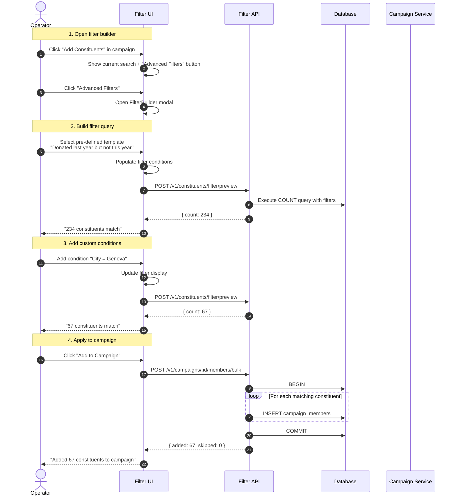

# 30 — Advanced Constituent Filters for Campaigns

> **Status**: Implemented — Epic #418, PR #421
> **Owner**: MVP Engineer  
> **Related**: [`docs/23-postal-campaigns.md`](23-postal-campaigns.md) §2.3 Campaign Members · [`docs/glossary-npo.md`](glossary-npo.md) NPO terminology · [`docs/28-bulk-import.md`](28-bulk-import.md) Bulk operations · [`docs/29-global-search.md`](29-global-search.md) GLO-001 search
> **Companion ADR**: [`docs/adrs/adr-033-advanced-filter-architecture.md`](adrs/adr-033-advanced-filter-architecture.md)

## 0. Why this exists — at a glance

NPOs need to select constituents for campaigns based on complex criteria like "donors who gave last year but not this year" (LYBUNT) or "recurring monthly donors in Geneva with lifetime value > €500". The current implementation only supports basic text search, forcing operators to manually select constituents one by one — a process that doesn't scale beyond a few dozen recipients.

Advanced filters ship **Salesforce NPSP-like segmentation** as a first-class feature so operators can:

1. **Build complex queries** using intuitive UI components with AND/OR logic
2. **Use pre-defined templates** for common NPO patterns (LYBUNT, major donors, etc.)
3. **See real-time counts** of matching constituents before applying
4. **Save and reuse filters** across campaigns and team members

## 1. User Flow



## 2. Filter Categories

### 2.1 Donation History Filters
- **Last donation date**: Before/after/between specific dates
- **Total donated**: Lifetime or within date range (>, <, =, between)
- **Donation count**: Number of gifts
- **Average gift size**: Mean donation amount
- **Largest gift**: Maximum single donation
- **First gift date**: Acquisition date
- **Campaign-specific**: Donated to specific campaigns

### 2.2 Donation Patterns
- **LYBUNT**: Donated last year but not this year
- **SYBUNT**: Donated some year but not this year  
- **Recurring donors**: Regular giving pattern detected
- **Lapsed donors**: No donation in X months
- **New donors**: First gift within X months
- **Upgraded donors**: Increased giving amount

### 2.3 Demographics
- **Location**: Country, canton, city, postal code
- **Language**: Preferred communication language
- **Type**: Individual, household, organization
- **Tags**: Custom constituent tags
- **Age**: Birthday-based filtering

### 2.4 Engagement
- **Email status**: Valid, bounced, unsubscribed
- **Communication preferences**: Email, postal, SMS
- **Last contact date**: Recent engagement
- **Campaign participation**: Previous campaign member

### 2.5 Calculated Metrics
- **Lifetime value**: Total historical giving
- **Giving frequency**: Gifts per year
- **Recency score**: Months since last gift
- **Engagement score**: Combined metric

## 3. Technical Architecture

### 3.1 Query DSL Structure
```typescript
interface FilterQuery {
  operator: 'AND' | 'OR';
  conditions: Array<{
    field: string;
    operator: FilterOperator;
    value: any;
    // Optional nesting for complex queries
    subConditions?: FilterQuery;
  }>;
  // Pre-defined pattern detection
  patterns?: Array<'LYBUNT' | 'SYBUNT' | 'RECURRING'>;
}

type FilterOperator = 
  | 'eq' | 'neq' 
  | 'gt' | 'gte' | 'lt' | 'lte'
  | 'between' | 'in' | 'notIn'
  | 'contains' | 'startsWith' | 'endsWith'
  | 'exists' | 'notExists';
```

### 3.2 Component Architecture
```
packages/web/src/components/constituents/filters/
├── FilterBuilder.tsx       # Main container component
├── FilterChip.tsx         # Individual filter display
├── FilterPresets.tsx      # Template selector
├── FilterCondition.tsx    # Single condition editor
├── FilterPreview.tsx      # Results count display
├── filter-types.ts        # TypeScript definitions
├── filter-presets.ts      # Pre-defined templates
└── index.ts              # Public exports
```

### 3.3 API Endpoints
- `POST /v1/constituents/filter` - Execute filter query
- `POST /v1/constituents/filter/preview` - Get count only
- `GET /v1/constituents/filter/suggestions` - Field value suggestions
- `POST /v1/campaigns/:id/members/filter` - Add filtered results to campaign
- `POST /v1/constituents/filter/save` - Save filter for reuse
- `GET /v1/constituents/filter/saved` - List saved filters

## 4. Pre-defined Filter Templates

### 4.1 Donor Segmentation
```typescript
const templates = {
  lybunt: {
    name: 'Donated last year but not this year',
    query: {
      operator: 'AND',
      conditions: [
        {
          field: 'donations.lastDate',
          operator: 'between',
          value: [lastYearStart, lastYearEnd]
        },
        {
          field: 'donations.thisYear',
          operator: 'eq',
          value: 0
        }
      ]
    }
  },
  majorDonors: {
    name: 'Major donors (€1000+ lifetime)',
    query: {
      operator: 'AND',
      conditions: [
        {
          field: 'donations.lifetime',
          operator: 'gte',
          value: 1000
        }
      ]
    }
  },
  // ... more templates
};
```

### 4.2 Geographic Templates
- Local supporters (by canton/city)
- Regional campaigns
- International donors

### 4.3 Engagement Templates  
- Active email subscribers
- Postal-only constituents
- Multi-channel supporters

## 5. Performance Considerations

### 5.1 Database Indexes
```sql
-- Optimize common filter patterns
CREATE INDEX idx_donations_constituent_date 
  ON donations(constituent_id, donation_date DESC);

CREATE INDEX idx_donations_amount_date 
  ON donations(amount, donation_date) 
  WHERE amount > 0;

CREATE INDEX idx_constituents_location 
  ON constituents(city, postal_code, canton);

-- Materialized view for expensive calculations
CREATE MATERIALIZED VIEW constituent_metrics AS
SELECT 
  constituent_id,
  COUNT(*) as donation_count,
  SUM(amount) as lifetime_value,
  AVG(amount) as avg_gift,
  MAX(amount) as largest_gift,
  MAX(donation_date) as last_donation_date,
  DATE_PART('month', AGE(NOW(), MAX(donation_date))) as months_since_last
FROM donations
GROUP BY constituent_id;
```

### 5.2 Query Optimization
- Use materialized views for aggregations
- Implement query result caching
- Paginate large result sets
- Background processing for exports

## 6. UI/UX Principles

### 6.1 Progressive Disclosure
- Start with simple search
- Reveal advanced options on demand
- Show common templates first
- Allow custom field selection

### 6.2 Visual Feedback
- Real-time count updates
- Loading states during calculation
- Clear filter chip display
- Validation messages

### 6.3 Mobile Responsive
- Touch-friendly controls
- Simplified mobile layout
- Swipe to remove filters
- Bottom sheet on mobile

## 7. Implementation Phases

### Phase 1: Core Filtering (Current)
- Basic filter UI components
- Common donation/demographic filters
- Pre-defined templates
- Real-time preview

### Phase 2: Advanced Features
- Save/load filters
- Filter sharing between users
- Complex nested conditions
- Custom calculated fields

### Phase 3: AI Enhancement
- Natural language query parsing
- Smart filter suggestions
- Predictive analytics
- Anomaly detection

### Phase 4: Integration
- Export filtered lists
- Email campaign integration
- Report generation
- API access

## 8. Success Metrics

- **Query Performance**: < 2 seconds for 10k constituents
- **Adoption**: 80% of campaigns use filters vs manual selection
- **Time Savings**: 90% reduction in constituent selection time
- **Accuracy**: < 1% false positive/negative rate

## 9. Related Documents

- [NPO Glossary](./glossary-npo.md) - Domain terminology
- [ADR-033](./adrs/adr-033-advanced-filter-architecture.md) - Technical decisions
- [Campaign Management](./23-postal-campaigns.md) - Parent feature
- [Bulk Import](./28-bulk-import.md) - Related bulk operations