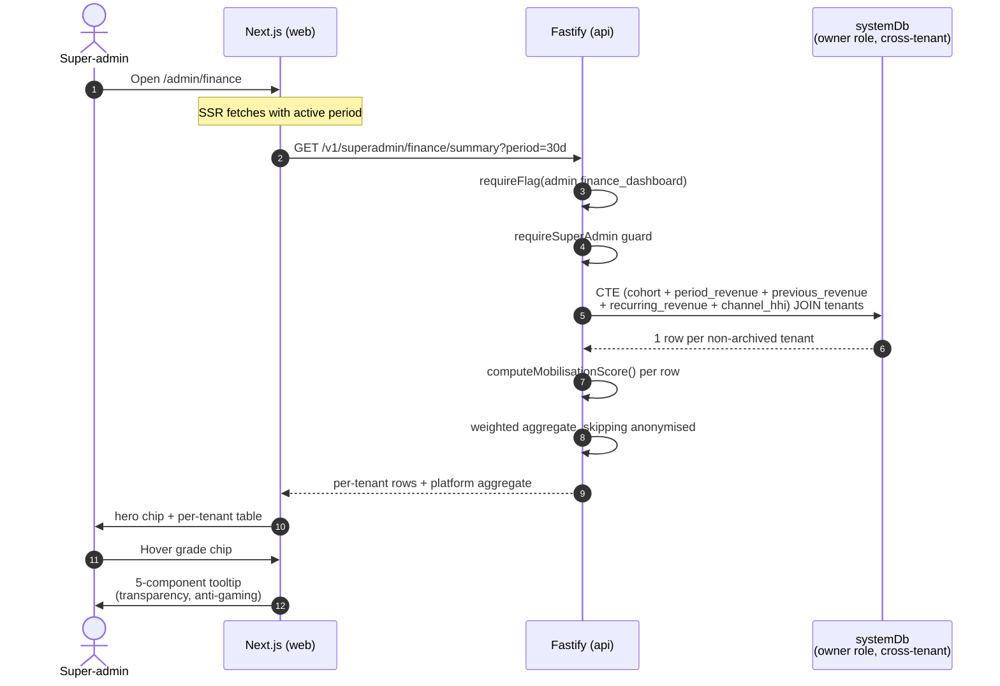
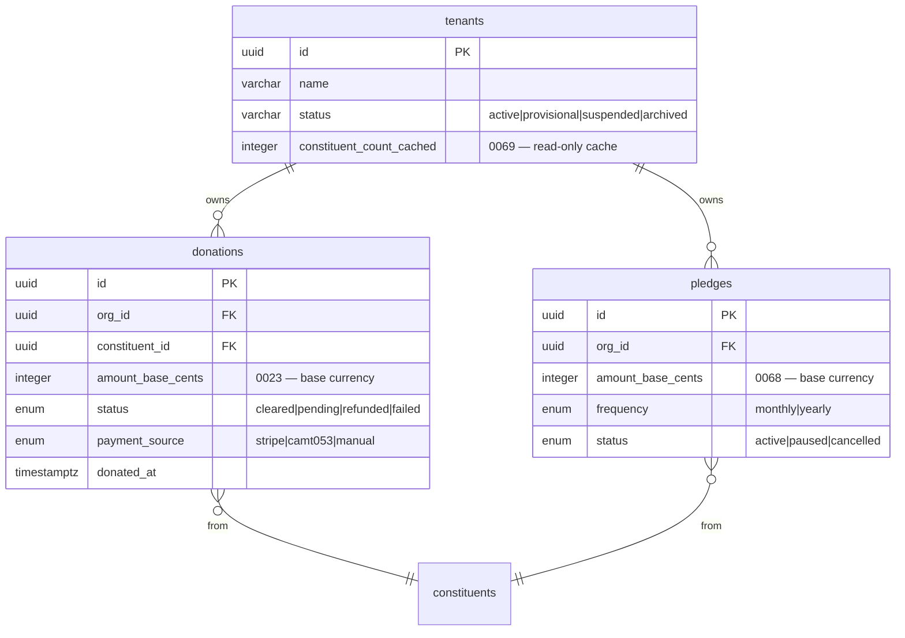

# 31 — Tenant Mobilisation Score

> **Status**: Implemented — Epic [#434](https://github.com/onigam/givernance/issues/434), issue [#438](https://github.com/onigam/givernance/issues/438)
> **Owner**: Super-admin / Finance surface
> **Related**: [`04-business-capabilities.md`](04-business-capabilities.md), [`06-security-compliance.md`](06-security-compliance.md), [`15-infra-adr.md`](15-infra-adr.md), [`18-feature-flags.md`](18-feature-flags.md) (`admin.finance_dashboard`), [`32-survey-infrastructure.md`](32-survey-infrastructure.md) (sibling — supplies PMF/NPS/CSAT aggregates), epic [#434](https://github.com/onigam/givernance/issues/434)
> **Visual source**: [`docs/design/admin/dashboard.html`](design/admin/dashboard.html) — hero block + per-tenant tooltip
> **No new tables** — the score is a derived projection. Read sources: `donations`, `pledges`, `tenants`.

## 0. Why this exists — at a glance

The Mobilisation Score is **the one composite indicator a super-admin can look at and instantly know which tenants are thriving, which are coasting, and which need a CSM intervention before they churn**. It rolls five orthogonal signals — donor activation, recurring-revenue depth, raw scale, period-over-period growth, and channel diversity — into a single A+ → D grade per tenant and a volume-weighted platform aggregate. The score is **pure transparency**: every chip exposes its five components in a tooltip, so a tenant who asks "why am I a B?" gets a five-row breakdown, not a black box. The score's purpose is **prioritisation of CSM time**, not gating of features or pricing — a D-grade tenant is a tenant to call, not a tenant to throttle.

## 1. The score at a glance

### Five components, fixed weights

| Component | Weight | What it measures | Where the signal comes from |
|---|---:|---|---|
| **Activation** | 25 % | Share of the all-time donor cohort that gave at least one cleared donation in the current period | `donations` (`status = 'cleared'`, `donated_at`, distinct `constituent_id`) |
| **Récurrence** | 25 % | Share of the period's revenue (base currency) attributable to active recurring pledges | `pledges` (`status = 'active'`, `amount_base_cents`, `frequency`) normalised to monthly |
| **Échelle** | 20 % | Total cleared-donation revenue in the period (base currency) on a log curve | `donations.amount_base_cents` (added 0023, finalised for multi-currency 0065/0068) |
| **Croissance** | 20 % | `(period − previous period) / previous period`, clamped to `[-1, +1]` | `donations.amount_base_cents` over two consecutive equal-length windows |
| **Diversité** | 10 % | `1 − HHI` on payment-source revenue share | `donations.payment_source` (`stripe`, `camt053`, `manual`) |

**Weights sum to 100**, asserted in `packages/shared/src/mobilisation/__tests__/score.test.ts`. The re-evaluation hook (§ 7) describes how to re-weight without a code change.

### Grade bands

| Grade | Score | Read-as |
|---|---|---|
| **A+** | ≥ 90 | Exceptional mobilisation — case-study material |
| **A** | 75 – 89 | Strong, healthy growth |
| **B** | 60 – 74 | Solid, room to grow |
| **C** | 40 – 59 | Underperforming, CSM attention |
| **D** | < 40 | At-risk, schedule an outreach call |
| **—** | n/a | K-anonymised (< 5 unique donors in the period) |

### Formula

```
score = (activation × 25 + recurrence × 25 + scale × 20 + growth × 20 + diversity × 10) / 100
```

Each component is **clamped to `[0, 100]` BEFORE weighting** — no single outlier component can pull the total above 100 or below 0. The final score is rounded to whole numbers for display only; the underlying float is preserved for the platform aggregate.

## 2. User flow



## 3. Data sources (ERD)

The score reads three existing tables and one cache column. **It writes nothing.**



**The score creates no new tables.** A future v2 may cache the daily per-tenant score in a `mobilisation_scores_daily` materialisation if the SQL latency budget is exceeded (see § 8 future work).

## 4. The formula — worked example

Take a synthetic tenant **"Les Petits Frères"**:

| Signal | Raw value | Component value (0..100) |
|---|---|---|
| Unique donors this period | **120** | (passes k-anonymity ≥ 5) |
| All-time cohort | 200 | Activation = 120 / 200 = 0.60 → **60** |
| Period revenue (base) | €12 500 | Échelle = 20 × log₁₀(12500) = 20 × 4.10 = **82** |
| Recurring monthly (base) | €1 500 / mo, period 1 mo | Récurrence = 1500 / 12500 = 0.12 → **12** |
| Previous-period revenue | €10 000 | Croissance = (12500 − 10000) / 10000 = +0.25 → (0.25 + 1) × 50 = **62.5** |
| Channel HHI (Stripe 80%, manual 20%) | 0.68 | Diversité = (1 − 0.68) × 100 = **32** |

Weighted:

```
score = (60 × 25 + 12 × 25 + 82 × 20 + 62.5 × 20 + 32 × 10) / 100
      = (1500 + 300 + 1640 + 1250 + 320) / 100
      = 5010 / 100
      = 50.1  →  C
```

→ Grade **C**, score **50**. The CSM tooltip would highlight: "Récurrence faible (12 / 100) — la plus grosse opportunité d'amélioration."

## 5. K-anonymity & GDPR posture

### K-anonymity gate

Tenants with **fewer than 5 unique donors** in the period (`K_ANONYMITY_THRESHOLD = 5`) are **anonymised**:

- The five components ARE still computed (engineering / DPO can inspect them in logs).
- The public `grade` and `score` are returned as `null`.
- The UI renders `—`, not `D`. A grade of D on a 3-donor tenant would be statistically meaningless AND would functionally identify that tenant in any aggregated breakdown (anyone with knowledge of "the small tenant in Lille that does 3 donations a quarter" could re-identify them from the dashboard).

The threshold is **overridable per call** via `opts.kAnonymityThreshold`, exclusively for unit tests. Production callers MUST use the default.

### PII surface

The score itself has **zero PII**. The five inputs are aggregate counts and sums. The per-tenant row carries `tenantName` (already public via the super-admin tenant list) but no constituent identifiers, no email addresses, no donation references.

### SAR / erasure behaviour

The score is **derived** — it has no row of its own to erase. When a constituent invokes their GDPR right to erasure, the underlying `donations.constituent_id` cascade (see [`06-security-compliance.md`](06-security-compliance.md) § Right to erasure) detaches their donations, the cohort count drops by 1, and the next render of the score reflects that reduction. **No additional erasure code-path is required for the score.**

When a tenant is archived (`tenants.status = 'archived'`), the SQL CTE's `WHERE t.status NOT IN ('archived', 'suspended')` filter drops them silently from the platform aggregate — no historical-score back-fill, no orphan row.

## 6. Permissions matrix

| Endpoint | super_admin | org_admin | user | viewer |
|---|---|---|---|---|
| `GET /v1/superadmin/finance/summary` (includes per-tenant mobilisation rows) | **200** | 404 | 404 | 404 |
| `GET /v1/superadmin/finance/summary?tenantId=…` (one-tenant projection) | **200** | 404 | 404 | 404 |
| Per-tenant self-view (`org_admin` sees own grade only) | n/a | **OUT OF SCOPE** | n/a | n/a |

**Out of scope for this PR**: the `org_admin` self-view. A tenant admin will eventually see their own grade in their own dashboard, but the projection shape (which components to expose, whether to show the cohort denominator, how to handle the k-anonymity floor on a single-tenant view) needs UX validation. Tracked in § 8.

The route layer is **flag-gated then role-gated** (in that order, per [`docs/18-feature-flags.md`](18-feature-flags.md)): a non-flagged probe sees a 404 without revealing role requirements.

## 7. Re-evaluation hook

### When to re-weight

The weights `[25, 25, 20, 20, 10]` are an educated first cut, not first principles. **Re-evaluate after 3 months of production data.** Trigger criteria:

- **If every tenant clusters in B/C** (60 ≤ score < 75 for >70% of the platform): the formula is too compressed. Lower the band ceilings or steepen the log curve.
- **If the platform aggregate doesn't track CSM-observed health**: the components are mis-weighted. The platform's gut feel + the score should agree on the bottom decile of tenants. If they don't, re-weight.
- **If Diversité dominates incorrectly** (small tenants with two channels score artificially high): consider raising the unique-donor floor on the diversity component, or capping its contribution.

### How to re-weight without a code change (v2)

The `MOBILISATION_WEIGHTS` constant in `packages/shared/src/mobilisation/score.ts` is the single source. For v2 (post-3-month review), promote it to a row in the `feature_flags` table OR a dedicated `mobilisation_config` row queried at request time by the API layer and passed into `computeMobilisationScore` as an extra opt. **Out of scope for this PR** — until then, a weight change ships as a one-line PR + a comparison-period regression test.

## 8. Future work / out of scope

- **Per-tenant historical trend chart** — daily snapshot of the score for the last 90/180/365 days, rendered as a sparkline next to the chip. Requires a `mobilisation_scores_daily` materialisation.
- **Org-admin self-view** — tenant-facing projection of their own grade + the actionable component (the one with the most upside).
- **Grade-drop alerting** — Slack / email notification when a tenant drops a grade band period-over-period; feeds the CSM "À recontacter" list.
- **Cohort comparison** — peer-group benchmark ("you're in the top 25% of NPOs your size"); requires opt-in.
- **Configurable weights** — admin UI to re-weight without a deploy; see § 7.
- **Score caching** — if p95 of the dashboard render exceeds budget, materialise the score into a daily-refreshed read-model and read from that on the dashboard.
