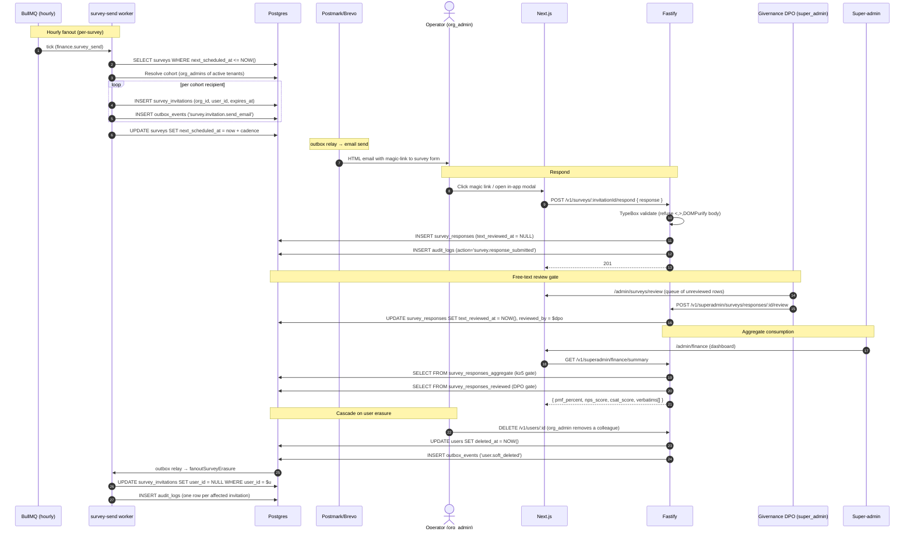

# 32 — Survey Infrastructure (PMF / NPS / CSAT)

> **Status**: Implemented — Epic #434 (issues #435, #436, #437, #439)
> **Owner**: Super-admin Platform
> **Related**: [`06-security-compliance.md`](06-security-compliance.md), [`15-infra-adr.md`](15-infra-adr.md), [`17-log-management.md`](17-log-management.md), [`27-notifications.md`](27-notifications.md), [`31-tenant-mobilization-score.md`](31-tenant-mobilization-score.md) (sibling — consumes survey aggregates), epic #434, sub-issues #435 (schema), #436 (worker), #437 (API), #439 (this doc + erasure cascade)

## 0. Why this exists — at a glance

Givernance's super-admin dashboard tracks **tenant health** through three industry-standard survey instruments:

- **PMF Sean Ellis** — quarterly. "How disappointed would you be if you couldn't use Givernance anymore?" Sean Ellis's threshold is ≥ 40 % "very disappointed" = PMF achieved.
- **NPS** — quarterly on a rotating 25 %/month cohort so every org_admin is surveyed roughly once per year. 0-10 likelihood-to-recommend; score = % promoters (≥ 9) − % detractors (≤ 6).
- **CSAT** — continuous, triggered post-ticket-resolution. 1-5 satisfaction rating.

We **do not** integrate Delighted, Sprig, Pendo, Typeform or any other off-the-shelf survey SaaS. The reasons are GDPR-first, not bikeshedding:

1. **Data residency** — every third-party survey vendor we evaluated stores response PII in the US or routes through a US sub-processor. Tenant emails + free-text answers crossing the Atlantic is a Schrems II problem we do not need to inherit when our entire stack is Scaleway EU.
2. **DPO review gate** — operators expect free-text answers to never appear in any UI until a Givernance DPO has personally reviewed each row for inadvertent PII / accidental third-party-identification (e.g. naming a beneficiary). No third-party tool offers a per-row review gate at the projection layer.
3. **Soft-delete + erasure cascade** — per CLAUDE.md "Soft-delete is universal", every survey row participates in the same GDPR Art. 17 erasure cascade as the rest of the application. Bolting an external vendor onto this would require a parallel SAR / erasure integration we'd rather not maintain.
4. **Cost** — Delighted starts at ~€600/month, Sprig at ~€2000/month, Pendo well beyond. Our usage is bounded (a few thousand sends/quarter); the build cost amortises in months.

The build is small by design: 4 tables, 2 read-side views, one BullMQ send cron, one BullMQ retention cron, one outbox-fanout erasure consumer, three API endpoints, and one super-admin UI. Everything below the API layer is documented here; the dashboard UI and Mobilisation Score consumer are documented in [`docs/31-tenant-mobilization-score.md`](31-tenant-mobilization-score.md).

## 1. Survey kinds & cadences

| Kind | Cohort | Cadence | Channel | Response target |
|---|---|---|---|---|
| `pmf` | 100 % of `org_admin` users of active tenants | Quarterly (90 d `cadence_days`) | `email` + `in_app` modal at next login | ≥ 40 responses for the 40 % threshold to be statistically meaningful |
| `nps` | Rotating 25 %/month cohort of `org_admin` users | Quarterly per user (each user surveyed ≈ 1×/year) | `email` | ≥ 100 responses for ±5 pt confidence |
| `csat` | Ticket requester after a support ticket is resolved | Continuous (no cadence — event-triggered) | `email` post-resolution | No fixed target; rolling 30-day average |

Cohort targeting is encoded in `surveys.cohort_rule` (JSONB) and evaluated by the survey-send worker (#436). Example: `{"role": "org_admin", "tenant_min_age_days": 14}`.

Freshness bands per survey are stored as `freshness_soon_days` and `freshness_stale_days` and drive the dashboard `FreshPip` / `StaleBanner` components (the "1 source périmée" topbar pattern from PR #433).

## 2. User flow

## 3. Domain model

```mermaid
erDiagram
  tenants ||--o{ survey_invitations : "org_id"
  tenants ||--o{ survey_responses : "org_id (denormalised)"
  users ||--o{ survey_invitations : "user_id (ON DELETE SET NULL)"
  surveys ||--o{ survey_invitations : "survey_id"
  surveys ||--o{ survey_launches : "survey_id"
  survey_invitations ||--|| survey_responses : "1:1 via invitation_id"
  platform_admins ||--o{ survey_responses : "reviewed_by (ON DELETE SET NULL)"
  platform_admins ||--o{ survey_launches : "launched_by"

  surveys {
    uuid id PK
    text kind "pmf|nps|csat|custom"
    text slug "URL-safe, partial-unique on deleted_at IS NULL"
    text question_fr
    text question_en
    jsonb options
    jsonb cohort_rule
    int cadence_days
    int freshness_soon_days
    int freshness_stale_days
    int response_target
    timestamptz next_scheduled_at
    timestamptz deleted_at
  }

  survey_invitations {
    uuid id PK
    uuid survey_id FK
    uuid user_id FK "NULLable; SET NULL on user erasure"
    uuid org_id FK
    text channel "email|in_app"
    timestamptz invited_at
    timestamptz expires_at
    timestamptz opened_at
    timestamptz dismissed_at
    timestamptz deleted_at
  }

  survey_responses {
    uuid id PK
    uuid invitation_id FK "UNIQUE (deleted_at IS NULL)"
    uuid org_id FK
    jsonb response "PMF/NPS/CSAT-specific shape"
    timestamptz submitted_at
    timestamptz text_reviewed_at "DPO gate — NULL = invisible"
    uuid reviewed_by FK "→ platform_admins; SET NULL on offboard"
    timestamptz deleted_at
  }

  survey_launches {
    uuid id PK
    uuid survey_id FK
    text channel "email|in_app|schedule"
    uuid idempotency_key "UNIQUE — double-click safety"
    uuid launched_by FK "→ platform_admins"
    int recipient_count
    timestamptz launched_at
  }
```

Survey-table migrations: [`0071_surveys.sql`](../packages/api/migrations/0071_surveys.sql), [`0072_survey_invitations.sql`](../packages/api/migrations/0072_survey_invitations.sql), [`0073_survey_responses.sql`](../packages/api/migrations/0073_survey_responses.sql), [`0074_survey_launches.sql`](../packages/api/migrations/0074_survey_launches.sql), [`0076_survey_views.sql`](../packages/api/migrations/0076_survey_views.sql). A follow-up migration `0077_survey_fk_restrict.sql` (shipped in this same PR) switches the `tenant_id` foreign keys from `ON DELETE CASCADE` to `ON DELETE RESTRICT`, so that tenant deletion routes through the worker's explicit erasure cascade (with audit trail) instead of silently nuking survey responses.

`surveys` and `survey_launches` are **platform-level** (no `org_id`, no RLS, REVOKEd from `givernance_app`). `survey_invitations` and `survey_responses` are **tenant-scoped** with RLS ENABLED + FORCED on `org_id` — and per the CLAUDE.md "RLS is the safety net, never the contract" rule every Drizzle query MUST also carry an explicit `eq(orgId, ctx.orgId)`.

## 4. DPO-review gate (free-text)

Free-text follow-ups (PMF `why_text`, NPS `comment`, CSAT `comment`) are the highest-PII surface in the subsystem — they are open-ended natural-language entered by tenant users about their experience and may inadvertently mention third parties (beneficiaries, donors, colleagues by name). Per epic #434 BLOCKING items, free-text MUST NOT appear in any super-admin projection until a Givernance DPO has personally reviewed and cleared the row.

The gate is enforced at **two layers**:

1. **DB layer** — the `survey_responses_reviewed` view ([migration 0076](../packages/api/migrations/0076_survey_views.sql)) projects `response_text` / `response_why_text` / `response_comment` as `NULL` whenever `text_reviewed_at IS NULL`. A direct SQL query through the `givernance_app` role observes the NULL. The view is created with `security_invoker = true` so the caller's RLS context still applies.
2. **API layer** — the TypeBox response shape on every super-admin survey endpoint (#437) omits free-text fields entirely when `text_reviewed_at` is unset. A buggy frontend that ignores the schema cannot pull a free-text field from a response payload that doesn't carry one.

The two layers are intentional belt + suspenders: a buggy frontend cannot leak unreviewed text because the DB view returns NULL; a buggy API projection cannot leak unreviewed text because the TypeBox shape filters; an SQL-injection-style attack against the API would still hit the view's `NULL` because the projection is at SQL plan level, not application logic.

The DPO workflow itself (a super-admin queue of unreviewed responses with approve/redact buttons) is out of scope for the MVP — until that ships, the `text_reviewed_at` field is updated manually via `psql` by the on-call DPO.

## 5. K-anonymity gate

Per-tenant survey aggregates (PMF %, NPS, CSAT) are **suppressed when fewer than 5 responses** are available. The threshold is enforced at the view layer in `survey_responses_aggregate` via a `HAVING COUNT(r.id) >= 5` clause — rows below the threshold are absent from the view, so the dashboard's "—" + "n<5" badge is the only path through which the suppressed state is visible.

Rationale: in a 2-person tenant a 0/0/1 NPS split tells a super-admin exactly who the one detractor is. The k≥5 threshold makes single-respondent re-identification statistically impossible while still letting us surface health signals for tenants with a reasonable user count.

The aggregate view is REVOKEd from `givernance_app` — only `systemDb` (the super-admin owner pool) can read it. A mistaken tenant-pool query fails loud (`permission denied for view`).

## 6. Permissions matrix

| Endpoint | Guard | Notes |
|---|---|---|
| `POST /v1/superadmin/surveys/:slug/launch` (channel=email) | super_admin only | Idempotency-Key header required; 24 h cooldown per (survey, channel); emits audit_log per launch (#437) |
| `POST /v1/superadmin/surveys/:slug/launch` (channel=in_app) | super_admin only | Same — Idempotency-Key + cooldown + audit |
| `POST /v1/superadmin/surveys/:slug/schedule` | super_admin only | Same — Idempotency-Key + cooldown + audit |
| `GET /v1/superadmin/finance/summary` | super_admin only | Reads `survey_responses_aggregate` view (rows suppressed when n<5) |
| `POST /v1/superadmin/surveys/responses/:id/review` | super_admin (DPO designation) | Sets `text_reviewed_at`, `reviewed_by`; emits audit_log |
| `POST /v1/surveys/:invitationId/respond` | tenant user; `eq(invitation.userId, ctx.userId)` + `eq(orgId, ctx.orgId)` explicit | TypeBox + DOMPurify on free-text; refuses `<`/`>`; returns 404 (not 403) on cross-user pointer |
| `GET /v1/superadmin/surveys/aggregates` (org-admin scoped read, post-MVP) | org_admin reads own tenant's aggregate | Returns suppressed rows when `response_count < 5` |

All super-admin endpoints go through `systemDb` (the BYPASSRLS owner pool); the tenant-facing `POST /respond` goes through the `givernance_app` pool with the standard `withTenantContext` wrapper.

## 7. GDPR posture

| Concern | Posture |
|---|---|
| **Soft-delete** | Every survey table carries `deleted_at` (ADR-021). No hard deletes — even retention sweeps soft-delete. |
| **Erasure cascade** (Art. 17) | `DELETE /v1/users/:id` emits `user.soft_deleted` outbox event inside the soft-delete tx. The worker's `survey-erasure-cascade` consumer NULLs every `survey_invitations.user_id` for the user and emits one `audit_logs` row per affected invitation. The aggregate response count survives (privacy posture: keep the aggregate, drop the identity). |
| **Tenant erasure** | `tenants.id ON DELETE CASCADE` on `survey_invitations` and `survey_responses` — a full tenant purge takes its survey data with it. |
| **Retention** (Art. 5(1)(e)) | 24-month CRON sweep (#436's `finance.survey_retention`) soft-deletes `survey_responses` older than 24 months. Aggregates derived earlier are preserved for historical trend. |
| **SAR export** (Art. 15) | A user's pending invitations are exported via the per-tenant SAR pipeline. PII columns enumerated below. |
| **PII column registry** | The repository does **not yet ship a code/JSON registry artefact** (`pii_column_registry` / `PII_COLUMNS`). The survey PII fields are documented here as the canonical source until that registry exists; the future SAR exporter MUST consume this list: • `survey_invitations.user_id` — recipient identifier (linkable PII) • `survey_responses.response.text` / `.why_text` / `.comment` — free-text (open-ended PII) • `survey_responses.reviewed_by` — DPO identifier (internal personnel, NOT exported per Art. 15(4)) **Follow-up**: No follow-up issue planned for this PR; the registry will be created when the SAR exporter work begins. The PII columns introduced in this epic are listed in this section as the canonical source until then. |
| **DPO review gate** | Free-text invisible until `text_reviewed_at IS NOT NULL`. Enforced at DB view + API TypeBox layer (§4). |
| **k-anonymity** | Per-tenant aggregates suppressed when `response_count < 5` (§5). |
| **Opt-out** | An `org_admin` can dismiss every pending invitation via the per-user settings page (post-MVP); the in-app modal is non-blocking by design. |
| **Cross-border transfer** | Email send goes through Postmark / Brevo EU endpoints — no US sub-processor in the data path. |

## 8. Cost analysis vs alternatives

| Option | One-off | Recurring | Notes |
|---|---|---|---|
| **In-house (this doc)** | ~2 weeks engineering | €0 | Reuses existing BullMQ + Postmark + Postgres infra. |
| Delighted | €0 setup | ~€600 / month | US-headquartered (Qualtrics); EU residency requires Enterprise tier. |
| Sprig | €0 setup | ~€2 000 / month + per-survey | Heavy SDK footprint; designed for in-product surveys, not email cadence. |
| Pendo | €0 setup | €€€ (enterprise) | Bundles analytics we don't need. |
| Typeform | €0 setup | ~€80 / month | No per-row DPO gate, no SAR integration. |

Even at the most aggressive Delighted pricing the build pays back in under a year, and the GDPR posture (data residency, DPO gate, erasure cascade) is irreproducible with any of the vendors above.

## 9. Statistical guardrails

The dashboard surfaces explicit confidence cues so super-admins don't over-interpret early data:

- **PMF threshold**: the 40 % Sean Ellis threshold becomes meaningful at **n ≥ 40 responses**. Below 40, the dashboard renders "n=NN" in the marker and disables the "PMF achieved" celebration state.
- **NPS confidence**: ±5 pt confidence on NPS requires **n ≥ 100 responses** (rough binomial CI). Below 100, the dashboard renders a "représentativité limitée" caveat alongside the score.
- **CSAT rolling window**: CSAT is a 30-day rolling average; the dashboard never shows the lifetime mean (a single old bad month would distort it).
- **K-anonymity gate** (§5): aggregates below n=5 are entirely suppressed at the SQL view layer.

XSS / injection guardrails on the response path:

- `surveys.question_fr` / `surveys.question_en` are interpolated as text nodes only — never `dangerouslySetInnerHTML`. DOMPurify runs at render time; the TypeBox write-time validator refuses `<` and `>` in question text.
- Free-text response fields go through the same DOMPurify + TypeBox pipe at submit.
- Invitation tokens are UUID v4 only (no opaque-token gymnastics needed because the URL is gated on the recipient's session, not on a public token).

## 10. Out of scope / future

Explicitly deferred for the MVP:

- **Multi-question surveys** — every survey is single-question + optional free-text follow-up. Adding multi-question support means a `survey_questions` child table and a more complex response shape.
- **Branching logic** — no "if PMF answer = somewhat, then ask why_more" path. Single-question keeps the form rendering trivial and the response shape flat.
- **Drag-and-drop survey editor** — surveys are seeded by migrations; the super-admin UI shows / launches existing surveys but does not let you create new ones from the browser.
- **SMS channel** — `channel` is `email | in_app` only. SMS would need a per-tenant SMS provider integration we don't have yet.
- **Analytics dashboard for surveys themselves** — open-rate, click-through, time-to-respond. The current dashboard surfaces only the aggregate score + freshness; the meta-stats are out of scope.
- **DPO review queue UI** — until shipped, `text_reviewed_at` is set via `psql` by the on-call DPO. The DB + API gates are in place from day 1; only the operator UI is deferred.
- **`pii_column_registry` artefact** — a shared code/JSON registry of PII columns consumed by the SAR exporter and the erasure cascade. Today the survey PII columns are listed in §7 only; the registry will be introduced as part of the SAR exporter work (no separate follow-up issue planned).
- **Per-user notification opt-out** — survey invitations are not (yet) modelled as a notification type with a `notification_preferences` row. A user who wants to opt out of all surveys must dismiss each in-app modal individually.
