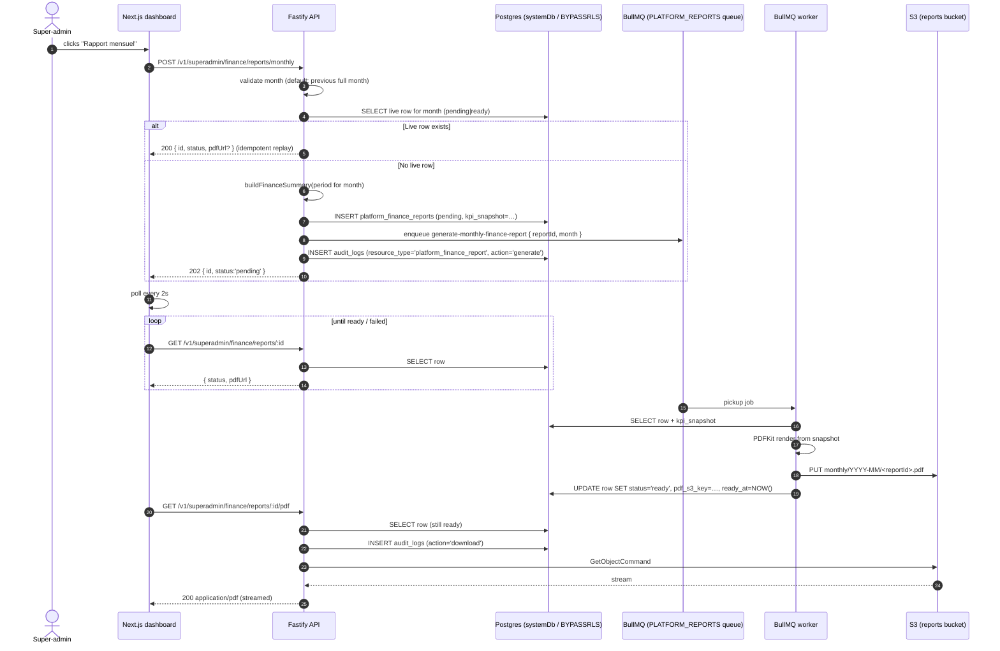
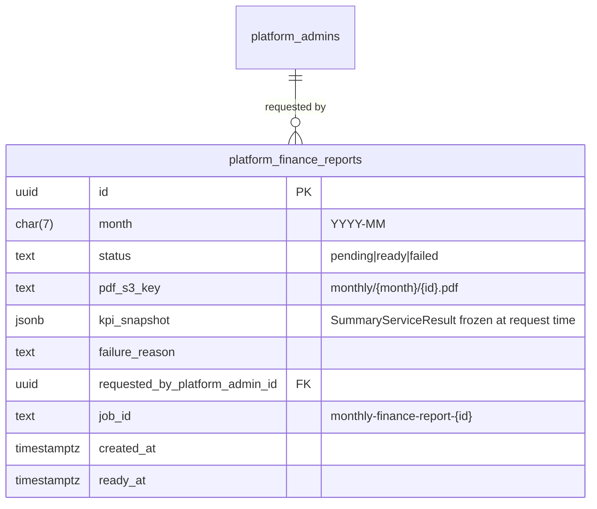

# 33 — Platform monthly finance report (PDF)

> Related: [`docs/14-screen-inventory.md`](14-screen-inventory.md) (super-admin Finance), [`docs/31-tenant-mobilization-score.md`](31-tenant-mobilization-score.md), [`docs/32-survey-infrastructure.md`](32-survey-infrastructure.md), [`docs/15-infra-adr.md`](15-infra-adr.md) (ADR-023 bucket topology), [Epic #434](https://github.com/purposestack/givernance/issues/434), [Issue #443](https://github.com/purposestack/givernance/issues/443).
>
> Migration that ships the schema: [`packages/api/migrations/0079_platform_finance_reports.sql`](../packages/api/migrations/0079_platform_finance_reports.sql).
> Feature flag: gated under the existing `admin.finance_dashboard` (default off; same flag as the rest of Epic #434).
> S3 bucket: `S3_REPORTS_BUCKET` (private, ADR-023).

## 0. Why this exists — at a glance

The super-admin "Finance plateforme" dashboard (Epic #434) is interactive — period selector, currency filter, tenant filter, drill-downs — and the numbers are live, cached for 5 minutes. It does its job for day-to-day operations.

A **monthly PDF snapshot** plays a different role: it's the artefact super-admins keep for the board pack, for accounting reconciliation, and for the GDPR Art. 5(2) accountability story ("here is what the dashboard said on day X for month Y"). The dashboard is a live view; the PDF is a closed-period statement.

This shipped MVP gives super-admins a one-click "Rapport mensuel" button on `/admin/finance` that:
1. Resolves the most recent fully-completed calendar month (default; an explicit `month` body param re-runs an older period).
2. Freezes the full `SummaryServiceResult` payload into a `kpi_snapshot` JSONB column.
3. Streams a PDFKit render into the private `reports` bucket.
4. Returns a same-host URL the browser can download from (streamed through the API per issue #214 — no presigned URLs that leak the MinIO hostname into a SigV4 signature).

Same-month re-clicks are idempotent (one PDF per month). The `kpi_snapshot` is the canonical record of what numbers the super-admin saw, decoupled from later schema/SQL drift.

## 1. End-to-end user flow

**Failure path**: a worker error sets `status='failed'` + `failure_reason`, then BullMQ retries with exponential backoff (`attempts=3`, delay 60s). After all attempts the job lands in BullMQ's `failed` set; the partial unique index is scoped to `('pending','ready')`, so a fresh re-POST creates a new row (the failed row stays as a forensic record).

## 2. Domain model

**Partial unique index** on `(month) WHERE status IN ('pending','ready')` enforces the "one live PDF per month" idempotency contract while leaving older `failed` rows in place. The schema check constraint pins `month` to a real calendar month (`^\d{4}-(0[1-9]|1[0-2])$`).

**Platform-level**: no `org_id`, no RLS. Reads/writes go through `systemDb` (BYPASSRLS owner pool). `REVOKE ALL ON platform_finance_reports FROM givernance_app` so an accidental query through the tenant-scoped pool fails loud.

## 3. Architecture

| Concern | Owner | Notes |
|---|---|---|
| Route handlers | [`packages/api/src/modules/superadmin/finance/routes.ts`](../packages/api/src/modules/superadmin/finance/routes.ts) | Three new routes (POST, GET, GET pdf). Guard chain `requireFlag(ADMIN_FINANCE_DASHBOARD) → requireSuperAdmin` — flag first so a scanner gets 404 without enumerating the role requirement. |
| Service / idempotency | [`packages/api/src/modules/superadmin/finance/monthly-report.ts`](../packages/api/src/modules/superadmin/finance/monthly-report.ts) | Month resolution, snapshot build, INSERT, enqueue. Same-month race collapses to the existing row via the partial unique index (catch + re-SELECT). |
| Snapshot source | [`packages/api/src/modules/superadmin/finance/service.ts`](../packages/api/src/modules/superadmin/finance/service.ts) (`buildFinanceSummary`) | Same SQL as the live dashboard. The 5-min Redis cache covers the typical "view dashboard → click Generate" flow. |
| Worker processor | [`packages/worker/src/processors/generate-monthly-finance-report.ts`](../packages/worker/src/processors/generate-monthly-finance-report.ts) | Reads snapshot from row, renders PDF, uploads, flips status. |
| PDF renderer | [`packages/worker/src/services/platform-report-pdf.ts`](../packages/worker/src/services/platform-report-pdf.ts) | PDFKit; A4; FR locale. 5 sections matching the issue spec. |
| S3 upload | [`packages/worker/src/lib/s3.ts`](../packages/worker/src/lib/s3.ts) (`uploadPlatformReportPdf`) | Private bucket `S3_REPORTS_BUCKET`. ACL=private, SSE=AES256. Key shape: `monthly/{YYYY-MM}/{id}.pdf`. |
| S3 stream-back | [`packages/api/src/lib/s3.ts`](../packages/api/src/lib/s3.ts) (`fetchPlatformReportObject`) | Same `Readable`-piping pattern as receipts / postal exports (issue #214 — keeps URL on the app's apex). |
| Queue | `PLATFORM_REPORTS` in [`packages/shared/src/jobs/index.ts`](../packages/shared/src/jobs/index.ts) | Concurrency 1 per worker pod; bound by S3 upload latency. |
| Frontend | [`packages/web/src/app/(admin)/admin/finance/finance-dashboard.tsx`](../packages/web/src/app/(admin)/admin/finance/finance-dashboard.tsx) | Button restored, polling loop (every 2s, 60-attempt ceiling), `window.location.assign(pdfUrl)` to trigger the download. |
| Service facade | [`packages/web/src/services/SuperAdminFinanceService.ts`](../packages/web/src/services/SuperAdminFinanceService.ts) | `requestMonthlyReport()` + `fetchReport()`. |

**Sync vs async split**: the API runs the SQL aggregation synchronously (warm cache → ~50ms; cold ~1s) so the snapshot is frozen at request time, even if the SQL behind `buildFinanceSummary` later drifts. The PDF render + S3 upload run in the worker so a slow upload doesn't block the HTTP 202.

## 4. Permissions matrix

| Route | super_admin | org_admin / user / viewer | unauth |
|---|---|---|---|
| `POST /v1/superadmin/finance/reports/monthly` | 202 (or 200 replay) | 404 (anti-disclosure) | 401 |
| `POST /v1/superadmin/finance/reports/backfill` | 200 (rate-limited 2/min/IP) | 404 | 401 |
| `GET /v1/superadmin/finance/reports/:id` | 200 / 404 | 404 | 401 |
| `GET /v1/superadmin/finance/reports/:id/pdf` | 200 stream / 409 / 404 | 404 | 401 |

Every route's `preHandler` is `requireFlag(ADMIN_FINANCE_DASHBOARD) → requireSuperAdmin` (order matters — flag-off returns 404 without revealing the role requirement, consistent with the rest of Epic #434).

## 5. Privacy / GDPR posture

- **PII**: none. The report aggregates cross-tenant donation volumes, platform revenue, Stripe fees, and Mobilisation Score; no donor names or emails ever reach the PDF. The "Top 10 tenants" section uses tenant display names (operator-public).
- **k-anonymity gate**: the survey snapshot section honours the `isStatisticallySignificant` flag built by `aggregateSurveys` — surveys below the k-anonymity threshold render as "anonymisé (n=N < seuil k-anonymity)" instead of leaking the score.
- **Audit trail**: every `generate` and `download` writes an `audit_logs` row on the platform sentinel tenant, with `resource_type='platform_finance_report'`, `resource_id=<row.id>`, the super-admin's keycloak `sub` as `user_id` / `actor_id`, and a 16-char SHA-256 prefix of the IP. The `kpi_snapshot` JSONB on the row itself is the canonical record of "what numbers did the super-admin see" — decoupled from later schema drift in donations / pledges.
- **Soft-delete**: `requested_by_platform_admin_id` is `ON DELETE SET NULL`, consistent with ADR-021 — the report stays auditable even after a super-admin is offboarded.
- **Storage isolation**: ADR-023 — the `reports` bucket is **private** (ACL=private, SSE=AES256). Never co-locate with public-read assets (branding). Served back through the API only.

## 5b. Automatic generation + backfill

Two non-manual paths feed into the same `requestMonthlyReport()` flow:

- **Boot-time backfill** — on every API process start, `startMonthlyReportScheduler` walks the last 12 fully-completed calendar months and idempotently enqueues a report for any month that doesn't already have a live row. Failures are logged but never block boot. Keeps the 12-month retention window populated after a fresh deploy.
- **Recurring monthly cron** — the same scheduler also chains a `setTimeout` for `03:30 UTC on the 1st of each month`. On fire it calls `requestMonthlyReport()` for the previous month and re-schedules itself. The timer is `unref()`-ed so it doesn't keep the process alive on its own; an `onClose` Fastify hook cancels it on graceful shutdown.
- **Manual backfill button** — `POST /v1/superadmin/finance/reports/backfill` powers the dashboard's "Backfill 12 mois" secondary button. Rate-limited at 2/min/IP because the 12 sequential `buildFinanceSummary` runs are a real load spike on the SQL pool. Audits as `action='backfill', resource_type='platform_finance_report', resource_id=NULL` with the enqueued/skipped month lists in `new_values`.

**Multi-replica safety** — the cron and the boot-time backfill BOTH check `findLiveByMonth` before INSERTing; concurrent replicas race the partial unique index, and the loser catches the violation + replays the existing row. No coordination service required.

**Flag gating** — both the boot-time backfill and the cron's fire-time fire re-check `ADMIN_FINANCE_DASHBOARD` and no-op when off, so a paused rollout doesn't churn Postgres.

**Tests** — `disableSchedulers: true` on `createServer` opts is the test-only opt-out so integration suites don't enqueue spurious jobs. Production callers always get the scheduler.

## 6. Out of scope (deferred follow-ups)

- **Cadences other than monthly**: weekly / quarterly / annual reports — deferred.
- **Automated email distribution**: a "send to the super-admin team" pipeline is deferred; today the PDF is download-only.
- **Tenant-level branding**: the PDF is platform-branded (Givernance). Per-tenant white-label PDFs for the operator-facing reports are docs/24 territory and unrelated.
- **CSV export of the same data**: covered by issue #442 — separate row of the same toolbar; intentionally not wired in this PR (`feedback_no_anticipatory_ui`).
- **Re-rendering an existing snapshot with a fresh template** (e.g. design refresh while keeping the audit-trail numbers): a future "re-render" route would re-use `kpi_snapshot` without re-querying. Not needed yet.
- **Public projection to the donor-facing site**: never. The report aggregates cross-tenant data and is super-admin-only by design.

## 7. Operating notes

- **DLQ candidate signal**: the dashboard's polling loop runs for up to ~2 min (60 × 2 s). If the row is still `pending` after that, BullMQ has likely failed three times and the job is in the `failed` set — check Loki logs filtered by `worker=platform_reports, dlq=true`.
- **Re-running a failed month**: just re-POST. The partial unique index allows it; the existing `failed` row stays as a forensic record.
- **Local dev**: the bucket is provisioned automatically by the MinIO init container (every `S3_*_BUCKET` in the env schema gets created on boot). If you renamed the env var, restart the `givernance-minio` container.
