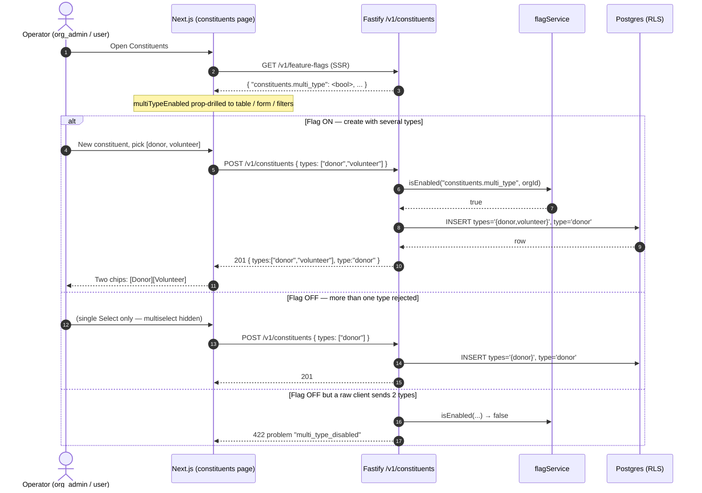
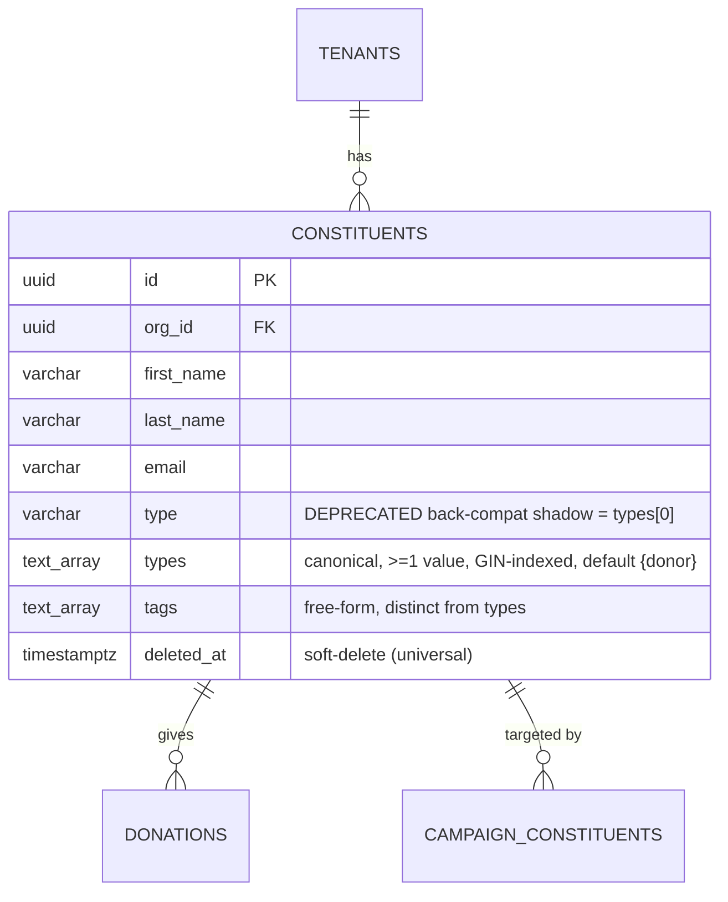

# 34 — Constituents & multi-valued type

> Related: [04-business-capabilities.md](04-business-capabilities.md) · [03-data-model.md](03-data-model.md) · [18-feature-flags.md](18-feature-flags.md) · [28-bulk-import.md](28-bulk-import.md) · [30-advanced-filters.md](30-advanced-filters.md) · [05-integration-migration.md](05-integration-migration.md)
>
> Schema shipped by: [`packages/api/migrations/0083_constituent_types_array.sql`](../packages/api/migrations/0083_constituent_types_array.sql) (array column + GIN index) and [`packages/api/migrations/0084_constituents_multi_type_flag.sql`](../packages/api/migrations/0084_constituents_multi_type_flag.sql) (feature-flag seed).

## 0. Why this exists — at a glance

A **constituent** is any person or organisation an NPO holds a relationship with: a donor, a volunteer, a member, a beneficiary, a partner. Historically Givernance forced each constituent into **exactly one** of those buckets via a single `type` picklist. Real NPOs don't work that way — a donor who also volunteers, a beneficiary who later becomes a member, a partner who donates. Issue #465 makes **type multi-valued**: a constituent now carries a *set* of types (a "tag"-style picklist) instead of one.

The change is **additive and feature-flagged**. The canonical store is a Postgres `types text[]` array; the legacy singular `type` column is kept in lockstep as `types[0]` for one release so nothing breaks mid-rollout. With the `constituents.multi_type` flag **off**, every constituent stays single-typed and the product behaves exactly as before. With it **on**, operators pick one *or more* types and every type-display surface renders all of them as chips.

If you read only this section: **`type` (one value) → `types` (a set); flagged default-off; the singular `type` survives as a deprecated mirror of `types[0]`.**

## 1. User flow

## 2. Domain model

`type` and `types` are the only fields this issue touches; the rest of the `constituents` table is unchanged. `types` is a closed picklist array (same five values as the legacy column).

Allowed `types` values (closed set): `donor`, `volunteer`, `member`, `beneficiary`, `partner`.

`types` is **distinct from `tags`**: `tags` are free-form operator-authored labels; `types` is a fixed-vocabulary role classification.

## 3. Architecture — who owns what

| Concern | Location | Notes |
|---|---|---|
| Schema | [`packages/shared/src/schema/index.ts`](../packages/shared/src/schema/index.ts) `constituents` | `types: text[] NOT NULL DEFAULT '{donor}'` + legacy `type` shadow |
| Migration | `0083_constituent_types_array.sql` (+ `0085_constituent_types_partial_gin.sql`) | additive: add column → backfill `ARRAY[type]` → GIN index; keeps `type`. `0085` makes the GIN index partial (`WHERE deleted_at IS NULL`) to match every sibling constituent index |
| Flag seed | `0084_constituents_multi_type_flag.sql` | `constituents.multi_type`, tenant scope, default-off, public |
| Validators | [`packages/shared/src/validators/index.ts`](../packages/shared/src/validators/index.ts) | `ConstituentCreate/Update` accept `types` (≥1, unique) + legacy `type` |
| Type↔column reconcile | [`packages/api/.../constituents/service.ts`](../packages/api/src/modules/constituents/service.ts) `reconcileTypeColumns` | always writes both columns; `type = types[0]` |
| Multi-type gate | `constituents/routes.ts` `rejectMultiTypeWhenDisabled` | 422 `multi_type_disabled` when flag off + >1 type. NOT a `requireFlag` 404 — core CRUD must stay reachable |
| List filter | `service.ts` `buildListConstituentsWhere` | `types && ARRAY[...]` overlap (GIN-backed); legacy `?type=` folds into the same overlap |
| Sort by type | `service.ts` `buildConstituentOrderBy` | orders on `types[1]` (first element) |
| Advanced filter DSL | `constituents/filters/{types,query-builder,filter.service}.ts` | `constituent.type` field is now array-typed; legacy `eq`/`neq`/`in` translated to `arrayContains`/`arrayOverlaps` so saved segments survive |
| Bulk import (API validate) | `constituents/bulk-import/validation.ts` | a `type` CSV cell splits on `; , \|` into a deduped array |
| Bulk import (worker) | [`packages/worker/.../process-bulk-import.ts`](../packages/worker/src/processors/process-bulk-import.ts) | mirrors the parse; **rejects** a multi-type row as a failed result row (`multi_type_disabled`, parity with the API 422) when the flag is off for the tenant — never silently truncates (defence in depth); keeps `type = types[0]` |
| Salesforce ETL | [`packages/migrate/src/transformers/constituents.ts`](../packages/migrate/src/transformers/constituents.ts) | single SF value → one-element `types` array |
| Web | `packages/web/src/...` constituents module | SSR-fetch flag → multiselect form / multi-chip badges when on, single Select / single badge when off |

**Transaction & RLS boundaries.** All writes go through `withTenantContext` / `withWorkerContext` and carry an explicit `eq(constituents.orgId, …)` predicate in addition to RLS (issue #430). The array filter compiles to a parameterised `types && ARRAY[...]::text[]` — no string interpolation. Everything is synchronous request/response except bulk import, which is the existing async BullMQ pipeline.

**Persisted-segment translation semantics.** The DSL operator translation is exact for the common cases — `eq → arrayContains` ("holds this one type"), `in → arrayOverlaps` ("holds any of these"). `neq` translates to **`NOT arrayContains`** = "does *not* hold this type at all". For single-type rows this is identical to the legacy scalar `!=`; for a genuinely multi-type row `[donor, volunteer]`, a segment `type neq donor` now *excludes* it (it holds `donor`). This is the intended contract and is why no special-casing is needed — but it is the one operator whose meaning shifts on multi-type data, so audit any business-critical saved `neq` segment after enabling the flag. The advanced-filter `constituent.type` field is **array-typed regardless of the flag** (the column is always `text[]`, and filtering by several values is orthogonal to whether a constituent can hold several) — a hard single-select gate would invalidate array-operator segments saved while the flag was on, so it is deliberately not gated. Only the constituent **form** (assignment) is single-value when the flag is off.

## 4. Permissions matrix

No new endpoints — the change rides existing constituent routes; guards are unchanged.

| Endpoint | Guard | Multi-type behaviour |
|---|---|---|
| `GET /v1/constituents` | `requireAuth` | accepts `?types=` (repeatable) + legacy `?type=`; overlap filter |
| `GET /v1/constituents/:id` | `requireAuth` | returns `types` + `type` |
| `POST /v1/constituents` | `requireWrite` | accepts `types`; 422 if >1 and flag off |
| `PUT /v1/constituents/:id` | `requireWrite` | accepts `types`; 422 if >1 and flag off |
| `DELETE /v1/constituents/:id` | `requireOrgAdmin` | unchanged |
| `POST /v1/constituents/:id/merge` | `requireOrgAdmin` | unchanged |
| Advanced filter routes | (existing `advanced_filters` flag) | `constituent.type` is array-typed |

## 5. Privacy / GDPR posture

- `types` is **non-sensitive** role metadata (not GDPR Art. 9 special category). It carries no health/beliefs/etc. data.
- Soft-delete is universal — constituents are never hard-deleted; `deleted_at` propagates as before. `types` rides the row's lifecycle.
- Type changes are captured by the existing `constituent.updated` outbox/audit event (the `changes` payload now includes `types`).
- No new PII fields, no new storage of personal data, no erasure-cascade changes.

## 6. Out of scope (explicit MVP/roadmap split)

> Tracked as follow-up **#515** — blocked until the `constituents.multi_type` flag is enabled everywhere and cleaned up (every reader consumes `types`).

- **Dropping the legacy `type` column.** Kept this release as a back-compat shadow; a follow-up migration removes it once every reader consumes `types` (#515).
- **Per-type metadata** (e.g. "volunteer since", "donor tier"). `types` is a flat set; richer per-role attributes would need a junction table — deliberately not built (#515).
- **Type-change history / audit timeline.** Changes are captured coarsely by `constituent.updated`; a dedicated per-type assignment audit is not in scope (#515).
- **Reworking `tags`.** `tags` (free-form) stays separate from `types` (closed picklist); they are not merged.
- **Public-projection hardening of the flag name.** Same caveat as every public flag (see doc 18) — out of scope here.
