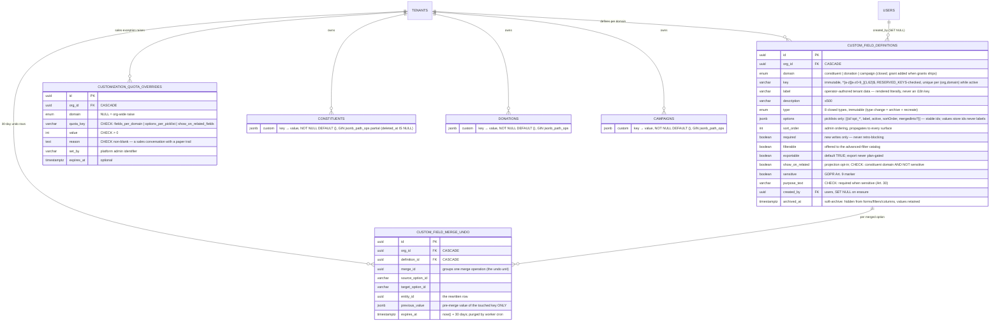

# 35 — Per-organization customization engine (custom fields)

> Related: [04-business-capabilities.md](04-business-capabilities.md) · [18-feature-flags.md](18-feature-flags.md) · [30-advanced-filters.md](30-advanced-filters.md) · [28-bulk-import.md](28-bulk-import.md) · [34-constituents.md](34-constituents.md) · [13-ai-modes.md](13-ai-modes.md) · [08-pricing-packaging.md](08-pricing-packaging.md)
>
> Schema shipped by: [`packages/api/migrations/0086_custom_field_definitions.sql`](../packages/api/migrations/0086_custom_field_definitions.sql) (registry + enums + RLS), [`0087_customization_supporting_tables.sql`](../packages/api/migrations/0087_customization_supporting_tables.sql) (quota overrides + merge-undo store), [`0088_domain_custom_columns.sql`](../packages/api/migrations/0088_domain_custom_columns.sql) (three `custom` JSONB columns + GIN indexes), [`0089_custom_fields_flags.sql`](../packages/api/migrations/0089_custom_fields_flags.sql) (per-domain flag seeds).
>
> Companion diagram: [`diagrams/custom-fields-flow.mmd`](../diagrams/custom-fields-flow.mmd) · Decision record: [ADR-036](adrs/adr-036-custom-fields-jsonb-registry.md) · Epic: #539 (this document covers the **core wedge**, Phases 1–2; Phases 3–4 are roadmap, see § 7)

## 0. Why this exists — at a glance

Client feedback (field calls, 2026-07) is unambiguous: without custom fields, Givernance reads as "small-org only". Mid-size NPOs (2–5 M€ budgets) disqualify a CRM that cannot hold *their* data shapes — a "Membre du conseil" checkbox, a "Segment donateur" picklist, a per-campaign budget code — without a consultant. The strategic trap is equally clear: **we must not rebuild Salesforce.** NPSP's unlimited flexibility is exactly what produces €75k–275k implementations and the ">50 % of custom fields unused" failure mode our product exists to abolish.

Our answer is **governed flexibility**: typed custom fields per **(organization × domain)** — constituent, donation, campaign — on a deliberately closed engine:

- **8 field types**, closed set (`text`, `long_text`, `number`, `date`, `boolean`, `picklist`, `multi_picklist`, `currency`). No formula, roll-up, lookup, file, or user-reference types — ever (refused Salesforce traps, § 7).
- **One `custom` JSONB column per domain table** validated against a per-org registry (`custom_field_definitions`) — never per-tenant DDL, never EAV (ADR-036).
- **Picklists with a rename-never-delete lifecycle**: options carry stable `opt_*` ids, values store ids never labels, so renaming is free; merging duplicates is the only data rewrite, and it ships with a dry-run count, a chunked audited backfill, and a 30-day undo window.
- **Published quotas** (10/25/50 fields per domain by plan) with usage meters — scarcity as a feature, the anti-sprawl story sold openly.
- **Full pipeline integration**: forms, detail pages, sortable list columns, the advanced-filter DSL, CSV export (never plan-gated), the bulk-import template, and cross-domain **projection** (a donation shows its donor's opted-in custom fields).
- **GDPR-native**: Art. 9 `sensitive` marker forcing an Art. 30 `purpose_text`, structural exclusion of sensitive fields from projection, log redaction of all values, erasure cascade including a sensitive-value strip on donations under legal hold.

Everything ships behind three per-domain feature flags, default-off. A 3-person NPO never sees the machinery.

> Positioning line: *"Salesforce lets you make a mess. Creatio lets you make it faster. Givernance helps you not make one."*

If you read only this section: **org admins define typed fields per domain in minutes; values live in one validated JSONB column per table; picklists rename in place and merge with undo; quotas are published, export is never gated, sensitive data is structurally fenced — and none of it is per-tenant DDL.**

## 1. User flow

Happy path: an org admin creates a picklist field, an operator fills it, filters on it, and exports. Error branches: quota exceeded at creation, invalid value at write, flag off → 404.

```mermaid
sequenceDiagram
    autonumber
    actor Admin as Org admin
    actor Op as Operator
    participant Web as Next.js (settings / constituents)
    participant API as Fastify /v1/custom-fields + domain routes
    participant Flag as flagService
    participant Redis as Redis (catalog cache, 60 s)
    participant DB as Postgres (RLS)

    Note over Admin,DB: 1. Admin creates a picklist field
    Admin->>Web: Settings → Custom fields → New field ("Segment donateur", picklist)
    Web->>API: POST /v1/custom-fields { domain:"constituent", key:"segment_donateur", type:"picklist", options:[…] }
    API->>Flag: requireFlag("constituents.custom_fields") — FIRST preHandler
    alt Flag off
        API-->>Web: 404 (surface does not exist)
    else Flag on
        API->>DB: count non-archived defs (org, domain) + read quota overrides
        alt Quota reached (e.g. 10/10 on starter)
            API-->>Web: 422 problem "quota_exceeded" (names the limit)
            Web-->>Admin: Quota meter full — archive a field or contact sales
        else Within quota
            API->>DB: INSERT custom_field_definitions (key immutable, opt_* ids minted)
            API->>Redis: UNLINK customfields:{orgId}:* (all 3 domains)
            API-->>Web: 201 { definition }
            Web-->>Admin: Field live; quota meter "8 / 10 fields"
        end
    end

    Note over Op,DB: 2. Operator fills the field
    Op->>Web: Edit constituent → "Segment donateur" = "Grand donateur"
    Web->>API: PUT /v1/constituents/:id { …, custom: { segment_donateur: "opt_a1b2c3d4" } }
    API->>Redis: getActiveDefinitions(orgId,"constituent") (cache-hit or DB read)
    API->>API: validateCustomPatch — merge-patch over existing blob
    alt Unknown key / inactive option / bad type
        API-->>Web: 422 problem + [{ key, code:"unknown_option", … }]
    else Valid
        API->>DB: UPDATE constituents SET custom = merged WHERE id AND org_id = ctx.orgId
        API-->>Web: 200 (custom serialized through definition-driven serializer)
    end

    Note over Op,DB: 3. Filter and export
    Op->>Web: Filter builder → "Segment donateur = Grand donateur" + LYBUNT
    Web->>API: GET /v1/constituents?filters={custom.segment_donateur eq opt_…}
    API->>DB: WHERE custom @> '{"segment_donateur":"opt_…"}' (GIN) AND org_id = …
    API-->>Web: page of matches + count
    Op->>Web: Export CSV
    Web->>API: GET /v1/constituents/export.csv?filters=…
    API-->>Web: CSV — one column per exportable def, option ids resolved to labels
```

The option-merge lifecycle (dry-run → 202 → chunked backfill → undo) is drawn in full in [`diagrams/custom-fields-flow.mmd`](../diagrams/custom-fields-flow.mmd).

## 2. Domain model

Three new tables plus one `custom` JSONB column on each of the three domain tables. All three tables are tenant-scoped: RLS enabled + forced on `org_id`, **and** every query carries the explicit `eq(orgId, ctx.orgId)` predicate (issue #430 — RLS is the safety net, never the contract).



**Value encoding** (server-authoritative, [`packages/shared/src/custom-fields/validator.ts`](../packages/shared/src/custom-fields/validator.ts)): `text` ≤ 2000 chars / `long_text` ≤ 10 000; `number` finite; `date` = `'YYYY-MM-DD'` string; `boolean`; `picklist` = one `opt_*` id; `multi_picklist` = deduped id array; `currency` = **integer cents, org base currency only in v1** (reuses the filter engine's `valueUnit:'cents'`). Null never persists: absent key ≡ null ≡ "is empty"; writing `null`/`""`/`[]` clears the key. Archived-definition values stay in the blob untouched (read-only on detail + exports) — the validator preserves unknown keys in the *existing* blob but rejects them in a *patch*.

**Quota-override grants** are SELECT-only for `givernance_app` (write bits revoked in `0087`): raises are written exclusively through the owner role — in Phases 1–2 via the operator runbook ([`docs/runbooks/customization-quota-override.md`](runbooks/customization-quota-override.md)); the tenant-side quota check only reads them.

## 3. Architecture — who owns what

| Concern | Location | Notes |
|---|---|---|
| Shared types, quotas, reserved keys, validator | [`packages/shared/src/custom-fields/`](../packages/shared/src/custom-fields/) | Web-safe subpath (`@givernance/shared/custom-fields`, no Drizzle) — consumed identically by API, worker, and web forms (client-side UX only; server authoritative) |
| Drizzle schema | [`packages/shared/src/schema/customization.ts`](../packages/shared/src/schema/customization.ts) | `customFieldDefinitions`, `customizationQuotaOverrides`, `customFieldMergeUndo` + the two pgEnums; `custom` columns typed `CustomFieldValues` on the three domain tables |
| Migrations | `0086`–`0089` | registry + RLS · supporting tables + app-role REVOKE · `custom` columns + GIN · flag seeds (see header blockquote) |
| Definitions/options CRUD + quota checks | [`packages/api/src/modules/customization/`](../packages/api/src/modules/customization/) | `requireFlag` first → `requireAuth` → `requireOrgAdmin`; 422s name the exceeded quota; every mutation calls `invalidateDefinitionsCache` |
| Value-service seam | [`packages/api/src/modules/customization/lib/value-service.ts`](../packages/api/src/modules/customization/lib/value-service.ts) | `getActiveDefinitions` (cached catalog) · `validateCustomPatch` · `buildCustomSerializer` (the strict-response firewall) · `getProjectableDefinitions` — the only surface domain modules import |
| Value write/read paths | existing constituent / donation / campaign modules | No dedicated value endpoints: create/update payloads accept optional `custom` (merge-patch semantics), read models serialize through definition-driven serializers |
| Cross-domain projection | donation/campaign read models | Donor join extends its SELECT with `constituents.custom`; only projectable keys serialized (§ 6 of the epic); `eq(orgId)` on root **and** join; `deleted_at IS NULL` on the join |
| Filter integration | [`packages/api/src/modules/constituents/filters/`](../packages/api/src/modules/constituents/filters/) | Two-layer registry (static core ∪ per-org `filterable` defs as `custom.<key>`); JSONB resolver branch in the query builder; keys server-resolved — the DSL never carries column names |
| CSV export | constituents module | One column per `exportable` def, option ids → labels, ordered by `sort_order`; honors the active `?filters=` DSL; **never plan-gated** |
| Bulk import | constituents `bulk-import/` + [`packages/worker`](../packages/worker/src/) | Template 1.1: one column per non-archived constituent def, header = label with stable `cf_<key>` alias; worker validates via `buildCustomValidator`, resolves picklist labels case-insensitively to ids, never auto-creates options |
| Merge backfill + undo jobs | `packages/worker/src/` (`custom_fields` queue) | `custom-field-option-merge-backfill` (chunked, idempotent jobId `option-merge-{mergeId}`, audited counts-only) · `custom-field-option-merge-undo-backfill` (chunked restore from undo rows, consumed as it goes) · `custom-field-merge-undo-purge` (daily TTL sweep). Both merge jobs arrive via the transactional outbox (`option_merge_requested` / `option_merge_undo_requested`), never a direct API-side enqueue |
| Admin UI | `packages/web/src/app/(app)/settings/custom-fields/` + [`docs/design/settings/custom-fields.html`](design/settings/custom-fields.html) | Per-domain tabs, create/edit drawer (type immutable, key shown once), option manager (rename / deactivate / merge with dry-run), quota meter, usage column |
| Rendering primitives | `packages/web/src/components/shared/custom-fields/` | `CustomFieldInput` (definition.type → existing form primitives), `CustomFieldValue` (DetailRow + cells), `buildCustomFieldColumns(defs)` spread into the domain column sets |
| Feature flags | [`packages/shared/src/constants/feature-flags.ts`](../packages/shared/src/constants/feature-flags.ts) | `constituents.custom_fields` · `donations.custom_fields` · `campaigns.custom_fields` — default-off, `scope='tenant'`, `tenant_override_allowed=false` (staff-enabled rollout), `public=true` |

**Catalog caching — why 60 s and no flush route.** The active-definition catalog of one (org × domain) is cached in Redis under `customfields:{orgId}:{domain}` with a **60-second TTL** — deliberately ≤ 1 minute so the issue-#449 "cached endpoint ships a flush route" rule does not bite: staleness self-heals within a minute even if invalidation is missed. On top of the TTL, **every** definition mutation (create / patch / archive / reorder / option changes, **sensitive-flag toggles included**) calls `invalidateDefinitionsCache(orgId)`, which `UNLINK`s all three domain keys. The cache is best-effort: Redis failures fall through to a direct Postgres read, never to a 500.

**Sync vs. async.** Everything is synchronous request/response except three things: the **option-merge backfill** (dry-run is a sync count; the real merge returns 202 and rewrites values chunk-by-chunk in a BullMQ job, writing one `custom_field_merge_undo` row per touched entity *before* each rewrite), the **merge undo** (202; the worker restores `previous_value` per entity and deletes each consumed undo row in the same chunk transaction), and the **undo-purge cron** (daily, deletes undo rows past `expires_at`). The merge/undo handoffs are **transactional**: the API writes the outbox row inside the same transaction as the option-state change, and the relay enqueues with a deterministic per-merge jobId — a crash or Redis outage between "option marked merged" and "backfill enqueued" cannot happen. The backfill re-checks `isFlagEnabled` at pickup (defence-in-depth); the purge cron runs unconditionally — retention enforcement, like erasure, is never flag-gated.

**Transaction & RLS boundaries.** All API queries run under `withTenantContext`, worker queries under `withWorkerContext`, and every one carries the explicit `eq(<table>.orgId, ctx.orgId)` predicate in addition to RLS (issue #430) — on PK lookups and on both sides of the donor join too. Integration tests pass under the `api-tests-app` NOBYPASSRLS role (issue #455). The single legitimate owner-pool use is the super-admin quota-override write (`systemDb`, commented).

**The strict-serializer firewall.** Custom values never leave the API as a whole-blob passthrough. Every response surface picks its definition set (active defs for detail/forms, `getProjectableDefinitions` for projection, the `exportable` subset for CSV) and runs the stored blob through `buildCustomSerializer(defs)` — a key-picking serializer that drops everything the chosen definitions don't name. TypeBox response schemas keep `additionalProperties: false` throughout.

**Projection eligibility is per-request.** `show_on_related ∧ ¬sensitive ∧ ¬archived` is recomputed on every `getProjectableDefinitions` call — never baked into cached payloads or SSR-frozen props (epic anti-goal #9). A sensitive toggle takes effect immediately via cache invalidation, and within one 60 s window at absolute worst. Hard cap: 5 projected fields per org, enforced at write time and defensively re-clamped at read time.

**Filter execution.** Picklist/boolean equality compiles to `custom @> '{"key":"opt_x"}'` and is served by the GIN `jsonb_path_ops` indexes; number/date ranges run as unindexed cast expressions (`(custom->>'key')::numeric` / `::date`) — acceptable at NPO scale. **Per-field expression indexes are the documented escape hatch** if a tenant's range filters ever breach the p95 budget: a deliberate, per-key migration decision — never automatic (open question: the exact p95 threshold that triggers one, and its ownership).

## 4. Permissions matrix

Every `/v1/custom-fields*` route places `requireFlag` **first** in the preHandler chain (before role guards) so a disabled surface 404s without leaking role requirements. Cross-tenant ids → 404 (ADR-019). Definition mutations require org admin; catalog reads require any authenticated tenant user.

| Endpoint | Guard | Notes |
|---|---|---|
| `GET /v1/custom-fields?domain=` | `requireAnyFlag(3 domain keys) → requireAuth` | Catalog read-model; response filtered to flag-enabled domains |
| `POST /v1/custom-fields` | `requireFlag(domain) → requireAuth → requireOrgAdmin` | Key regex + `RESERVED_KEYS` + quota + purpose-if-sensitive; 422 `quota_exceeded` names the limit |
| `PATCH /v1/custom-fields/:id` | `requireFlag(domain) → requireAuth → requireOrgAdmin` | label / description / sort / required / filterable / exportable / show_on_related / sensitive+purpose — **never `key` or `type`** (structurally absent from the body schema; Fastify's `removeAdditional` silently drops them, so a body carrying `key`/`type` answers 200 with the row untouched, not 400) |
| `DELETE /v1/custom-fields/:id` | `requireFlag(domain) → requireAuth → requireOrgAdmin` | Soft-archive (`archived_at`); values retained, read-only |
| `POST /v1/custom-fields/:id/restore` | `requireFlag(domain) → requireAuth → requireOrgAdmin` | Un-archive; re-checks the quota and active-key uniqueness (409 `duplicate_key` if the key was recreated meanwhile) |
| `POST /v1/custom-fields/reorder` | `requireFlag(domain) → requireAuth → requireOrgAdmin` | Bulk `sort_order` |
| `POST /v1/custom-fields/:id/options` | `requireFlag(domain) → requireAuth → requireOrgAdmin` | Add option (stable `opt_*` id minted server-side); options-per-picklist quota |
| `PATCH /v1/custom-fields/:id/options/:optId` | `requireFlag(domain) → requireAuth → requireOrgAdmin` | Rename-in-place / deactivate / reorder — never deletes |
| `POST /v1/custom-fields/:id/options/:optId/merge` | `requireFlag(domain) → requireAuth → requireOrgAdmin` | `?dryRun=true` → affected-row count; real call → 202 `{ mergeId, undoExpiresAt }` — the merge transaction itself writes the `custom_field.option_merge_requested` outbox row (relay → chunked audited backfill + undo rows, 30-day TTL); a Redis outage can never strand a half-merged option |
| `POST /v1/custom-fields/:id/options/:optId/merge/:mergeId/undo` | `requireFlag(domain) → requireAuth → requireOrgAdmin` | Reverts a merge inside its 30-day window (`mergedAt`-bounded): re-activates the source option and emits `custom_field.option_merge_undo_requested` in the same transaction; the worker restores `previous_value` per entity and consumes the undo rows. 422 `merge_not_undoable` (wrong/spent mergeId) / `undo_expired` |
| `GET /v1/custom-fields/usage` | `requireFlag → requireAuth → requireOrgAdmin` | Fill-rate + per-option counts; counts < 5 rendered `'< 5'` (k-anonymity) |
| `POST /v1/constituents` · `PUT /v1/constituents/:id` | existing guards (`requireWrite`) | Optional `custom` merge-patch; validated only when `constituents.custom_fields` is on (payload rejected 422 when off); unknown key / inactive option → 422 error list |
| Donation / campaign create + update | existing guards | Same contract under `donations.custom_fields` / `campaigns.custom_fields` |
| `GET` detail/list of the three domains | existing guards | `custom` (and `donorCustom` projection on donations) added via definition-driven serializers when the flag is on; absent when off. **Detail** responses serialize active + archived definitions (values retained, read-only); **list** responses and the projection stay active-only |
| `GET /v1/constituents/export.csv` | `requireFlag(constituents.custom_fields) → requireWrite` | Honors the `?filters=` DSL; `exportable` columns only — archived ones included, labels suffixed `(archived)` (the export is the DSAR vehicle); each download writes a `constituents.exported` audit row (filter hashed); **never plan-gated** (role-gated ≠ plan-gated: bulk PII egress has no viewer-role use case) |
| `GET /v1/constituents/filter/fields` | existing `advanced_filters` gate | Catalog enriched with `category:'custom'` entries (`label`, `labelKind:'literal'`, `uiType`, `options`, `valueUnit`, `nullable`) |
| Quota-override writes | super-admin surface only | No tenant-facing endpoint; rows written via `systemDb` (owner pool) with mandatory `reason`, audited |
| Worker: `custom-field-option-merge-backfill` | `isFlagEnabled` re-check at pickup | `withWorkerContext(orgId)` + explicit `eq(orgId)`; counts-only audit rows |
| Worker: `custom-field-merge-undo-purge` | unconditional (daily cron) | Retention enforcement is never flag-gated |

**Off-state QA contract**: with a domain flag off, its settings tab, form section, list columns, filter category, export columns, import-template extension, and `donorCustom` projection are completely absent; its routes return 404 — not 403, not blank.

**Audit actions**: `custom_field.created|updated|archived|restored|reordered`, `custom_field.option_added|renamed|deactivated|merged`, `custom_field.option_merged|option_merge_undone` (route-side, ids only), `custom_field.option_merge_backfilled|option_merge_undo_backfilled` (worker-side, counts + ids only — see § 6), `constituents.exported` (CSV egress trail).

**422 error contract for invalid custom values** (uniform across the three domains): title `custom_field_validation_failed`, error list under the `custom_field_errors` extension — keys + codes only, never the submitted values.

> Implementation note: every `/v1/custom-fields*` route mounts `requireAnyFlag(3 domain keys)` as the FIRST preHandler (404 when all three are off); `:id` routes additionally pre-resolve the row and 404 — with no side effects — when the row's own domain flag is off. A `GET /v1/custom-fields?domain=<disabled>` with at least one *other* domain flag on answers an empty filtered list, not a 404.

## 5. Quotas & tiers (published)

Quotas are a product feature, not a hidden limitation — they are the anti-NPSP-sprawl story and are published here and in pricing. Constants live in [`packages/shared/src/custom-fields/limits.ts`](../packages/shared/src/custom-fields/limits.ts); 422 responses name the exceeded quota; the admin UI shows the meter permanently ("14 / 25 fields").

| Quota | Starter | Growth | Pro | Platform ceiling |
|---|---|---|---|---|
| Fields per domain | 10 | 25 | 50 | **50** |
| Options per picklist | 50 | 100 | 100 | **100** |
| `show_on_related` (projected) fields | 0 | 5 | 5 | **5** |
| CSV export of custom columns | ✅ | ✅ | ✅ | **never gated** |

**Tier-name reconciliation** (epic open question #1, decided in this PR): the pricing tiers (doc 08) are **Starter / Growth / Pro**; the code-side `tenants.plan` strings are `starter` / `pro` / `enterprise` (`TENANT_PLAN_VALUES`). Mapping: Starter → `starter`, Growth → `pro`, Pro → `enterprise`. There is **no** `"growth"` plan string. An unknown plan value resolves to the most restrictive tier (`starter`), never throws. This table awaits formal pricing sign-off on the numbers; the mechanism is final.

Archived definitions never count against a quota. Raises beyond a plan — but never beyond the platform ceiling — go through `customization_quota_overrides`: super-admin only, mandatory non-blank `reason`, optional expiry. A sales conversation with a paper trail, not a toggle. **Write path in Phases 1–2**: there is no super-admin endpoint yet — overrides are inserted by an operator via owner-role SQL following [`docs/runbooks/customization-quota-override.md`](runbooks/customization-quota-override.md); the tenant-side quota check reads them (SELECT-only grant for `givernance_app`). The governed endpoint (reason-mandatory body, audit row, RBAC/flag tests) is a fast-follow (§ 7).

## 6. Privacy / GDPR posture

- **Custom values are unredactable PII by default** — the platform cannot know what an operator puts in a free-text field. `PINO_REDACT_PATHS` covers `body.custom.*`, `custom.*`, `donorCustom.*` (+ snake variants) with a redact-coverage test; `sanitizeAuditDiff` strips the `custom` blob from entity diffs, recording only `{ customKeysChanged: [keys] }`. Definition/option/quota **metadata** is not PII and gets full audit diffs.
- **Art. 9 sensitive classification is mechanism, not guidance**: `sensitive=true` forces a non-blank `purpose_text` (Art. 30 record support) — enforced by a 422 *and* a DB CHECK. Sensitive definitions are **structurally** excluded from cross-domain projection (DB CHECK on `show_on_related` + per-request recomputation in `getProjectableDefinitions`) and flagged in the UI (Art. 9 badge) and export headers.
- **Erasure cascade** (never flag-gated): constituent anonymisation sets `custom = '{}'` in the same worker step. **Donation-domain values whose definition is `sensitive=true` are stripped at donor erasure even under the Swiss CO legal hold** — non-sensitive donation values are retained with the financial row. This strip is a merge precondition, not a documentation promise (epic anti-goal #8).
- **DSAR (Art. 15)**: the constituent export includes custom values with definition labels and option labels resolved — a donor sees "Segment donateur: Grand donateur", not `opt_a1b2c3d4`.
- **Soft-delete propagation**: values ride the parent row's lifecycle; the projection join carries `deleted_at IS NULL`, so erased or soft-deleted donors project nothing.
- **Merge undo vs. audit separation**: per-row pre-merge values live only in `custom_field_merge_undo` (30-day TTL, worker-purged); long-retention `audit_logs` rows carry counts + ids only (anti-goal #7). `created_by` / user refs are `SET NULL` on user erasure.
- **K-anonymity**: usage counts below 5 render as `'< 5'` on every admin surface.
- **Sensitive fields never feed autocomplete**: filter suggestions (`/v1/constituents/filter/suggestions`) answer `[]` for `sensitive=true` text fields — a `SELECT DISTINCT` over stored Art. 9 values would let any authenticated user enumerate the tenant-wide value set without record-level access. Sensitive fields stay *filterable* (an operator can type a value they already know); only value *enumeration* is fenced. Picklist options are definition metadata (admin-authored labels, already visible in the catalog), not row data — they keep answering client-side.
- **Reviewer checklist — strict-response firewall**: *custom values in responses go through explicit definition-driven serializers (`buildCustomSerializer`); `additionalProperties: true` or whole-blob passthrough on anything carrying custom values — projections and exports included — is a blocking review finding.*

## 7. Out of scope (explicit MVP/roadmap split)

This document covers the Epic #539 **core wedge** (Phases 1–2). Deliberately not in it:

- **Phase 3 — tags governance.** `constituents.tags text[]` stays untouched as free-form storage; the derived advisory `tag_registry`, the admin tags page (usage counts, pg_trgm duplicate clusters, rename/merge with dry-run + undo), and the `constituents.managed_tags` flag are a follow-up PR pair. Governance will be **advisory only** — a 3-person NPO never hits a permission wall while typing a tag.
- **Phase 4 — the AI schema steward.** Creation-time assist (`ai.field_suggestions`), the weekly structure audit (`ai.structure_audit`, including the suspicious-label detective control for undeclared Art. 9 data), and the `ai_suggestions` table. Everything propose-only, EU-inference-only (Scaleway), schema-metadata-only prompts, k ≥ 5 floors — see [13-ai-modes.md](13-ai-modes.md). **No AI infrastructure exists in the core wedge** (binding anti-goal #3).
- **Cmd+K search of custom values — vetoed, with a revisit note.** Whole-blob `jsonb_to_tsvector` is permanently rejected: it would index sensitive values regardless of flags. Custom fields are **filter-only** in this epic. The only acceptable future mechanisms are per-field expression indexes or an explicit non-sensitive allowlist generated column — either would be its own reviewed design.
- **Per-field expression indexes** — the documented escape hatch for JSONB range-filter performance: a deliberate per-key migration owned by an engineer, never automatic (open question #9: the p95 trigger threshold).
- **Binding anti-goals** (epic § 13, enforced in review): no custom objects/collections in any form; no write-blocking managed tags; no per-field `searchable` flag; no `additionalProperties:true`/whole-blob passthrough; no Mode-3 auto-execution; no per-row pre-merge snapshots in `audit_logs`; no documentation-only Art. 9 controls; no eligibility baked into caches/SSR props. Refused Salesforce traps: no formula/roll-up/lookup/file/user-reference types, no page-layout designer, no per-record or field-level permissions, no user-scriptable automation, no per-tenant DDL, no cross-tenant field sharing; hard quota ceilings with governed overrides only.
- **Out of MVP even within the wedge**: donation/campaign-domain fields in the filter engine (constituent-domain only in v1); per-key merge-conflict UI on constituent merge (survivor wins, missing keys copied); reusable cross-field option sets (open question #7); required-on-existing-rows backfill; multi-currency custom money fields (org base currency only); the super-admin quota-override **endpoint** (Phase 1–2 write path is runbook SQL — see § 5).
- **Adjacent epics custom fields do NOT solve** (epic § 14 — each carries workflow/money semantics JSONB cannot express; each ships as a first-class typed domain *with* `custom` JSONB support from day one): **Grants** (docs/03 § 3.5 design exists; funder-as-constituent inherits the constituent surface), **Bequests** (lifecycle domain posting `gift_type='bequest'` donations), **In-kind multi-valuations** (`gift_type` discriminator + `donation_valuations` child table), **Recurring-donations completion** (pledge lifecycle routes, installment processor, Stripe subscription webhooks). Invariant: *everything settles as a donation row.*
- **Flag graduation** to org-admin self-service (`tenant_override_allowed=true`) — open question #6; rollout starts staff-enabled per tenant.

## 8. References

- [ADR-036 — Custom fields: JSONB + registry over EAV / per-tenant DDL / custom objects](adrs/adr-036-custom-fields-jsonb-registry.md)
- [ADR-033 — Advanced filter architecture](adrs/adr-033-advanced-filter-architecture.md) (the registry/DSL this epic extends) · [30-advanced-filters.md](30-advanced-filters.md)
- [18-feature-flags.md](18-feature-flags.md) (flag machinery) · [28-bulk-import.md](28-bulk-import.md) (template 1.1) · [34-constituents.md](34-constituents.md) (types vs. tags vs. custom fields) · [13-ai-modes.md](13-ai-modes.md) (Phase 4 doctrine) · [08-pricing-packaging.md](08-pricing-packaging.md) (tier names)
- Migrations: `0086_custom_field_definitions.sql` (registry, enums, CHECKs, RLS) · `0087_customization_supporting_tables.sql` (quota overrides SELECT-only for app role; merge-undo store) · `0088_domain_custom_columns.sql` (three `custom` columns + GIN `jsonb_path_ops`) · `0089_custom_fields_flags.sql` (three per-domain flag seeds)
- Mockup: [`docs/design/settings/custom-fields.html`](design/settings/custom-fields.html)
- Epic #539 (multi-agent architecture study 2026-07-17; judge vetoes honored in § 7) · issues #430 (explicit `eq(orgId)`), #455 (dual-role tests), #449 (cache-flush rule — inapplicable at 60 s TTL)
