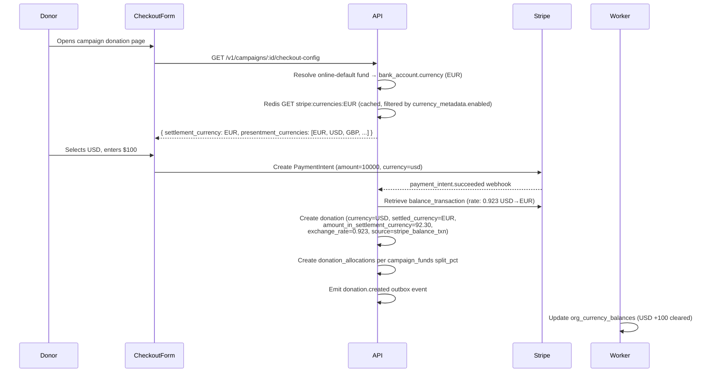
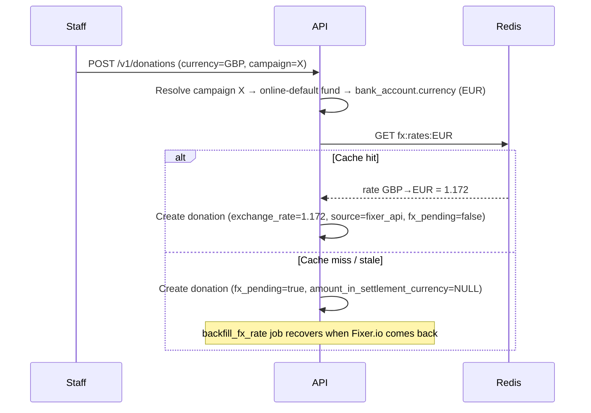
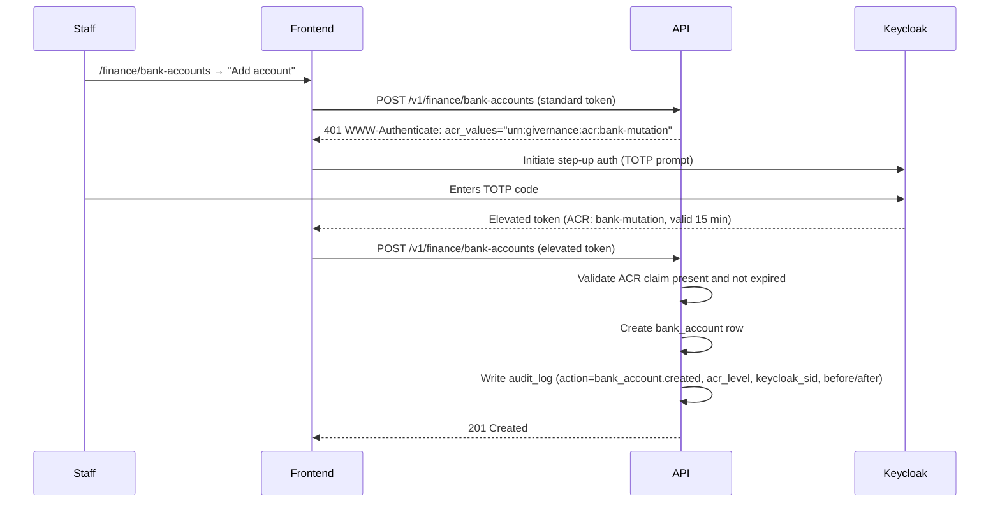

# ADR-032: Multi-Currency Strategy — Fund/Account Settlement Model, FX Rate Policy, Checkout Currency Resolution, UI Display

> Related: [ADR-010 Payment Provider Selection](adr-010-payment-provider-selection.md) · [ADR-029 Keycloak Session Revocation](adr-029-keycloak-session-revocation.md) · [docs/20-payment-strategy.md](../20-payment-strategy.md) · [docs/03-data-model.md](../03-data-model.md) · [docs/25-swiss-qr-bill.md](../25-swiss-qr-bill.md)

**Status**: Implemented — 2026-05-22 (Epic #416, PR #417)
**Supersedes**: v1 (initial multi-currency sketch, same date)

---

## 0. Why this exists — at a glance

Givernance serves European NPOs that receive donations in multiple currencies across multiple fundraising campaigns, each routed to one or more restricted or unrestricted funds, each fund backed by a specific bank account. Without an explicit strategy, the platform risks: mixing accounting currencies in financial reports, losing the actual FX rate applied by Stripe at settlement time, silently rejecting donations below Stripe's per-currency minimums, and exposing bank account details to IBAN-redirect fraud.

This ADR defines: the canonical four-layer currency model and where each layer is stored; how funds bind to bank accounts to determine settlement currency; how campaigns route donations across multiple funds with split percentages; how the checkout form resolves valid presentment currencies from Stripe without exposing fund internals to donors; how bank account mutations are protected by step-up authentication; how the Fixer.io rate cache drives all UI display conversions; and the full design and accessibility specification for the Converted Currency Amount Component.

---

## 1. Context

### 1.1 Four currency layers

Four distinct currency concepts operate independently and must never be conflated:

| Layer | Definition | Example | Anchor |
|---|---|---|---|
| **Presentment** | What the donor pays in | USD | Donor choice at checkout; constrained by Stripe per settlement currency |
| **Settlement** | What Stripe (or the bank) deposits | EUR | `bank_accounts.currency` — fund-specific, not org-specific |
| **Settlement equivalent** | Presentment converted to settlement for accounting | EUR 91.20 | Stored on `donations.amount_in_settlement_currency` |
| **Display** | Staff member's UI preference | DKK | `users.display_currency` — profile regionalisation parameter |

**`orgs.currency_code` is repurposed**: it is retained as a *primary reporting currency* used only in the annual report header and as the default `display_currency` for new users in that org. It plays no role in settlement, FX calculation, or Stripe routing. It must not be referenced in any FX path.

### 1.2 Two exchange rates, two purposes

1. **Stripe balance transaction rate** — the actual FX rate Stripe applied at settlement, inclusive of Stripe's FX margin. Sourced from the `balance_transaction` object on the payment webhook. This is the accounting-grade figure: it matches the org's bank deposit exactly.

2. **Fixer.io mid-market rate** — a reference rate used for:
   - Converting offline donations (manual / cash / bank transfer) to settlement currency for accounting records, when `donations.currency ≠ fund's bank_account.currency`.
   - All display-currency conversions in the UI (dashboards, constituent views, campaign totals).
   - The 24h TTL cached value from Fixer.io is the single source for every display conversion across the platform.

For online Stripe payments, **both rates are stored**. For offline donations where currencies differ, only the Fixer.io rate is used. For same-currency donations, `exchange_rate = 1.0`.

### 1.3 Zero-decimal and special currencies

Stripe requires amounts in the smallest currency unit (ISO 4217 minor unit). Three tiers:

| Tier | Examples | Stripe requirement |
|---|---|---|
| Standard (2 dp) | USD, EUR, GBP, CHF | Cents — 100 = $1.00 |
| Zero-decimal (0 dp) | JPY, KRW, BIF, CLP | Major unit — 100 = ¥100 |
| Special (rounds to int) | HUF, TWD, UGX | Submitted as integers; Stripe rounds internally |

Stripe also enforces **minimum charge amounts** per currency (e.g., $0.50 USD, ¥50 JPY). The platform must enforce these minimums client-side (donation form) and server-side (API guard before calling Stripe).

### 1.4 FX resilience requirement

When Fixer.io is unreachable:
- Online Stripe donations continue to process normally.
- Offline cross-currency donations are recorded with `fx_pending = true` and `amount_in_settlement_currency = NULL`.
- A `backfill_fx_rate` BullMQ job polls for `fx_pending = true` records and fetches the historical Fixer.io rate for each donation's `received_date` once the API recovers.
- The healthcheck reports cache age (hours since last successful fetch) in addition to current reachability. Cache age > 25 hours → `fx_cache_stale`.

---

## 2. Decision

### 2.1 Exchange rate provider: Fixer.io

Fixer.io is selected as the platform's exchange rate provider.

Rationale:
- EU-hosted — consistent with GDPR/data-residency posture.
- 170+ currencies — covers CHF, SEK, NOK, PLN, DKK, and all major European settlement currencies.
- Historical rates API — required by the `backfill_fx_rate` job.
- Daily update cadence matches the 24h TTL cache policy.

**Caching contract**: A scheduled BullMQ job (`refresh_fx_cache`) runs every 24 hours and on startup. It fetches Fixer.io `/v1/latest?base={currency}` for each distinct base currency in the union of:
- The **platform base currency (EUR)** — always warmed, unconditionally (see below).
- All distinct `bank_accounts.currency` values where the account is linked to an active fund.
- All distinct `users.display_currency` values for active users.

Results stored in Redis under `fx:rates:{base_currency}` with TTL 25 hours. A single Redis key per base currency serves all conversion directions for that base. Do not make per-request Fixer.io calls.

**Always warm EUR**: The warm-set unconditionally includes the platform base currency `EUR`, even when no tenant has a bank account or a display-currency override yet. This is load-bearing for the healthcheck (§2.12), which probes `fx:rates:EUR` as its canary: without a guaranteed EUR warm-up, a fresh deploy — or a tenant set that settles entirely in non-EUR currencies — leaves `fx:rates:EUR` cold and flaps the `fx` subsystem to `down` despite a valid `FIXER_API_KEY` and a running worker. The warm-set construction is an exported pure helper (`collectCurrenciesToWarm`) so the always-include-EUR contract is unit-tested without booting Drizzle/Redis/BullMQ.

**Rejected**: ECB/Frankfurter — EUR-base only, ~32 currency pairs, no historical rate API.

### 2.2 Rate storage policy on `donations`

`exchange_rate_source` enum values:

| Value | When used |
|---|---|
| `stripe_balance_txn` | Online Stripe payment; rate sourced from `balance_transaction` object |
| `fixer_api` | Offline donation, cross-currency; Fixer.io cached rate at donation time |
| `backfilled` | Fixer.io historical rate applied post-facto by `backfill_fx_rate` job |
| `manual` | Rate entered manually by finance staff (requires `finance_manager` role + audit note) |
| `same_currency` | Presentment currency = settlement currency; rate = 1.0 |

### 2.3 Schema additions to `donations`

```sql
-- Fee breakdown (in presentment/donation currency)
transaction_fee               NUMERIC(19,4)  NOT NULL DEFAULT 0,
platform_fee                  NUMERIC(19,4)  NOT NULL DEFAULT 0,
forex_fee                     NUMERIC(19,4)  NOT NULL DEFAULT 0,
net_amount                    NUMERIC(19,4)  NOT NULL,  -- amount - all fees

-- Settlement record (from Stripe balance_transaction; NULL for offline donations)
settled_amount                NUMERIC(19,4),
settled_currency              CHAR(3),
stripe_balance_txn_id         TEXT,

-- FX accounting
exchange_rate                 NUMERIC(18,8),
exchange_rate_source          TEXT  CHECK (exchange_rate_source IN (
                                'stripe_balance_txn','fixer_api','backfilled','manual','same_currency'
                              )),
exchange_rate_timestamp       TIMESTAMPTZ,
amount_in_settlement_currency NUMERIC(19,4),  -- equiv. in fund's bank account currency

-- Outage resilience
fx_pending                    BOOLEAN  NOT NULL DEFAULT FALSE
```

Constraints:
- `fx_pending = TRUE` implies `amount_in_settlement_currency IS NULL`.
- `exchange_rate_source = 'stripe_balance_txn'` implies `stripe_balance_txn_id IS NOT NULL`.
- `net_amount = amount - transaction_fee - platform_fee - forex_fee`.

### 2.4 Fund → Bank Account binding

Each fund is bound to exactly one bank account. The bank account's currency is the settlement currency for all donations allocated to that fund.

**Schema addition to `funds`**:

```sql
ALTER TABLE funds
  ADD COLUMN bank_account_id UUID NOT NULL REFERENCES bank_accounts(id);
```

**Extended `bank_accounts` schema** (generalised from Swiss QR-bill scope to first-class entity):

```sql
CREATE TABLE bank_accounts (
  id           UUID     PRIMARY KEY DEFAULT uuid_generate_v7(),
  org_id       UUID     NOT NULL REFERENCES orgs(id),
  label        TEXT     NOT NULL,           -- human-readable: "Main EUR account", "CHF donations"
  iban         TEXT     NOT NULL,
  bic          TEXT,
  holder_name  TEXT     NOT NULL,
  bank_name    TEXT,
  currency     CHAR(3)  NOT NULL,           -- settlement currency for all linked funds
  is_active    BOOLEAN  NOT NULL DEFAULT TRUE,
  -- Swiss QR-bill fields (nullable; set only for CH IBANs)
  qr_iban      TEXT,
  creditor_ref TEXT,
  created_at   TIMESTAMPTZ NOT NULL DEFAULT NOW(),
  updated_at   TIMESTAMPTZ NOT NULL DEFAULT NOW()
);
```

Invariants:
- Multiple funds may reference the same `bank_account_id`.
- A fund cannot be reassigned to a bank account with a different currency once donations have been recorded against it. Currency changes require a new fund + new bank account and migration of open allocations.
- Deactivating a bank account (`is_active = FALSE`) is blocked if any active fund references it.

### 2.5 Campaign → Fund(s) routing with split

A campaign may route donations to one or more funds via a `campaign_funds` junction table.

```sql
CREATE TABLE campaign_funds (
  id                UUID      PRIMARY KEY DEFAULT uuid_generate_v7(),
  org_id            UUID      NOT NULL REFERENCES orgs(id),
  campaign_id       UUID      NOT NULL REFERENCES campaigns(id),
  fund_id           UUID      NOT NULL REFERENCES funds(id),
  split_pct         NUMERIC(5,2),             -- NULL when only one fund (implies 100%)
  is_online_default BOOLEAN   NOT NULL DEFAULT FALSE,
  sort_order        SMALLINT  NOT NULL DEFAULT 0,
  created_at        TIMESTAMPTZ NOT NULL DEFAULT NOW(),
  UNIQUE (campaign_id, fund_id)
);
```

**Invariants** (enforced by API, verified by integration tests):
- If a campaign has exactly one fund, `split_pct` may be NULL and `is_online_default` is implicitly TRUE.
- If a campaign has multiple funds: exactly one row must have `is_online_default = TRUE`; `SUM(split_pct)` must equal 100.00; all `split_pct` values must be non-null.

**The `is_online_default` fund** determines:
1. Which bank account receives online Stripe payment settlement.
2. The settlement currency used to query Stripe for valid presentment currencies at checkout.

**Offline donation allocation**: when a staff member records a manual donation against a campaign, the default split percentages are pre-filled in the allocation form but are editable. The final `donation_allocations` rows record the actual amounts and must sum to `donations.amount`.

**Fund complexity is hidden from donors**: the checkout form never exposes fund names, bank accounts, or split details. Fund routing is resolved server-side after payment confirmation.

### 2.6 Checkout currency resolution

The currencies offered to a donor at checkout derive from the campaign's online-default fund's bank account currency, queried against Stripe's API and cached.

**Resolution flow**:

```
GET /v1/campaigns/:id/checkout-config
  → campaign_funds WHERE is_online_default = TRUE
  → funds.bank_account_id → bank_accounts.currency  (= settlement_currency)
  → Redis GET stripe:currencies:{settlement_currency}
      HIT  → return cached list (filtered by currency_metadata.enabled)
      MISS → call Stripe API, cache TTL 24h, filter, return
```

**Cache key**: `stripe:currencies:{settlement_currency}` — TTL 24h. Filtered through `currency_metadata.enabled = TRUE`; a platform super-admin can disable currencies even if Stripe supports them.

**Donor UX**: the currency selector pre-orders common currencies by browser locale, then shows the full list. The selected currency is stored in sessionStorage across form steps. Fund names, bank accounts, and split details are never transmitted to the donor's browser.

### 2.7 Bank account security — step-up authentication

Bank account records (IBAN, BIC, holder name) are the primary vector for IBAN-redirect fraud. All mutations to `bank_accounts` require a separate authentication proof from the normal session.

**Threat model**: stolen session credentials; insider threat; social engineering targeting account details before a large transfer.

**Mechanism — Keycloak step-up authentication**:

All bank account mutation endpoints (`POST /v1/finance/bank-accounts`, `PATCH /v1/finance/bank-accounts/:id`, `DELETE /v1/finance/bank-accounts/:id`) require an access token carrying ACR claim `urn:givernance:acr:bank-mutation`. This ACR is issued only when the user has completed TOTP re-authentication within the last 15 minutes.

Flow:
1. Frontend calls the mutation endpoint with a standard token.
2. API returns `401 WWW-Authenticate: acr_values="urn:givernance:acr:bank-mutation"`.
3. Frontend redirects to a Keycloak step-up flow (TOTP prompt).
4. Keycloak reissues the token with the elevated ACR; the frontend retries the mutation.
5. The elevated ACR token expires after 15 minutes; the next mutation triggers a new TOTP prompt.

**Dedicated UI surface**: bank account management lives under `/finance/bank-accounts`, not inside general org settings. A persistent security banner reads: "Changes to bank accounts require re-authentication and are fully audited."

**Audit trail**: every bank account mutation records in `audit_log`:
- `action`: `bank_account.created` / `bank_account.updated` / `bank_account.deactivated`
- `before_state` / `after_state`: full JSON snapshots (IBAN, BIC, holder_name, currency)
- `acr_level`: the Keycloak ACR claim confirming step-up was used
- `keycloak_sid`: session ID of the authenticating user

**Four-eyes for deactivation** (Phase 2): deactivating an existing bank account additionally requires a second `org_admin` to confirm. Phase 1 ships step-up auth only.

### 2.8 User display currency — profile regionalisation

Each user may set a preferred display currency in their profile (`/settings/profile`). This currency drives all monetary amount conversions shown in the UI.

**Schema addition to `users`**:

```sql
ALTER TABLE users
  ADD COLUMN display_currency CHAR(3) DEFAULT NULL;
```

`NULL` falls back to `orgs.currency_code` (the org's primary reporting currency).

When rendering a monetary value, the API response (or Next.js server component) includes: `original_amount`, `original_currency`, `display_amount`, `display_currency`, `exchange_rate`, `exchange_rate_timestamp`. The Converted Currency Amount Component (§2.9) consumes this structure uniformly.

### 2.9 New table: `currency_metadata`

Static lookup table seeded by migration; updated only on Stripe policy changes.

```sql
CREATE TABLE currency_metadata (
  code             CHAR(3)   PRIMARY KEY,
  name             TEXT      NOT NULL,
  minor_unit       SMALLINT  NOT NULL,
  stripe_zero_dec  BOOLEAN   NOT NULL DEFAULT FALSE,
  stripe_special   BOOLEAN   NOT NULL DEFAULT FALSE,
  stripe_min_amt   INTEGER   NOT NULL,
  enabled          BOOLEAN   NOT NULL DEFAULT FALSE
);
```

### 2.10 New table: `org_currency_balances`

Materialized balance table updated by the outbox worker on each `donation.created`, `donation.refunded`, and `donation.status_changed` event. Keyed by `(org_id, currency)` for dashboard-level aggregation across all funds in that currency.

```sql
CREATE TABLE org_currency_balances (
  org_id         UUID          NOT NULL REFERENCES orgs(id),
  currency       CHAR(3)       NOT NULL,
  cleared_total  NUMERIC(19,4) NOT NULL DEFAULT 0,
  pending_total  NUMERIC(19,4) NOT NULL DEFAULT 0,
  updated_at     TIMESTAMPTZ   NOT NULL DEFAULT NOW(),
  PRIMARY KEY (org_id, currency)
);
```

**Multi-currency dashboard aggregation algorithm**:

1. Fetch all `org_currency_balances` rows for the org (one row per currency that has recorded donations).
2. For each row, look up the Fixer.io cached rate: `fx:rates:{row.currency}` → target `users.display_currency`.
3. Compute each currency's converted contribution: `converted_i = cleared_total_i × rate_i`.
4. Sum all contributions: `display_total = Σ converted_i`.
5. Emit the result as a multi-currency aggregate payload (see §2.13):

```json
{
  "display_currency": "CHF",
  "display_total": 92604.00,
  "is_estimate": true,
  "components": [
    { "currency": "EUR", "amount": 50000.00, "rate": 1.0601, "rate_timestamp": "2026-05-21T14:30:00Z", "converted": 53005.00 },
    { "currency": "USD", "amount": 30000.00, "rate": 0.9234, "rate_timestamp": "2026-05-21T14:30:00Z", "converted": 27702.00 },
    { "currency": "GBP", "amount": 10000.00, "rate": 1.1897, "rate_timestamp": "2026-05-21T14:30:00Z", "converted": 11897.00 }
  ]
}
```

This computation runs backend-side and is not performed in the browser. Per-fund balances are derived at query time from `donations` + `donation_allocations` in the Finance module (not cached).

### 2.11 Accounting reports: per-currency sections, no cross-currency aggregation

Every GL export and accounting report groups by `donations.currency`. Within each currency section:
- Gross amount (donation currency)
- Transaction fee / platform fee / forex fee (donation currency)
- Net amount (donation currency)
- Settlement equivalent (`amount_in_settlement_currency`) for the GL entry
- Exchange rate + source + timestamp
- Fund allocation breakdown (fund name + amount per `donation_allocations`)

No single-figure "total donations" crosses currency boundaries in any accounting-grade output.

### 2.12 Healthcheck

`GET /health` `fx` subsystem:

```json
{
  "fx": {
    "status": "ok | stale | down",
    "cache_age_hours": 6.2,
    "last_success": "2026-05-21T04:00:00Z",
    "pending_backfill_count": 0
  }
}
```

`stale` = cache age > 25 hours. `down` = unreachable AND cache age > 25h. No live Fixer.io call on every probe.

The probe reads a single canary key — `fx:rates:EUR` (the platform base currency) — and reports `down` when it is absent (`cache_age_hours: null`). The `refresh_fx_cache` warm-set therefore **always** includes EUR (§2.1) so the canary reflects real Fixer.io reachability, not merely whether a tenant happens to hold a EUR bank account.

### 2.13 Converted Currency Amount Component — design specification

Every screen field displaying a monetary amount that may have been converted via an exchange rate uses this component. It applies three layers of progressive disclosure.

**Layer 1 — Primary display**

Format the converted amount per the target currency's locale conventions using `Intl.NumberFormat` (symbol placement, decimal/thousands separators, decimal precision per ISO 4217 minor unit). Right-align in table cells. Use tabular-figures font (`font-variant-numeric: tabular-nums`) to align decimal points across rows.

**Layer 2 — Conversion indicator**

Prefix converted amounts with the approximation symbol `≈` (U+2248), marked `aria-hidden="true"`. Non-converted amounts (original currency = display currency) show no prefix, creating a natural visual distinction without colour.

**Layer 3 — Detail on demand (tooltip / popover)**

On hover and keyboard focus of the info button, reveal:
- Original amount with currency: `EUR 89,000.00`
- Exchange rate: `1 EUR = 1.0601 CHF`
- Rate timestamp: `Updated: 21 May 2026, 14:30`

**Example rendered output**:
```
≈ CHF 94'350.00 ⓘ
```
Tooltip: `Original: EUR 89,000.00 | Rate: 1 EUR = 1.0601 CHF | Updated: 21 May 2026, 14:30`

**Accessibility requirements**:
- The info button: `<button aria-label="Conversion details">` (or localised equivalent).
- `aria-describedby` links tooltip content to the amount's context so screen readers announce conversion details on focus.
- Tooltip dismissible via `Escape`; does not trap keyboard focus; does not obscure adjacent interactive elements.
- No colour-only distinction between converted and non-converted amounts — the `≈` symbol carries that role visually.

**Screen reader announcement** (expected):
> "CHF 94,350.00 — Converted from EUR 89,000.00, rate 1 EUR equals 1.0601 CHF, updated May 21 2026 14:30"

Achieved by a visually-hidden string constructed from conversion metadata, linked via `aria-describedby`.

**Multi-currency aggregate variant**

When displaying a sum that spans multiple currencies (e.g., the dashboard total cleared), the component receives an array of components instead of a single source amount. Layer 1 and 2 behave identically (show `≈ CHF 92'604.00 ⓘ`). Layer 3 (tooltip / popover) expands to a per-currency breakdown table:

```
Original amounts used in this total:
  EUR 50,000.00  ×  1.0601  =  CHF 53,005.00   (rate: 21 May 2026, 14:30)
  USD 30,000.00  ×  0.9234  =  CHF 27,702.00   (rate: 21 May 2026, 14:30)
  GBP 10,000.00  ×  1.1897  =  CHF 11,897.00   (rate: 21 May 2026, 14:30)
  ─────────────────────────────────────────
  Total                        ≈ CHF 92,604.00
```

The screen reader announcement for the aggregate variant:
> "Approximately CHF 92,604.00 — estimated total in your preferred currency. Includes EUR 50,000.00 converted at 1.0601, USD 30,000.00 converted at 0.9234, GBP 10,000.00 converted at 1.1897. Rates from 21 May 2026 14:30."

**Implementation notes**:
- Shared React component `<CurrencyAmount>` in `packages/web/src/components/ui/`.
- Single-source props: `amount`, `currency`, `displayCurrency`, `exchangeRate`, `exchangeRateTimestamp`. When `currency === displayCurrency`, render without `≈` and without the info button.
- Multi-currency aggregate props: `displayCurrency`, `displayTotal`, `components: Array<{ currency, amount, rate, rateTimestamp, converted }>`. Always renders with `≈` and the info button; the popover shows the breakdown table.
- The component makes no API calls. All rate and conversion data is fetched server-side (Next.js server component) and passed as props.
- Follows ADR-012 (shadcn/ui + TanStack) component conventions.

---

## 3. Flow diagrams

### 3.1 Online donation — FX and fund routing



### 3.2 Offline donation — cross-currency, FX from cache



### 3.3 Bank account mutation — step-up authentication



---

## 4. Consequences

### Positive
- Settlement currency is fund-specific and explicit — no ambiguity from a single org-level field.
- Campaign-to-fund split is a first-class model feature, enabling multi-fund campaigns with defined percentages.
- Checkout currency list is Stripe-authoritative and filtered by platform policy — no risk of offering unsupported currencies.
- Bank account mutations require TOTP re-auth — IBAN redirect fraud requires both stolen credentials and a second factor.
- The Converted Currency Amount Component standardises display across the entire app with full a11y compliance.

### Negative / trade-offs
- `funds` now has a required `bank_account_id` — existing fund rows need a migration to assign to a bank account.
- `campaign_funds` junction table adds complexity to campaign setup UX (multi-fund campaigns require split configuration).
- Step-up auth requires Keycloak ACR level configuration and a re-auth frontend flow.
- `org_currency_balances` aggregates at org level — per-fund balances are live queries (no cache).
- Two Redis cache namespaces now required: `fx:rates:{base}` and `stripe:currencies:{settlement}`.

---

## 5. Alternatives considered

| Alternative | Reason rejected |
|---|---|
| `orgs.currency_code` as settlement anchor | NPOs with multiple bank accounts in different currencies are common; a single org-level currency cannot represent this |
| Single fund per campaign (no split) | Restricts NPOs from running campaigns that split between restricted and unrestricted funds — a core fundraising pattern |
| Hard-code presentment currencies per settlement currency | Stripe adds currencies; a hard-coded list requires code changes for each addition |
| Embed bank account management in general settings | Reduces security prominence; IBAN redirect fraud requires that bank account changes are clearly demarcated and protected |
| Colour to distinguish converted/non-converted amounts | WCAG 1.4.1 prohibits colour as the sole visual differentiator; `≈` prefix is accessible and sufficient |

---

## 6. Out of scope — Phase 1 (deferred)

- **Donor-covers-fees**: tracked in GitHub issue #395.
- **Four-eyes bank account deactivation**: Phase 1 ships step-up auth only; the second-admin approval flow is Phase 2.
- **FX gain/loss on refunds**: `refund_exchange_rate` and `refund_amount_in_settlement_currency` stored, but GL gain/loss entry deferred to Phase 2.
- **Recurring pledge rate drift reporting**: `pledge_installments` to carry `exchange_rate` and `amount_in_settlement_currency`; drift-over-time view is Phase 2.
- **Tax implications of FX gain/loss**: country-specific (UK, FR, DE) — deferred to accountant consultation.
- **Crypto and alternative payment methods**: explicitly out of scope.
