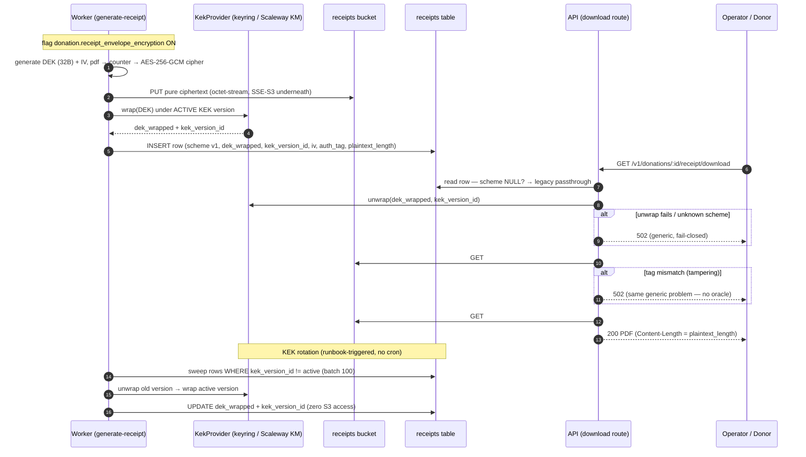

# ADR-037: Receipt Envelope Encryption — Per-Receipt DEK + Rotatable KEK over Storage-Native SSE Alone

**Status**: Accepted
**Date**: 2026-07-27
**Issue**: #228 (the issue text referenced this as a future "ADR-018"; the numbering had moved on by implementation time — this is that ADR)
**Related**: [ADR-023](./adr-023-object-storage-bucket-topology.md) (bucket topology — `receipts` stays private, signed-URL-free), [ADR-034](./adr-034-seaweedfs-over-minio-for-self-hosted-object-storage.md) (SeaweedFS SSE-S3 — the at-rest inner layer this ADR wraps), [ADR-009](./adr-009-scaleway-as-primary-saas-managed-cloud-provider.md) (Scaleway as SaaS provider — why Scaleway Key Manager), [docs/06-security-compliance.md](../06-security-compliance.md), [docs/runbooks/receipt-kek-rotation.md](../runbooks/receipt-kek-rotation.md)

## Context

Donation tax receipts (CERFA 11580 in France) are legal fiscal documents carrying donor name, address, and donation amount — for cause-based NPOs (health, religion, politics) the mere *existence* of a receipt can be GDPR Art. 9-adjacent. French tax law (CGI art. 200 / 238 bis) imposes a **7-year retention horizon**: a receipt generated in 2026 must still be readable in 2033, and the key that protects it must survive that long too.

The pre-#228 posture was SSE-S3 only: every receipt PDF is uploaded with `ServerSideEncryption: "AES256"`, and the storage backend (Scaleway Object Storage in SaaS prod, SeaweedFS with a `WEED_S3_SSE_KEY`-derived KEK elsewhere — ADR-034) encrypts at rest with **one storage-wide key that is effectively non-rotatable** (rotating the SeaweedFS KEK orphans every previously written object — ADR-034 documents this exact foot-gun). The failure mode is binary and maximal: one key compromise or one bucket exposure ⇒ **seven years of donor tax documents readable in one sweep** — a CNIL-notifiable breach with mandatory donor notification.

Issue #228 left the mechanism open — "Option A (Scaleway KMS) vs Option B (application-level envelope)". The constraint that decides it: the same code ships to SaaS prod (Scaleway), staging, local dev, and **self-hosted NPO deployments** (SeaweedFS, no managed KMS available), so neither option alone covers every tier.

## Decision

**Application-level envelope encryption for receipt PDFs, with the KEK behind an abstract provider — Scaleway Key Manager in SaaS prod, a versioned local keyring everywhere else.** Shipped behind the platform-scoped, default-off flag `donation.receipt_envelope_encryption`.

Key schema (implemented in [`packages/shared/src/lib/receipt-crypto.ts`](../../packages/shared/src/lib/receipt-crypto.ts), reachable only via the `@givernance/shared/lib/receipt-crypto` subpath — never the root barrel, so the web package can't import `node:crypto` server code, per ADR-013):

- **One fresh 32-byte DEK per receipt**, AES-256-GCM, 12-byte IV. Blast radius of a leaked DEK = exactly one receipt.
- **The S3 object is pure ciphertext.** IV, auth tag, wrapped DEK, and KEK version live on the `receipts` row (`encryption_iv`, `encryption_auth_tag`, `dek_wrapped`, `kek_version_id`, plus `encryption_scheme` and `plaintext_length` — migration [`0092_receipt_envelope_encryption.sql`](../../packages/api/migrations/0092_receipt_envelope_encryption.sql)). A leaked bucket alone yields nothing decryptable; a leaked DB dump alone yields no PDFs. SSE-S3 stays on underneath (defence in depth).
- **The DEK is wrapped by a KEK held outside the object store**, via the `KekProvider` interface: `wrap()` always uses the *active* KEK version; `unwrap()` uses the version recorded on the row. That split is what makes rotation a DB-only operation.
  - `LocalKekProvider` — env-configured JSON keyring (`{"v1": "<base64 32B>", ...}`) + active-version pointer. Dev / staging / self-hosted.
  - `ScalewayKmsKekProvider` — Scaleway Key Manager REST (`/key-manager/v1beta1/.../encrypt|decrypt`), `kek_version_id = scw:{keyId}`. Scaleway's ciphertext is self-describing (it embeds the internal key version), so Scaleway-side material rotation is transparent to unwrap. SaaS prod.
- **KEK rotation = re-wrap DEKs in the DB, zero S3 access.** The manual `receipts.rewrap_deks` worker job ([`packages/worker/src/processors/rewrap-receipt-deks.ts`](../../packages/worker/src/processors/rewrap-receipt-deks.ts)) unwraps each row's 32-byte DEK under its old KEK version and re-wraps under the active one — never touching the PDFs. Procedure: [`docs/runbooks/receipt-kek-rotation.md`](../runbooks/receipt-kek-rotation.md).
- **Versioned scheme discriminator**: `encryption_scheme = 'dek-aes256gcm.v1'`; `NULL` = legacy SSE-S3-only object. A future algorithm change is a new scheme value read per-row, not a migration of old objects. An *unknown* scheme value fails closed (502) — it means a newer deploy wrote the row.
- **Everything fails closed.** Flag on + missing/invalid `RECEIPT_ENCRYPTION_*` config ⇒ generation jobs fail before any byte reaches S3. Unknown KEK version, malformed blob, GCM tag mismatch ⇒ error, never a plaintext fallback and never raw ciphertext streamed to a client. All crypto failures on download surface as the *same* generic RFC 9457 502 used for S3 unavailability — no error oracle distinguishing "tampered" from "storage down".

### Gate placement — generation only, download by row state

The feature flag gates **generation** (worker pickup in [`generate-receipt.ts`](../../packages/worker/src/processors/generate-receipt.ts)): ON encrypts new receipts, OFF keeps the pre-#228 plaintext+SSE-S3 upload byte-for-byte. The download route (`GET /v1/donations/:id/receipt/download`) is deliberately **not** flag-gated: it branches on the row's `encryption_scheme`. Flipping the flag off must never brick already-encrypted receipts — a 7-year legal document cannot depend on a feature flag staying on.

### Verify-then-stream on download

GCM only verifies its auth tag at stream finalisation — **after** every plaintext chunk has been emitted. A naive `s3Body.pipe(decipher).pipe(reply)` would flush a `200` plus unauthenticated (possibly attacker-modified) bytes before discovering tampering. The download route therefore does two passes:

1. **Verification pass** — stream the ciphertext through a throwaway decipher, discard the output (memory-bounded, nothing buffered), fail with a 502 on any GCM mismatch.
2. **Serving pass** — a second S3 GET piped through a fresh decipher to the response.

Cost: one extra S3 GET per encrypted download (receipts are tens of KB). Gain: a genuinely fail-closed 502 on tampering — tampered bytes never reach a donor with a `200`. `Content-Length` is served from the DB's `plaintext_length` (the S3 `ContentLength` is the ciphertext size).

### Storage details

- Encrypted objects are uploaded with `ContentType: application/octet-stream`, not `application/pdf` — the object *is not* a PDF, and a misleading content type would make any accidental direct serve render as a subtly-broken PDF instead of an obviously opaque blob.
- The object key shape is unchanged (`{org_id}/receipts/{number}.pdf`); the DB row, not the key, marks ciphertext.

### Sequence

## Rejected alternatives

- **Single non-rotatable key, status quo (SSE-S3 only).** The 7-year retention horizon makes "we never rotate" indefensible: any key exposure over the receipt's lifetime exposes the entire archive, and there is no remediation short of re-encrypting every object with credentials you no longer trust.
- **Naive rotation of the storage-wide key.** Rotating `WEED_S3_SSE_KEY` (or an equivalent single app key) orphans every previously encrypted object — ADR-034 documents this exact property. "Rotation" that destroys read access to legal fiscal documents is not rotation.
- **Fallback-key accumulation (the `MINIO_KMS_AUTO_ENCRYPTION`-style pattern).** Keep the old keys forever, try each on read. Every "rotation" *adds* a live key that can decrypt part of the archive and *removes* nothing — the compromise surface grows monotonically, and a compromised old key can never actually be retired. The envelope design inverts this: after a re-wrap sweep the old KEK version decrypts nothing and can be destroyed.
- **Re-encrypt every object at each rotation.** Correct but operationally brutal: download + decrypt + re-encrypt + re-upload the full archive (GBs, growing for 7+ years) on every rotation — and during an emergency rotation, exactly when time matters most. The envelope re-wrap touches only 32-byte DEKs in the DB; the sweep is minutes, not days, and involves zero S3 traffic.
- **Storage-native SSE-KMS only (issue #228's "Option A" pure form).** Scaleway Object Storage's KMS integration covers SaaS prod, but self-hosted deployments run SeaweedFS, whose SSE cannot delegate to a customer KMS — the self-hosted tier (a core product commitment) would keep the non-rotatable posture. It also welds the security property to one provider (lock-in the stack otherwise avoids) and keeps decrypt authority inside the storage layer, so a bucket-credential leak still yields plaintext. Scaleway Key Manager *is* used — but as the KEK provider inside the app-level envelope, where the same code path serves every tier.
- **`pgcrypto` column encryption.** The PDFs are not in Postgres and should not be (multi-MB rows, WAL bloat, backup size). Moving them into the DB to encrypt them solves the wrong problem; encrypting only metadata leaves the PDFs exposed.
- **Single-pass pipe-to-response on download.** Rejected for the GCM-flushes-before-verify property described above: it turns "tampered object" into "donor received a 200 with attacker-controlled bytes". The extra S3 GET is the deliberate price of a fail-closed 502.
- **IV + auth tag prefixed inside the S3 object (the common `iv||ct||tag` layout).** Self-describing objects are convenient, but splitting the material means neither store alone suffices to decrypt, and the DB row must exist anyway (wrapped DEK, scheme, plaintext length). Keeping IV/tag in the row also makes the object *pure* ciphertext — no parseable structure for an attacker holding only the bucket. The `wrapDek` blob (which never leaves the DB) does use the concatenated layout internally; the split applies to the S3 object boundary.
- **Flag-gating the download path.** Rejected — see "Gate placement". A receipt encrypted during a flag-on window must outlive the flag.

## Consequences

- **Blast radius is bounded**: leaked DEK = 1 receipt; leaked KEK = rotate + re-wrap (DB-only) + destroy the old version. A bucket leak or a DB leak alone yields nothing decryptable.
- **New operational surface**: 7 `RECEIPT_ENCRYPTION_*` env vars on **both** api and worker (TypeBox-optional, read lazily at call time because the whole feature is flag-gated). They must be deployed *before* the flag flips — the fail-closed posture means flag-on-without-config fails receipt generation loudly. Provisioning + rotation + compromise response: [`docs/runbooks/receipt-kek-rotation.md`](../runbooks/receipt-kek-rotation.md).
- **One extra S3 GET per encrypted-receipt download** (verification pass). Negligible at receipt sizes; revisit if receipts ever grow to many MB.
- **Log hygiene extended**: pino redact paths now cover `dek`, `dekWrapped`/`dek_wrapped`, `kekSecret`, `keyring`, `plaintextKey` (+ prefixed variants) in [`packages/shared/src/constants/pino-redact.ts`](../../packages/shared/src/constants/pino-redact.ts). `kek_version_id`, IV and auth tag are deliberately *not* redacted — they are non-secret metadata the runbooks grep for.
- **Crypto-shredding becomes possible by design** (not yet wired): dropping `dek_wrapped` from a row renders that one receipt permanently unreadable without touching S3 — a future GDPR-erasure primitive, subject to the CGI retention obligation.
- **Legacy receipts (scheme `NULL`) are untouched**: no backfill ships with this ADR. The download route serves them exactly as before.

### Out of scope (explicitly deferred)

- Backfill / re-encryption of legacy plaintext receipts.
- Per-tenant KEKs (one platform KEK namespace for now; the `kek_version_id` column doesn't preclude it).
- Crypto-shredding wired into the erasure flow.
- HSM-backed keys.

## Revisit criteria

Reopen this ADR when:

- A backfill of legacy receipts is scheduled (the sweep machinery generalises; the verify-then-stream path already serves both populations).
- Per-tenant key isolation becomes a compliance or sales requirement — the `KekProvider` interface and per-row `kek_version_id` are the extension seams.
- Scaleway Key Manager changes its API surface (the provider pins `v1beta1`) or a second SaaS region/provider appears.
- Receipt PDFs grow large enough that the double-GET verification pass shows up in download latency budgets.
- The GDPR-erasure flow wants crypto-shredding — at which point the interaction with the 7-year CGI retention needs a legal read, not just a code change.
