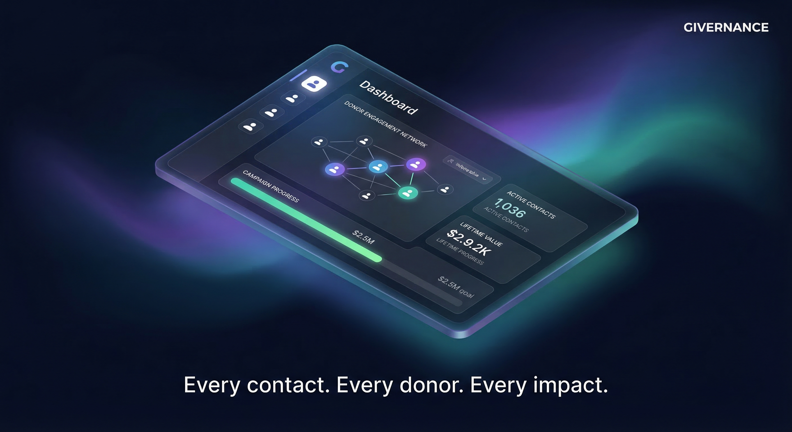

# Givernance — Marketing Campaign Ideas

> Generated: 2026-03-10  
> Tools: Gemini 3 Pro Image (2K resolution)  
> Status: 💡 Concept / Exploration

---

## Brand Direction

Givernance targets European nonprofit organizations (NPOs) — a market that values **trust**, **mission**, and **compliance** above flashiness. The campaign aesthetic borrows from premium SaaS brands (Linear, Stripe, Vercel) but anchors in warmth and purpose. Core palette: midnight navy + gold for emotion, forest green for trust.

**Candidate taglines:**
- *"Run your mission. Not your spreadsheets."* — direct, relief-focused
- *"Every contact. Every donor. Every impact."* — product-centric, comprehensive
- *"GDPR-native. Trust built in. From day one."* — compliance as differentiator
- *"Where mission meets management."* — brand/emotional positioning

---

## Visual 1 — Hero Brand

**Tagline:** *Run your mission. Not your spreadsheets.*  
**Use:** Homepage hero, keynote slides, LinkedIn banner  
**Concept:** A luminous tree of interconnected golden nodes on midnight navy — the relationship network as a living organism. Aspirational, organic, premium.

---

## Visual 2 — Product Feature

**Tagline:** *Every contact. Every donor. Every impact.*  
**Use:** Product pages, feature announcements, demo decks  
**Concept:** CRM dashboard floating as a 3D isometric panel with aurora gradients (purple/teal). Shows donor graph, fundraising progress, contact metrics — product clarity without feeling like a screenshot.

---

## Visual 3 — Trust & Compliance

**Tagline:** *GDPR-native. Trust built in. From day one.*  
**Use:** European market ads, compliance pages, investor decks  
**Concept:** Crystalline shield with EU star halo on forest green. Compliance framed as a competitive superpower, not a checkbox. Strong for B2B sales to risk-averse NPO directors.

---

## Visual 4 — Emotional / Brand Campaign

**Tagline:** *Where mission meets management.*  
**Use:** Brand awareness, social campaigns, conference walls  
**Concept:** Cinematic split — warm amber organic light (human purpose) / cool blue digital precision (technology) — converging at a single luminous axis. The most emotionally resonant of the series.

---

## Next Steps

- [ ] Refine color palette into a formal brand system (`docs/11-design-identity.md`)
- [ ] Create social-native variants (1:1 square, 9:16 story)
- [ ] Test taglines with target NPO audience (A/B)
- [ ] Develop French/German localized versions (EU market reach)
- [ ] Explore video/motion versions of the hero concept
